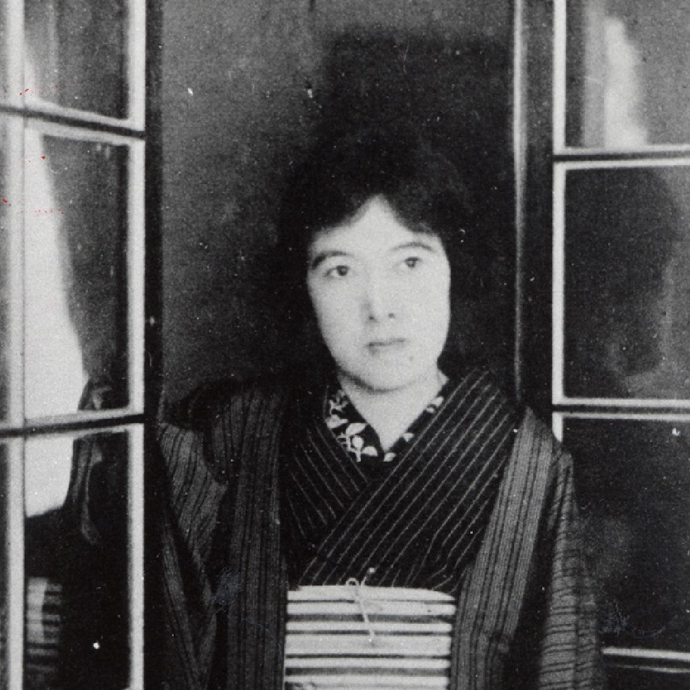

与謝野晶子
「君死にたまふことなかれ」　
――旅順口包囲軍の中に在る弟を歎きて
あゝをとうとよ、君を泣く、
君死にたまふことなかれ、
末に生れし君なれば
親のなさけはまさりしも、
親は刃をにぎらせて
人を殺せとをしへしや、
人を殺して死ねよとて
二十四までをそだてしや。

堺の街のあきびとの
旧家をほこるあるじにて
親の名を継ぐ君なれば、
君死にたまふことなかれ、
旅順の城はほろぶとも、
ほろびずとても、何事ぞ、
君は知らじな、あきびとの
家のおきてに無かりけり。

君死にたまふことなかれ、
すめらみことは、戦ひに
おほみづからは出でまさね、
かたみに人の血を流し、
獣の道に死ねよとは、
死ぬるを人のほまれとは、
大みこゝろの深ければ
もとよりいかで思されむ。

あゝをとうとよ、戦ひに
君死にたまふことなかれ、
すぎにし秋を父ぎみに
おくれたまへる母ぎみは、
なげきの中に、いたましく
わが子を召され、家を守り、
安しと聞ける大御代も
母のしら髪はまさりぬる。

暖簾のかげに伏して泣く
あえかにわかき新妻を、
君わするるや、思へるや、
十月も添はでわかれたる
少女ごころを思ひみよ、
この世ひとりの君ならで
あゝまた誰をたのむべき、
君死にたまふことなかれ。