# Ich habe versucht, verschiedene Versionsinformationsdialoge zu sammeln

## Windows 11
Zunächst einmal sind hier die Versionsinformationen für Windows 11, die ich gerade verwende.
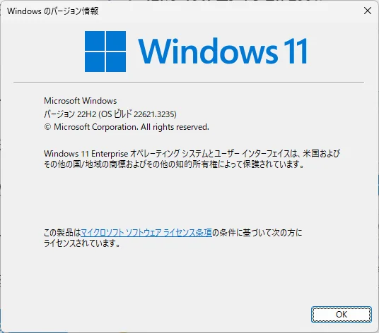

## IntelliJ IDEA (Community Edition)
Dies ist die Umgebung, in der ich diesen Blog schreibe.
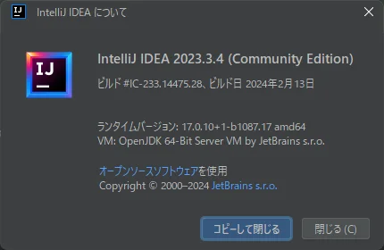

## Visual Studio Code
Dies ist auch ein Editor, den ich oft benutze. Er ist überraschend einfach.
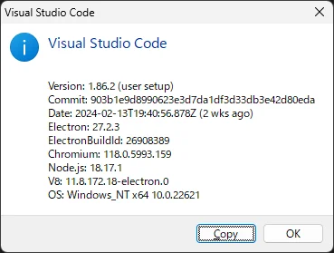

## Visual Studio
Dies ist die Entwicklungsumgebung, die ich für C++ verwende.
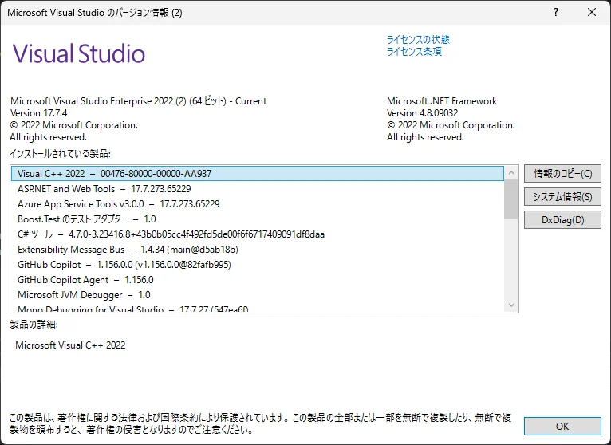

## LINE (Windows)
Dies ist die Windows-Version von LINE.
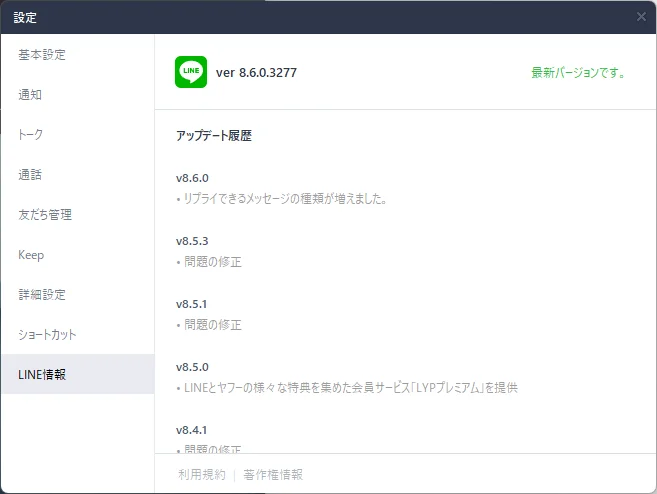

## Paint.NET
Dies ist eine Bildbearbeitungssoftware.
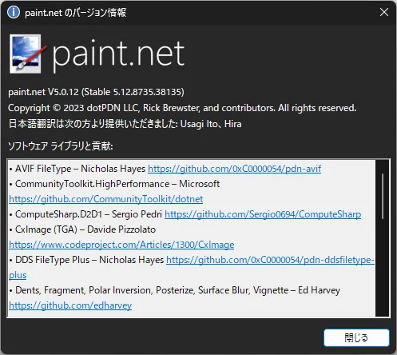

## sakura editor
Dies ist ein Texteditor.
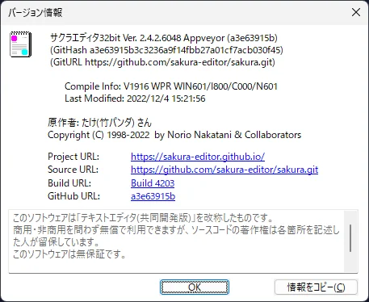

## Google Chrome
Dies ist Google Chrome. Seit der Einführung von Edge benutze ich ihn nicht mehr so oft.
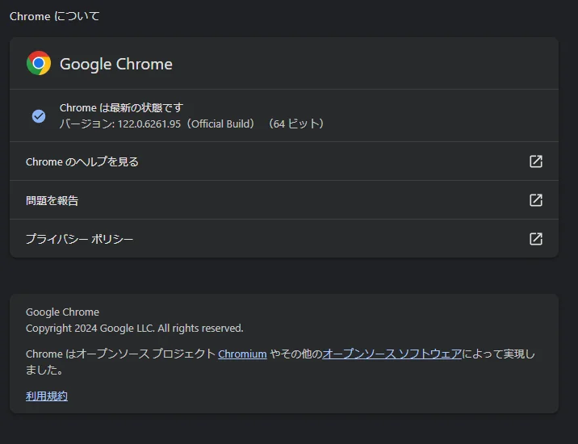

## Firefox
Dies ist Firefox. In letzter Zeit benutze ich ihn nicht mehr so oft.
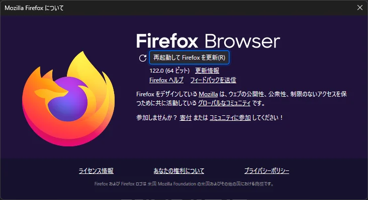

## Microsoft Edge
Dies ist Microsoft Edge. In letzter Zeit benutze diesen öfter.
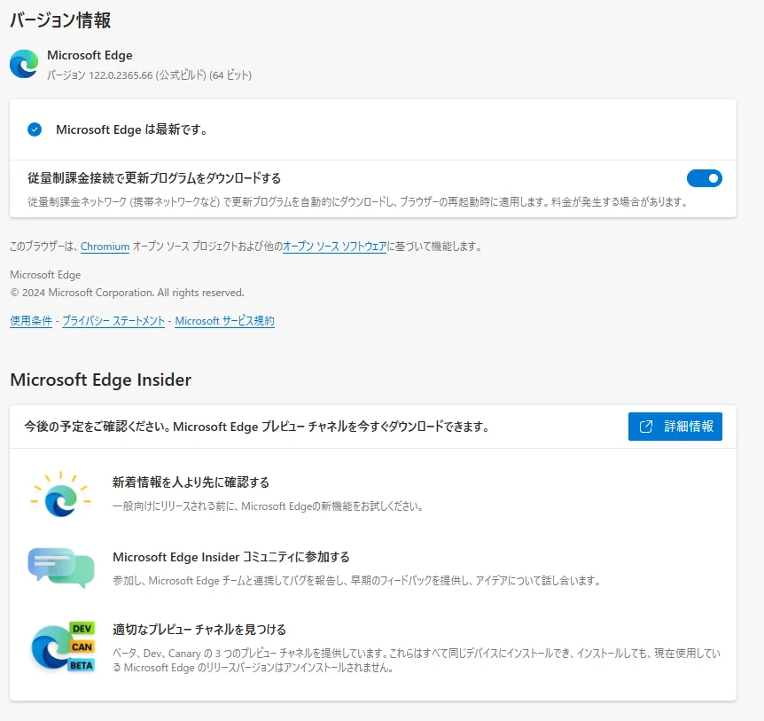

## OBS Studio
Dies ist OBS Studio. In letzter Zeit benutze ich es nicht mehr so oft.
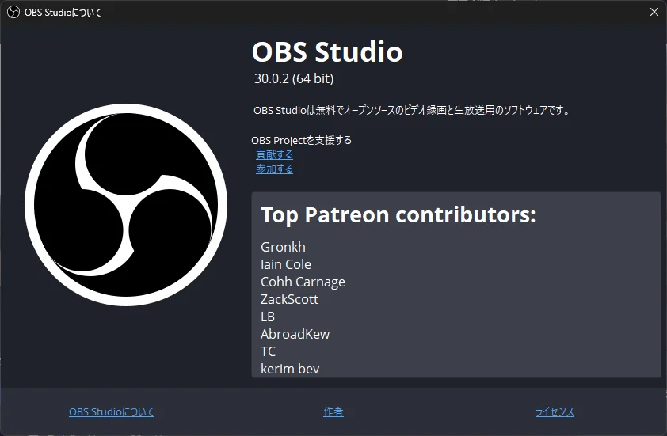

## TradingView
Dies ist TradingView. In letzter Zeit benutze ich es, um mir den Dollar-Yen-Chart anzusehen.
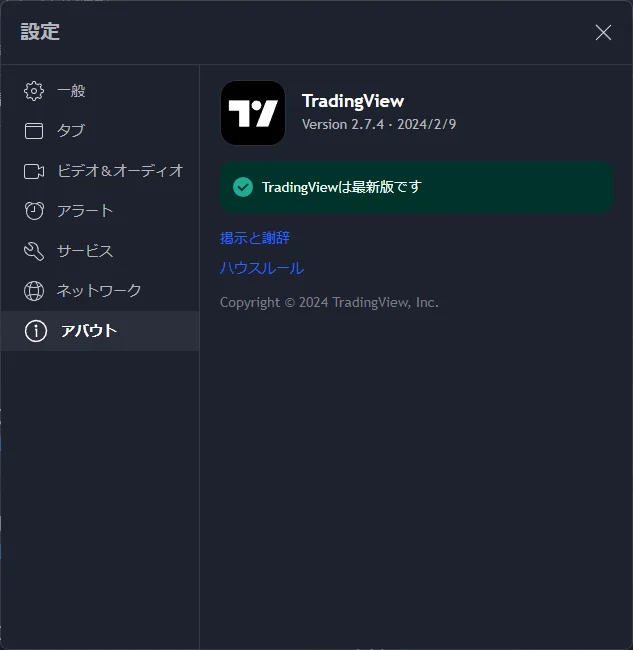

## Spy++
Dies ist Spy++. Es ist ein Tool, das im Windows SDK enthalten ist.
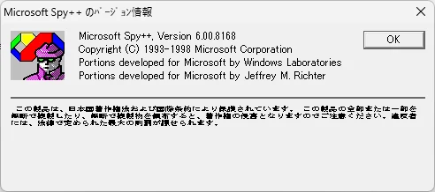

## dependency walker
Dies ist der dependency walker. Es ist ein Tool, das im Windows SDK enthalten ist.
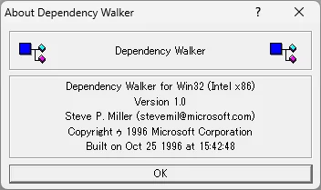

## resource hacker
Dies ist der resource hacker. Es ist ein Tool zum Bearbeiten und Extrahieren von Ressourcen aus ausführbaren Dateien.
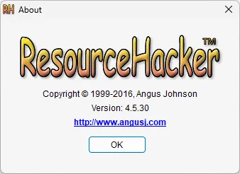

## Microsoft Excel
Dies ist Microsoft Excel.
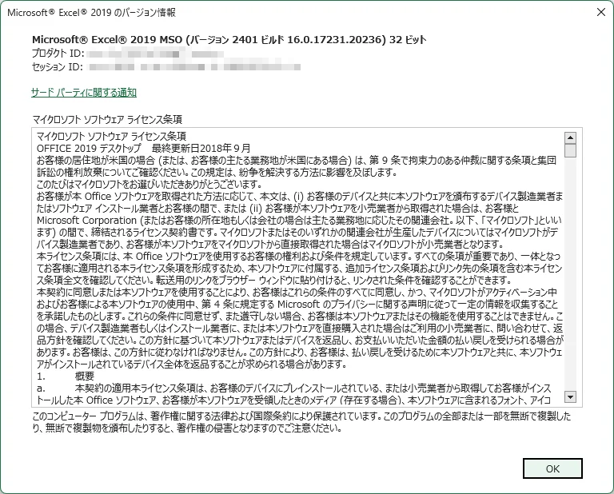

## bandicam
Dies ist bandicam. Es ist ein Video-Capture-Tool.
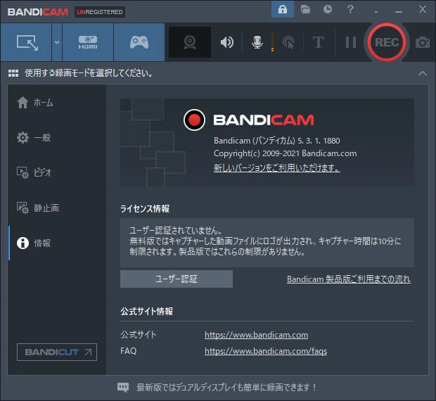

## winmerge
Dies ist winmerge. Es ist ein Tool, um Unterschiede zwischen Dateien zu erkennen.
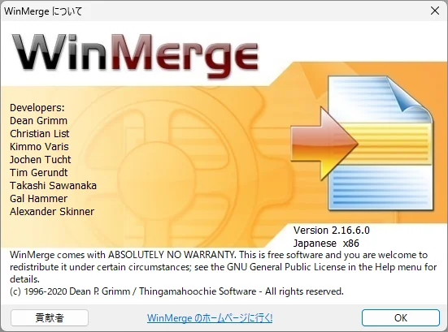

## iTunes
Dies ist iTunes. In letzter Zeit benutze ich es nicht mehr so oft.
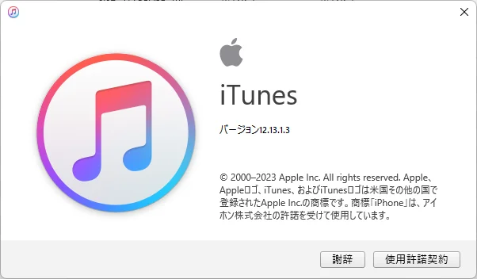

## Hidemaru Editor
Dies ist der Hidemaru Editor. Es ist ein Texteditor.
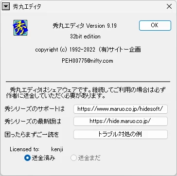

## Adobe Photoshop CS6
Dies ist Adobe Photoshop CS6.
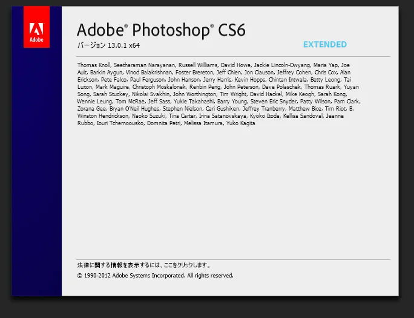

## Adobe Illustrator CS6
Dies ist Adobe Illustrator CS6.
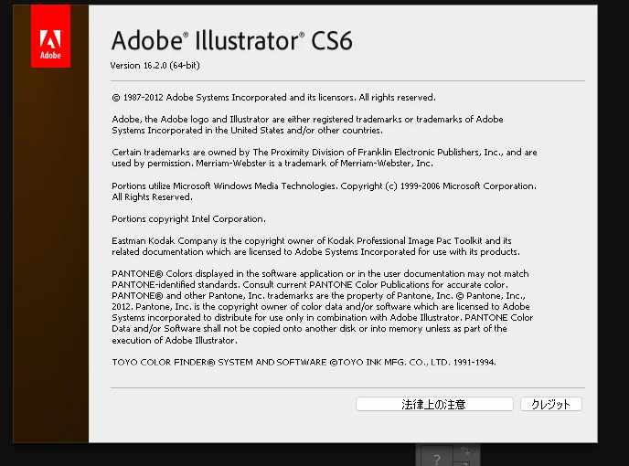

## ESET NOD32
Dies ist ESET NOD32.
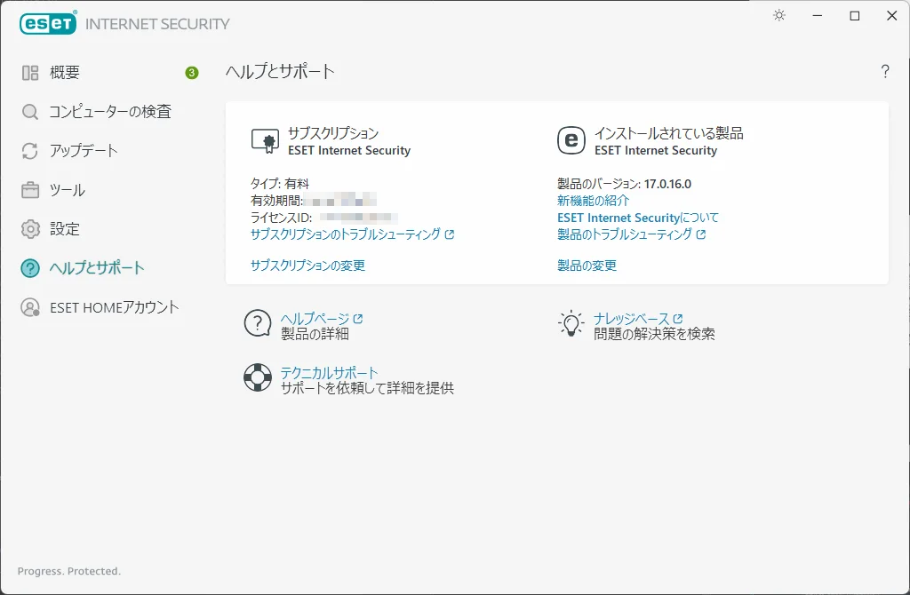

## NotePad++
Dies ist NotePad++. Es ist ein Texteditor.
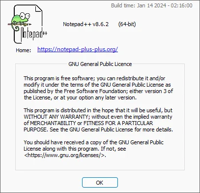

## MIFES
Dies ist MIFES. In letzter Zeit benutze ich es nicht mehr so oft.
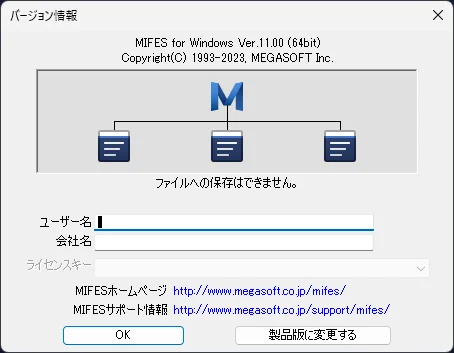
