---

title: "'Colección de varios diálogos de información de versión'"
date: 2024-03-02T21:32:11+09:00
tags: ["Información de versión", "Windows", "MacOS"]
draft: false
image: "img.png"
categories: ["PC y Gadgets"]
---

# Colección de varios diálogos de información de versión

## Windows 11
Primero, la información de versión de Windows 11 que estoy usando ahora.
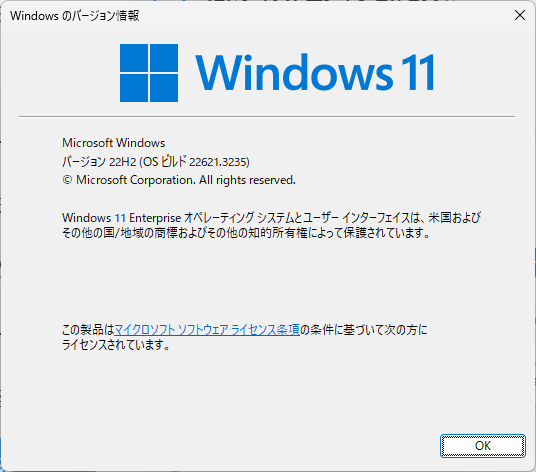

## IntelliJ IDEA (Community Edition)
Este es el entorno donde escribo este blog.
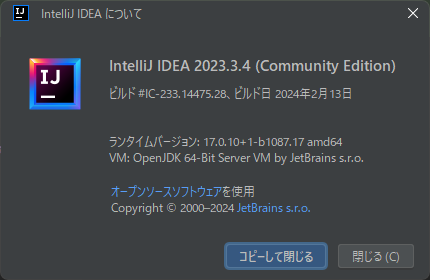

## Visual Studio Code
Este también es un editor que uso a menudo. Es sorprendentemente simple.
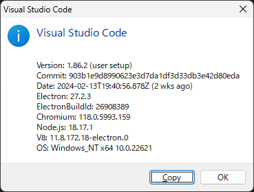

## Visual Studio
Este es el entorno de desarrollo que uso con C++.
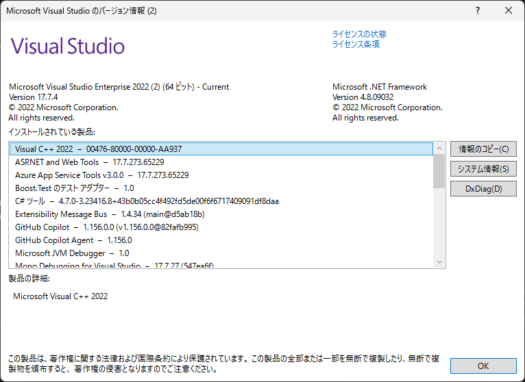

## LINE (Windows)
Esta es la versión de Windows de LINE.
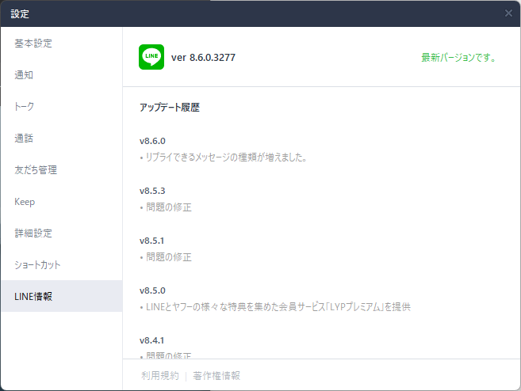

## Paint.NET
Este es un software de edición de imágenes.
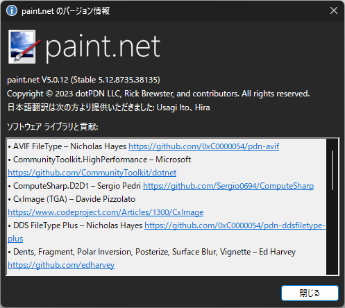

## sakura editor
Este es un editor de texto.
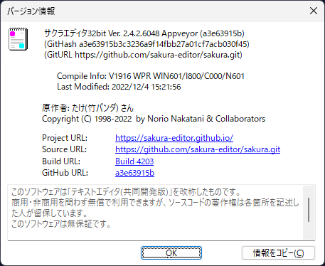

## Google Chrome
Este es Google Chrome. Después de la aparición de Edge, ya no lo uso mucho.
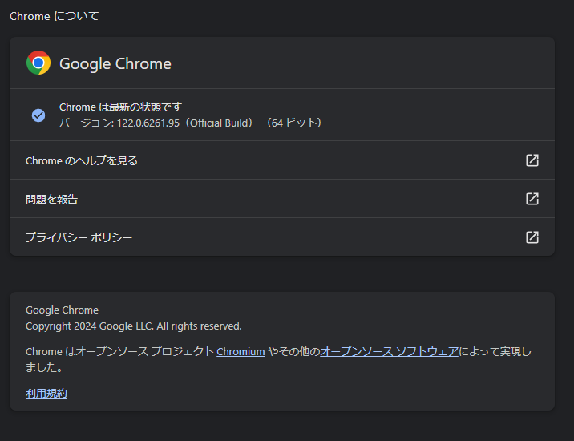

## Firefox
Este es Firefox. Últimamente no lo uso mucho.
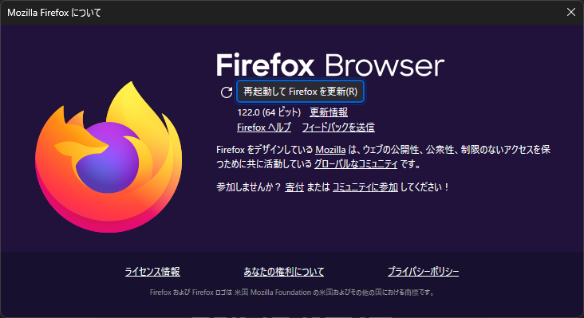

## Microsoft Edge
Este es Microsoft Edge. Últimamente uso este más a menudo.
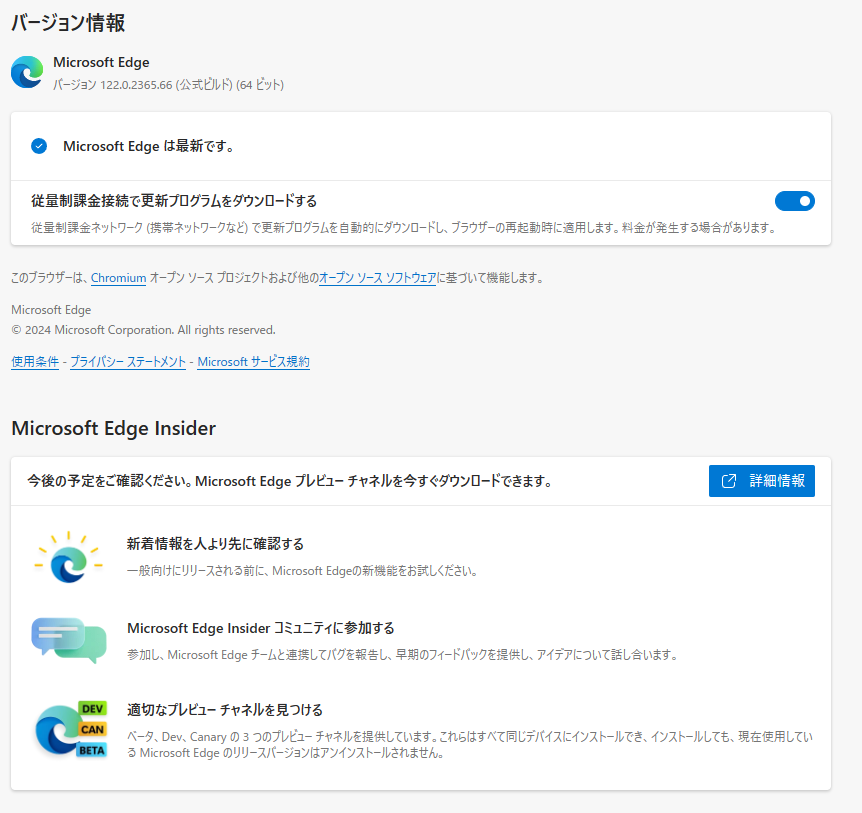

## OBS Studio
Este es OBS Studio. Últimamente no lo uso mucho.
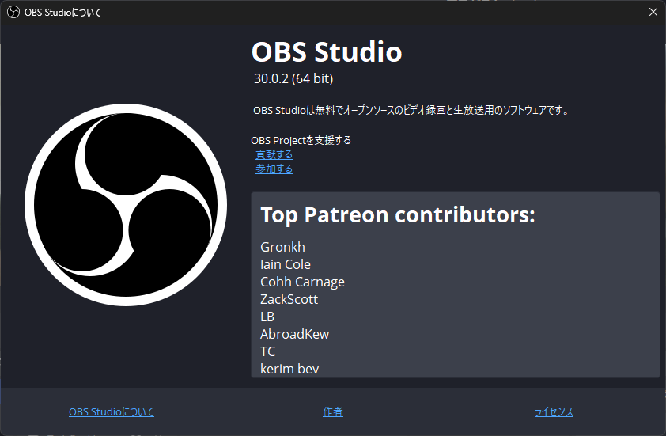

## TradingView
Este es TradingView. Últimamente lo uso para ver el gráfico del dólar-yen.
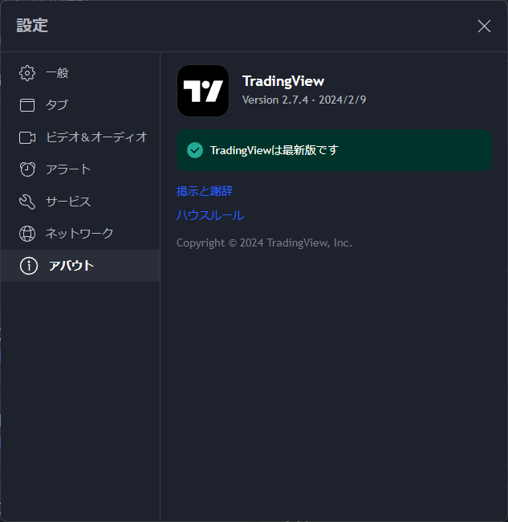

## Spy++
Este es Spy++. Es una herramienta incluida en el SDK de Windows.
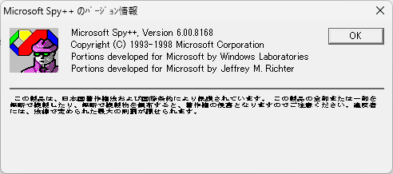

## dependency walker
Este es dependency walker. Es una herramienta incluida en el SDK de Windows.
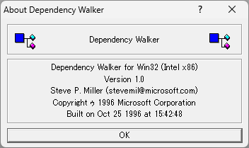

## resource hacker
Este es resource hacker. Es una herramienta para editar y obtener recursos de archivos ejecutables.
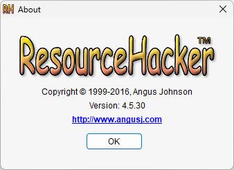

## Microsoft Excel
Este es Microsoft Excel.
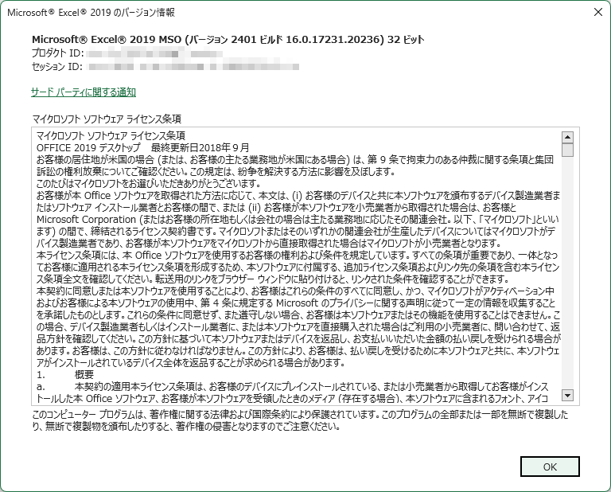

## bandicam
Este es bandicam. Es una herramienta de captura de video.
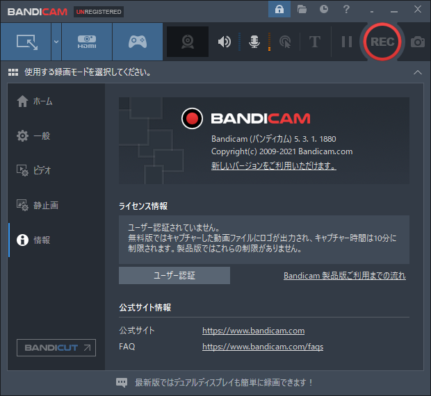

## winmerge
Este es winmerge. Es una herramienta para ver diferencias entre archivos.
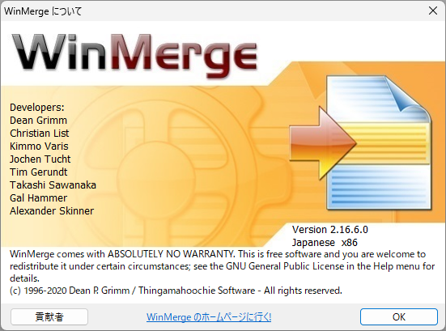

## iTunes
Este es iTunes. Últimamente no lo uso mucho.
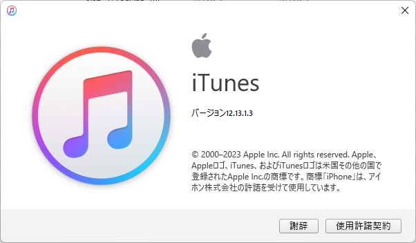

## Hidemaru Editor
Este es Hidemaru Editor. Es un editor de texto.
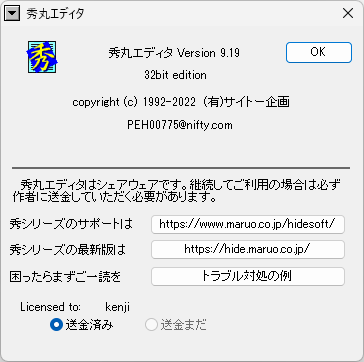

## Adobe Photoshop CS6
Este es Adobe Photoshop CS6.
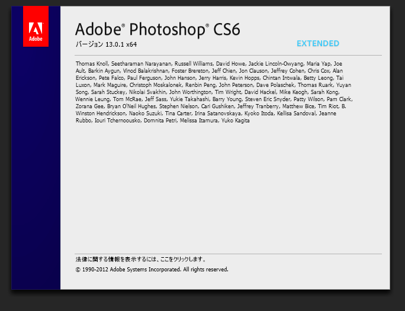

## Adobe Illustrator CS6
Este es Adobe Illustrator CS6.
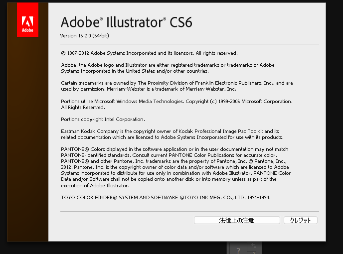

## ESET NOD32
Este es ESET NOD32.
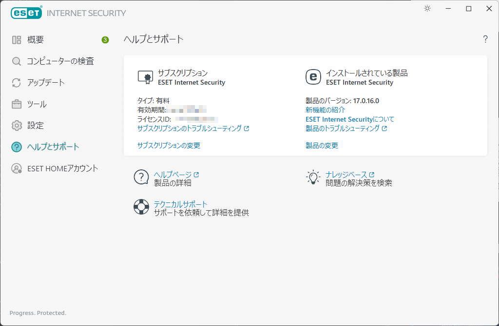

## NotePad++
Este es NotePad++. Es un editor de texto.
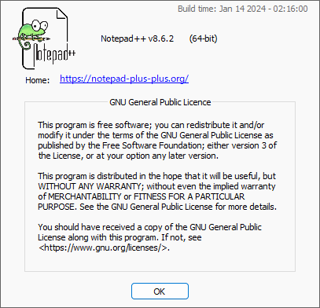

## MIFES
Este es MIFES. Últimamente no lo uso mucho.
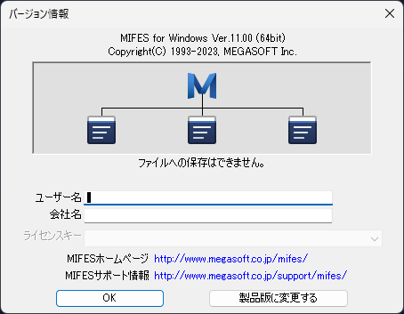
