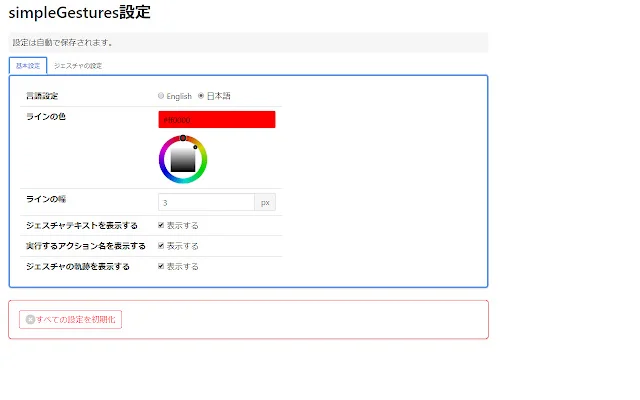
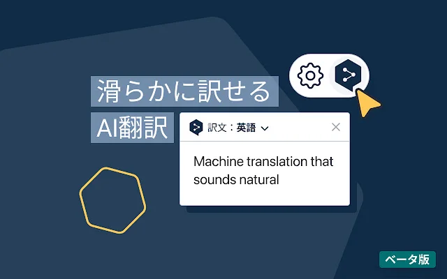
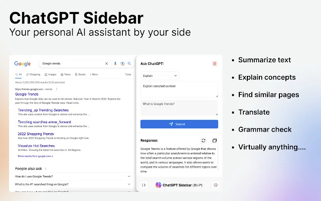
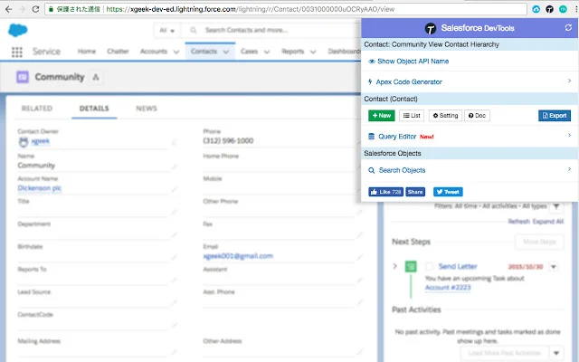

---
title: 'A Summary of Recommended Browser Extensions to Dramatically Improve Chrome and Edge'
slug: "おすすめの Chorme 拡張"
date: 2023-03-19T02:54:30+09:00
tags: ["Chrome Extensions", "Browser", "Chrome", "Edge"]
draft: false
image: "img_4.webp"
categories: ["IT / Technology"]
description: 'Introduces recommended extensions that dramatically streamline browsing in Google Chrome and Microsoft Edge, including mouse gestures, ad blockers, DeepL translation, and using ChatGPT in the sidebar.'
---

# Recommended Chrome Extensions

I would like to introduce the Chrome extensions I am currently using. Although they are for Chrome, they can also be used in Microsoft Edge.

## 1. simpleGestures

An extension that enables the use of mouse gestures.
It allows you to control the browser without using the keyboard or aiming for toolbar buttons.

For example, sliding the mouse to the left while holding down the right mouse button goes back, and sliding the mouse to the right while holding down the right mouse button goes forward.

This is also highly reliable because it is open source.

- [simpleGestures](https://chrome.google.com/webstore/detail/simplegestures/flfminafiamnggnldfpilnfnmbgmiegn)
- [github](https://github.com/RyutaKojima/simpleGestures)

## 2. uBlock Origin

An extension that blocks advertisements. Highly reliable because it is open source. It also operates comfortably with low CPU and memory usage.

- [uBlock Origin](https://microsoftedge.microsoft.com/addons/detail/ublock-origin/odfafepnkmbhccpbejgmiehpchacaeak)
- [github](https://github.com/gorhill/uBlock/)

## 3. DeepL Translation

A Chrome extension that allows you to translate pages using the world-famous translation service DeepL. When you select the text you want to translate on the browser, the DeepL icon appears, and clicking it automatically translates the text.

- [DeepL Translator](https://chrome.google.com/webstore/detail/deepl-translate-reading-w/cofdbpoegempjloogbagkncekinflcnj?hl=ja)

## 4. ChatGPT Sidebar

An extension that allows you to use ChatGPT in a sidebar. You can display the sidebar with Ctrl+P and immediately ask the AI questions.
If there is a selected text string in the page, it will be copied directly into the question text, so you can ask a question immediately with Ctrl+Enter.

- [ChatGPT Sidebar](https://chrome.google.com/webstore/detail/chatgpt-sidebar-support-g/difoiogjjojoaoomphldepapgpbgkhkb)

## 5. Salesforce DevTools

An extension that adds useful features for Salesforce development.
I think this is unnecessary for those who do not use Salesforce.

- [Salesforce DevTools](https://chrome.google.com/webstore/detail/salesforce-devtools/ehgmhinnhggigkogkbhnbodhbfjgncjf)
