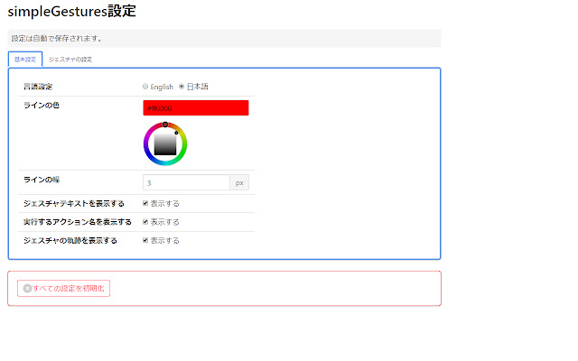
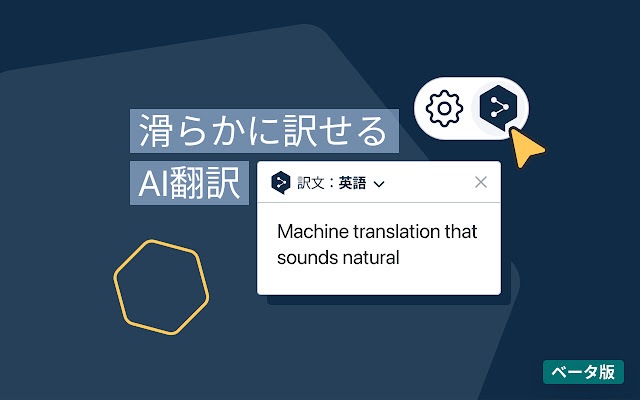
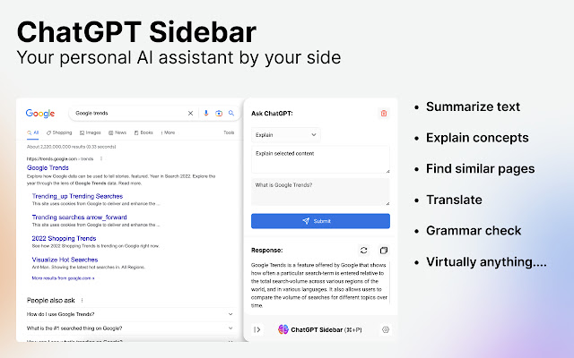
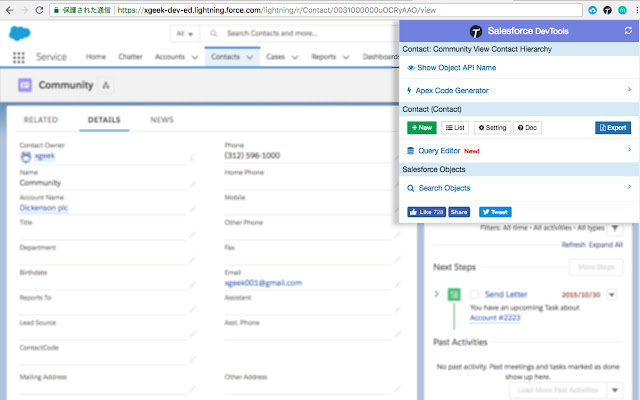

---

title: "Extensiones recomendadas para Chrome"
date: 2023-03-19T02:54:30+09:00
tags: ["Extensiones de Chrome", "Navegador", "Chrome", "Edge"]
draft: false
image: "img_4.png"
categories: ["IT y Tecnología"]
---

# Extensiones recomendadas para Chrome

A continuación, presento las extensiones de Chrome que uso actualmente. Aunque son para Chrome, también se pueden usar en Microsoft Edge.

## 1. simpleGestures

Es una extensión que permite usar gestos del ratón.
Puedes operar el navegador sin necesidad de usar el teclado o hacer clic en los botones de la barra de herramientas.

Por ejemplo, puedes retroceder deslizando el ratón hacia la izquierda mientras mantienes presionado el botón derecho, o avanzar deslizando el ratón hacia la derecha mientras mantienes presionado el botón derecho.

Dado que es de código abierto, es altamente confiable.

- [simpleGestures](https://chrome.google.com/webstore/detail/simplegestures/flfminafiamnggnldfpilnfnmbgmiegn)
- [github](https://github.com/RyutaKojima/simpleGestures)

## 2. uBlock Origin

Es una extensión para bloquear anuncios. Como es de código abierto, es altamente confiable. Además, utiliza poca CPU y memoria, por lo que funciona de manera fluida.

- [uBlock Origin](https://microsoftedge.microsoft.com/addons/detail/ublock-origin/odfafepnkmbhccpbejgmiehpchacaeak)
- [github](https://github.com/gorhill/uBlock/)

## 3. Traductor DeepL

Es una extensión de Chrome que permite traducir dentro de la página utilizando DeepL, un servicio de traducción mundialmente famoso. Al seleccionar el texto que deseas traducir en el navegador, aparece el ícono de DeepL, y al hacer clic en él se traduce automáticamente.

- [DeepL Translator](https://chrome.google.com/webstore/detail/deepl-translate-reading-w/cofdbpoegempjloogbagkncekinflcnj?hl=ja)

## 4. ChatGPT Sidebar

Es una extensión que permite usar ChatGPT en una barra lateral. Puedes mostrar la barra lateral con Ctrl+P y hacer preguntas a la IA inmediatamente.
Si hay texto seleccionado en la página, se copia directamente en el cuadro de la pregunta, por lo que puedes preguntar rápidamente presionando Ctrl+Enter.

- [ChatGPT Sidebar](https://chrome.google.com/webstore/detail/chatgpt-sidebar-support-g/difoiogjjojoaoomphldepapgpbgkhkb)

## 5. Salesforce DevTools

Es una extensión que añade funciones útiles para el desarrollo en Salesforce.
Creo que no es necesaria para aquellos que no usan Salesforce.

- [Salesforce DevTools](https://chrome.google.com/webstore/detail/salesforce-devtools/ehgmhinnhggigkogkbhnbodhbfjgncjf)
