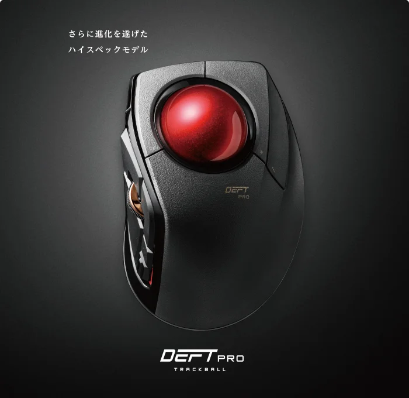

# Periferal PC yang Direkomendasikan & Diinginkan oleh Insinyur Aktif

## Keyboard

Pertama-tama, keyboard dengan sakelar kapasitif tanpa sentuhan yang sulit rusak sangat direkomendasikan.
Saya telah memiliki [RealForce](https://amzn.to/3IzOOFO) selama lebih dari 10 tahun, dan saya masih aktif menggunakannya hingga hari ini.
Tipe yang saya gunakan adalah tata letak bahasa Inggris yang senyap.

Namun, belakangan ini saya juga tertarik dengan keyboard bernama [Logitech MX Keys](https://amzn.to/3Z5skmR).

## Trackball

Sebagai perangkat penunjuk, trackball direkomendasikan daripada mouse karena dapat mengurangi kelelahan.

Perangkat yang saya gunakan adalah [Logitech MX Ergo](https://amzn.to/3IYOwtf). Ini adalah produk mahal yang harganya lebih dari 10.000 yen, tetapi saya pikir nilainya lebih dari itu.

Saya juga tertarik dengan [DEFT PRO(M-DPT1MRXBK)](https://amzn.to/3Zu5tB8), yaitu tipe yang memiliki bola besar dan dioperasikan dengan jari telunjuk dan jari tengah.

## Layar

Apa saja boleh, tetapi layar 4K beresolusi tinggi direkomendasikan.

Saat ini saya menggunakan [layar 4K DELL](https://amzn.to/3y0ViIW).

Sekarang saya menginginkan layar lebar dari [EIZO](https://amzn.to/3kz7BZH) atau [DELL](https://amzn.to/3xZleo1).
