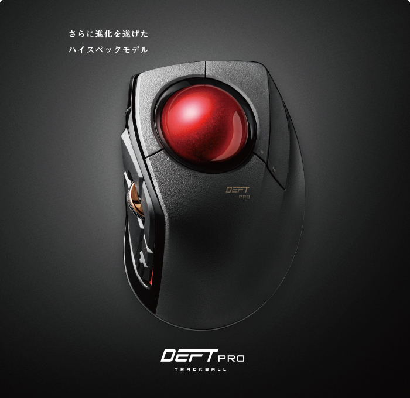

---

title: "'추천하는 PC 주변기기'"
date: 2023-02-28T00:51:49+09:00
tags: ["키보드", "트랙볼", "디스플레이"]
draft: false
image: "img.png"
categories: ["PC・가젯"]
---

# 현역 엔지니어가 추천하는 & 갖고 싶은 PC 주변기기

## 키보드

뭐니 뭐니 해도 키보드는 고장 나기 어려운 정전용량 무접점 방식을 추천합니다.
저는 거의 10년 이상 [RealForce](https://amzn.to/3IzOOFO)를 가지고 있는데, 아직도 현역으로 잘 사용하고 있습니다.
사용하고 있는 타입은 영어 배열의 저소음 모델입니다.

다만, 최근에는 [Logitech MX Keys](https://amzn.to/3Z5skmR)라는 키보드도 관심이 갑니다.

## 트랙볼

포인팅 디바이스는 마우스보다 피로를 줄일 수 있는 트랙볼을 추천합니다.

사용하고 있는 것은 [Logitech MX Ergo](https://amzn.to/3IYOwtf)입니다. 이것은 1만 엔 이상하는 고가품이지만, 그 이상의 가치가 있다고 생각합니다.

볼이 큰 타입으로 집게손가락·가운뎃손가락으로 조작하는 [DEFT PRO(M-DPT1MRXBK)](https://amzn.to/3Zu5tB8)도 관심이 갑니다.

## 디스플레이

어떤 것이든 좋지만, 해상도가 높은 4K 디스플레이를 추천합니다.

현재는 [DELL의 4K 디스플레이](https://amzn.to/3y0ViIW)를 사용하고 있습니다.

지금은 와이드 디스플레이인 [EIZO의 디스플레이](https://amzn.to/3kz7BZH) 또는 [DELL의 디스플레이](https://amzn.to/3xZleo1)를 갖고 싶다고 생각합니다.
