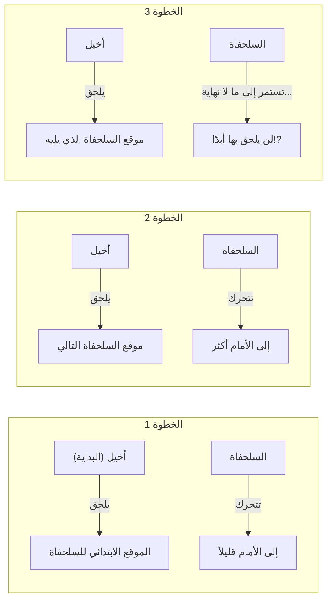
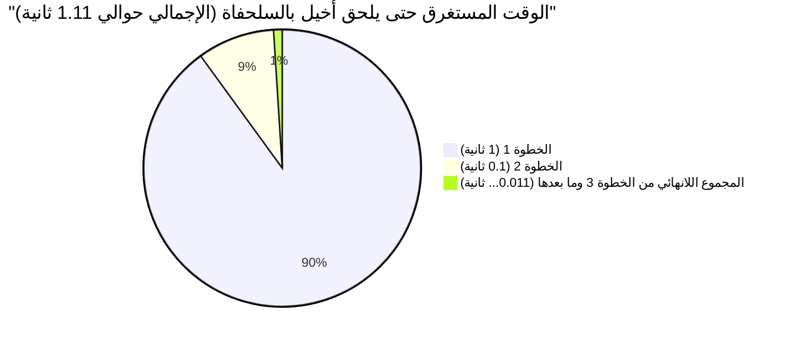

## 1. مفارقة زينون: البطل السريع لا يمكنه التغلب على السلحفاة؟

في القرن الخامس قبل الميلاد، قدم الفيلسوف اليوناني القديم زينون الإيليائي عدة مفارقات حول "الحركة" تتعارض تمامًا مع حدسنا ومنطقنا السليم. وأشهر هذه المفارقات هي **"أخيل والسلحفاة"**.

يتسابق أخيل، البطل الأسرع في الأساطير اليونانية، مع السلحفاة، التي تعتبر مضرب المثل في البطء.
وبما أن أخيل أسرع بكثير، تُعطى السلحفاة ميزة البدء من مسافة متقدمة قليلاً عنه كتعويض.

يبدأ السباق. يطارد أخيل السلحفاة بسرعة هائلة.
ومع ذلك، جادل زينون على النحو التالي:

**"أخيل لن يتمكن أبدًا من اللحاق بالسلحفاة."**

لماذا؟ منطق زينون هو كالتالي:

1. عندما يصل أخيل إلى "نقطة البداية الأولى" للسلحفاة (النقطة أ)، ستكون السلحفاة قد تقدمت قليلاً لتصبح في "النقطة ب".
2. عندما يصل أخيل إلى "النقطة ب"، ستكون السلحفاة قد تقدمت أكثر قليلاً لتصبح في "النقطة ج".
3. عندما يصل أخيل إلى "النقطة ج"، ستكون السلحفاة قد تقدمت مرة أخرى قليلاً لتصبح في "النقطة د".

تستمر هذه العملية إلى ما لا نهاية. ففي كل مرة يصل فيها أخيل إلى "المكان الذي كانت فيه السلحفاة"، يجب أن تكون السلحفاة قد تحركت "إلى الأمام قليلاً".
المسافة تتقلص باستمرار، ولكن بما أن هذه الخطوة يجب أن تتكرر لعدد لا نهائي من المرات، يقال إن أخيل لن يتمكن أبدًا من تجاوز السلحفاة.

في العالم الحقيقي، من الطبيعي أن يتجاوز الشخص السريع شخصًا بطيئًا. ومع ذلك، كان من الصعب جدًا على الناس في ذلك الوقت شرح أين تكمن الثغرة في هذه **الخدعة المنطقية اللفظية**.

---

## 2. أين الخطأ؟ وهم "الوقت" و "اللانهاية"

براعة منطق زينون تكمن في أنه استبدل **"الخطوات اللانهائية (التقسيم المكاني)"** بـ **"الوقت اللانهائي"**.

بالتأكيد، يوجد عدد لا نهائي من "الخطوات" حتى يصل أخيل إلى المكان الذي كانت فيه السلحفاة.
ولكن، مجرد وجود "عدد لا نهائي من الخطوات" لا يعني أن **"مجموع الوقت اللازم لذلك سيكون لا نهائيًا (أبديًا)"**.

لقد ابتكر علماء الرياضيات في الأجيال اللاحقة سلاحًا قويًا يسمى "مجموع المتسلسلة اللانهائية" لفك لغز هذه المفارقة.

---

## 3. التفسير الرياضي: مجموع المتسلسلة اللانهائية و"النهاية"

دعونا نطبق أرقامًا محددة لحساب هذه المشكلة رياضيًا.

- لنفترض أن سرعة ركض أخيل هي **$10\text{م/ث}$**.
- ولنفترض أن سرعة مشي السلحفاة هي **$1\text{م/ث}$**. (عُشر سرعة أخيل)
- كتعويض للسلحفاة، نفترض أنها تبدأ من مسافة **$10\text{م}$** أمام أخيل.

### حساب الوقت لكل خطوة

**الخطوة 1:**
الوقت الذي يستغرقه أخيل للوصول إلى الموقع الابتدائي للسلحفاة (على بُعد $10\text{م}$) هو $\frac{10\text{م}}{10\text{م/ث}} =$ **$1\text{ ثانية}$**.
خلال هذه الثانية الواحدة، تقدمت السلحفاة بمقدار $1\text{م}$. (الفارق الحالي بين أخيل والسلحفاة هو $1\text{م}$)

**الخطوة 2:**
الوقت الذي يستغرقه أخيل للوصول إلى الموقع التالي للسلحفاة (على بُعد $1\text{م}$) هو $\frac{1\text{م}}{10\text{م/ث}} =$ **$0.1\text{ ثانية}$**.
خلال هذه الـ 0.1 ثانية، تقدمت السلحفاة بمقدار $0.1\text{م}$. (الفارق هو $0.1\text{م}$)

**الخطوة 3:**
الوقت الذي يستغرقه أخيل للوصول إلى الموقع التالي للسلحفاة (على بُعد $0.1\text{م}$) هو $\frac{0.1\text{م}}{10\text{م/ث}} =$ **$0.01\text{ ثانية}$**.
خلال هذه الـ 0.01 ثانية، تقدمت السلحفاة بمقدار $0.01\text{م}$. (الفارق هو $0.01\text{م}$)

وهكذا، فإن "الوقت" الذي يستغرقه أخيل للوصول إلى الموقع السابق للسلحفاة يشكل متتالية لا نهائية كالتالي:

$$ 1\text{ ثانية},\ 0.1\text{ ثانية},\ 0.01\text{ ثانية},\ 0.001\text{ ثانية},\ \dots $$

قال زينون: "بما أن هذه الخطوات تستمر إلى ما لا نهاية، فإن أخيل لن يتمكن من اللحاق بها أبدًا."
ولكن، ماذا يحدث إذا **جمعنا كل الوقت** المستغرق في هذه الخطوات (إيجاد مجموع المتسلسلة اللانهائية)؟

$$ \text{الوقت الإجمالي } T = 1 + 0.1 + 0.01 + 0.001 + \dots $$

هذه **متسلسلة هندسية لانهائية** حدها الأول $a = 1$ وأساسها $r = 0.1$.
إذا كانت القيمة المطلقة للأساس $r$ أقل من 1 ($|r| < 1$)، فإن المتسلسلة الهندسية اللانهائية تتقارب إلى "قيمة محدودة" معينة. صيغة المجموع هي كالتالي:

$$ S = \frac{a}{1 - r} $$

بتطبيق هذه الصيغة والحساب نجد أن،

$$ T = \frac{1}{1 - 0.1} = \frac{1}{0.9} = \frac{10}{9} = 1.1111\dots \text{ ثانية} $$

بمعنى آخر، حتى مع وجود عدد لا نهائي من الخطوات، فإن إجمالي الوقت اللازم لا يصبح "لا نهائيًا"، بل **يتقارب بالضبط إلى $\frac{10}{9}$ ثانية (حوالي 1.11 ثانية)**.
بعد حوالي 1.11 ثانية من البداية، سيلحق أخيل بالسلحفاة بنجاح بل وسيتجاوزها.

---

## 4. لماذا خُدعنا؟

جوهر هذه المفارقة يكمن في استغلال **خطأ الحدس البشري البسيط القائل بأنه "إذا جمعنا عددًا لا نهائيًا من الأشياء، فإن الجواب سيكون لا نهائيًا أيضًا"**.

$$ 1 + 1 + 1 + 1 + \dots = \infty $$
بهذه الطريقة، إذا جمعنا نفس العدد عددًا لا نهائيًا من المرات، فستكون النتيجة بطبيعة الحال ما لا نهاية.

$$ \frac{1}{2} + \frac{1}{3} + \frac{1}{4} + \dots = \infty $$
في "المتسلسلة التوافقية" الشهيرة، تصبح الأعداد المضافة أصغر فأصغر، لكنها في النهاية تتباعد نحو الما لا نهاية.

ومع ذلك، إذا كانت الأرقام المضافة **تصغر بسرعة كافية** (كما هو الحال في المتسلسلة الهندسية على سبيل المثال)، فحتى لو جمعنا عددًا لا نهائيًا من الأرقام، فإنها ستتناسب تمامًا ضمن "إطار محدود" معين.

$$ \frac{1}{2} + \frac{1}{4} + \frac{1}{8} + \frac{1}{16} + \dots = 1 $$

هذا يشبه تمامًا تناول نصف كعكة، ثم تناول نصف المتبقي، ثم نصف المتبقي... وتكرار ذلك إلى ما لا نهاية، وفي النهاية لن يتجاوز الأمر "كعكة واحدة أصلية".
لقد قسّم زينون الوقت عمداً وبشكل دقيق، ومن خلال التحدث فقط ضمن إطار تلك الأطر الزمنية المقسمة (1 ثانية، 0.1 ثانية، 0.01 ثانية...)، خلق الوهم بأنه "لن يلحق بها أبدًا".

---

## 5. يمكن حلها في لحظة باستخدام السرعة النسبية

بالمناسبة، دون الوقوع في فخ زينون (التقسيم اللانهائي للمكان والزمان)، من السهل أيضًا حل هذه المشكلة باستخدام رياضيات المدرسة الإعدادية.
كل ما عليك فعله هو استخدام "السرعة النسبية".

- سرعة أخيل: $10\text{م/ث}$
- سرعة السلحفاة: $1\text{م/ث}$
- السرعة النسبية للسلحفاة من منظور أخيل (السرعة التي يقترب بها أخيل من السلحفاة): $10 - 1 = 9\text{م/ث}$

التأخر الأولي لأخيل بالنسبة للسلحفاة هو $10\text{م}$.
الوقت المستغرق لتقليص مسافة $10\text{م}$ بسرعة $9\text{م/ث}$ هو،

$$ \text{الوقت} = \frac{\text{المسافة}}{\text{السرعة}} = \frac{10}{9}\text{ ثانية} $$

وهذا يتطابق تمامًا مع الإجابة التي حصلنا عليها سابقًا باستخدام التفاضل والتكامل (نهاية المتسلسلة اللانهائية).

---

## 6. الخلاصة: المفارقة طورت الرياضيات

قد تبدو مفارقة "أخيل والسلحفاة" لزينون بالنسبة لنا اليوم مجرد تلاعب بالألفاظ أو سفسطة.
ومع ذلك، بالنسبة لفلاسفة اليونان القدماء الذين لم يكن لديهم في ذلك الوقت مفاهيم مثل "اللانهاية" أو "النهاية"، كان دحض ذلك باستخدام المنطق فقط مهمة شبه مستحيلة.

إن الأسئلة العميقة التي طرحتها هذه المفارقة، مثل "ما هو الاتصال؟" و "ماذا يعني إمكانية التقسيم إلى ما لا نهاية؟"، أصبحت قوة دافعة مهمة أدت لاحقًا إلى ولادة **"علم التفاضل والتكامل"** على يد نيوتن ولايبنتز، وصولاً إلى أسس الرياضيات الحديثة.

إن المفارقات العظيمة لا تربك الناس فحسب، بل هي أيضًا المفتاح لفتح أبواب رياضيات جديدة.
