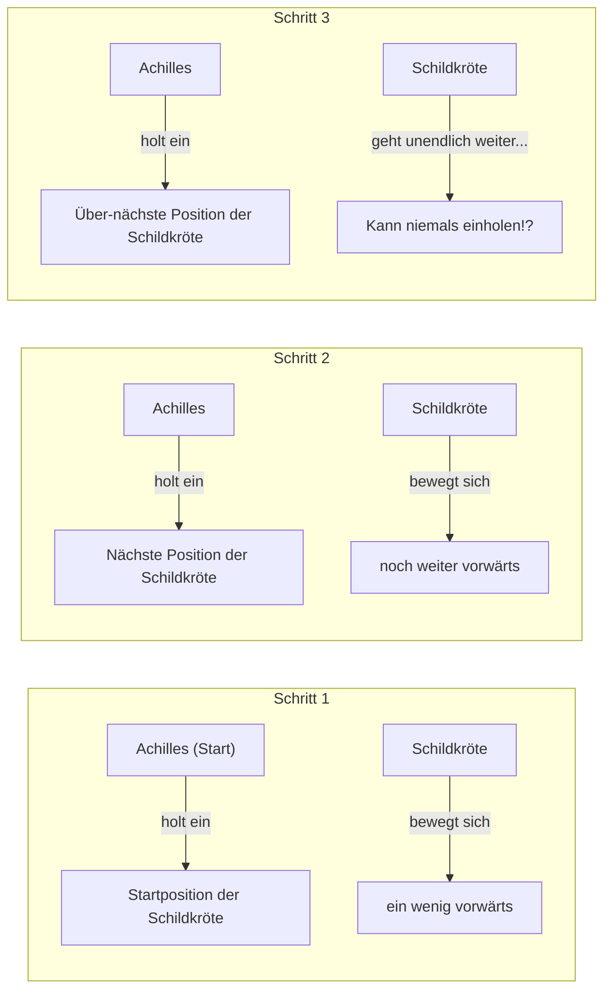
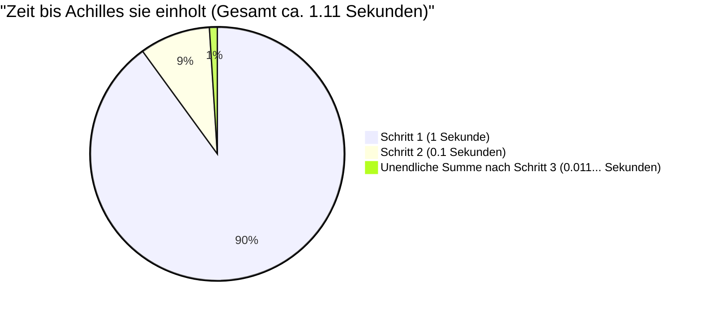

## 1. Zenons Paradoxon: Kann der flinke Held die Schildkröte nicht besiegen?

Im 5. Jahrhundert v. Chr. präsentierte der antike griechische Philosoph Zenon von Elea einige Paradoxa über "Bewegung", die unserer Intuition und unserem gesunden Menschenverstand völlig widersprachen. Das berühmteste davon ist das **"Achilles und die Schildkröte"**-Paradoxon.

Der schnellste Held der griechischen Mythologie, Achilles, und die Schildkröte, der Inbegriff von Langsamkeit, treten in einem Wettlauf gegeneinander an.
Da Achilles natürlich weitaus schneller ist, bekommt die Schildkröte als Vorgabe das Recht, ein Stück weiter vorne zu starten.

Das Rennen beginnt. Achilles verfolgt die Schildkröte mit rasender Geschwindigkeit.
Jedoch behauptete Zenon Folgendes:

**"Achilles wird die Schildkröte niemals einholen können."**

Warum um alles in der Welt? Zenons Logik ist wie folgt:

1. Wenn Achilles den "anfänglichen Startpunkt (Punkt A)" der Schildkröte erreicht, hat sich die Schildkröte ein wenig vorwärts bewegt und befindet sich am "Punkt B".
2. Wenn Achilles "Punkt B" erreicht, hat sich die Schildkröte wieder ein wenig vorwärts bewegt und befindet sich am "Punkt C".
3. Wenn Achilles "Punkt C" erreicht, hat sich die Schildkröte noch ein wenig weiter vorwärts bewegt und befindet sich am "Punkt D".

Dieser Prozess setzt sich unendlich fort. Denn jedes Mal, wenn Achilles den "Ort, an dem die Schildkröte war", erreicht, hat sich die Schildkröte unweigerlich "ein Stück weiter" bewegt.
Der Abstand wird zwar immer geringer, aber da dieser Schritt unendlich oft wiederholt werden muss, argumentierte man, dass Achilles die Schildkröte niemals überholen könne.

In der realen Welt ist es selbstverständlich, dass eine schnelle Person eine langsame überholt. Es war jedoch für die Menschen damals sehr schwierig zu erklären, wo der Fehler in diesem **Trick der sprachlichen Logik** lag.

---

## 2. Was ist daran falsch? Die Illusion von "Zeit" und "Unendlichkeit"

Das Clevere an Zenons Logik ist, dass er **"unendliche Schritte (Raumteilung)"** mit **"unendlicher Zeit"** vertauscht hat.

Es stimmt zwar, dass es unendlich viele "Schritte" gibt, bis Achilles den Ort erreicht, an dem die Schildkröte war.
Aber nur weil "die Anzahl der Schritte unendlich ist", bedeutet das nicht unbedingt, **"dass die Gesamtzeit dafür unendlich (ewig) sein wird"**.

Spätere Mathematiker schufen eine mächtige Waffe, um dieses Paradoxon zu lösen: die "Summe unendlicher Reihen".

---

## 3. Mathematische Klärung: Summe unendlicher Reihen und "Grenzwerte"

Lassen Sie uns dieses Problem mathematisch mit konkreten Zahlen berechnen.

- Angenommen, die Laufgeschwindigkeit von Achilles beträgt **$10\text{m/s}$**.
- Angenommen, die Gehgeschwindigkeit der Schildkröte beträgt **$1\text{m/s}$**. (Ein Zehntel der Geschwindigkeit von Achilles, $\frac{1}{10}$)
- Als Vorgabe für die Schildkröte startet sie **$10\text{m}$ vor** Achilles.

### Berechnung der Zeit pro Schritt

**Schritt 1:**
Die Zeit, die Achilles benötigt, um die Startposition der Schildkröte ($10\text{m}$ entfernt) zu erreichen, beträgt $\frac{10\text{m}}{10\text{m/s}} =$ **$1\text{ Sekunde}$**.
In dieser einen Sekunde bewegt sich die Schildkröte $1\text{m}$ vorwärts. (Der aktuelle Abstand zwischen Achilles und der Schildkröte beträgt $1\text{m}$)

**Schritt 2:**
Die Zeit, die Achilles benötigt, um die nächste Position der Schildkröte ($1\text{m}$ entfernt) zu erreichen, beträgt $\frac{1\text{m}}{10\text{m/s}} =$ **$0.1\text{ Sekunden}$**.
In diesen $0.1$ Sekunden bewegt sich die Schildkröte $0.1\text{m}$ vorwärts. (Der Abstand beträgt $0.1\text{m}$)

**Schritt 3:**
Die Zeit, die Achilles benötigt, um die nächste Position der Schildkröte ($0.1\text{m}$ entfernt) zu erreichen, beträgt $\frac{0.1\text{m}}{10\text{m/s}} =$ **$0.01\text{ Sekunden}$**.
In diesen $0.01$ Sekunden bewegt sich die Schildkröte $0.01\text{m}$ vorwärts. (Der Abstand beträgt $0.01\text{m}$)

Auf diese Weise wird die "Zeit", die Achilles benötigt, um die vorherige Position der Schildkröte zu erreichen, zu der folgenden unendlichen Folge:

$$ 1\text{ Sekunde},\ 0.1\text{ Sekunden},\ 0.01\text{ Sekunden},\ 0.001\text{ Sekunden},\ \dots $$

Zenon sagte: "Da diese Schritte unendlich weitergehen, kann Achilles sie niemals einholen".
Aber was passiert, wenn wir die Zeit, die für jeden dieser Schritte benötigt wird, **alle addieren (die Summe der unendlichen Reihe ermitteln)**?

$$ \text{Gesamtzeit } T = 1 + 0.1 + 0.01 + 0.001 + \dots $$

Dies ist eine **unendliche geometrische Reihe** mit dem Anfangsglied $a = 1$ und dem Quotienten $r = 0.1$.
Wenn der absolute Wert des Quotienten $r$ kleiner als 1 ist ($|r| < 1$), konvergiert die unendliche geometrische Reihe gegen einen bestimmten "endlichen Wert". Die Formel für ihre Summe lautet wie folgt:

$$ S = \frac{a}{1 - r} $$

Wenn wir diese Formel zur Berechnung anwenden:

$$ T = \frac{1}{1 - 0.1} = \frac{1}{0.9} = \frac{10}{9} = 1.1111\dots \text{ Sekunden} $$

Das heißt, selbst wenn es unendlich viele Schritte gibt, wird die für sie benötigte Gesamtzeit nicht "unendlich", sondern **konvergiert exakt auf $\frac{10}{9}$ Sekunden (etwa 1,11 Sekunden)**.
Achilles wird die Schildkröte nach etwa 1,11 Sekunden ab dem Start erfolgreich einholen und dann überholen.

---

## 4. Warum wurden wir getäuscht?

Der Kern dieses Paradoxons liegt in dem Ausnutzen des **Fehlers in der einfachen menschlichen Intuition: "Wenn man unendlich viele Dinge addiert, muss die Antwort auch unendlich sein"**.

$$ 1 + 1 + 1 + 1 + \dots = \infty $$
Wenn man also dieselbe Zahl unendlich oft addiert, wird sie natürlich unendlich.

$$ \frac{1}{2} + \frac{1}{3} + \frac{1}{4} + \dots = \infty $$
Bei der berühmten "harmonischen Reihe" werden die zu addierenden Zahlen immer kleiner, divergieren aber letztendlich gegen unendlich.

Wenn jedoch die zu addierenden Zahlen **schnell genug kleiner werden** (wie bei einer geometrischen Reihe), passen sie selbst dann, wenn unendlich viele Zahlen addiert werden, sauber in einen bestimmten "endlichen Rahmen".

$$ \frac{1}{2} + \frac{1}{4} + \frac{1}{8} + \frac{1}{16} + \dots = 1 $$

Es ist wie wenn man einen Kuchen zur Hälfte isst, dann die Hälfte des Rests, dann die Hälfte des Rests... Wenn man das unendlich wiederholt, wird es am Ende nicht mehr als "ein ganzer Kuchen" sein.
Zenon unterteilte die Zeit absichtlich in winzige Stücke und indem er nur in diesem unterteilten Zeitrahmen (1 Sekunde, 0,1 Sekunden, 0,01 Sekunden...) sprach, schuf er die Illusion von "kann niemals einholen".

---

## 5. Mit relativer Geschwindigkeit auf einen Schlag gelöst

Übrigens ist es einfach, dieses Problem mit Schulmathematik zu lösen, ohne in Zenons Falle (unendliche Teilung von Raum und Zeit) zu tappen.
Man muss nur die "relative Geschwindigkeit" verwenden.

- Geschwindigkeit von Achilles: $10\text{m/s}$
- Geschwindigkeit der Schildkröte: $1\text{m/s}$
- Relative Geschwindigkeit der Schildkröte aus der Sicht von Achilles (die Geschwindigkeit, mit der Achilles sich der Schildkröte nähert): $10 - 1 = 9\text{m/s}$

Der anfängliche Rückstand von Achilles gegenüber der Schildkröte beträgt $10\text{m}$.
Die Zeit, die benötigt wird, um den Abstand von $10\text{m}$ mit einer Geschwindigkeit von $9\text{m/s}$ zu schließen, ist:

$$ \text{Zeit} = \frac{\text{Distanz}}{\text{Geschwindigkeit}} = \frac{10}{9}\text{ Sekunden} $$

Dies stimmt vollständig mit der Antwort überein, die wir zuvor mithilfe der Analysis (dem Grenzwert unendlicher Reihen) gefunden haben.

---

## 6. Zusammenfassung: Paradoxa haben die Mathematik vorangebracht

Zenons "Achilles und die Schildkröte" mag für uns heute wie ein bloßes Wortspiel oder Sophisterei erscheinen.
Für die antiken griechischen Philosophen jedoch, die noch keine Konzepte wie "Unendlichkeit" oder "Grenzwerte" besaßen, war es äußerst schwierig, dies allein durch Logik zu widerlegen.

Die tiefen Fragen, die dieses Paradoxon aufwarf, wie "Was bedeutet kontinuierlich?" oder "Was bedeutet es, unendlich teilbar zu sein?", wurden zu einer wichtigen treibenden Kraft, die zur Geburt der **"Analysis"** durch Newton und Leibniz und schließlich zu den Grundlagen der modernen Mathematik führte.

Große Paradoxa verwirren nicht nur die Menschen, sondern sind auch Schlüssel, die neue Türen in der Mathematik öffnen.
