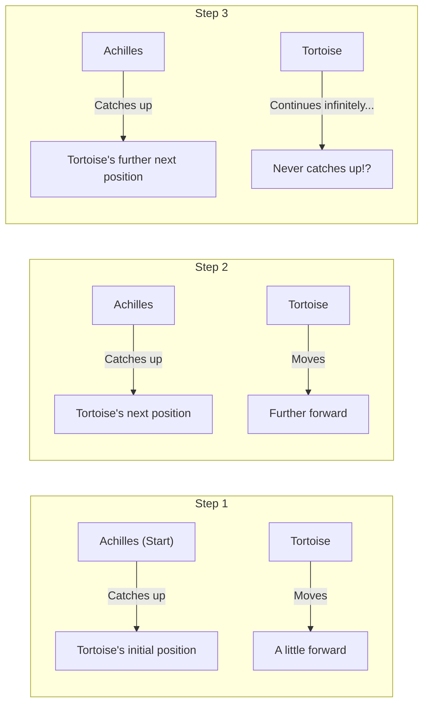
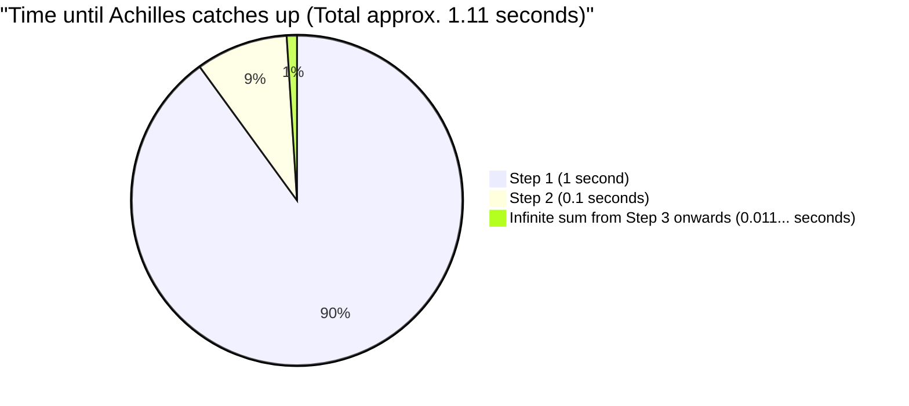

## 1. Zeno's Paradox: Can the Swift Hero Not Beat the Tortoise?

In the 5th century BC, the ancient Greek philosopher Zeno of Elea presented several paradoxes regarding "motion" that directly contradicted our intuition and common sense. The most famous among them is the paradox of **"Achilles and the Tortoise"**.

Achilles, the swiftest hero in Greek mythology, and a tortoise, the epitome of slowness, have a footrace.
Of course, Achilles is overwhelmingly faster, so the tortoise is given a handicap and allowed to start a little further ahead.

The race begins. Achilles chases after the tortoise at breakneck speed.
However, Zeno argued as follows:

**"Achilles will never be able to catch up to the tortoise."**

Why on earth is this? Zeno's logic goes like this:

1. When Achilles reaches the tortoise's "initial starting point (Point A)", the tortoise has moved a little forward and is at "Point B".
2. When Achilles reaches "Point B", the tortoise has moved a little further forward and is at "Point C".
3. When Achilles reaches "Point C", the tortoise has moved a little further forward again and is at "Point D".

This process continues infinitely. Every time Achilles reaches "where the tortoise was," the tortoise has inevitably moved "a little bit further ahead."
Although the distance keeps shrinking, because these steps must be repeated an infinite number of times, Achilles can never overtake the tortoise, or so the argument goes.

In the real world, it is obvious that a fast person will overtake a slow person. However, explaining exactly where the flaw lay in this **verbal logical trick** was extremely difficult for the people of that time.

---

## 2. Where is the Error? The Illusion of "Time" and "Infinity"

The cleverness of Zeno's logic lies in subtly replacing **"an infinite number of steps (division of space)"** with **"infinite time"**.

It is true that there are an infinite number of "steps" before Achilles reaches the place where the tortoise was.
However, just because "there are an infinite number of steps," it **does not necessarily mean that "the total time required for them is infinite (eternal)"**.

Later mathematicians created a powerful weapon called the "sum of an infinite series" to solve this paradox.

---

## 3. Mathematical Clarification: The Sum of Infinite Series and "Limits"

Let's apply concrete numbers to this problem and calculate it mathematically.

- Let Achilles' running speed be **$10\text{m}$ per second**.
- Let the tortoise's walking speed be **$1\text{m}$ per second**. ($\frac{1}{10}$ of Achilles' speed)
- As a handicap for the tortoise, assume the tortoise starts **$10\text{m}$ ahead** of Achilles.

### Calculating the Time for Each Step

**Step 1:**
The time it takes for Achilles to reach the tortoise's initial position ($10\text{m}$ ahead) is $\frac{10\text{m}}{10\text{m/s}} =$ **$1\text{ second}$**.
During this 1 second, the tortoise has moved forward $1\text{m}$. (The current gap between Achilles and the tortoise is $1\text{m}$)

**Step 2:**
The time it takes for Achilles to reach the tortoise's next position ($1\text{m}$ ahead) is $\frac{1\text{m}}{10\text{m/s}} =$ **$0.1\text{ seconds}$**.
During this 0.1 seconds, the tortoise has moved forward $0.1\text{m}$. (The gap is $0.1\text{m}$)

**Step 3:**
The time it takes for Achilles to reach the tortoise's next position ($0.1\text{m}$ ahead) is $\frac{0.1\text{m}}{10\text{m/s}} =$ **$0.01\text{ seconds}$**.
During this 0.01 seconds, the tortoise has moved forward $0.01\text{m}$. (The gap is $0.01\text{m}$)

In this way, the "time" it takes for Achilles to reach the tortoise's previous position forms the following infinite sequence:

$$ 1\text{ second},\ 0.1\text{ seconds},\ 0.01\text{ seconds},\ 0.001\text{ seconds},\ \dots $$

Zeno said, "Since these steps continue infinitely, Achilles can never catch up."
However, what happens if we **add up all the time** taken for each of these steps (finding the sum of the infinite series)?

$$ \text{Total Time } T = 1 + 0.1 + 0.01 + 0.001 + \dots $$

This is an **infinite geometric series** with a first term of $a = 1$ and a common ratio of $r = 0.1$.
When the absolute value of the common ratio $r$ is less than 1 ($|r| < 1$), the infinite geometric series converges to a certain "finite value." The formula for its sum is as follows:

$$ S = \frac{a}{1 - r} $$

Calculating this by applying it to the formula gives:

$$ T = \frac{1}{1 - 0.1} = \frac{1}{0.9} = \frac{10}{9} = 1.1111\dots \text{ seconds} $$

In other words, even if there are an infinite number of steps, the sum of the time required for them does not become "infinite," but **converges exactly to $\frac{10}{9}$ seconds (about 1.11 seconds)**.
Achilles will splendidly catch up to and overtake the tortoise approximately 1.11 seconds after the start.

---

## 4. Why Were We Deceived?

The essence of this paradox lies in pointing out **the flaw in human naive intuition that "if you add up an infinite number of things, the answer must also be infinite."**

$$ 1 + 1 + 1 + 1 + \dots = \infty $$
As shown here, adding the same number infinitely naturally results in infinity.

$$ \frac{1}{2} + \frac{1}{3} + \frac{1}{4} + \dots = \infty $$
The famous "harmonic series" also adds numbers that get progressively smaller, but ultimately diverges to infinity.

However, when the numbers being added **become smaller sufficiently quickly** (like in a geometric series, for example), even if you add an infinite number of them, they neatly fit within a certain "finite boundary."

$$ \frac{1}{2} + \frac{1}{4} + \frac{1}{8} + \frac{1}{16} + \dots = 1 $$

It is the same as how eating half a cake, then half of the remainder, then half of that remainder... infinitely repeating this process will still never exceed "the original 1 whole cake."
Zeno intentionally divided time into minute fragments and, by only speaking within those divided timeframes (1 second, 0.1 seconds, 0.01 seconds...), created the illusion that Achilles could "never catch up."

---

## 5. Easy to Solve in an Instant Using Relative Velocity

By the way, without falling into Zeno's trap (the infinite division of space and time), it is also easy to solve this problem using middle school mathematics.
You just need to use "relative velocity."

- Achilles' speed: $10\text{m/s}$
- Tortoise's speed: $1\text{m/s}$
- The relative speed of the tortoise from Achilles' perspective (the speed at which Achilles approaches the tortoise): $10 - 1 = 9\text{m/s}$

Achilles' initial delay relative to the tortoise is $10\text{m}$.
The time it takes to close the distance of $10\text{m}$ at a speed of $9\text{m/s}$ is:

$$ \text{Time} = \frac{\text{Distance}}{\text{Speed}} = \frac{10}{9}\text{ seconds} $$

This perfectly matches the answer we previously derived using calculus (the limit of an infinite series).

---

## 6. Conclusion: Paradoxes Developed Mathematics

From our modern perspective, Zeno's "Achilles and the Tortoise" might just seem like wordplay or sophistry.
However, for the philosophers of ancient Greece, who lacked concepts like "infinity" and "limits" at the time, refuting this using logic alone was a formidable task.

The deep questions posed by this paradox—"What is continuity?" and "What does it mean to be infinitely divisible?"—became an important driving force leading to the birth of **"calculus"** by Newton and Leibniz later on, and further to modern mathematical foundations.

Great paradoxes do not merely deceive people; they also act as keys that open doors to new mathematics.
