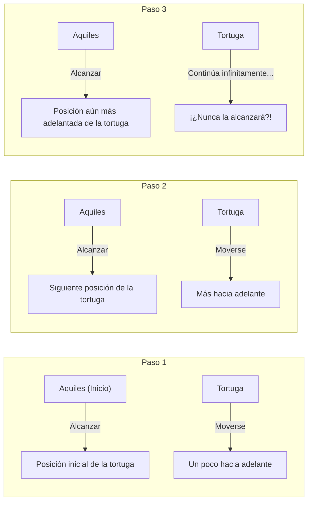
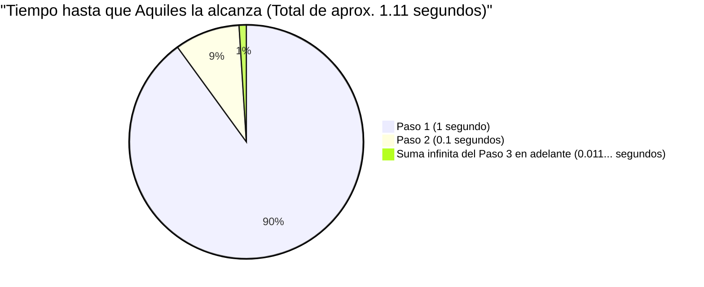

## 1. La paradoja de Zenón: ¿El veloz héroe no puede vencer a la tortuga?

En el siglo V a. C., el filósofo griego antiguo Zenón de Elea presentó varias paradojas sobre el "movimiento" que iban directamente en contra de nuestra intuición y sentido común. La más famosa de ellas es la paradoja de **"Aquiles y la tortuga"**.

Aquiles, el héroe más veloz de la mitología griega, y una tortuga, sinónimo de lentitud, hacen una carrera.
Por supuesto, Aquiles es abrumadoramente más rápido, por lo que a la tortuga se le da una ventaja, permitiéndole empezar un poco más adelante.

Comienza la carrera. Aquiles persigue a la tortuga a una velocidad vertiginosa.
Sin embargo, Zenón argumentó lo siguiente:

**"Aquiles nunca podrá alcanzar a la tortuga."**

¿Por qué? La lógica de Zenón es esta:

1. Cuando Aquiles alcanza el "punto de partida original (Punto A)" de la tortuga, la tortuga ha avanzado un poco más hasta el "Punto B".
2. Cuando Aquiles alcanza el "Punto B", la tortuga ha avanzado un poco más hasta el "Punto C".
3. Cuando Aquiles alcanza el "Punto C", la tortuga ha avanzado todavía un poco más hasta el "Punto D".

Este proceso continúa infinitamente. Cada vez que Aquiles llega a "donde estaba la tortuga", la tortuga siempre se ha movido "un poco más adelante".
La distancia se acorta cada vez más, pero debido a que este paso debe repetirse infinitas veces, se dice que Aquiles nunca podrá superar a la tortuga.

En el mundo real, es natural que una persona rápida supere a una lenta. Sin embargo, explicar dónde estaba la falla en este **truco lógico verbal** fue extremadamente difícil para la gente de esa época.

---

## 2. ¿Dónde está el error? La ilusión del "tiempo" y el "infinito"

La lógica de Zenón es astuta porque sustituye **"pasos infinitos (división del espacio)"** con **"tiempo infinito"**.

Es cierto que el "número de pasos" hasta que Aquiles alcanza el lugar donde estaba la tortuga es infinito.
Sin embargo, solo porque "el número de pasos sea infinito", **no significa que "el tiempo total requerido sea infinito (una eternidad)"**.

Los matemáticos posteriores crearon una poderosa herramienta llamada "suma de series infinitas" para desentrañar esta paradoja.

---

## 3. Aclaración matemática: Suma de series infinitas y el "límite"

Apliquemos números específicos a este problema y calculémoslo matemáticamente.

- Supongamos que la velocidad a la que corre Aquiles es de **$10\text{m}$ por segundo**.
- Supongamos que la velocidad a la que camina la tortuga es de **$1\text{m}$ por segundo**. (Una velocidad de $\frac{1}{10}$ de la de Aquiles)
- Como ventaja para la tortuga, supongamos que esta empieza **$10\text{m}$ por delante** de Aquiles.

### Calcular el tiempo para cada paso

**Paso 1:**
El tiempo que le toma a Aquiles alcanzar la posición inicial de la tortuga ($10\text{m}$ por delante) es $\frac{10\text{m}}{10\text{m/s}} =$ **$1\text{ segundo}$**.
En este 1 segundo, la tortuga ha avanzado $1\text{m}$. (La diferencia actual entre Aquiles y la tortuga es de $1\text{m}$)

**Paso 2:**
El tiempo que le toma a Aquiles alcanzar la siguiente posición de la tortuga ($1\text{m}$ por delante) es $\frac{1\text{m}}{10\text{m/s}} =$ **$0.1\text{ segundos}$**.
En estos 0.1 segundos, la tortuga ha avanzado $0.1\text{m}$. (La diferencia es de $0.1\text{m}$)

**Paso 3:**
El tiempo que le toma a Aquiles alcanzar la siguiente posición de la tortuga ($0.1\text{m}$ por delante) es $\frac{0.1\text{m}}{10\text{m/s}} =$ **$0.01\text{ segundos}$**.
En estos 0.01 segundos, la tortuga ha avanzado $0.01\text{m}$. (La diferencia es de $0.01\text{m}$)

De esta manera, el "tiempo" que le toma a Aquiles alcanzar la posición anterior de la tortuga se convierte en una secuencia infinita como la siguiente:

$$ 1\text{ segundo},\ 0.1\text{ segundos},\ 0.01\text{ segundos},\ 0.001\text{ segundos},\ \dots $$

Zenón dijo: "Dado que este paso continúa infinitamente, Aquiles nunca podrá alcanzarla".
Sin embargo, ¿qué pasa si **sumamos todos** los tiempos que toma cada paso (calculamos la suma de la serie infinita)?

$$ \text{Tiempo total } T = 1 + 0.1 + 0.01 + 0.001 + \dots $$

Esta es una **serie geométrica infinita** con el primer término $a = 1$ y la razón común $r = 0.1$.
Si el valor absoluto de la razón común $r$ es menor a 1 ($|r| < 1$), la serie geométrica infinita converge a un cierto "valor finito". Su fórmula de suma es la siguiente:

$$ S = \frac{a}{1 - r} $$

Aplicando esta fórmula para calcular,

$$ T = \frac{1}{1 - 0.1} = \frac{1}{0.9} = \frac{10}{9} = 1.1111\dots \text{ segundos} $$

Es decir, incluso si hay infinitos pasos, el tiempo total requerido no se vuelve "infinito", sino que **converge exactamente a $\frac{10}{9}$ segundos (aproximadamente 1.11 segundos)**.
Aquiles, de manera brillante, alcanza a la tortuga y luego la supera aproximadamente 1.11 segundos después del inicio.

---

## 4. ¿Por qué fuimos engañados?

La esencia de esta paradoja es que ataca el **error de la intuición humana ingenua de que "si sumas infinitas cosas, la respuesta también debe ser infinita"**.

$$ 1 + 1 + 1 + 1 + \dots = \infty $$
De esta forma, si sumas el mismo número infinitamente, naturalmente se vuelve infinito.

$$ \frac{1}{2} + \frac{1}{3} + \frac{1}{4} + \dots = \infty $$
En la famosa "serie armónica", los números que se suman se vuelven cada vez más pequeños, pero finalmente diverge al infinito.

Sin embargo, si los números que se suman **disminuyen lo suficientemente rápido** (como en una serie geométrica, por ejemplo), incluso si se suman infinitos números, encajarán perfectamente dentro de un cierto "marco finito".

$$ \frac{1}{2} + \frac{1}{4} + \frac{1}{8} + \frac{1}{16} + \dots = 1 $$

Es lo mismo que comer la mitad de un pastel, comer la mitad de lo que queda, luego la mitad de eso... incluso si se repite infinitamente, al final no superará "1 pastel original".
Zenón dividió intencionalmente el tiempo en partes finas, y al hablar de las cosas solo dentro de esos marcos de tiempo divididos (1 segundo, 0.1 segundos, 0.01 segundos...), creó la ilusión de que "nunca podría alcanzarla".

---

## 5. Se puede resolver en un instante pensando en velocidad relativa

Por cierto, es fácil resolver este problema con las matemáticas de secundaria, sin caer en la trampa de Zenón (la división infinita del espacio y el tiempo).
Simplemente se debe usar la "velocidad relativa".

- Velocidad de Aquiles: $10\text{m/s}$
- Velocidad de la tortuga: $1\text{m/s}$
- Velocidad relativa de la tortuga vista desde Aquiles (la velocidad a la que Aquiles se acerca a la tortuga): $10 - 1 = 9\text{m/s}$

El retraso inicial de Aquiles con respecto a la tortuga es de $10\text{m}$.
El tiempo que le toma cerrar la distancia de $10\text{m}$ a una velocidad de $9\text{m/s}$ es,

$$ \text{Tiempo} = \frac{\text{Distancia}}{\text{Velocidad}} = \frac{10}{9}\text{ segundos} $$

Coincide perfectamente con la respuesta que obtuvimos anteriormente usando cálculo (el límite de series infinitas).

---

## 6. Conclusión: Las paradojas desarrollaron las matemáticas

"Aquiles y la tortuga" de Zenón puede parecernos a los modernos un simple juego de palabras o sofismo.
Sin embargo, para los antiguos filósofos griegos de la época que no tenían los conceptos de "infinito" o "límite", era una tarea hercúlea refutar esto basándose únicamente en la lógica.

La profunda pregunta que planteó esta paradoja, "¿Qué significa ser continuo?" o "¿Qué significa poder dividirse infinitamente?", se convirtió en una fuerza impulsora importante que condujo al nacimiento del **"Cálculo"** por Newton y Leibniz en épocas posteriores, e incluso a la teoría moderna de los fundamentos matemáticos.

Una gran paradoja no solo confunde a las personas, sino que también es una llave que abre la puerta a nuevas matemáticas.
