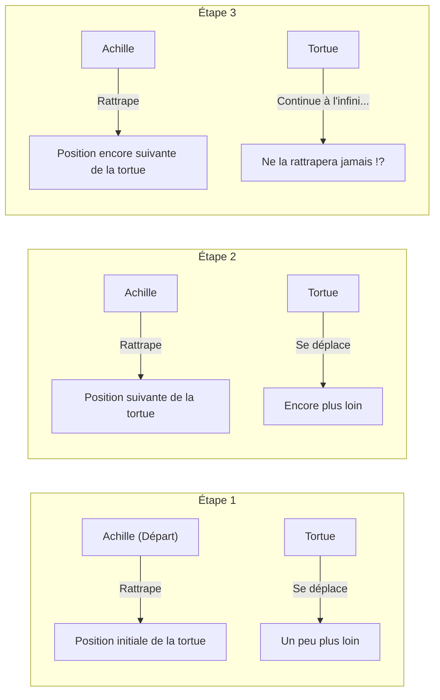
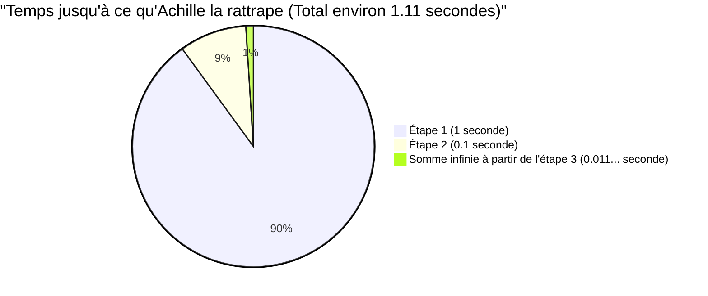

## 1. Le paradoxe de Zénon : le héros au pied léger ne peut-il pas battre une tortue ?

Au Ve siècle avant J.-C., le philosophe grec antique Zénon d'Élée a présenté plusieurs paradoxes concernant le « mouvement » qui allaient directement à l'encontre de notre intuition et de notre bon sens. Le plus célèbre d'entre eux est le paradoxe d'**« Achille et la tortue »**.

Achille, le héros le plus rapide de la mythologie grecque, et une tortue, synonyme de lenteur, font une course à pied.
Bien sûr, comme Achille est nettement plus rapide, la tortue reçoit un avantage en lui permettant de partir un peu plus en avant.

La course commence. Achille poursuit la tortue à une vitesse fulgurante.
Cependant, Zénon a affirmé ce qui suit :

**« Achille ne pourra jamais rattraper la tortue »**

Mais pourquoi donc ? La logique de Zénon est la suivante :

1. Lorsqu'Achille atteint le « point de départ initial (point A) » de la tortue, la tortue a avancé un peu et se trouve au « point B ».
2. Lorsqu'Achille atteint le « point B », la tortue a encore avancé un peu et se trouve au « point C ».
3. Lorsqu'Achille atteint le « point C », la tortue a encore avancé un peu et se trouve au « point D ».

Ce processus se poursuit à l'infini. Chaque fois qu'Achille atteint « l'endroit où se trouvait la tortue », la tortue s'est inévitablement déplacée « un peu plus loin ».
La distance se réduit de plus en plus, mais comme cette étape doit être répétée un nombre infini de fois, Achille ne pourra jamais dépasser la tortue.

Dans le monde réel, il est tout à fait normal qu'une personne rapide dépasse une personne lente. Cependant, il était très difficile pour les gens de l'époque d'expliquer où se trouvait la faille dans ce **tour de passe-passe logique basé sur les mots**.

---

## 2. Où est l'erreur ? L'illusion du « temps » et de « l'infini »

L'ingéniosité de la logique de Zénon réside dans le fait qu'il substitue **« un nombre infini d'étapes (division de l'espace) »** à un **« temps infini »**.

Il est vrai que le « nombre d'étapes » nécessaires pour qu'Achille atteigne l'endroit où se trouvait la tortue est infini.
Cependant, le fait qu'il y ait « un nombre infini d'étapes » ne signifie pas nécessairement que **« la somme du temps requis sera infinie (l'éternité) »**.

Les mathématiciens des générations suivantes ont créé une arme puissante pour résoudre ce paradoxe : la « somme des séries infinies ».

---

## 3. Explication mathématique : sommes de séries infinies et « limites »

Appliquons des nombres concrets et calculons mathématiquement ce problème.

- Supposons que la vitesse de course d'Achille soit de **$10\text{m/s}$**.
- Supposons que la vitesse de marche de la tortue soit de **$1\text{m/s}$**. (La vitesse d'Achille multipliée par $\frac{1}{10}$)
- Comme avantage pour la tortue, supposons que la tortue parte de **$10\text{m}$ devant** Achille.

### Calcul du temps pour chaque étape

**Étape 1 :**
Le temps nécessaire à Achille pour atteindre la position initiale de la tortue ($10\text{m}$ plus loin) est de $\frac{10\text{m}}{10\text{m/s}} =$ **$1\text{ seconde}$**.
Pendant cette seconde, la tortue a avancé de $1\text{m}$. (L'écart actuel entre Achille et la tortue est de $1\text{m}$)

**Étape 2 :**
Le temps nécessaire à Achille pour atteindre la position suivante de la tortue ($1\text{m}$ plus loin) est de $\frac{1\text{m}}{10\text{m/s}} =$ **$0.1\text{ seconde}$**.
Pendant ces $0.1$ seconde, la tortue a avancé de $0.1\text{m}$. (L'écart est de $0.1\text{m}$)

**Étape 3 :**
Le temps nécessaire à Achille pour atteindre la position suivante de la tortue ($0.1\text{m}$ plus loin) est de $\frac{0.1\text{m}}{10\text{m/s}} =$ **$0.01\text{ seconde}$**.
Pendant ces $0.01$ seconde, la tortue a avancé de $0.01\text{m}$. (L'écart est de $0.01\text{m}$)

Ainsi, le « temps » nécessaire pour qu'Achille atteigne la position précédente de la tortue forme la séquence infinie suivante :

$$ 1\text{ seconde},\ 0.1\text{ seconde},\ 0.01\text{ seconde},\ 0.001\text{ seconde},\ \dots $$

Zénon a dit : « Puisque ces étapes se poursuivent indéfiniment, Achille ne la rattrapera jamais. »
Cependant, que se passe-t-il si nous **additionnons tous** les temps pris pour chaque étape (trouvons la somme de la série infinie) ?

$$ \text{Temps total } T = 1 + 0.1 + 0.01 + 0.001 + \dots $$

Il s'agit d'une **série géométrique infinie** avec un premier terme $a = 1$ et une raison $r = 0.1$.
Si la valeur absolue de la raison $r$ est inférieure à 1 ($|r| < 1$), la série géométrique infinie converge vers une certaine « valeur finie ». La formule de sa somme est la suivante :

$$ S = \frac{a}{1 - r} $$

En appliquant cette formule et en calculant, on obtient :

$$ T = \frac{1}{1 - 0.1} = \frac{1}{0.9} = \frac{10}{9} = 1.1111\dots \text{ secondes} $$

En d'autres termes, même s'il existe un nombre infini d'étapes, la somme du temps requis ne devient pas « infinie », mais **converge exactement vers $\frac{10}{9}$ de seconde (environ $1.11$ secondes)**.
Achille rattrapera magnifiquement et dépassera la tortue environ $1.11$ seconde après le départ.

---

## 4. Pourquoi avons-nous été trompés ?

L'essence de ce paradoxe réside dans le fait qu'il exploite **l'erreur de l'intuition humaine naïve selon laquelle « si vous additionnez un nombre infini de choses, la réponse devrait également être infinie »**.

$$ 1 + 1 + 1 + 1 + \dots = \infty $$
Ainsi, si vous ajoutez le même nombre indéfiniment, cela devient naturellement infini.

$$ \frac{1}{2} + \frac{1}{3} + \frac{1}{4} + \dots = \infty $$
La célèbre « série harmonique », bien que les nombres à ajouter deviennent de plus en plus petits, diverge finalement vers l'infini.

Cependant, si les nombres à ajouter **deviennent plus petits suffisamment rapidement** (comme dans une série géométrique), même si vous additionnez un nombre infini de nombres, ils s'inséreront parfaitement dans un certain « cadre fini ».

$$ \frac{1}{2} + \frac{1}{4} + \frac{1}{8} + \frac{1}{16} + \dots = 1 $$

C'est comme manger la moitié d'un gâteau, puis manger la moitié du reste, et encore la moitié du reste... même si vous le répétez indéfiniment, cela ne dépassera jamais « l'équivalent d'un gâteau entier d'origine ».
Zénon a intentionnellement divisé le temps en petits morceaux, et en ne parlant des choses que dans ce cadre temporel divisé (1 seconde, 0.1 seconde, 0.01 seconde...), il a créé l'illusion que l'on ne pourrait « jamais rattraper ».

---

## 5. Une réflexion sur la vitesse relative le résout instantanément

Soit dit en passant, il est également facile de résoudre ce problème en utilisant les mathématiques du collège sans tomber dans le piège de Zénon (la division infinie de l'espace et du temps).
Il suffit d'utiliser la « vitesse relative ».

- Vitesse d'Achille : $10\text{m/s}$
- Vitesse de la tortue : $1\text{m/s}$
- Vitesse relative de la tortue vue par Achille (la vitesse à laquelle Achille s'approche de la tortue) : $10 - 1 = 9\text{m/s}$

Le retard initial d'Achille par rapport à la tortue est de $10\text{m}$.
Le temps qu'il faut pour combler une distance de $10\text{m}$ à une vitesse de $9\text{m/s}$ est :

$$ \text{Temps} = \frac{\text{Distance}}{\text{Vitesse}} = \frac{10}{9}\text{ secondes} $$

Cela correspond parfaitement à la réponse que nous avons trouvée plus tôt en utilisant le calcul infinitésimal (la limite d'une série infinie).

---

## 6. Résumé : Les paradoxes ont fait progresser les mathématiques

Le paradoxe d'« Achille et la tortue » de Zénon peut sembler n'être qu'un simple jeu de mots ou un sophisme de notre point de vue moderne.
Cependant, pour les philosophes grecs anciens qui ne possédaient pas les concepts d'« infini » ou de « limite » à l'époque, il était extrêmement difficile de le réfuter par la seule logique.

Les questions profondes posées par ce paradoxe, telles que « Qu'est-ce que le continu ? » et « Que signifie être divisé à l'infini ? », sont devenues un moteur important qui a conduit à la naissance du **« calcul infinitésimal »** par Newton et Leibniz plus tard, et même aux fondements des mathématiques modernes.

Les grands paradoxes ne font pas que tromper les gens, ce sont aussi les clés qui ouvrent les portes de nouvelles mathématiques.
