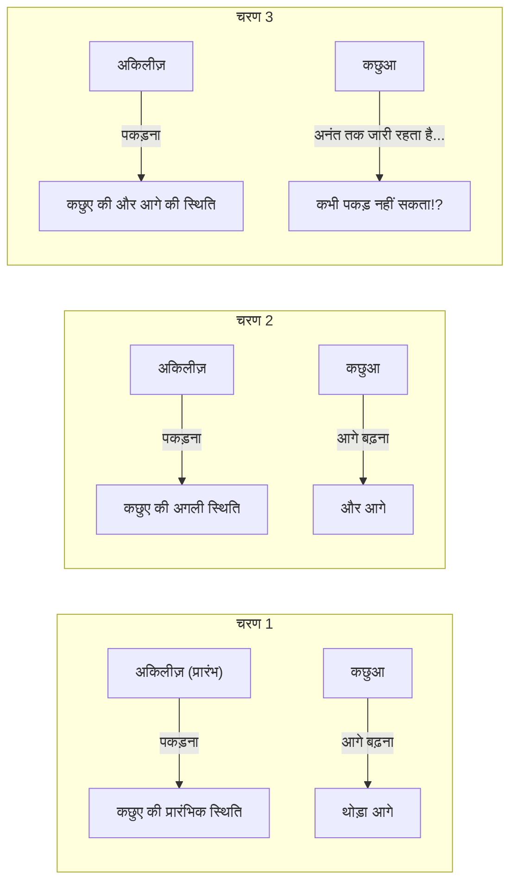
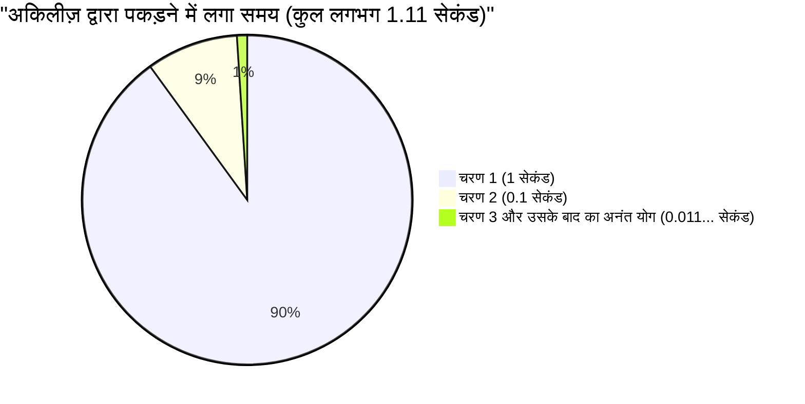

## 1. ज़ेनो का विरोधाभास: क्या तेज दौड़ने वाला नायक कछुए को नहीं हरा सकता?

5वीं शताब्दी ईसा पूर्व में, प्राचीन ग्रीक दार्शनिक एलिया के ज़ेनो ने "गति" के संबंध में कई विरोधाभास प्रस्तुत किए जो सीधे हमारे अंतर्ज्ञान और सामान्य ज्ञान के खिलाफ जाते हैं। उनमें से सबसे प्रसिद्ध **"अकिलीज़ और कछुआ"** का विरोधाभास है।

ग्रीक पौराणिक कथाओं के सबसे तेज नायक अकिलीज़ और धीमी गति के पर्याय कछुए के बीच दौड़ होती है।
चूंकि अकिलीज़ स्पष्ट रूप से बहुत तेज है, इसलिए कछुए को बाधा (handicap) के रूप में थोड़ा आगे से शुरुआत करने का अधिकार दिया गया है।

दौड़ शुरू होती है। अकिलीज़ तेज गति से कछुए का पीछा करता है।
हालाँकि, ज़ेनो ने निम्नलिखित तर्क दिया:

**"अकिलीज़ कछुए को कभी नहीं पकड़ सकता।"**

आखिर ऐसा क्यों है? ज़ेनो का तर्क इस प्रकार है:

1. जब अकिलीज़ कछुए के "शुरु शुरुआती बिंदु (बिंदु A)" पर पहुँचता है, तो कछुआ थोड़ा आगे बढ़कर "बिंदु B" पर पहुँच जाता है।
2. जब अकिलीज़ "बिंदु B" पर पहुँचता है, तो कछुआ थोड़ा और आगे बढ़कर "बिंदु C" पर पहुँच जाता है।
3. जब अकिलीज़ "बिंदु C" पर पहुँचता है, तो कछुआ थोड़ा और आगे बढ़कर "बिंदु D" पर पहुँच जाता है।

यह प्रक्रिया अनंत काल तक चलती है। हर बार जब अकिलीज़ उस स्थान पर पहुँचता है "जहाँ कछुआ था", कछुआ हमेशा "थोड़ा और आगे" बढ़ चुका होता है।
दूरी लगातार कम होती जाती है, लेकिन चूँकि यह कदम अनंत बार दोहराया जाना चाहिए, इसलिए कहा जाता है कि अकिलीज़ कछुए को कभी नहीं पछाड़ सकता।

वास्तविक दुनिया में, यह सामान्य बात है कि एक तेज दौड़ने वाला व्यक्ति धीमी गति वाले व्यक्ति को पछाड़ देता है। हालाँकि, उस समय के लोगों के लिए यह समझाना बहुत मुश्किल था कि इस **शाब्दिक तर्क की चाल** में क्या खामी है।

---

## 2. कहाँ गलती है? "समय" और "अनंत" का भ्रम

ज़ेनो के तर्क की चतुराई इस बात में है कि वह **"अनंत चरणों (अंतरिक्ष का विभाजन)"** को **"अनंत समय"** के साथ बदल देता है।

यह सच है कि अकिलीज़ को उस स्थान तक पहुँचने के लिए "चरणों की संख्या" अनंत है जहाँ कछुआ था।
हालाँकि, सिर्फ इसलिए कि "चरणों की संख्या अनंत है", इसका मतलब यह नहीं है कि **"इसके लिए आवश्यक कुल समय अनंत (हमेशा के लिए) होगा"**।

बाद के गणितज्ञों ने इस विरोधाभास को सुलझाने के लिए "अनंत श्रेणी का योग" नामक एक शक्तिशाली हथियार बनाया।

---

## 3. गणितीय स्पष्टीकरण: अनंत श्रेणियों का योग और "सीमा (Limit)"

आइए इस समस्या को विशिष्ट संख्याओं का उपयोग करके गणितीय रूप से हल करें।

- मान लीजिए कि अकिलीज़ के दौड़ने की गति **$10\text{m/s}$** है।
- मान लीजिए कि कछुए के चलने की गति **$1\text{m/s}$** है। (अकिलीज़ की गति का $\frac{1}{10}$)
- कछुए को लाभ (handicap) देने के लिए, मान लीजिए कि कछुआ अकिलीज़ से **$10\text{m}$ आगे** से शुरू होता है।

### प्रत्येक चरण के लिए समय की गणना

**चरण 1:**
अकिलीज़ को कछुए की प्रारंभिक स्थिति ($10\text{m}$ आगे) तक पहुँचने में लगने वाला समय $\frac{10\text{m}}{10\text{m/s}} =$ **$1\text{ सेकंड}$** है।
इस 1 सेकंड के दौरान, कछुआ $1\text{m}$ आगे बढ़ता है। (अब अकिलीज़ और कछुए के बीच का अंतर $1\text{m}$ है)

**चरण 2:**
अकिलीज़ को कछुए की अगली स्थिति ($1\text{m}$ आगे) तक पहुँचने में लगने वाला समय $\frac{1\text{m}}{10\text{m/s}} =$ **$0.1\text{ सेकंड}$** है।
इस 0.1 सेकंड के दौरान, कछुआ $0.1\text{m}$ आगे बढ़ता है। (अंतर $0.1\text{m}$ है)

**चरण 3:**
अकिलीज़ को कछुए की अगली स्थिति ($0.1\text{m}$ आगे) तक पहुँचने में लगने वाला समय $\frac{0.1\text{m}}{10\text{m/s}} =$ **$0.01\text{ सेकंड}$** है।
इस 0.01 सेकंड के दौरान, कछुआ $0.01\text{m}$ आगे बढ़ता है। (अंतर $0.01\text{m}$ है)

इस प्रकार, अकिलीज़ को कछुए की पिछली स्थिति तक पहुँचने में लगने वाला "समय" एक अनंत अनुक्रम (infinite sequence) बन जाता है:

$$ 1\text{ सेकंड},\ 0.1\text{ सेकंड},\ 0.01\text{ सेकंड},\ 0.001\text{ सेकंड},\ \dots $$

ज़ेनो ने कहा, "चूँकि यह कदम अनंत बार जारी रहता है, इसलिए अकिलीज़ उसे कभी नहीं पकड़ सकता।"
लेकिन क्या होगा यदि हम इन सभी चरणों में लगने वाले समय को **जोड़ दें (अनंत श्रेणी का योग खोजें)**?

$$ \text{कुल समय } T = 1 + 0.1 + 0.01 + 0.001 + \dots $$

यह प्रथम पद $a = 1$ और सार्व अनुपात $r = 0.1$ वाली एक **अनंत गुणोत्तर श्रेणी (infinite geometric series)** है।
यदि सार्व अनुपात $r$ का निरपेक्ष मान 1 से कम है ($|r| < 1$), तो अनंत गुणोत्तर श्रेणी एक निश्चित "सीमित मान" (finite value) पर अभिसरण (converges) करती है। इसके योग का सूत्र निम्नलिखित है:

$$ S = \frac{a}{1 - r} $$

इस सूत्र का उपयोग करके गणना करने पर:

$$ T = \frac{1}{1 - 0.1} = \frac{1}{0.9} = \frac{10}{9} = 1.1111\dots \text{ सेकंड} $$

दूसरे शब्दों में, भले ही अनंत चरण हों, उनके लिए आवश्यक कुल समय "अनंत" नहीं होता है, बल्कि **ठीक $\frac{10}{9}$ सेकंड (लगभग 1.11 सेकंड) पर अभिसरण करता है**।
शुरुआत से लगभग 1.11 सेकंड के बाद, अकिलीज़ सफलतापूर्वक कछुए को पकड़ लेगा और उसे पछाड़ देगा।

---

## 4. हम मूर्ख क्यों बने?

इस विरोधाभास का सार मानव के इस सहज ज्ञान की गलती का फायदा उठाना है कि **"यदि आप अनंत चीजों को एक साथ जोड़ते हैं, तो उत्तर भी अनंत होना चाहिए।"**

$$ 1 + 1 + 1 + 1 + \dots = \infty $$
इस तरह, यदि आप एक ही संख्या को अनंत बार जोड़ते हैं, तो यह स्वाभाविक रूप से अनंत हो जाएगी।

$$ \frac{1}{2} + \frac{1}{3} + \frac{1}{4} + \dots = \infty $$
प्रसिद्ध "हरात्मक श्रेणी (harmonic series)" में भी, जोड़ी जा रही संख्याएँ छोटी होती जाती हैं, लेकिन अंततः यह अनंत तक अपसरित (diverges) हो जाती है।

हालाँकि, यदि जोड़ी जा रही संख्याएँ **पर्याप्त रूप से तेज़ी से छोटी होती जाती हैं** (उदाहरण के लिए, गुणोत्तर श्रेणी की तरह), तो अनंत संख्याओं को जोड़ने पर भी वे एक "सीमित सीमा" (finite frame) में पूरी तरह से फिट हो जाएँगी।

$$ \frac{1}{2} + \frac{1}{4} + \frac{1}{8} + \frac{1}{16} + \dots = 1 $$

यह उसी तरह है जैसे यदि आप आधा केक खाते हैं, फिर शेष का आधा खाते हैं, और फिर शेष का आधा खाते हैं... भले ही आप इसे अनंत काल तक दोहराएं, यह अंततः "मूल 1 केक" से अधिक नहीं होगा।
ज़ेनो ने जानबूझकर समय को छोटे-छोटे हिस्सों में बाँट दिया, और केवल उन विभाजित समय-सीमाओं (1 सेकंड, 0.1 सेकंड, 0.01 सेकंड...) के भीतर बात करके "कभी पकड़ नहीं पाने" का भ्रम पैदा किया।

---

## 5. सापेक्ष गति का उपयोग करके इसे एक पल में हल किया जा सकता है

वैसे, ज़ेनो के जाल (स्थान और समय का अनंत विभाजन) में फंसे बिना, मिडिल स्कूल के गणित का उपयोग करके इस समस्या को हल करना आसान है।
आप बस "सापेक्ष गति (relative speed)" का उपयोग कर सकते हैं।

- अकिलीज़ की गति: $10\text{m/s}$
- कछुए की गति: $1\text{m/s}$
- अकिलीज़ के दृष्टिकोण से कछुए की सापेक्ष गति (जिस गति से अकिलीज़ कछुए के करीब आता है): $10 - 1 = 9\text{m/s}$

कछुए के मुकाबले अकिलीज़ की शुरुआती देरी $10\text{m}$ है।
$9\text{m/s}$ की गति से $10\text{m}$ की दूरी कम करने में लगने वाला समय है:

$$ \text{समय} = \frac{\text{दूरी}}{\text{गति}} = \frac{10}{9}\text{ सेकंड} $$

यह कैलकुलस (अनंत श्रेणी की सीमा) का उपयोग करके हमारे द्वारा प्राप्त उत्तर से पूरी तरह मेल खाता है।

---

## 6. निष्कर्ष: विरोधाभासों ने गणित को कैसे विकसित किया

ज़ेनो का "अकिलीज़ और कछुआ" आज हमें केवल शब्दों का खेल या कुतर्क लग सकता है।
हालाँकि, प्राचीन ग्रीक दार्शनिकों के लिए, जिनके पास उस समय "अनंत" या "सीमा" जैसी कोई अवधारणा नहीं थी, अकेले तर्क का उपयोग करके इसका खंडन करना एक अत्यंत कठिन कार्य था।

इस विरोधाभास द्वारा उठाए गए गहरे प्रश्न, जैसे कि "निरंतरता क्या है?" और "अनंत रूप से विभाजित होने का क्या मतलब है?", बाद में न्यूटन और लीबनिज़ द्वारा **"कैलकुलस"** के जन्म और आधुनिक गणितीय नींव के विकास के लिए एक महत्वपूर्ण प्रेरक शक्ति बन गए।

महान विरोधाभास केवल लोगों को भ्रमित ही नहीं करते, बल्कि वे नए गणित के द्वार खोलने की कुंजी भी हैं।
