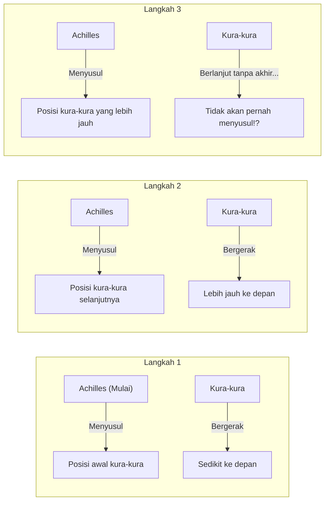
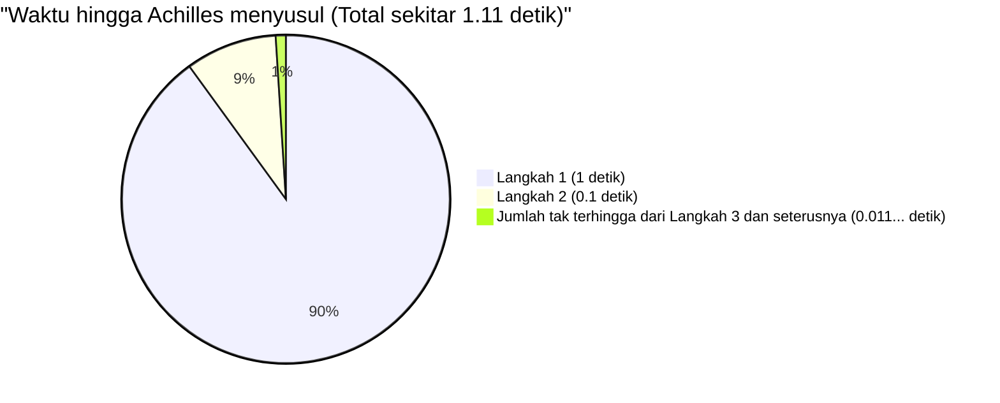

## 1. Paradoks Zeno: Pahlawan Pelari Cepat Tidak Bisa Mengalahkan Kura-kura?

Pada abad ke-5 SM, filsuf Yunani kuno Zeno dari Elea mengajukan beberapa paradoks mengenai "gerakan" yang secara langsung bertentangan dengan intuisi dan akal sehat kita. Yang paling terkenal di antaranya adalah paradoks **"Achilles dan Kura-kura"**.

Achilles, pahlawan pelari cepat dalam mitologi Yunani, dan kura-kura, yang merupakan sinonim dari kelambatan, melakukan balap lari.
Tentu saja karena Achilles jauh lebih cepat, kura-kura diberi hak untuk memulai sedikit lebih maju sebagai bentuk handicap (keuntungan).

Balapan pun dimulai. Achilles mengejar kura-kura dengan kecepatan luar biasa.
Namun, Zeno berpendapat sebagai berikut:

**"Achilles tidak akan pernah bisa menyusul kura-kura"**

Mengapa demikian? Logika Zeno adalah seperti ini:

1. Saat Achilles mencapai "titik awal pertama (Titik A)" tempat kura-kura berada, kura-kura telah bergerak sedikit ke depan dan berada di "Titik B".
2. Saat Achilles mencapai "Titik B", kura-kura telah bergerak sedikit lebih maju lagi dan berada di "Titik C".
3. Saat Achilles mencapai "Titik C", kura-kura telah bergerak sedikit lebih maju lagi dan berada di "Titik D".

Proses ini berlanjut tanpa henti. Setiap kali Achilles mencapai "tempat kura-kura berada", kura-kura pasti telah bergerak ke "sedikit lebih jauh ke depan".
Jaraknya semakin pendek, tetapi karena langkah ini harus diulang tanpa batas (tak terhingga), Achilles dikatakan tidak akan pernah bisa menyusul kura-kura tersebut.

Di dunia nyata, hal yang wajar jika orang yang berlari cepat menyusul orang yang lebih lambat. Namun, untuk menjelaskan di mana letak kelemahan **trik logika verbal** ini merupakan hal yang sangat sulit bagi orang-orang pada masa itu.

---

## 2. Di mana letak kesalahannya? Ilusi "Waktu" dan "Ketakterhinggaan"

Letak kepintaran logika Zeno adalah karena dia telah menukar **"langkah tak terhingga (pembagian ruang)"** dengan **"waktu tak terhingga"**.

Memang benar bahwa "jumlah langkah" hingga Achilles mencapai tempat kura-kura berada itu tak terbatas.
Namun, hanya karena "jumlah langkahnya tak terbatas", bukan berarti **"total waktu yang dibutuhkan akan menjadi tak terbatas (selamanya)"**.

Para matematikawan generasi berikutnya menciptakan senjata yang ampuh bernama "jumlah deret tak terhingga" untuk memecahkan paradoks ini.

---

## 3. Penjelasan secara Matematis: Jumlah Deret Tak Terhingga dan "Limit"

Mari kita coba menghitung masalah ini secara matematis dengan menerapkan angka-angka konkret.

- Anggaplah kecepatan lari Achilles adalah **$10\text{m}$ per detik**.
- Anggaplah kecepatan jalan kura-kura adalah **$1\text{m}$ per detik**. (Kecapatannya $\frac{1}{10}$ dari kecepatan Achilles)
- Sebagai keuntungan (handicap) bagi kura-kura, diasumsikan kura-kura memulai dari **$10\text{m}$ di depan** Achilles.

### Menghitung waktu untuk setiap langkah

**Langkah 1:**
Waktu yang dibutuhkan Achilles untuk mencapai posisi awal kura-kura ($10\text{m}$ di depan) adalah $\frac{10\text{m}}{10\text{m/s}} =$ **$1\text{ detik}$**.
Dalam 1 detik ini, kura-kura telah maju $1\text{m}$. (Perbedaan jarak antara Achilles dan kura-kura saat ini adalah $1\text{m}$)

**Langkah 2:**
Waktu yang dibutuhkan Achilles untuk mencapai posisi kura-kura selanjutnya ($1\text{m}$ di depan) adalah $\frac{1\text{m}}{10\text{m/s}} =$ **$0.1\text{ detik}$**.
Dalam 0.1 detik ini, kura-kura telah maju $0.1\text{m}$. (Perbedaannya adalah $0.1\text{m}$)

**Langkah 3:**
Waktu yang dibutuhkan Achilles untuk mencapai posisi kura-kura selanjutnya ($0.1\text{m}$ di depan) adalah $\frac{0.1\text{m}}{10\text{m/s}} =$ **$0.01\text{ detik}$**.
Dalam 0.01 detik ini, kura-kura telah maju $0.01\text{m}$. (Perbedaannya adalah $0.01\text{m}$)

Dengan demikian, "waktu" yang dibutuhkan Achilles untuk mencapai posisi di mana kura-kura baru saja berada, menjadi sebuah barisan tak terhingga sebagai berikut:

$$ 1\text{ detik},\ 0.1\text{ detik},\ 0.01\text{ detik},\ 0.001\text{ detik},\ \dots $$

Zeno berkata, "Karena langkah ini berlanjut tanpa henti, Achilles tidak akan pernah menyusul".
Namun, bagaimana jika waktu yang dibutuhkan untuk masing-masing langkah ini **dijumlahkan semuanya (mencari jumlah dari deret tak terhingga)**?

$$ \text{Total Waktu } T = 1 + 0.1 + 0.01 + 0.001 + \dots $$

Ini adalah **deret geometri tak terhingga** dengan suku pertama $a = 1$ dan rasio $r = 0.1$.
Ketika nilai absolut dari rasio $r$ kurang dari 1 ($|r| < 1$), deret geometri tak terhingga tersebut konvergen ke suatu "nilai berhingga" yang konstan. Rumus untuk jumlahnya adalah sebagai berikut:

$$ S = \frac{a}{1 - r} $$

Jika kita substitusikan ke dalam rumus ini dan menghitungnya:

$$ T = \frac{1}{1 - 0.1} = \frac{1}{0.9} = \frac{10}{9} = 1.1111\dots \text{ detik} $$

Dengan kata lain, meskipun ada langkah yang tak terhingga jumlahnya, total waktu yang dibutuhkan tidak menjadi "tak terhingga", melainkan **konvergen tepat pada $\frac{10}{9}$ detik (sekitar 1.11 detik)**.
Achilles dengan luar biasa akan menyusul dan melewati kura-kura setelah sekitar 1.11 detik sejak awal dimulai.

---

## 4. Mengapa Kita Tertipu?

Inti dari paradoks ini adalah menyerang **kesalahan intuisi sederhana manusia yang menganggap bahwa "jika kita menjumlahkan benda dalam jumlah tak terhingga, maka jawabannya pasti akan menjadi tak terhingga"**.

$$ 1 + 1 + 1 + 1 + \dots = \infty $$
Seperti ini, jika angka yang sama dijumlahkan tak terhingga kali, maka secara alami hasilnya akan menjadi tak terhingga.

$$ \frac{1}{2} + \frac{1}{3} + \frac{1}{4} + \dots = \infty $$
Pada "deret harmonik" yang terkenal, meskipun angka yang ditambahkan semakin lama semakin kecil, pada akhirnya akan divergen menuju ketakterhinggaan.

Namun, jika angka yang ditambahkan **mengecil dengan cukup cepat** (seperti pada deret geometri, misalnya), meskipun sejumlah tak terhingga angka dijumlahkan, hasilnya akan pas masuk ke dalam suatu "kerangka yang berhingga".

$$ \frac{1}{2} + \frac{1}{4} + \frac{1}{8} + \frac{1}{16} + \dots = 1 $$

Ini sama halnya jika Anda memakan setengah dari sebuah kue, kemudian memakan setengah dari sisanya, lalu memakan setengah dari sisanya lagi... dan mengulanginya tanpa henti, pada akhirnya tidak akan lebih dari "satu buah kue aslinya".
Zeno secara sengaja membagi waktu secara halus, dan dengan hanya membicarakan hal-hal dalam kerangka waktu yang terbagi tersebut (1 detik, 0.1 detik, 0.01 detik...), dia menciptakan ilusi bahwa Achilles "tidak akan pernah bisa menyusul".

---

## 5. Bisa Dipecahkan dalam Sekejap Jika Menggunakan Kecepatan Relatif

Omong-omong, sangat mudah untuk memecahkan masalah ini dengan matematika tingkat SMP tanpa perlu terjebak dalam perangkap Zeno (pembagian ruang dan waktu yang tak terhingga).
Kita cukup menggunakan "kecepatan relatif".

- Kecepatan Achilles: $10\text{m/s}$
- Kecepatan kura-kura: $1\text{m/s}$
- Kecepatan relatif kura-kura jika dilihat dari Achilles (kecepatan Achilles mendekati kura-kura): $10 - 1 = 9\text{m/s}$

Ketertinggalan awal Achilles terhadap kura-kura adalah $10\text{m}$.
Waktu yang dibutuhkan untuk memperpendek jarak $10\text{m}$ dengan kecepatan $9\text{m/s}$ adalah:

$$ \text{Waktu} = \frac{\text{Jarak}}{\text{Kecepatan}} = \frac{10}{9}\text{ detik} $$

Jawabannya sangat cocok dengan yang kita dapatkan sebelumnya menggunakan kalkulus (limit dari deret tak terhingga).

---

## 6. Kesimpulan: Paradoks Mengembangkan Matematika

"Achilles dan Kura-kura" dari Zeno mungkin terlihat seperti permainan kata-kata atau argumen yang menyesatkan dari sudut pandang kita di zaman modern.
Namun, bagi para filsuf Yunani kuno yang tidak memiliki konsep "tak terhingga" atau "limit" pada saat itu, membantah hal ini hanya dengan menggunakan logika merupakan hal yang sangat sulit.

Pertanyaan mendalam yang diajukan oleh paradoks ini, seperti "apa itu sesuatu yang kontinu" dan "apa artinya dapat dibagi hingga tak terbatas", menjadi pendorong penting yang mengarah pada lahirnya **"kalkulus"** oleh Newton dan Leibniz di kemudian hari, serta bermuara pada dasar-dasar matematika modern.

Paradoks yang hebat tidak hanya membingungkan orang, tetapi juga merupakan kunci untuk membuka pintu matematika yang baru.
