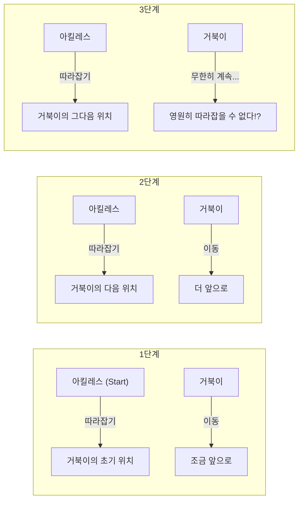
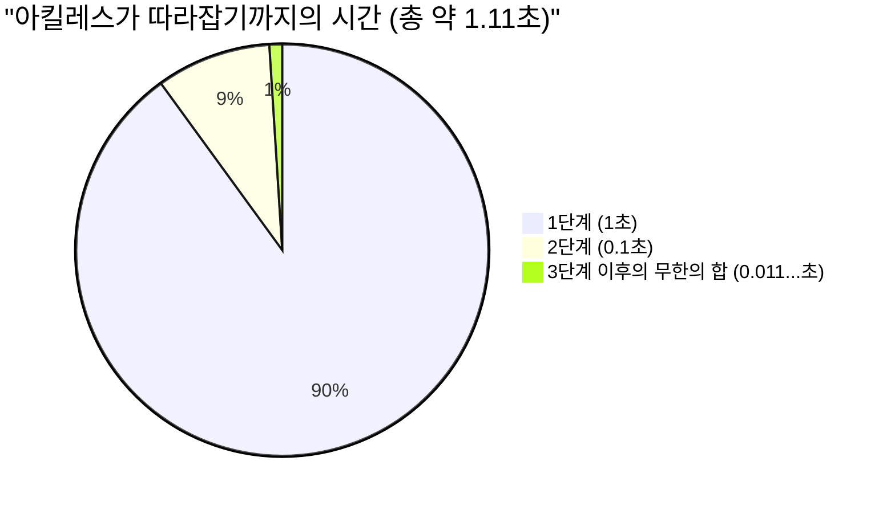

## 1. 제논의 역설: 발 빠른 영웅은 거북이를 이길 수 없다?

기원전 5세기, 고대 그리스의 철학자 엘레아의 제논은 우리의 직관이나 상식에 정면으로 반하는 "운동"에 관한 몇 가지 역설을 제시했습니다. 그중에서도 가장 유명한 것이 **"아킬레스와 거북이"**의 역설입니다.

그리스 신화에서 가장 발이 빠른 영웅 아킬레스와 느림의 대명사인 거북이가 달리기 경주를 합니다.
물론 아킬레스가 압도적으로 빠르기 때문에 거북이에게는 핸디캡으로 조금 앞서 출발할 수 있는 권리가 주어졌습니다.

이제 경주가 시작됩니다. 아킬레스는 맹렬한 속도로 거북이를 뒤쫓습니다.
하지만 제논은 다음과 같이 주장했습니다.

**"아킬레스는 영원히 거북이를 따라잡을 수 없다"**

도대체 왜 그럴까요? 제논의 논리는 이렇습니다.

1. 아킬레스가 거북이의 "최초 출발 지점(A 지점)"에 도달했을 때, 거북이는 조금 더 앞으로 나아가 "B 지점"에 있습니다.
2. 아킬레스가 "B 지점"에 도달했을 때, 거북이는 조금 더 앞으로 나아가 "C 지점"에 있습니다.
3. 아킬레스가 "C 지점"에 도달했을 때, 거북이는 다시 조금 더 앞으로 나아가 "D 지점"에 있습니다.

이 과정은 무한히 계속됩니다. 아킬레스가 "거북이가 있던 곳"에 도달할 때마다 거북이는 반드시 "그보다 조금 더 앞"으로 이동해 있기 때문입니다.
거리는 점점 좁혀지지만, 이 단계를 무한 번 반복해야 하므로 아킬레스는 영원히 거북이를 추월할 수 없다는 것입니다.

현실 세계에서는 발이 빠른 사람이 느린 사람을 추월하는 것이 당연합니다. 하지만 이 **말에 의한 논리적 트릭**의 어디에 허점이 있는지 설명하는 것은 당시 사람들에게 매우 어려운 일이었습니다.

---

## 2. 어디가 잘못된 것일까? "시간"과 "무한"의 착각

제논의 논리가 교묘한 점은 **"무한한 횟수의 단계(공간의 분할)"**를 **"무한한 시간"**으로 교묘하게 바꾸어 놓았다는 것에 있습니다.

확실히 아킬레스가 거북이가 있던 곳에 도달하기까지의 "단계 수"는 무한히 존재합니다.
하지만 "단계 수가 무한히 있다"고 해서 **"그에 소요되는 시간의 합이 무한대(영원)가 되는 것"은 결코 아닙니다**.

후세의 수학자들은 이 역설을 풀기 위해 "무한급수의 합"이라는 강력한 무기를 만들어 냈습니다.

---

## 3. 수학에 의한 규명: 무한급수의 합과 "극한"

이 문제를 구체적인 숫자를 대입하여 수학적으로 계산해 봅시다.

- 아킬레스가 달리는 속도를 **초속 $10\text{m}$** 라고 합니다.
- 거북이가 걷는 속도를 **초속 $1\text{m}$** 라고 합니다. (아킬레스의 $\frac{1}{10}$ 속도)
- 거북이의 핸디캡으로, 거북이는 아킬레스의 **$10\text{m}$ 앞**에서 출발한다고 합니다.

### 단계별 시간 계산하기

**1단계:**
아킬레스가 거북이의 초기 위치($10\text{m}$ 앞)에 도달하는 데 걸리는 시간은 $\frac{10\text{m}}{10\text{m/s}} =$ **$1\text{초}$** 입니다.
이 1초 동안 거북이는 $1\text{m}$ 전진했습니다. (현재 아킬레스와 거북이의 차이는 $1\text{m}$)

**2단계:**
아킬레스가 거북이의 다음 위치($1\text{m}$ 앞)에 도달하는 데 걸리는 시간은 $\frac{1\text{m}}{10\text{m/s}} =$ **$0.1\text{초}$** 입니다.
이 0.1초 동안 거북이는 $0.1\text{m}$ 전진했습니다. (차이는 $0.1\text{m}$)

**3단계:**
아킬레스가 거북이의 다음 위치($0.1\text{m}$ 앞)에 도달하는 데 걸리는 시간은 $\frac{0.1\text{m}}{10\text{m/s}} =$ **$0.01\text{초}$** 입니다.
이 0.01초 동안 거북이는 $0.01\text{m}$ 전진했습니다. (차이는 $0.01\text{m}$)

이처럼 아킬레스가 거북이의 직전 위치에 도달하기까지 걸리는 "시간"은 다음과 같은 무한한 수열이 됩니다.

$$ 1\text{초},\ 0.1\text{초},\ 0.01\text{초},\ 0.001\text{초},\ \dots $$

제논은 "이 단계가 무한히 계속되므로 아킬레스는 영원히 따라잡을 수 없다"고 말했습니다.
하지만 이 각 단계에 걸리는 시간을 **모두 더하면(무한급수의 합을 구하면)** 어떻게 될까요?

$$ \text{총 시간 } T = 1 + 0.1 + 0.01 + 0.001 + \dots $$

이것은 첫째항 $a = 1$, 공비 $r = 0.1$ 인 **무한등비급수**입니다.
공비 $r$ 의 절댓값이 1보다 작을 경우($|r| < 1$), 무한등비급수는 일정한 "유한한 값"에 수렴합니다. 그 합의 공식은 다음과 같습니다.

$$ S = \frac{a}{1 - r} $$

이 공식에 대입하여 계산하면,

$$ T = \frac{1}{1 - 0.1} = \frac{1}{0.9} = \frac{10}{9} = 1.1111\dots \text{초} $$

즉, 무한한 횟수의 단계가 존재하더라도, 그에 소요되는 시간의 합은 "무한대"가 되지 않고, **정확히 $\frac{10}{9}$ 초(약 1.11초)에 수렴하는** 것입니다.
아킬레스는 출발 후 약 1.11초 뒤에 훌륭하게 거북이를 따라잡고 추월하게 됩니다.

---

## 4. 왜 우리는 속았을까?

이 역설의 본질은, **"무한 개의 무언가를 더하면 정답도 무한대가 될 것이다"라는 인간의 소박한 직관의 오류**를 찌르고 있다는 점에 있습니다.

$$ 1 + 1 + 1 + 1 + \dots = \infty $$
이렇게 같은 수를 무한히 더하면 당연히 무한대가 됩니다.

$$ \frac{1}{2} + \frac{1}{3} + \frac{1}{4} + \dots = \infty $$
유명한 "조화급수"도 더해가는 수가 점점 작아지지만, 결국에는 무한대로 발산합니다.

하지만 더해가는 수가 **충분히 빠르게 작아질** 경우(예를 들어 등비급수처럼), 무한 개의 수를 더하더라도 어떤 "유한한 틀" 안에 쏙 들어가 버립니다.

$$ \frac{1}{2} + \frac{1}{4} + \frac{1}{8} + \frac{1}{16} + \dots = 1 $$

케이크를 반을 먹고, 남은 반을 먹고, 또 남은 반을 먹고... 를 무한히 반복해도, 결국은 "원래 케이크 1개 분량" 이상이 되지 않는 것과 같습니다.
제논은 의도적으로 시간을 잘게 나누고, 그 분할된 시간의 틀(1초, 0.1초, 0.01초...) 안에서만 사물을 이야기함으로써 "영원히 따라잡을 수 없다"는 착각을 만들어 냈습니다.

---

## 5. 상대속도로 생각하면 순식간에 풀린다

참고로, 제논의 함정(공간과 시간의 무한 분할)에 빠지지 않고 중학교 수학으로 이 문제를 푸는 것도 간단합니다.
"상대속도"를 사용하면 됩니다.

- 아킬레스의 속도: $10\text{m/s}$
- 거북이의 속도: $1\text{m/s}$
- 아킬레스가 본 거북이의 상대적인 속도(아킬레스가 거북이에게 다가가는 속도): $10 - 1 = 9\text{m/s}$

거북이에 대한 아킬레스의 초기 뒤처짐은 $10\text{m}$ 입니다.
$9\text{m/s}$ 의 속도로 $10\text{m}$ 의 거리를 좁히는 데 걸리는 시간은,

$$ \text{시간} = \frac{\text{거리}}{\text{속력}} = \frac{10}{9}\text{초} $$

앞서 미적분(무한급수의 극한)을 사용하여 구한 답과 완전히 일치했습니다.

---

## 6. 요약: 역설이 수학을 발전시켰다

제논의 "아킬레스와 거북이"는 현대의 우리가 보면 단순한 말장난이나 궤변처럼 보일지도 모릅니다.
하지만 당시 "무한"이나 "극한"과 같은 개념이 없었던 고대 그리스의 철학자들에게, 논리만으로 이를 논파하는 것은 매우 어려운 일이었습니다.

이 역설이 던진 "연속이란 무엇인가", "무한히 분할할 수 있다는 것은 어떤 의미인가"라는 깊은 질문은, 훗날 뉴턴이나 라이프니츠에 의한 **"미적분학"**의 탄생, 나아가 현대 수학 기초론으로 이어지는 중요한 원동력이 되었습니다.

위대한 역설은 단지 사람을 현혹할 뿐만 아니라, 새로운 수학의 문을 여는 열쇠이기도 합니다.
