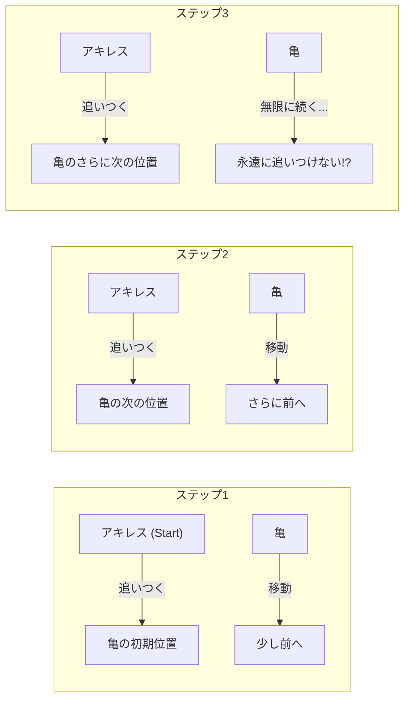
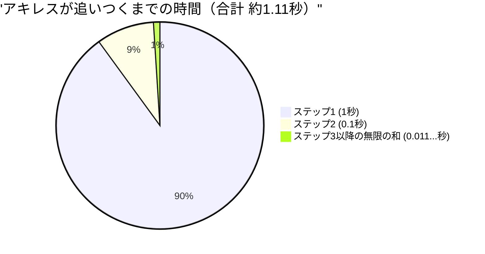

## 1. ゼノンのパラドックス：俊足の英雄は亀に勝てない？

紀元前5世紀、古代ギリシャの哲学者エレアのゼノンは、私たちの直感や常識に真っ向から反する「運動」に関するいくつかのパラドックスを提示しました。その中でも最も有名なのが**「アキレスと亀」**のパラドックスです。

ギリシャ神話きっての俊足の英雄アキレスと、鈍足の代名詞である亀が徒競走をします。
もちろんアキレスの方が圧倒的に速いので、亀にはハンデとして少し前からスタートする権利が与えられました。

いざレースがスタートします。アキレスは猛スピードで亀を追いかけます。
しかし、ゼノンは次のように主張しました。

**「アキレスは永遠に亀に追いつくことはできない」**

一体なぜでしょうか？ゼノンの論理はこうです。

1. アキレスが亀の「最初のスタート地点（A地点）」に到達したとき、亀は少しだけ前に進んで「B地点」にいます。
2. アキレスが「B地点」に到達したとき、亀はさらに少しだけ前に進んで「C地点」にいます。
3. アキレスが「C地点」に到達したとき、亀はさらにまた少しだけ前に進んで「D地点」にいます。

このプロセスは無限に続きます。アキレスが「亀がいた場所」に到達するたびに、亀は必ず「その少し先」へと移動しているからです。
距離はどんどん縮まっていきますが、このステップを無限回繰り返さなければならないため、アキレスは永遠に亀を追い抜くことができない、というのです。

現実世界では、足の速い人が遅い人を追い抜くのは当たり前のことです。しかし、この**言葉による論理のトリック**のどこに穴があるのかを説明するのは、当時の人々にとって非常に困難でした。

---

## 2. どこが間違っているのか？「時間」と「無限」の錯覚

ゼノンの論理が巧妙なのは、**「無限回のステップ（空間の分割）」**を**「無限の時間」**とすり替えてしまっている点にあります。

確かに、アキレスが亀のいた場所に到達するまでの「ステップ数」は無限に存在します。
しかし、「ステップ数が無限にある」からといって、**「それに要する時間の合計が無限大（永遠）になる」とは限らない**のです。

後世の数学者たちは、このパラドックスを解き明かすために「無限級数の和」という強力な武器を生み出しました。

---

## 3. 数学による解明：無限級数の和と「極限」

この問題を、具体的な数字を当てはめて数学的に計算してみましょう。

- アキレスの走る速さを **秒速 $10\text{m}$** とします。
- 亀の歩く速さを **秒速 $1\text{m}$** とします。（アキレスの $\frac{1}{10}$ のスピード）
- 亀へのハンデとして、亀はアキレスの **$10\text{m}$ 前方**からスタートするとします。

### ステップごとの時間を計算する

**ステップ1：**
アキレスが亀の初期位置（$10\text{m}$ 先）に到達するまでの時間は、$\frac{10\text{m}}{10\text{m/s}} =$ **$1\text{秒}$** です。
この1秒間に、亀は $1\text{m}$ 前進しています。（現在のアキレスと亀の差は $1\text{m}$）

**ステップ2：**
アキレスが亀の次の位置（$1\text{m}$ 先）に到達するまでの時間は、$\frac{1\text{m}}{10\text{m/s}} =$ **$0.1\text{秒}$** です。
この0.1秒間に、亀は $0.1\text{m}$ 前進しています。（差は $0.1\text{m}$）

**ステップ3：**
アキレスが亀の次の位置（$0.1\text{m}$ 先）に到達するまでの時間は、$\frac{0.1\text{m}}{10\text{m/s}} =$ **$0.01\text{秒}$** です。
この0.01秒間に、亀は $0.01\text{m}$ 前進しています。（差は $0.01\text{m}$）

このように、アキレスが亀の直前の位置に到達するまでの「時間」は、次のような無限の数列になります。

$$ 1\text{秒},\ 0.1\text{秒},\ 0.01\text{秒},\ 0.001\text{秒},\ \dots $$

ゼノンは「このステップが無限回続くのだから、アキレスは永遠に追いつけない」と言いました。
しかし、この各ステップにかかる時間を**すべて足し合わせる（無限級数の和を求める）**とどうなるでしょうか。

$$ \text{合計時間 } T = 1 + 0.1 + 0.01 + 0.001 + \dots $$

これは初項 $a = 1$、公比 $r = 0.1$ の**無限等比級数**です。
公比 $r$ の絶対値が 1 より小さい場合（$|r| < 1$）、無限等比級数はある一定の「有限の値」に収束します。その和の公式は以下の通りです。

$$ S = \frac{a}{1 - r} $$

この公式に当てはめて計算すると、

$$ T = \frac{1}{1 - 0.1} = \frac{1}{0.9} = \frac{10}{9} = 1.1111\dots \text{秒} $$

つまり、無限回のステップが存在しても、それに要する時間の合計は「無限大」にはならず、**きっちり $\frac{10}{9}$ 秒（約1.11秒）に収束する**のです。
アキレスは、開始から約1.11秒後に見事、亀に追いつき、そして追い抜くことになります。

---

## 4. なぜ私たちは騙されたのか？

このパラドックスの本質は、**「無限個のものを足し合わせたら、答えも無限大になるはずだ」という人間の素朴な直感の誤り**を突いている点にあります。

$$ 1 + 1 + 1 + 1 + \dots = \infty $$
このように、同じ数を無限に足せば当然無限大になります。

$$ \frac{1}{2} + \frac{1}{3} + \frac{1}{4} + \dots = \infty $$
有名な「調和級数」も、足していく数はどんどん小さくなりますが、最終的には無限大に発散します。

しかし、足していく数が**十分に早く小さくなる**場合（例えば等比級数のように）、無限個の数を足し合わせても、ある「有限の枠」にすっぽりと収まってしまうのです。

$$ \frac{1}{2} + \frac{1}{4} + \frac{1}{8} + \frac{1}{16} + \dots = 1 $$

ケーキを半分食べ、残りの半分を食べ、さらに残りの半分を食べ…と無限に繰り返しても、結局は「元のケーキ1個分」以上にはならないのと同じです。
ゼノンは意図的に時間を細かく分割し、その分割された時間枠（1秒、0.1秒、0.01秒...）の中でしか物事を語らないことで、「永遠に追いつけない」という錯覚を生み出しました。

---

## 5. 相対速度で考えれば一瞬で解ける

ちなみに、ゼノンの罠（空間と時間の無限分割）に引っかからずに、中学生の数学でこの問題を解くことも簡単です。
「相対速度」を使えば良いのです。

- アキレスの速さ：$10\text{m/s}$
- 亀の速さ：$1\text{m/s}$
- アキレスから見た亀の相対的な速さ（アキレスが亀に近づくスピード）：$10 - 1 = 9\text{m/s}$

亀に対するアキレスの初期の遅れは $10\text{m}$ です。
$9\text{m/s}$ のスピードで $10\text{m}$ の距離を縮めるのにかかる時間は、

$$ \text{時間} = \frac{\text{距離}}{\text{速さ}} = \frac{10}{9}\text{秒} $$

先ほど微積分（無限級数の極限）を使って求めた答えと完全に一致しました。

---

## 6. まとめ：パラドックスが数学を発展させた

ゼノンの「アキレスと亀」は、現代の私たちから見れば単なる言葉遊びや詭弁のように思えるかもしれません。
しかし、当時「無限」や「極限」といった概念を持たなかった古代ギリシャの哲学者たちにとって、論理だけでこれを論破することは至難の業でした。

このパラドックスが投げかけた「連続とは何か」「無限に分割できるとはどういうことか」という深い問いは、後のニュートンやライプニッツによる**「微積分学」**の誕生、さらには現代の数学基礎論へと繋がる重要な原動力となりました。

偉大なパラドックスは、ただ人を惑わすだけでなく、新しい数学の扉を開く鍵でもあるのです。
