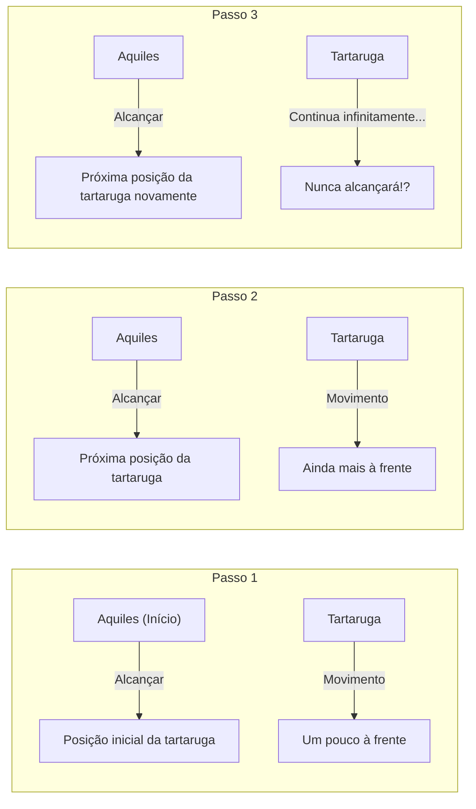
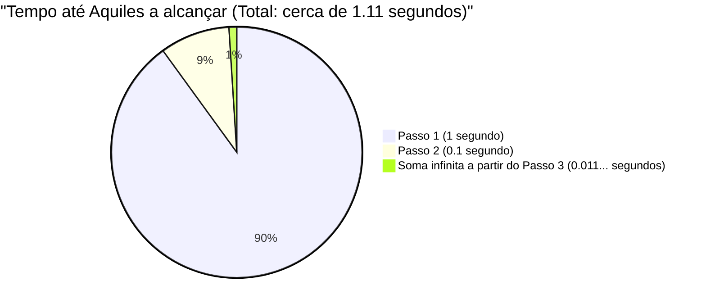

## 1. O Paradoxo de Zenão: O herói de pés ligeiros não consegue vencer a tartaruga?

No século V a.C., o filósofo da Grécia Antiga, Zenão de Eleia, apresentou vários paradoxos relacionados ao "movimento" que contrariam frontalmente nossa intuição e senso comum. O mais famoso deles é o paradoxo de **"Aquiles e a Tartaruga"**.

Aquiles, o herói de pés ligeiros da mitologia grega, aposta uma corrida com uma tartaruga, o símbolo da lentidão.
Como Aquiles é esmagadoramente mais rápido, a tartaruga recebe o direito de começar um pouco à frente como vantagem.

A corrida começa. Aquiles persegue a tartaruga em alta velocidade.
No entanto, Zenão argumentou o seguinte:

**"Aquiles nunca será capaz de alcançar a tartaruga"**

Por que isso aconteceria? A lógica de Zenão é a seguinte:

1. Quando Aquiles chega ao "ponto de partida original" (ponto A) da tartaruga, ela avançou um pouco e está no "ponto B".
2. Quando Aquiles chega ao "ponto B", a tartaruga avançou um pouco mais e está no "ponto C".
3. Quando Aquiles chega ao "ponto C", a tartaruga avançou um pouco mais ainda e está no "ponto D".

Esse processo continua infinitamente. Toda vez que Aquiles chega ao "lugar onde a tartaruga estava", a tartaruga sempre se moveu "um pouco mais à frente".
A distância diminui cada vez mais, mas como esse passo deve ser repetido infinitamente, Aquiles nunca será capaz de ultrapassar a tartaruga.

No mundo real, é óbvio que uma pessoa rápida pode ultrapassar uma pessoa lenta. No entanto, foi muito difícil para as pessoas da época explicar onde estava a falha nesse **truque lógico verbal**.

---

## 2. Onde está o erro? A ilusão do "tempo" e do "infinito"

A lógica de Zenão é engenhosa porque substitui **"passos infinitos (divisão do espaço)"** por **"tempo infinito"**.

Certamente, o "número de passos" até Aquiles chegar onde a tartaruga estava é infinito.
No entanto, só porque "o número de passos é infinito", **não significa necessariamente que "o tempo total necessário será infinito (eterno)"**.

Matemáticos posteriores criaram uma arma poderosa chamada "soma de séries infinitas" para desvendar esse paradoxo.

---

## 3. Explicação matemática: A soma de séries infinitas e os "limites"

Vamos aplicar números específicos a esse problema e calculá-lo matematicamente.

- A velocidade de corrida de Aquiles é de **$10\text{m/s}$**.
- A velocidade de caminhada da tartaruga é de **$1\text{m/s}$**. ($\frac{1}{10}$ da velocidade de Aquiles)
- Como vantagem para a tartaruga, ela começará **$10\text{m}$ à frente** de Aquiles.

### Calculando o tempo de cada passo

**Passo 1:**
O tempo para Aquiles atingir a posição inicial da tartaruga ($10\text{m}$ à frente) é $\frac{10\text{m}}{10\text{m/s}} =$ **$1\text{ segundo}$**.
Neste 1 segundo, a tartaruga avançou $1\text{m}$. (A diferença atual entre Aquiles e a tartaruga é de $1\text{m}$)

**Passo 2:**
O tempo para Aquiles atingir a próxima posição da tartaruga ($1\text{m}$ à frente) é $\frac{1\text{m}}{10\text{m/s}} =$ **$0.1\text{ segundo}$**.
Neste 0.1 segundo, a tartaruga avançou $0.1\text{m}$. (A diferença é de $0.1\text{m}$)

**Passo 3:**
O tempo para Aquiles atingir a próxima posição da tartaruga ($0.1\text{m}$ à frente) é $\frac{0.1\text{m}}{10\text{m/s}} =$ **$0.01\text{ segundo}$**.
Neste 0.01 segundo, a tartaruga avançou $0.01\text{m}$. (A diferença é de $0.01\text{m}$)

Desta forma, o "tempo" para Aquiles chegar logo à posição anterior da tartaruga torna-se uma sequência infinita como segue:

$$ 1\text{ segundo},\ 0.1\text{ segundo},\ 0.01\text{ segundo},\ 0.001\text{ segundo},\ \dots $$

Zenão disse que "como esses passos continuam infinitamente, Aquiles nunca vai alcançá-la".
Mas o que acontece se **somarmos tudo** (encontrar a soma de uma série infinita) o tempo que cada passo leva?

$$ \text{Tempo total } T = 1 + 0.1 + 0.01 + 0.001 + \dots $$

Esta é uma **série geométrica infinita** com primeiro termo $a = 1$ e razão comum $r = 0.1$.
Quando o valor absoluto da razão comum $r$ é menor que 1 ($|r| < 1$), a série geométrica infinita converge para um "valor finito" constante. A fórmula para essa soma é:

$$ S = \frac{a}{1 - r} $$

Aplicando essa fórmula ao nosso cálculo:

$$ T = \frac{1}{1 - 0.1} = \frac{1}{0.9} = \frac{10}{9} = 1.1111\dots \text{ segundos} $$

Em outras palavras, mesmo que haja um número infinito de passos, o tempo total necessário não será "infinito", mas **converge exatamente para $\frac{10}{9}$ segundos (cerca de 1.11 segundos)**.
Aquiles alcançará brilhantemente e ultrapassará a tartaruga após cerca de 1.11 segundos do início.

---

## 4. Por que fomos enganados?

A essência desse paradoxo reside no fato de que ele aponta o erro de uma intuição humana ingênua: **"se você somar um número infinito de coisas, a resposta também deve ser infinita"**.

$$ 1 + 1 + 1 + 1 + \dots = \infty $$
Dessa forma, se você somar o mesmo número infinitamente, naturalmente se tornará infinito.

$$ \frac{1}{2} + \frac{1}{3} + \frac{1}{4} + \dots = \infty $$
Na famosa "série harmônica", os números somados ficam cada vez menores, mas no final, divergem para o infinito.

No entanto, se os números que você está somando **ficarem menores rápido o suficiente** (como numa série geométrica), mesmo que você some um número infinito de números, eles se encaixarão perfeitamente dentro de um certo "limite finito".

$$ \frac{1}{2} + \frac{1}{4} + \frac{1}{8} + \frac{1}{16} + \dots = 1 $$

É o mesmo que se você comer metade de um bolo, depois a metade restante, e a metade restante novamente... repetindo isso infinitamente, você não comerá mais do que "1 bolo original" no total.
Zenão intencionalmente dividiu o tempo finamente e só falou das coisas dentro dessas divisões de tempo (1 segundo, 0.1 segundo, 0.01 segundo...), criando a ilusão de que "ele nunca a alcançará".

---

## 5. Pode ser resolvido em um instante se você pensar em velocidade relativa

A propósito, é fácil resolver este problema usando a matemática do ensino médio sem cair na armadilha de Zenão (divisão infinita do espaço e tempo).
Basta usar a "velocidade relativa".

- Velocidade de Aquiles: $10\text{m/s}$
- Velocidade da tartaruga: $1\text{m/s}$
- A velocidade relativa da tartaruga na perspectiva de Aquiles (a velocidade em que Aquiles se aproxima da tartaruga): $10 - 1 = 9\text{m/s}$

O atraso inicial de Aquiles em relação à tartaruga é de $10\text{m}$.
O tempo que leva para cobrir uma distância de $10\text{m}$ a uma velocidade de $9\text{m/s}$ é:

$$ \text{Tempo} = \frac{\text{Distância}}{\text{Velocidade}} = \frac{10}{9}\text{ segundos} $$

Isso coincide perfeitamente com a resposta encontrada anteriormente usando o cálculo (o limite de uma série infinita).

---

## 6. Conclusão: O paradoxo impulsionou a matemática

Do ponto de vista de hoje, "Aquiles e a Tartaruga" de Zenão pode parecer um simples jogo de palavras ou sofisma.
No entanto, para os antigos filósofos gregos que não tinham conceitos como "infinito" ou "limites" na época, refutar isso apenas com base na lógica foi uma tarefa monumental.

A profunda questão levantada por este paradoxo: "O que é contínuo?" e "O que significa poder dividir infinitamente?", tornou-se uma força motriz importante que levou ao nascimento do **"cálculo"** por Newton e Leibniz, e também serviu de base para os fundamentos da matemática moderna.

Grandes paradoxos não são apenas ilusórios, mas são também chaves para abrir novas portas na matemática.
