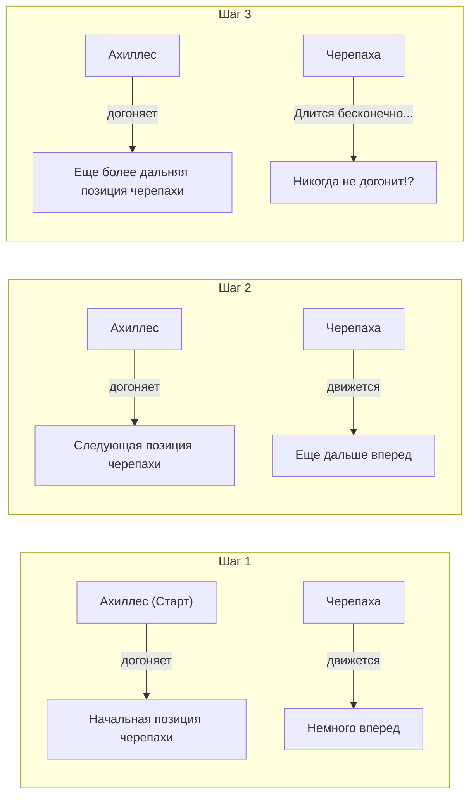
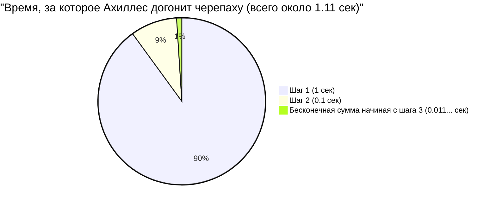

## 1. Парадокс Зенона: быстроногий герой не может победить черепаху?

В V веке до н. э. древнегреческий философ Зенон Элейский предложил несколько парадоксов о «движении», которые прямо противоречили нашей интуиции и здравому смыслу. Самый известный из них — парадокс **«Ахиллес и черепаха»**.

Быстроногий герой греческой мифологии Ахиллес и черепаха, являющаяся синонимом медлительности, устраивают забег.
Конечно, Ахиллес намного быстрее, поэтому черепахе дается фора: право стартовать немного впереди.

И вот гонка начинается. Ахиллес на огромной скорости бросается в погоню за черепахой.
Однако Зенон утверждал следующее:

**«Ахиллес никогда не сможет догнать черепаху»**

Почему же? Логика Зенона такова:

1. Когда Ахиллес достигает «начальной точки старта черепахи (точка А)», черепаха продвигается немного вперед и находится в «точке В».
2. Когда Ахиллес достигает «точки В», черепаха продвигается еще немного вперед и находится в «точке С».
3. Когда Ахиллес достигает «точки С», черепаха снова продвигается еще немного вперед и находится в «точке D».

Этот процесс продолжается бесконечно. Ведь каждый раз, когда Ахиллес достигает «места, где была черепаха», черепаха обязательно перемещается «немного дальше».
Расстояние постепенно сокращается, но поскольку этот шаг нужно повторять бесконечное количество раз, утверждается, что Ахиллес никогда не сможет обогнать черепаху.

В реальном мире быстрый человек легко обгоняет медленного, это очевидно. Однако в то время людям было крайне сложно объяснить, где кроется изъян в этой **словесной логической уловке**.

---

## 2. В чем ошибка? Иллюзия «времени» и «бесконечности»

Хитрость логики Зенона заключается в том, что он подменяет **«бесконечное количество шагов (деление пространства)»** на **«бесконечное время»**.

Действительно, количество «шагов», которые Ахиллесу нужно сделать, чтобы достичь места, где была черепаха, бесконечно.
Однако то, что «количество шагов бесконечно», вовсе не означает, что **«общее время, необходимое для этого, становится бесконечным (вечностью)»**.

Позднее математики создали мощное оружие для разгадки этого парадокса — «сумму бесконечного ряда».

---

## 3. Математическое объяснение: сумма бесконечного ряда и «предел»

Давайте применим конкретные числа и решим эту проблему математически.

- Пусть скорость бега Ахиллеса составляет **$10\text{ м/с}$**.
- Пусть скорость ходьбы черепахи составляет **$1\text{ м/с}$**. (Это $\frac{1}{10}$ скорости Ахиллеса)
- В качестве форы черепаха стартует на **$10\text{ м}$ впереди** Ахиллеса.

### Вычисляем время для каждого шага

**Шаг 1:**
Время, за которое Ахиллес достигает начальной позиции черепахи ($10\text{ м}$ впереди), равно $\frac{10\text{ м}}{10\text{ м/с}} =$ **$1\text{ секунда}$**.
За эту 1 секунду черепаха продвигается на $1\text{ м}$ вперед. (Текущая разница между Ахиллесом и черепахой составляет $1\text{ м}$)

**Шаг 2:**
Время, за которое Ахиллес достигает следующей позиции черепахи ($1\text{ м}$ впереди), равно $\frac{1\text{ м}}{10\text{ м/с}} =$ **$0.1\text{ секунды}$**.
За эти 0.1 секунды черепаха продвигается на $0.1\text{ м}$ вперед. (Разница составляет $0.1\text{ м}$)

**Шаг 3:**
Время, за которое Ахиллес достигает следующей позиции черепахи ($0.1\text{ м}$ впереди), равно $\frac{0.1\text{ м}}{10\text{ м/с}} =$ **$0.01\text{ секунды}$**.
За эти 0.01 секунды черепаха продвигается на $0.01\text{ м}$ вперед. (Разница составляет $0.01\text{ м}$)

Таким образом, «время», за которое Ахиллес достигает предыдущей позиции черепахи, образует следующую бесконечную последовательность:

$$ 1\text{ сек},\ 0.1\text{ сек},\ 0.01\text{ сек},\ 0.001\text{ сек},\ \dots $$

Зенон говорил: «Поскольку эти шаги продолжаются бесконечно, Ахиллес никогда ее не догонит».
Но что будет, если **сложить все время**, затраченное на каждый шаг **(найти сумму бесконечного ряда)**?

$$ \text{Общее время } T = 1 + 0.1 + 0.01 + 0.001 + \dots $$

Это **бесконечная геометрическая прогрессия**, где первый член $a = 1$, а знаменатель $r = 0.1$.
Если абсолютная величина знаменателя $r$ меньше 1 ($|r| < 1$), то сумма бесконечной геометрической прогрессии сходится к определенному «конечному значению». Формула ее суммы выглядит следующим образом:

$$ S = \frac{a}{1 - r} $$

Применив эту формулу, мы получим:

$$ T = \frac{1}{1 - 0.1} = \frac{1}{0.9} = \frac{10}{9} = 1.1111\dots \text{ сек} $$

То есть, даже при наличии бесконечного числа шагов, общее необходимое время не становится «бесконечно большим», а **точно сходится к $\frac{10}{9}$ секунды (около 1.11 секунды)**.
Примерно через 1.11 секунды после старта Ахиллес успешно догонит черепаху и обгонит ее.

---

## 4. Почему мы были обмануты?

Суть этого парадокса заключается в том, что он эксплуатирует **ошибочность нашей наивной интуиции, согласно которой «если сложить бесконечное количество элементов, то и результат должен быть бесконечным»**.

$$ 1 + 1 + 1 + 1 + \dots = \infty $$
Действительно, если бесконечно складывать одно и то же число, то, естественно, получится бесконечность.

$$ \frac{1}{2} + \frac{1}{3} + \frac{1}{4} + \dots = \infty $$
В знаменитом «гармоническом ряду» слагаемые тоже становятся все меньше и меньше, но в конечном итоге ряд расходится в бесконечность.

Однако если слагаемые **уменьшаются достаточно быстро** (как, например, в геометрической прогрессии), то даже при сложении бесконечного их количества сумма может полностью уложиться в некие «конечные рамки».

$$ \frac{1}{2} + \frac{1}{4} + \frac{1}{8} + \frac{1}{16} + \dots = 1 $$

Это похоже на то, как если бы вы съели половину торта, затем половину оставшегося, затем снова половину остатка... и повторяли бы это бесконечно: в конечном итоге вы съедите не больше, чем «один первоначальный торт».
Зенон намеренно дробил время и говорил лишь в рамках этих разделенных временных отрезков (1 секунда, 0.1 секунды, 0.01 секунды...), создавая иллюзию того, что Ахиллес «никогда не догонит» черепаху.

---

## 5. Если мыслить относительной скоростью, задача решается в мгновение ока

Кстати, не попадаясь в ловушку Зенона (бесконечное деление пространства и времени), эту задачу легко решить с помощью математики средней школы.
Достаточно использовать «относительную скорость».

- Скорость Ахиллеса: $10\text{ м/с}$
- Скорость черепахи: $1\text{ м/с}$
- Относительная скорость черепахи с точки зрения Ахиллеса (скорость, с которой Ахиллес приближается к черепахе): $10 - 1 = 9\text{ м/с}$

Изначальное отставание Ахиллеса от черепахи составляет $10\text{ м}$.
Время, необходимое для сокращения расстояния в $10\text{ м}$ при скорости $9\text{ м/с}$, равно:

$$ \text{Время} = \frac{\text{Расстояние}}{\text{Скорость}} = \frac{10}{9}\text{ сек} $$

Это полностью совпадает с ответом, который мы ранее получили с помощью математического анализа (предела бесконечного ряда).

---

## 6. Заключение: парадоксы развили математику

С нашей современной точки зрения «Ахиллес и черепаха» Зенона может показаться просто игрой слов или софистикой.
Однако для древнегреческих философов того времени, не имевших таких понятий, как «бесконечность» или «предел», было крайне сложной задачей опровергнуть это опираясь только на логику.

Глубокие вопросы, поднятые этим парадоксом — «что такое непрерывность» и «что значит быть бесконечно делимым» — стали важной движущей силой, приведшей к созданию **«математического анализа»** Ньютоном и Лейбницем, а также к современным основаниям математики.

Великие парадоксы — это не просто способ запутать людей, но и ключи, открывающие двери в новую математику.
