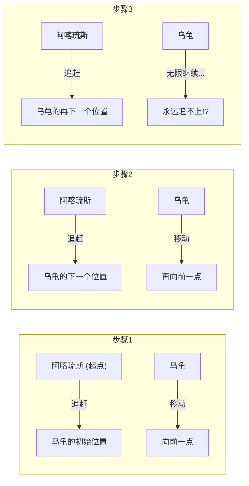
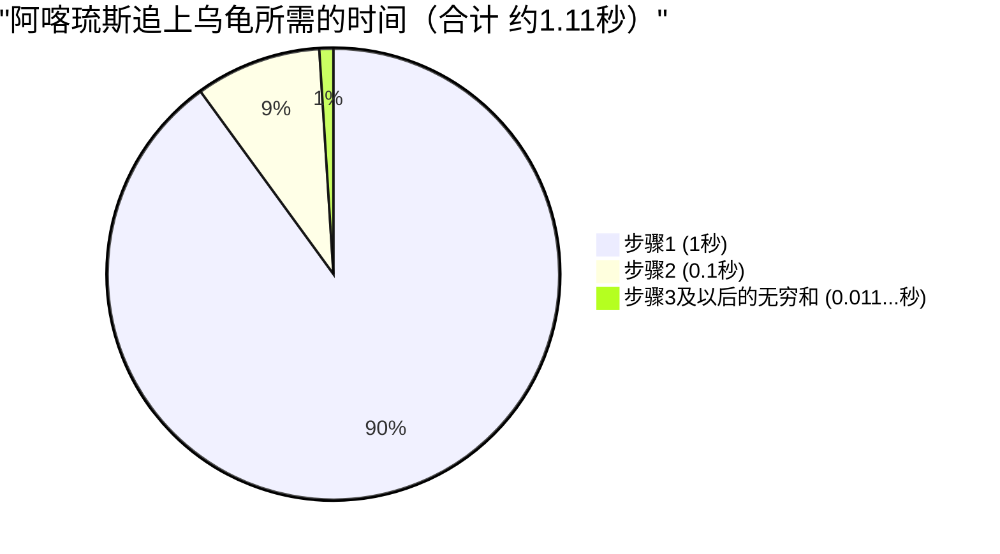

## 1. 芝诺悖论：飞毛腿英雄赢不了乌龟？

公元前5世纪，古希腊哲学家埃利亚的芝诺提出了一些完全违背我们直觉和常识的关于“运动”的悖论。其中最著名的便是**“阿喀琉斯与乌龟”**的悖论。

希腊神话中首屈一指的飞毛腿英雄阿喀琉斯，与代表迟缓的乌龟进行徒步赛跑。
当然阿喀琉斯的速度具有压倒性优势，因此作为让步，乌龟获得了从前方不远处起跑的权利。

比赛开始了。阿喀琉斯以极快的速度追赶乌龟。
然而，芝诺却提出了如下主张：

**“阿喀琉斯永远也追不上乌龟”**

到底为什么呢？芝诺的逻辑是这样的：

1. 当阿喀琉斯到达乌龟的“初始起跑点（A点）”时，乌龟已经向前移动了一点，到达了“B点”。
2. 当阿喀琉斯到达“B点”时，乌龟又向前移动了一点，到达了“C点”。
3. 当阿喀琉斯到达“C点”时，乌龟又再向前移动了一点，到达了“D点”。

这个过程将无限持续下去。因为每当阿喀琉斯到达“乌龟之前所在的位置”时，乌龟必然已经移动到了“稍微靠前一点的位置”。
距离虽然在不断缩短，但因为必须无限次重复这个步骤，所以阿喀琉斯永远也无法超越乌龟。

在现实世界中，跑得快的人超越跑得慢的人是理所当然的事情。然而，要解释这个**文字逻辑戏法**的漏洞在哪里，对当时的人们来说是非常困难的。

---

## 2. 哪里出错了？“时间”与“无穷”的错觉

芝诺的逻辑巧妙之处在于，将**“无限次的步骤（空间的分割）”**偷换成了**“无限的时间”**。

的确，阿喀琉斯到达乌龟之前所在位置的“步骤数”是无限的。
但是，“步骤数无限”并不意味着**“其所需的总时间就是无穷大（永远）”**。

后世的数学家们，为了解开这个悖论，创造出了“无穷级数求和”这一强大的武器。

---

## 3. 数学解惑：无穷级数求和与“极限”

让我们代入具体的数字，用数学的方法来计算一下这个问题。

- 假设阿喀琉斯奔跑的速度是 **每秒 $10\text{m}$**。
- 假设乌龟步行的速度是 **每秒 $1\text{m}$**。（阿喀琉斯速度的 $\frac{1}{10}$）
- 作为让步，假设乌龟从阿喀琉斯**前方 $10\text{m}$ 处**起跑。

### 计算各个步骤的时间

**步骤1：**
阿喀琉斯到达乌龟的初始位置（前方 $10\text{m}$ 处）所需的时间是 $\frac{10\text{m}}{10\text{m/s}} =$ **$1\text{秒}$**。
在这1秒钟内，乌龟前进了 $1\text{m}$。（现在阿喀琉斯和乌龟的差距是 $1\text{m}$）

**步骤2：**
阿喀琉斯到达乌龟的下一个位置（前方 $1\text{m}$ 处）所需的时间是 $\frac{1\text{m}}{10\text{m/s}} =$ **$0.1\text{秒}$**。
在这0.1秒钟内，乌龟前进了 $0.1\text{m}$。（差距是 $0.1\text{m}$）

**步骤3：**
阿喀琉斯到达乌龟的再下一个位置（前方 $0.1\text{m}$ 处）所需的时间是 $\frac{0.1\text{m}}{10\text{m/s}} =$ **$0.01\text{秒}$**。
在这0.01秒钟内，乌龟前进了 $0.01\text{m}$。（差距是 $0.01\text{m}$）

像这样，阿喀琉斯到达乌龟前一个位置所需的“时间”，变成了一个如下的无穷数列：

$$ 1\text{秒},\ 0.1\text{秒},\ 0.01\text{秒},\ 0.001\text{秒},\ \dots $$

芝诺说：“因为这个步骤将无限继续，所以阿喀琉斯永远也追不上。”
但是，如果我们**把每个步骤所需的时间全部加起来（求无穷级数的和）**，会发生什么呢？

$$ \text{总时间 } T = 1 + 0.1 + 0.01 + 0.001 + \dots $$

这是一个首项 $a = 1$、公比 $r = 0.1$ 的**无穷等比级数**。
当公比 $r$ 的绝对值小于 1 时（$|r| < 1$），无穷等比级数会收敛到一个固定的“有限值”。其求和公式如下：

$$ S = \frac{a}{1 - r} $$

代入这个公式进行计算，

$$ T = \frac{1}{1 - 0.1} = \frac{1}{0.9} = \frac{10}{9} = 1.1111\dots \text{秒} $$

也就是说，即使存在无限次的步骤，其所需的总时间也不会变成“无穷大”，而是**精确地收敛于 $\frac{10}{9}$ 秒（约1.11秒）**。
阿喀琉斯在起跑约1.11秒后，便会成功追上并超越乌龟。

---

## 4. 为什么我们会受骗？

这个悖论的本质在于，它利用了**人类朴素直觉的误区：“把无限个东西加起来，答案也一定是无穷大”**。

$$ 1 + 1 + 1 + 1 + \dots = \infty $$
像这样，无限地加上同一个数，结果当然是无穷大。

$$ \frac{1}{2} + \frac{1}{3} + \frac{1}{4} + \dots = \infty $$
著名的“调和级数”，虽然相加的数越来越小，但最终也会发散到无穷大。

但是，如果相加的数**缩小得足够快**（比如等比级数），那么即使将无限个数加在一起，也会恰好容纳在一个“有限的框架”内。

$$ \frac{1}{2} + \frac{1}{4} + \frac{1}{8} + \frac{1}{16} + \dots = 1 $$

这就像吃蛋糕，吃掉一半，再吃掉剩下的一半，再吃掉剩下的剩下的一半……无限重复下去，最终也不会超过“原来的一整个蛋糕”。
芝诺刻意将时间无限分割，并且只在那些被分割的时间框架（1秒，0.1秒，0.01秒...）内谈论事物，从而制造出了“永远追不上”的错觉。

---

## 5. 用相对速度思考，瞬间就能解开

顺便一提，只要不陷入芝诺的陷阱（空间和时间的无限分割），用初中数学来解这道题也非常简单。
只要使用“相对速度”就可以了。

- 阿喀琉斯的速度：$10\text{m/s}$
- 乌龟的速度：$1\text{m/s}$
- 阿喀琉斯相对于乌龟的速度（阿喀琉斯接近乌龟的速度）：$10 - 1 = 9\text{m/s}$

乌龟初始领先阿喀琉斯 $10\text{m}$。
以 $9\text{m/s}$ 的速度缩短 $10\text{m}$ 的距离所需的时间是：

$$ \text{时间} = \frac{\text{距离}}{\text{速度}} = \frac{10}{9}\text{秒} $$

这与刚才使用微积分（无穷级数的极限）求出的答案完全一致。

---

## 6. 总结：悖论推动了数学的发展

从现代人的角度来看，芝诺的“阿喀琉斯与乌龟”可能不过是文字游戏或诡辩。
然而，对于当时还没有“无穷”和“极限”概念的古希腊哲学家们来说，仅凭逻辑来反驳它是极其困难的。

这个悖论所抛出的深刻问题：“什么是连续？”“可以无限分割意味着什么？”，成为了后来牛顿和莱布尼茨创立**“微积分学”**，乃至现代数学基础理论发展的重要原动力。

伟大的悖论不仅能迷惑人，也是开启新数学大门的钥匙。
