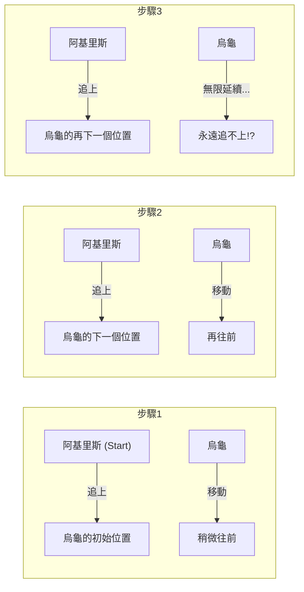
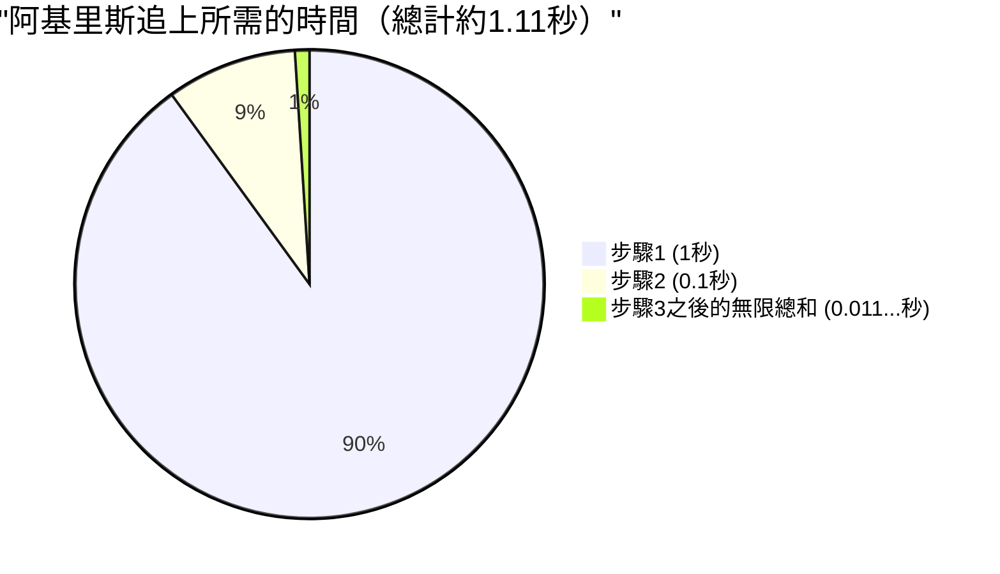

## 1. 芝諾悖論：捷足的英雄贏不了烏龜？

西元前5世紀，古希臘哲學家埃利亞的芝諾提出了一些關於「運動」的悖論，完全違背了我們的直覺與常識。其中最著名的便是**「阿基里斯與烏龜」**悖論。

希臘神話中最捷足的英雄阿基里斯，與代名詞為緩慢的烏龜進行一場賽跑。
當然，因為阿基里斯的速度有著壓倒性的優勢，所以給予烏龜一個讓步，讓牠可以從稍微前面一點的地方起跑。

比賽開始了。阿基里斯以極快的速度追趕烏龜。
然而，芝諾卻提出了以下的論點：

**「阿基里斯永遠無法追上烏龜」**

這到底是為什麼呢？芝諾的邏輯是這樣的：

1. 當阿基里斯到達烏龜的「最初起跑點（A點）」時，烏龜已經往前前進了一點，到了「B點」。
2. 當阿基里斯到達「B點」時，烏龜又往前前進了一點，到了「C點」。
3. 當阿基里斯到達「C點」時，烏龜又再往前前進了一點，到了「D點」。

這個過程會無限地延續下去。因為每當阿基里斯到達「烏龜曾經所在的位置」時，烏龜必然已經移動到了「稍微前面一點的地方」。
雖然距離不斷縮小，但因為必須重複這個步驟無限次，所以阿基里斯永遠無法超越烏龜。

在現實世界中，跑得快的人超越跑得慢的人是理所當然的事。然而，要解釋這個**語言邏輯上的戲法**到底哪裡有漏洞，對當時的人們來說非常困難。

---

## 2. 哪裡出錯了？「時間」與「無限」的錯覺

芝諾邏輯的巧妙之處，在於他將**「無限次的步驟（空間的分割）」**偷換成了**「無限的時間」**。

的確，阿基里斯到達烏龜曾所在位置的「步驟數」是無限的。
但是，「步驟數有無限多」並不代表**「所需的總時間會變成無限大（永遠）」**。

後世的數學家們為了要解開這個悖論，創造出了「無窮級數求和」這個強大的武器。

---

## 3. 數學的解答：無窮級數的總和與「極限」

讓我們將具體的數字代入，用數學來計算這個問題。

- 假設阿基里斯的奔跑速度為 **每秒 $10\text{m}$**。
- 假設烏龜的爬行速度為 **每秒 $1\text{m}$**。（阿基里斯速度的 $\frac{1}{10}$）
- 作為對烏龜的讓步，假設烏龜從阿基里斯 **前方 $10\text{m}$ 處**起跑。

### 計算每個步驟的時間

**步驟1：**
阿基里斯到達烏龜初始位置（前方 $10\text{m}$）所需的時間為，$\frac{10\text{m}}{10\text{m/s}} =$ **$1\text{秒}$**。
在這1秒內，烏龜前進了 $1\text{m}$。（目前阿基里斯與烏龜的差距為 $1\text{m}$）

**步驟2：**
阿基里斯到達烏龜下一個位置（前方 $1\text{m}$）所需的時間為，$\frac{1\text{m}}{10\text{m/s}} =$ **$0.1\text{秒}$**。
在這0.1秒內，烏龜前進了 $0.1\text{m}$。（差距為 $0.1\text{m}$）

**步驟3：**
阿基里斯到達烏龜再下一個位置（前方 $0.1\text{m}$）所需的時間為，$\frac{0.1\text{m}}{10\text{m/s}} =$ **$0.01\text{秒}$**。
在這0.01秒內，烏龜前進了 $0.01\text{m}$。（差距為 $0.01\text{m}$）

像這樣，阿基里斯到達烏龜前一個位置所需的「時間」，會形成如下的無限數列：

$$ 1\text{秒},\ 0.1\text{秒},\ 0.01\text{秒},\ 0.001\text{秒},\ \dots $$

芝諾說「因為這個步驟會無限次延續，所以阿基里斯永遠追不上」。
但是，如果將這些每個步驟所花費的時間**全部加總起來（求無窮級數的和）**，會變成怎樣呢？

$$ \text{總時間 } T = 1 + 0.1 + 0.01 + 0.001 + \dots $$

這是一個首項 $a = 1$、公比 $r = 0.1$ 的**無窮等比級數**。
當公比 $r$ 的絕對值小於 1 時（$|r| < 1$），無窮等比級數會收斂到一個固定的「有限值」。其求和公式如下：

$$ S = \frac{a}{1 - r} $$

將數字代入這個公式計算：

$$ T = \frac{1}{1 - 0.1} = \frac{1}{0.9} = \frac{10}{9} = 1.1111\dots \text{秒} $$

也就是說，即使存在無限次的步驟，其所需的總時間也不會變成「無限大」，而是**精確地收斂在 $\frac{10}{9}$ 秒（約1.11秒）**。
阿基里斯在起跑後約1.11秒，就能漂亮地追上烏龜，並且超越牠。

---

## 4. 為什麼我們被騙了？

這個悖論的本質，在於它戳中了**「把無限個東西加起來，答案應該也會是無限大」這種人類樸素直覺的錯誤**。

$$ 1 + 1 + 1 + 1 + \dots = \infty $$
像這樣，把同樣的數字無限相加，理所當然會變成無限大。

$$ \frac{1}{2} + \frac{1}{3} + \frac{1}{4} + \dots = \infty $$
著名的「調和級數」，雖然相加的數字越來越小，但最終還是會發散到無限大。

然而，當相加的數字**以足夠快的速度變小**時（例如等比級數），即使把無限個數字加起來，也會完完全全地收斂在某個「有限的範圍」內。

$$ \frac{1}{2} + \frac{1}{4} + \frac{1}{8} + \frac{1}{16} + \dots = 1 $$

這就好像吃掉一半的蛋糕，再吃掉剩下的一半，然後再吃掉剩下的一半... 即使無限地重複下去，最終也不會超過「原本的1塊蛋糕」。
芝諾刻意將時間細分，並且只在那些被分割的時間框架（1秒、0.1秒、0.01秒...）裡談論事情，從而產生了「永遠追不上」的錯覺。

---

## 5. 用相對速度思考就能一秒解開

順帶一提，如果不落入芝諾的陷阱（空間與時間的無限分割），只用國中數學也很容易解開這個問題。
只要使用「相對速度」就可以了。

- 阿基里斯的速度：$10\text{m/s}$
- 烏龜的速度：$1\text{m/s}$
- 從阿基里斯的角度看烏龜的相對速度（阿基里斯靠近烏龜的速度）：$10 - 1 = 9\text{m/s}$

相對於烏龜，阿基里斯一開始落後的距離是 $10\text{m}$。
以 $9\text{m/s}$ 的速度縮短 $10\text{m}$ 的距離所需的時間為：

$$ \text{時間} = \frac{\text{距離}}{\text{速度}} = \frac{10}{9}\text{秒} $$

這個答案與我們剛剛用微積分（無窮級數的極限）所求出的答案完全一致。

---

## 6. 總結：悖論推動了數學的發展

從現代的我們來看，芝諾的「阿基里斯與烏龜」可能只是一場文字遊戲或是詭辯。
但是，對於當時還沒有「無限」和「極限」等概念的古希臘哲學家來說，單憑邏輯要駁倒這個論點是極其困難的。

這個悖論所拋出的「連續是什麼」、「可以無限分割代表什麼意思」等深刻的問題，成為了後來牛頓和萊布尼茲創立**「微積分學」**，甚至連接到現代數學基礎論的重要原動力。

偉大的悖論不只是用來迷惑人心，它也是開啟新數學大門的鑰匙。
