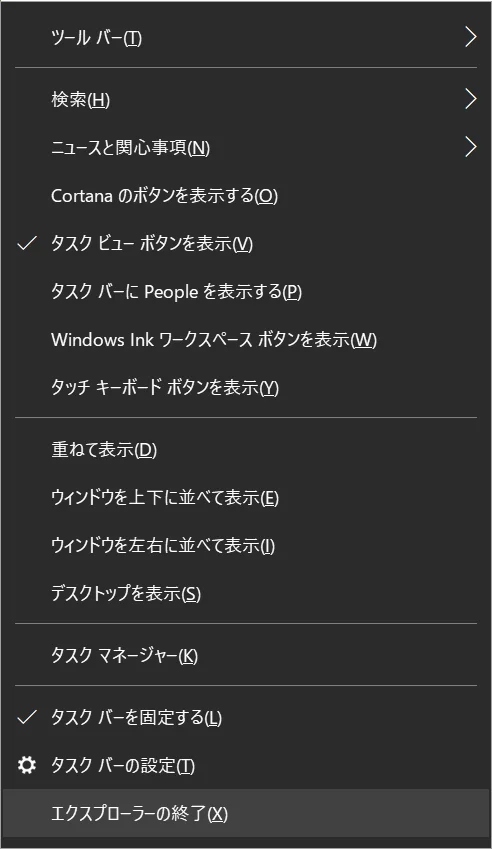
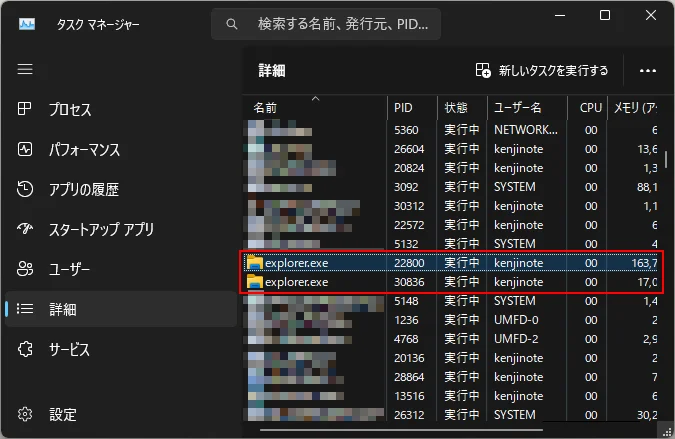
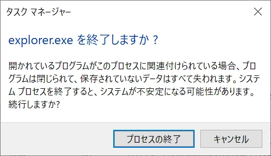

---
title: 'Windows资源管理器的结束与重启方法汇总'
slug: "エクスプローラーの終了・再起動方法"
date: 2024-03-30T15:40:24+09:00
tags: ["文件资源管理器"]
draft: false
image: "img_2.webp"
categories: ["IT・科技"]
description: '讲解在Windows中结束和重启资源管理器（explorer.exe）的多种方法。通俗易懂地介绍使用任务栏、任务管理器、命令提示符的步骤。'
---

## 从任务栏右键菜单关闭的方法

这是在 Windows 10 中的方法。Windows 11 中似乎不会显示该菜单。
在任务栏上同时按住 `Shift` 键和 `Ctrl` 键并右击，菜单中会显示 `退出资源管理器`。

## 从任务管理器关闭的方法

1. 按 `Ctrl` + `Shift` + `Esc` 键启动任务管理器。
2. 选择 `详细信息`。

3. 选择 `explorer.exe`，按下 `Delete` 键，当被问到 `是否要结束 explorer.exe？` 时，选择 `结束进程`。

## 从命令提示符关闭的方法

1. 按 `Win` + `R` 键，输入 `cmd`，然后按 `Enter` 键。
2. 输入 `taskkill /f /im explorer.exe`，然后按 `Enter` 键。

## 从任务管理器启动资源管理器的方法

1. 按 `Ctrl` + `Shift` + `Esc` 键启动任务管理器。
2. 从文件菜单中选择 `运行新任务`。
3. 输入 `explorer.exe`，然后按 `Enter` 键。
