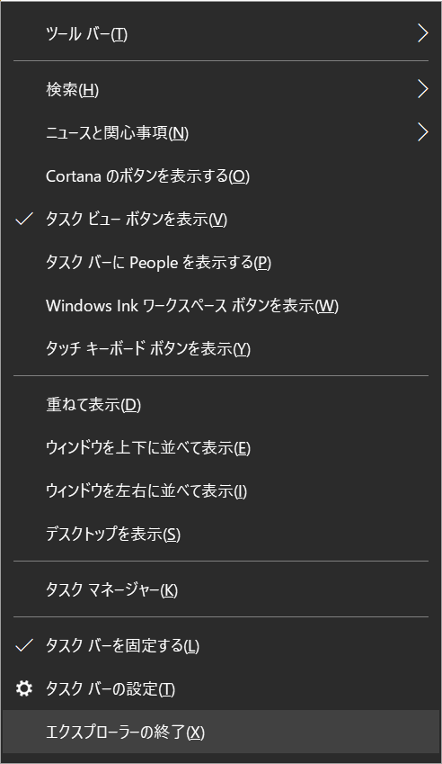
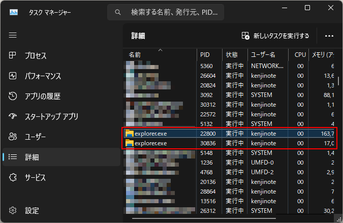
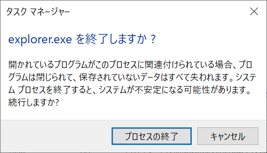

## 從工作列右鍵選單關閉的方法

這是在 Windows 10 上的方法。在 Windows 11 中似乎不會顯示該選單。
在工作列上按住 `Shift` 鍵與 `Ctrl` 鍵的同時點擊滑鼠右鍵，選單中就會顯示 `結束檔案總管`。

## 從工作管理員關閉的方法

1. 按下 `Ctrl` + `Shift` + `Esc` 鍵以啟動工作管理員。
2. 選擇 `詳細資料`。

3. 選擇 `explorer.exe` 並按下 `Delete` 鍵，當系統詢問 `確定要結束 explorer.exe 嗎？` 時，選擇 `結束處理程序`。

## 從命令提示字元關閉的方法

1. 按下 `Win` + `R` 鍵，輸入 `cmd`，然後按下 `Enter` 鍵。
2. 輸入 `taskkill /f /im explorer.exe`，然後按下 `Enter` 鍵。

## 從工作管理員啟動檔案總管的方法

1. 按下 `Ctrl` + `Shift` + `Esc` 鍵以啟動工作管理員。
2. 從檔案選單中，選擇 `執行新工作`。
3. 輸入 `explorer.exe`，然後按下 `Enter` 鍵。
