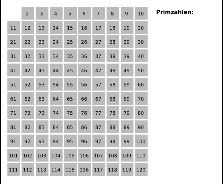

## What is the Sieve of Eratosthenes?

The Sieve of Eratosthenes is an algorithm for finding all prime numbers up to any given limit.
The algorithm is simple and can be implemented with the following steps:

1. Create an array of boolean values with N elements, and initialize all elements to true.
2. Set the 0th and 1st elements of the array to false (because 0 and 1 are not prime numbers).
3. If the 2nd element of the array is true, output 2 as a prime number.
4. Set all multiples of 2 from $2^2$ onwards in the array to false.*
5. If the 3rd element of the array is true, output 3 as a prime number.
6. Set all multiples of 3 from $3^2$ onwards in the array to false.
7. Repeat the same process for the 4th, 5th, ..., Nth elements.

*The reason for targeting elements from the square of the number onwards to become false is because the numbers smaller than the square have already been processed (enumeration is complete).




## Implementation in Rust

```rust
fn main() {
    let n = 1000;
    let mut is_prime = vec![true; n+1];
    is_prime[0] = false;
    is_prime[1] = false;
    for i in 2..=n {
        if is_prime[i] {
            println!("{}", i);
            let mut j = i * i;
            while j <= n {
                is_prime[j] = false;
                j += i;
            }
        }
    }
}
```

## Slightly Faster Version

Considering the following points, we implement a slightly faster version:

- Instead of initializing the array with true, initialize it with false (this is faster).
- Since multiples of 2 are not prime numbers, omit the process of setting the elements of multiples of 2 to false.
- There is no need to loop up to n; by enumerating primes up to the square root of n, you can enumerate primes up to n.

```rust
fn main() {
    let n = 1000;
    let mut is_prime = vec![false; n+1];
    is_prime[2] = true;
    for i in (3..=n).step_by(2) {
        is_prime[i] = true;
    }
    for i in 3..=((n as f64).sqrt() as usize) {
        if is_prime[i] {
            let mut j = i * i;
            while j <= n {
                is_prime[j] = false;
                j += i * 2;
            }
        }
    }
    for i in (2..=n).filter(|&x| is_prime[x]) {
        println!("{}", i);
    }
}
```

## References
- [Sieve of Eratosthenes](https://ja.wikipedia.org/wiki/%E3%82%A8%E3%83%A9%E3%83%88%E3%82%B9%E3%83%86%E3%83%8D%E3%82%B9%E3%81%AE%E7%AF%A9)
