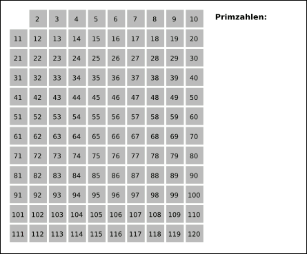

## エラトステネスの篩とは

エラトステネスの篩とは、ある数以下の素数を列挙するアルゴリズムです。
アルゴリズムは単純で、以下の手順で実装できます。

1. Nの要素をもつbool値配列を作成し、全要素をtrueで初期化する
2. 配列の0番目と1番目の要素をfalseにする(0と1は素数ではないため)
3. 配列の2番目の要素がtrueなら、2を素数として出力する
4. 配列の$2^2$以上の2の倍数番目の要素をすべてfalseにする※
5. 配列の3番目の要素がtrueなら、3を素数として出力する
6. 配列の$3^2$以上の3の倍数番目の要素をすべてfalseにする
7. 4番目、5番目、・・・、N番目の要素について、同様の処理を繰り返す

※2乗以上の要素をfalseの対象としているのは、2乗より小さい数についてはすでに処理済み(列挙が完了している)であるためです。




## Rustでの実装

```
fn main() {
    let n = 1000;
    let mut is_prime = vec![true; n+1];
    is_prime[0] = false;
    is_prime[1] = false;
    for i in 2..=n {
        if is_prime[i] {
            println!("{}", i);
            let mut j = i * i;
            while j <= n {
                is_prime[j] = false;
                j += i;
            }
        }
    }
}
```

## 少し高速化版

下記の点を考慮して、少し高速化した実装を行います。

- 配列の初期化をtrueで初期化するのではなく、falseで初期化する（このほうが高速）
- 2の倍数は素数ではないので、2の倍数の要素をfalseにする処理を省略
- nまでループする必要はなく、nの平方根までの素数を列挙すれば、n以下の素数を列挙できる

```
fn main() {
    let n = 1000;
    let mut is_prime = vec![false; n+1];
    is_prime[2] = true;
    for i in (3..=n).step_by(2) {
        is_prime[i] = true;
    }
    for i in 3..=((n as f64).sqrt() as usize) {
        if is_prime[i] {
            let mut j = i * i;
            while j <= n {
                is_prime[j] = false;
                j += i * 2;
            }
        }
    }
    for i in (2..=n).filter(|&x| is_prime[x]) {
        println!("{}", i);
    }
}
```

## 参考
- [エラトステネスの篩](https://ja.wikipedia.org/wiki/%E3%82%A8%E3%83%A9%E3%83%88%E3%82%B9%E3%83%86%E3%83%8D%E3%82%B9%E3%81%AE%E7%AF%A9)