---

title: '¡15 libros esenciales recomendados para ingenieros principiantes! Desde los conceptos básicos de programación hasta el diseño'
slug: "エンジニア初学者におすすめの書籍"
date: 2024-05-05T16:03:33+09:00
tags: ["ingeniero", "principiantes", "libros"]
draft: false
image: "img.webp"
categories: ["estilo de vida y notas misceláneas"]
description: '¡Imprescindible para ingenieros que quieren pasar de principiantes a intermedios en programación! Presentamos una cuidada selección de 15 libros esenciales recomendados para principiantes, como ''Código legible'' (The Art of Readable Code) y ''El programador pragmático'', donde puedes aprender conocimientos fundamentales y metodologías de diseño en el desarrollo de software.'
---

1. Código legible
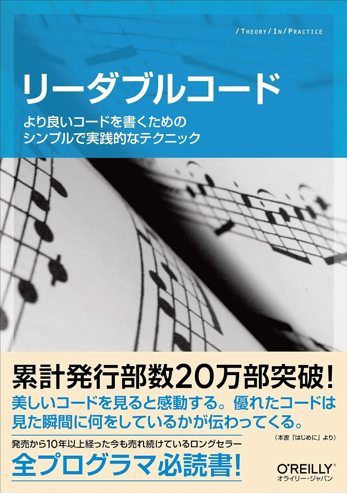
2. Principios de programación
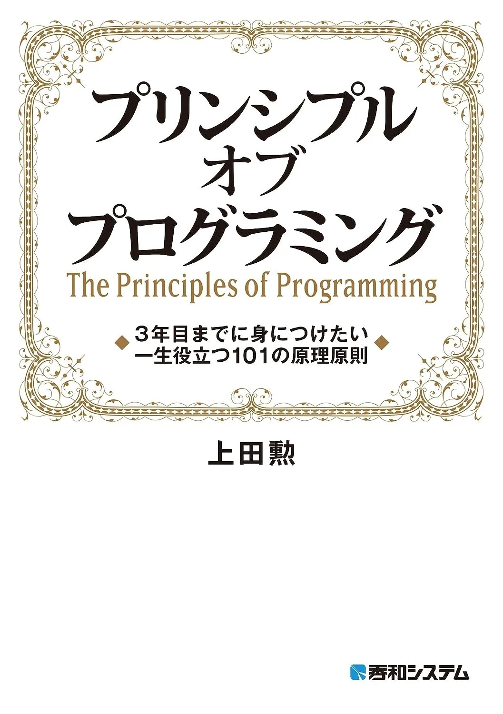
3. El programador pragmático
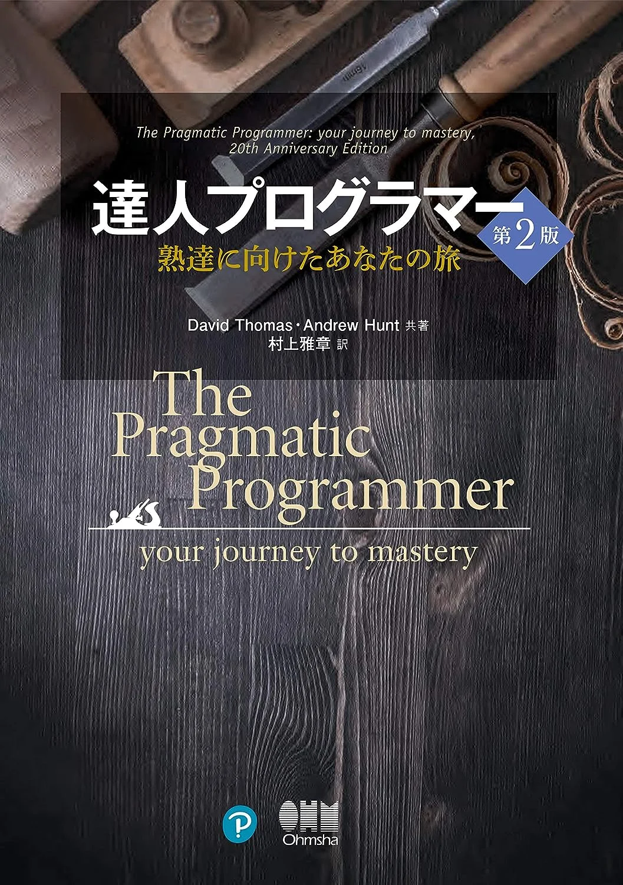
4. Tecnologías que sustentan la Web

5. Cómo crear aplicaciones web seguras
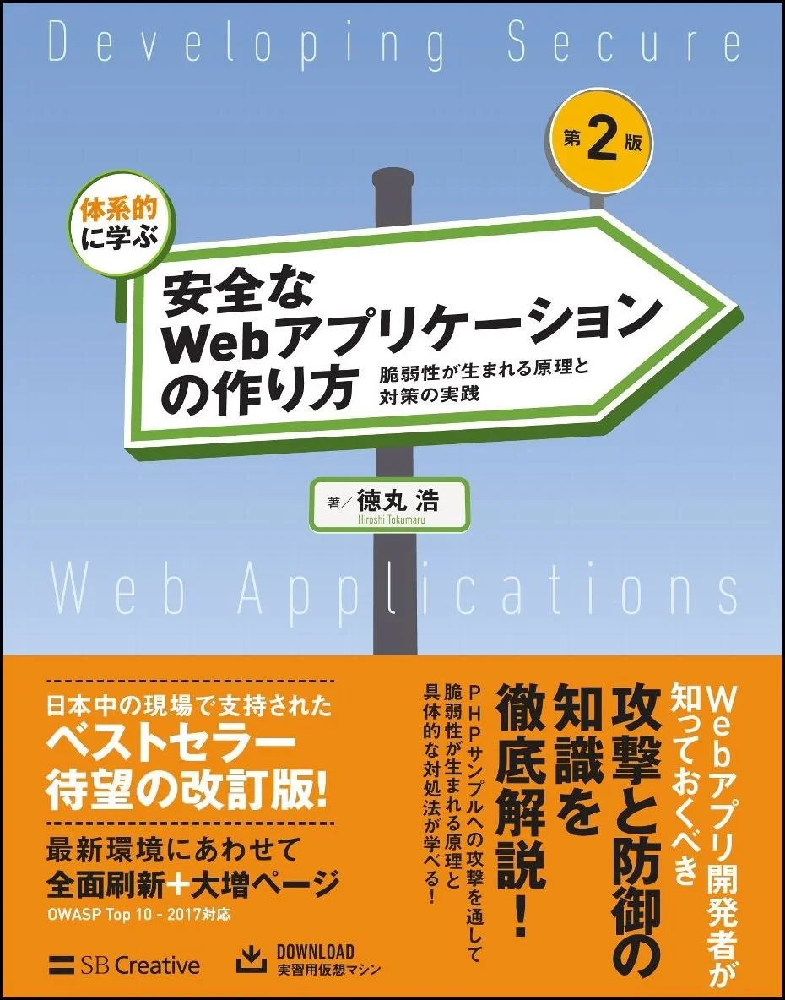
7. Por qué se conecta la red
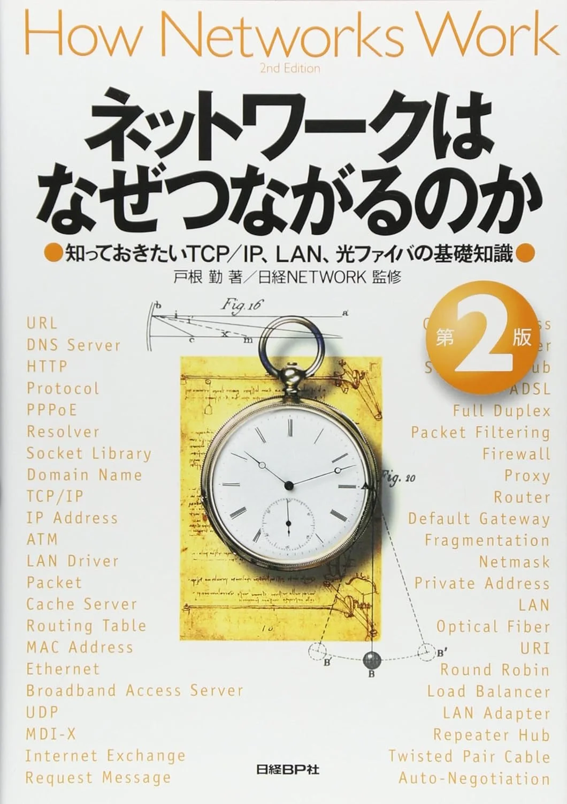
7. Guía exhaustiva de SQL de los expertos
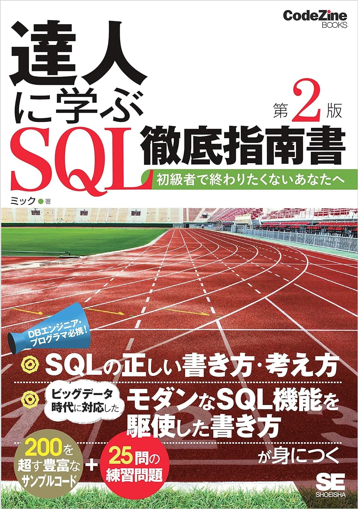
8. Guía práctica de Docker
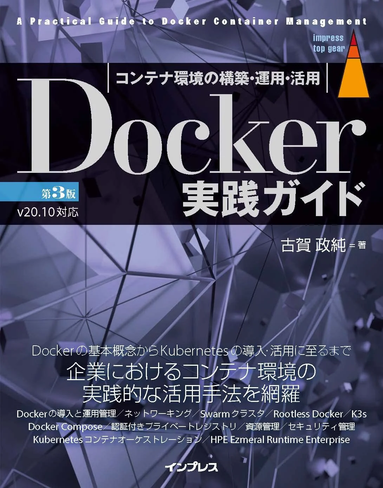
9. Guía completa de Kubernetes
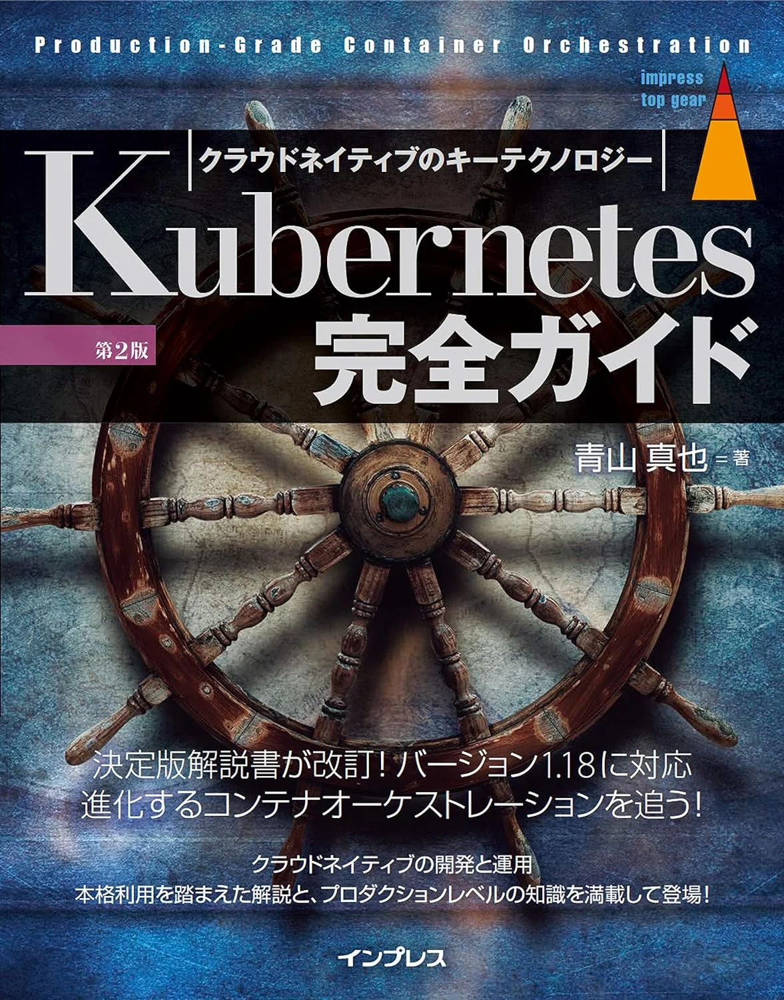
10. CODE COMPLETE 2da Edición
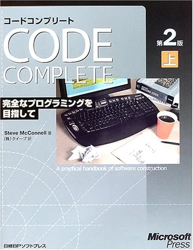
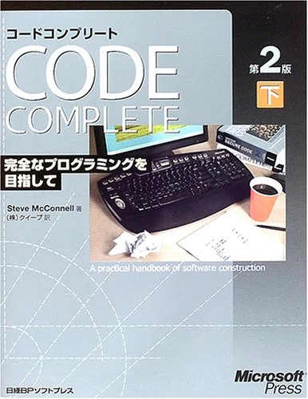
11. Clean Code: Habilidades de los expertos en software ágil
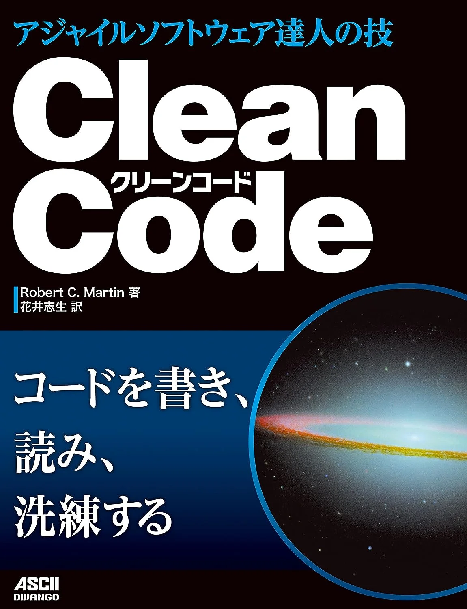
12. Clean Architecture: Estructura y diseño de software de los expertos
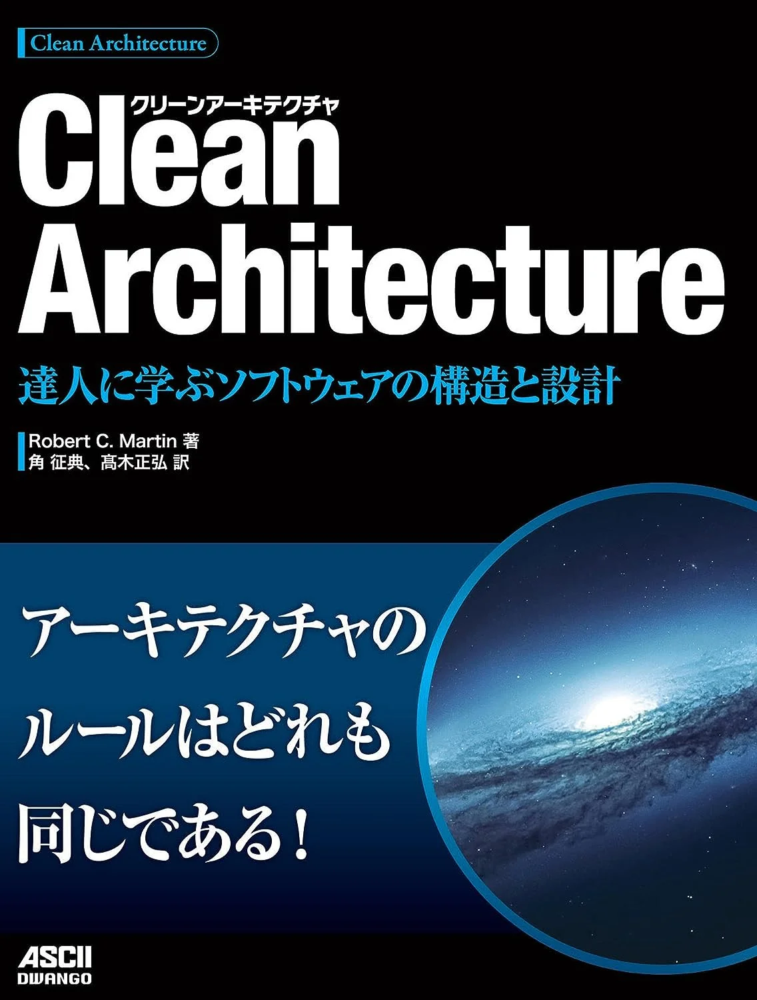
13. Tecnologías que debes conocer antes de convertirte en programador de videojuegos
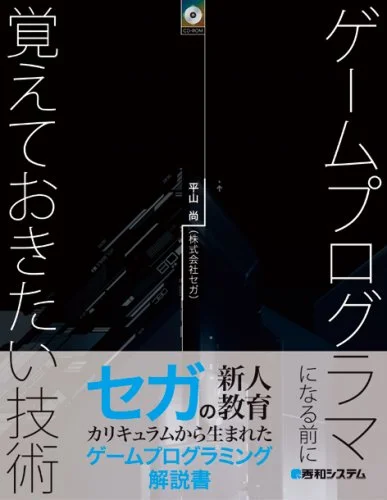
14. Being Geek
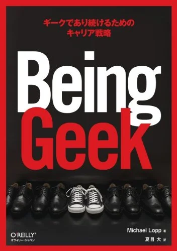
15. Por qué construimos con orientación a objetos
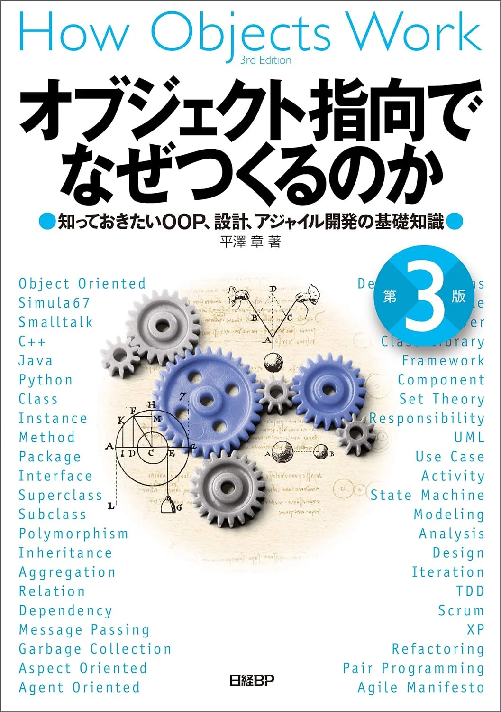
