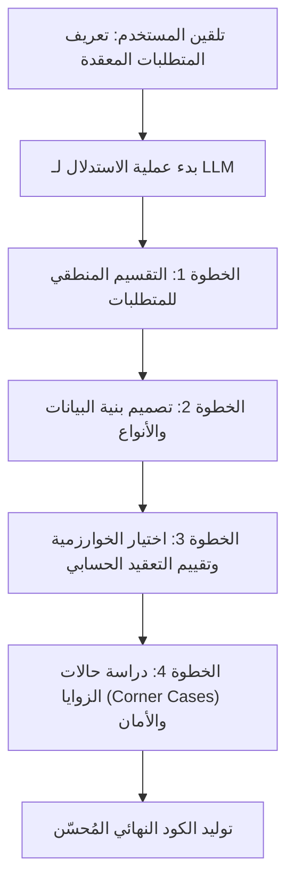
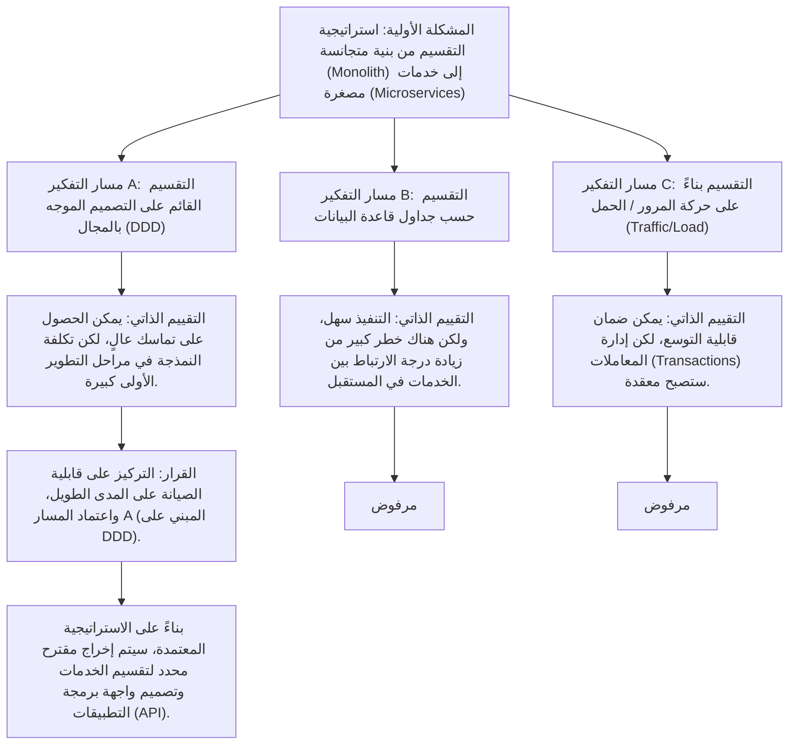
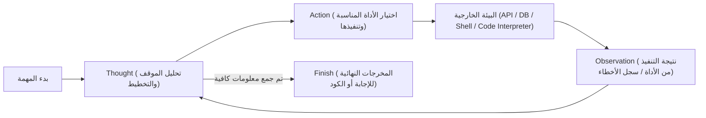
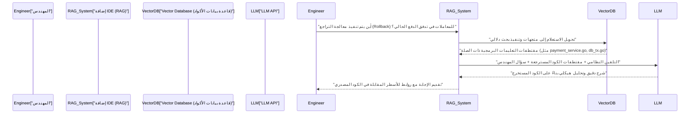

# مقدمة: لماذا يجب على المهندسين تعلم هندسة التلقين

يشهد عالم تطوير البرمجيات تحولاً جذرياً غير مسبوق بسبب التطور السريع للنماذج اللغوية الكبيرة (LLM). ليس من المبالغة القول إننا ننتقل الآن من "البرمجيات 2.0" (التطوير باستخدام الشبكات العصبية) التي اقترحها Andrejs Karpathy، إلى "البرمجيات 3.0" (التطوير الموجه بالتلقين باستخدام اللغة الطبيعية).

مع انتشار أدوات المساعدة بالذكاء الاصطناعي مثل GitHub Copilot و Cursor، أو باستخدام واجهات برمجة التطبيقات (APIs) لنماذج LLM المختلفة، تحولت المهام الأساسية للمهندس من "كتابة التعليمات البرمجية من الصفر" إلى "تصميم التعليمات لجعل الذكاء الاصطناعي يُنشئ الكود المقصود، ثم مراجعة الكود المُنشأ ودمجه".

المهارة الأكثر أهمية في منهجية التطوير الجديدة هذه هي **هندسة التلقين (Prompt Engineering)**. غالباً ما يُتحدث عن هندسة التلقين ككلمة طنانة لغير المهندسين تحت مسمى "الدردشة الجيدة مع الذكاء الاصطناعي"، ولكن جوهرها هو **شكل جديد من لغات البرمجة للأنظمة الحسابية غير الحتمية (Non-deterministic)**.

في هذه المقالة، نستهدف مهندسي البرمجيات ومعماريي الأنظمة، ونشرح بالتفصيل الممل في حوالي 10,000 حرف، بدءاً من الأسس الرياضية والمعمارية الكامنة وراء LLM، مروراً بتقنيات هندسة التلقين المتقدمة مثل Few-Shot و Chain-of-Thought و ReAct، وصولاً إلى سير عمل التطوير الفعلي وكيفية دمجها في واجهات برمجة التطبيقات (APIs).

---

## 1. أساسيات النماذج اللغوية الكبيرة (LLM) والخلفية الرياضية

من أجل تحسين التلقين (Prompt) والحصول على المخرجات المقصودة بشكل مستقر، من الضروري فهم "ما بداخل الصندوق الأسود" بشكل رياضي وهيكلي، وكيف تقوم نماذج LLM بمعالجة النصوص والأكواد وتوليدها داخلياً. معظم نماذج LLM الحديثة هي نماذج لغوية ذاتية الانحدار (Auto-regressive) تستخدم بنية المحولات (Transformer).

### 1.1 التقسيم إلى رموز (Tokenization) و BPE

نماذج LLM لا تعالج السلاسل النصية الخام مباشرة. بل يتم تقسيم النص إلى وحدات صغيرة تسمى **الرموز (Tokens)**. تستخدم العديد من النماذج خوارزمية تُعرف باسم تشفير أزواج البايت (Byte-Pair Encoding - BPE).

يُعد فهم التقسيم إلى رموز أمراً مهماً للمهندسين. وذلك لأن كيفية تقسيم المسافات البادئة (المسافات) والرموز الخاصة في لغات البرمجة تؤثر بشكل مباشر على جودة الكود المُنشأ. على سبيل المثال، في توليد كود Python، غالباً ما يُعامل عدد المسافات البيضاء (أربع مسافات أم علامة جدولة Tab) كرمز مستقل، وعدم توضيح قواعد المسافات البادئة في التلقين قد يكون سبباً في حدوث أخطاء في بناء الجملة (Syntax Errors).

### 1.2 التنبؤ بالرمز التالي (Next Token Prediction)

المهمة الأساسية لنموذج LLM ذي الانحدار الذاتي هي التنبؤ بـ "الرمز التالي الأكثر احتمالاً" الذي يتبع تسلسل الإدخال المعطى (السياق). عند التعبير عن ذلك رياضياً، فإنه يصبح مسألة تعظيم الاحتمال الشرطي التالي:

$$ P(w_t | w_{1}, w_{2}, \dots, w_{t-1}) $$

حيث يمثل $w_i$ الرمز، و $t$ هي الخطوة الزمنية الحالية. يحسب النموذج التوزيع الاحتمالي للرمز التالي من مجموعة الرموز المدخلة من خلال شبكته العصبية الداخلية. يُضاف الرمز المولد كمدخل للخطوة التالية بطريقة ذاتية الانحدار، وتتكرر هذه العملية حتى يتم إخراج رمز الانتهاء (مثل `<EOS>`).

### 1.3 آلية الانتباه (Attention Mechanism) ونافذة السياق

جوهر بنية Transformer هو آلية الانتباه الذاتي (Self-Attention). يسمح هذا للنموذج بحساب التبعيات بين الرموز المتباعدة داخل التسلسل.

$$ \text{Attention}(Q, K, V) = \text{softmax}\left(\frac{Q K^T}{\sqrt{d_k}}\right) V $$

هنا، $Q$ (الاستعلام Query)، $K$ (المفتاح Key)، و $V$ (القيمة Value) هي مصفوفات تم إنشاؤها من تمثيل الإدخال، و $d_k$ هو عامل القياس. ما تعنيه هذه المعادلة هو عملية "حساب أي كلمة سابقة (المفتاح) يجب أن تركز عليها (انتباه) الكلمة التي تتم معالجتها حالياً (الاستعلام)، ودمج تلك المعلومات (القيمة)".

لماذا يُعد فهم هذه الآلية مهماً في هندسة التلقين؟ لأنه يرتبط ارتباطاً مباشراً بمفهوم **نافذة السياق (Context Window)**. إذا كان تلقين الإدخال طويلاً جداً، فقد تُدفن التعليمات المهمة في منتصف السياق، وتتشتت أوزان الانتباه مما يؤدي إلى حدوث ظاهرة تسمى "الضياع في المنتصف (Lost in the middle)". بدلاً من رمي مستندات أو قواعد برمجية ضخمة بأكملها في التلقين، يُطلب استخراج وتمرير الأجزاء (Chunks) الضرورية بدقة فقط.

### 1.4 التحكم في أخذ العينات باستخدام معلمة درجة الحرارة (Temperature)

في طبقة الإخراج، تُستخدم عادةً دالة Softmax لتحويل اللوغاريتمات (Logits) (المخرجات الخام للنموذج) إلى توزيع احتمالي. هنا، يتم إدخال **درجة الحرارة (Temperature $T$)** للتحكم في تنوع (عشوائية) التوليد.

$$ p_i = \frac{\exp(z_i / T)}{\sum_j \exp(z_j / T)} $$

- $z_i$ هي درجة اللوغاريتم (Score) للرمز $i$ في المفردات.
- عندما يكون $T = 1.0$، فإنه يمثل دالة Softmax القياسية.
- كلما اقتربت $T \to 0$، يصبح التوزيع الاحتمالي أكثر حدة، ويتم اختيار الرمز ذي الاحتمالية الأعلى فقط (حتمي، فك التشفير الجشع Greedy Decoding).
- عندما يكون $T > 1.0$، يصبح التوزيع الاحتمالي مسطحاً، وتزداد احتمالية اختيار رموز نادرة لا تُختار عادةً (تزداد الإبداعية).

**نهج عملي للمهندسين:**
عند إجراء توليد للكود أو استخراج بيانات JSON (Structured Output) عبر واجهة برمجة التطبيقات (API)، من المعتاد ضبط قيمة منخفضة جداً لـ $T=0.0 \sim 0.2$ لمنع الهلوسة (Hallucination) وزيادة قابلية التكرار. من ناحية أخرى، في المهام الاستكشافية مثل العصف الذهني للبنية المعمارية أو ابتكار أفكار لاصطلاحات التسمية، يتم ضبطها على $T=0.7 \sim 1.0$.

---

## 2. البنية الهيكلية للتلقين: System Prompt مقابل User Prompt

عند بناء تطبيقات الذكاء الاصطناعي باستخدام واجهات برمجة تطبيقات OpenAI (مثل GPT-4) أو Anthropic (مثل Claude)، لا يتم هيكلة التلقين ككتلة نصية واحدة، بل كمصفوفة من الرسائل. وأهم جزء في ذلك هو الفصل بين "التلقين النظامي (System Prompt)" و "تلقين المستخدم (User Prompt)".

### 2.1 التلقين النظامي: تعريف القيود العالمية والشخصية

التلقين النظامي هو ما يحدد **القيود العالمية، والشخصية (الدور)، والقواعد الأساسية للسلوك** لنموذج LLM. إذا شبهناه بتصميم البرمجيات، فهو يلعب دوراً مشابهاً لـ "متغيرات البيئة (Environment Variables)" أو "الفئة الأساسية (Base Class)" للتطبيق، أو "Dockerfile" للحاوية (Container).

يعمل التلقين النظامي الممتاز على استقرار جودة وتنسيق المخرجات بشكل كبير.

```text
# مثال على التلقين النظامي (System Prompt)
أنت مهندس Go رفيع المستوى (Senior Go Engineer) من الطراز العالمي، وخبير في تصميم المعالجة المتزامنة (Goroutine/Channel).
يرجى توليد الإجابات وفقاً للقواعد الصارمة التالية.

【القواعد】
1. عند تقديم الكود، يجب تقديمه دائماً كدالة كاملة قابلة للتنفيذ.
2. لا تتجاهل معالجة الأخطاء (Error Handling)، وعالجها بوضوح باستخدام `if err != nil` وفقاً لأعراف لغة Go.
3. التفسيرات خارج كتل الكود يجب أن تكون في شكل نقاط، ولا تتجاوز 3 جمل.
4. في حالة طُلب منك تنفيذ محفوف بالمخاطر الأمنية (مثل SQL Injection أو Race Condition)، قدم بديلاً آمناً.
5. يجب أن يقتصر تنسيق الإخراج على الشروحات وكتل كود Markdown فقط.
```

### 2.2 تلقين المستخدم: المهام المؤقتة وحقن البيانات

يوفر تلقين المستخدم مهاماً محددة أو أسئلة أو بيانات الإدخال المراد معالجتها. وهو يعادل "استدعاء الدالة (تمرير الوسائط للدالة)" الذي يتم تنفيذه داخل بيئة السياق المبنية بواسطة التلقين النظامي.

```text
# مثال على تلقين المستخدم (User Prompt)
يرجى تنفيذ دالة تقوم بتنزيل الصور بشكل غير متزامن من قائمة كبيرة من عناوين URL وحفظها على القرص المحلي.
اجعل عدد العمال (Workers) قابلاً للتحكم من خلال وسيطة (Argument)، وقم بتضمين معالجة انتهاء المهلة (Timeout) في التنفيذ باستخدام السياق (context.Context).
```

من خلال ضبط التلقين النظامي بقوة، يمكنك ضمان استقرار المخرجات ضد تلقينات المستخدم شديدة التغير التي يتم حقنها من قبل المستخدمين (أو المكونات الأخرى للنظام). كما أنه يعمل كخط دفاع أول ضد هجمات "حقن التلقين (Prompt Injection)" الناتجة عن مدخلات المستخدمين الضارة.

---

## 3. تقنيات هندسة التلقين الأساسية

من هنا، سنشرح النماذج التلقينية المحددة التي تعمل على تحسين دقة مهام تطوير البرمجيات بشكل كبير.

### 3.1 Zero-Shot Prompting و Few-Shot Prompting

**Zero-Shot Prompting** هو أسلوب يُطلب فيه من النموذج الإجابة من خلال إعطائه تعليمات المهمة فقط، دون تقديم أي أمثلة. بالنسبة للطلبات العامة مثل "اكتب خوارزمية الترتيب السريع (Quicksort) بلغة Python"، تعمل نماذج LLM المتقدمة الحالية بشكل جيد كفاية باستخدام Zero-Shot.

ومع ذلك، إذا كنت ترغب في إجباره على اتباع اصطلاحات الترميز الخاصة بمشروعك، أو إذا كنت تريد منه إخراج مخطط JSON محدد، فإن احتمال خروج التنسيق عن السيطرة يرتفع مع Zero-Shot. ما يحل هذه المشكلة هو **Few-Shot Prompting**.

Few-Shot Prompting هو أسلوب يتم فيه تقديم بعض "أزواج الإدخال والمخرجات المتوقعة (أمثلة توضيحية)" داخل التلقين. وهو يستفيد من ظاهرة تسمى "التعلم داخل السياق (In-Context Learning)" حيث يتعلم النموذج الأنماط داخل سياق التلقين دون تحديث معلماته (Parameters).

```text
# مثال على Few-Shot Prompting (مهمة تحليل السجلات)
يرجى تحليل السجلات الخام (Raw Logs) التالية واستخراج كائنات JSON المهيكلة.

مثال 1:
الإدخال: "[2023-10-01 10:00:05] ERROR [AuthService] Failed to authenticate user id=12345: Invalid password"
المخرجات: {"timestamp": "2023-10-01T10:00:05Z", "level": "ERROR", "service": "AuthService", "message": "Failed to authenticate user", "user_id": 12345}

مثال 2:
الإدخال: "[2023-10-01 10:05:12] WARN [DBPool] Connection timeout approaching for query_id=987"
المخرجات: {"timestamp": "2023-10-01T10:05:12Z", "level": "WARN", "service": "DBPool", "message": "Connection timeout approaching", "query_id": 987}

إدخال المهمة:
الإدخال: "[2023-10-01 10:15:30] FATAL [PaymentGateway] API rate limit exceeded. Retry after 60s"
المخرجات:
```

من خلال تقديم الأمثلة بهذه الطريقة، يتعلم النموذج ضمنياً تنسيق `timestamp` (التحويل إلى ISO 8601)، وقواعد تسمية المفاتيح، وسيقوم بإخراج JSON مثالي.

### 3.2 Chain-of-Thought (CoT) و Zero-Shot CoT

كان **Chain-of-Thought (CoT: سلسلة الأفكار)** بمثابة اختراق كبير فيما يتعلق بقدرات الاستدلال لنماذج LLM. في المهام التي تتطلب منطقاً معقداً (مثل: تنفيذ خوارزميات معقدة، تتبع أخطاء برمجية غامضة، بناء تعبيرات نمطية، إلخ)، إذا تركت نموذج LLM يُخرج الكود النهائي فجأة، فمن المرجح أن تحدث قفزات منطقية أو أخطاء (هلوسة).

CoT هو أسلوب يجعل النموذج يعبر لفظياً عن عملية الاستدلال المتوسطة (عملية التفكير) قبل إخراج الإجابة النهائية. من خلال جعل النموذج يحلل الموقف خطوة بخطوة بنفسه، يصبح السياق أغنى مع كل رمز (Token) يتم إنشاؤه، مما يحسن من دقة الاستنتاج النهائي بشكل جذري.

التقنية الأبسط والأقوى هي **Zero-Shot CoT**، والتي تضيف الكلمات السحرية "**دعنا نفكر خطوة بخطوة (Let's think step by step)**" في نهاية التلقين.

في التطوير، يتم تطبيق هذا المفهوم وهيكلة التلقين على النحو التالي:

```text
يرجى إنشاء مكون React (React Component) يفي بالمواصفات التالية.
【المواصفات】...

قبل إنشاء الكود، يرجى كتابة عملية التفكير (داخل علامات <thinking>) بالخطوات التالية:
1. تحديد الحالة (State) المطلوبة وتصميم بنية البيانات
2. دراسة الحالات الحدية (Edge Cases) التي قد تحدث وكيفية معالجة الأخطاء
3. دراسة وحدة تقسيم المكونات

بعد اكتمال عملية التفكير، يرجى كتابة كود TypeScript النهائي.
```



### 3.3 Tree of Thoughts (ToT)

امتداد لمفهوم CoT هو **Tree of Thoughts (ToT)**. في حين أن CoT يتبع مسار استدلالي ذو اتجاه واحد (خطي)، فإن ToT يقوم بتوسيع مسارات استدلالية (فروع) متعددة بالتوازي مثل شجرة البحث، ويجعل النموذج يُقيّم كل مسار ذاتياً، ويتراجع (Backtrack) للوصول إلى الحل الأمثل.

تُعد تقنية ToT فعالة جداً في المشكلات التي تكون فيها مساحة البحث واسعة والتي يسهل الوقوع فيها في التحسين المحلي (Local Optima)، مثل تصميم بنية النظام (System Architecture)، تصميم مخطط قاعدة بيانات معقد، أو خطط إعادة هيكلة كود واسعة النطاق (Refactoring).



لتنفيذ ToT من خلال التلقين، نوجه التعليمة كالتالي: "يرجى اقتراح أساليب متعددة، وتقييم مزايا وعيوب كل منها، ثم اعتماد وتنفيذ الأسلوب الأفضل."

---

## 4. سير العمل الوكيلي (Agentic Workflow) و ReAct (الاستدلال والتصرف)

يتطور تطبيق نماذج LLM بسرعة من مجرد إدخال وإخراج للنصوص الفردية، إلى مجال **وكلاء الذكاء الاصطناعي (AI Agents)** الذين يخططون بشكل مستقل وينفذون المهام أثناء التفاعل مع البيئة الخارجية. النموذج الأساسي الذي يشكل جوهر هذه البنية الوكيلة هو **ReAct (Reasoning and Acting)**.

### 4.1 مفهوم إطار عمل ReAct

نماذج LLM التقليدية يمكنها "التفكير قبل الإجابة (CoT)"، ولكن لا يمكنها "اتخاذ إجراء" لتعويض النقص في معرفتها. يخترق إطار عمل ReAct هذا القيد من خلال جعل LLM يتناوب بين "التفكير (Thought)" و "الفعل (Action)".

يحلل النموذج المشكلة (Thought)، وإذا حدد أن المعلومات غير كافية، فإنه ينفذ أداة خارجية (بحث ويب، استعلام قاعدة بيانات، أمر Shell، استدعاء API، وما إلى ذلك) (Action). يتلقى نتيجة تنفيذ الأداة (Observation)، ويستخدمها كسياق جديد لمزيد من التفكير، ويكرر هذه الحلقة حتى يصل إلى الإجابة النهائية (Finish).



### 4.2 التنفيذ من خلال استدعاء الدوال (Function Calling)

الواجهة القياسية لدمج ReAct في الأنظمة هي **Function Calling (استدعاء الدوال / استخدام الأدوات)** التي توفرها شركات مثل OpenAI و Anthropic.

يمرر المهندسون لنموذج LLM "تعريفاً لمجموعة الأدوات المتاحة (مخطط JSON)" جنباً إلى جنب مع التلقين النظامي. يحلل LLM سياق التلقين، وإذا قرر أنه يجب استخدام أداة، فإنه يُخرج "اسم الدالة المراد استدعاؤها" و "متغيرات JSON لتلك الدالة" بدلاً من النص العادي. يتم تنفيذ الدالة على جانب التطبيق، وتُعاد النتيجة إلى LLM، مما يُشكل حلقة مغلقة.

**أمثلة على التطبيق في التطوير (وكيل تصحيح أخطاء مستقل):**
عند بناء وكيل (Agent) يحقق في سبب فشل الاختبارات في مسار CI/CD وينشئ تصحيحاً (Patch)، يتم تزويد LLM بالأدوات التالية:

1. `search_codebase(regex_pattern)`: يبحث في الأكواد الموجودة في المستودع (Repository) باستخدام التعبيرات النمطية.
2. `view_file_content(file_path, start_line, end_line)`: يقرأ محتويات ملف محدد.
3. `run_unit_test(test_file_path)`: يشغل اختبار وحدة (Unit Test) محدد ويحصل على تتبع الأخطاء (Traceback).
4. `propose_patch(file_path, diff_content)`: يقترح تصحيحاً للإصلاح.

يستنتج LLM ويتصرف بشكل مستقل على النحو التالي:
- **Thought**: بالنظر إلى سجل الاختبار، حدث خطأ `KeyError: 'user_id'` في السطر 45 من الملف `src/auth.py`. يجب التحقق من الكود المحيط به.
- **Action**: `view_file_content(file_path="src/auth.py", start_line=30, end_line=60)`
- **Observation**: (يقرأ التطبيق محتويات الملف ويعيدها إلى LLM)
- **Thought**: فهمت، التحقق من الصحة (Validation) للحالة التي لا يتضمن فيها JSON لرد الـ API المفتاح `user_id` مفقود. سأقوم بإنشاء تصحيح يعيد كتابته باستخدام طريقة `.get()` الآمنة.
- **Action**: `propose_patch(...)`

بهذه الطريقة، يتم رفع مستوى هندسة التلقين من "التحكم في توليد النص" إلى بعد "تعريف الأدوات وتصميم حلقة الوكيل (التنسيق Orchestration)".

---

## 5. التوليد المعزز بالاسترجاع (RAG) وتكامله مع قواعد الأكواد

أحد أكبر نقاط الضعف في نماذج LLM هو أنها لا تعرف "المعلومات الخاصة" أو "أحدث المعلومات" التي لم يتم تضمينها في بيانات التدريب المسبق. إذا سألتها عن مستودع خاص داخلي في الشركة أو عن مواصفات API مخصصة، فإن LLM سيهلوس بكل هدوء أو سيقدم إجابات عامة فقط.

البنية المعمارية التي تحل هذه المشكلة هي **RAG (التوليد المعزز بالاسترجاع - Retrieval-Augmented Generation)**. يعتبر RAG تقنية تجمع بين استرجاع المعلومات (Retrieval) وقدرة التوليد (Generation) لـ LLM.

### 5.1 التضمينات (Embeddings) والبحث المتجهي

أساس RAG هو نموذج الفضاء المتجهي الرياضي (Vector Space Model). يتم تحويل الكود المصدري والمستندات الداخلية إلى متجهات عالية الأبعاد (على سبيل المثال، مصفوفة من أرقام الفاصلة العائمة المكونة من 1536 بُعداً) بواسطة نموذج تضمين (Embedding Model) (مثل `text-embedding-3-small`) ويتم تخزينها في قاعدة بيانات موجهة (Vector Database).

عندما يقوم المستخدم بإدخال سؤال (استعلام)، يتم أيضاً تحويل الاستعلام إلى متجهات باستخدام نفس النموذج، ويتم حساب **تشابه جيب التمام (Cosine Similarity)** بينه وبين متجهات المستندات الموجودة في قاعدة البيانات.

$$ \text{Cosine Similarity}(A, B) = \frac{A \cdot B}{\|A\| \|B\|} = \frac{\sum_{i=1}^{n} A_i B_i}{\sqrt{\sum_{i=1}^{n} A_i^2} \sqrt{\sum_{i=1}^{n} B_i^2}} $$

يتم استرداد مقتطفات التعليمات البرمجية أو المستندات القليلة الأولى التي تحتوي على تشابه عالٍ (قريبة دلالياً)، ويتم حقنها ديناميكياً في تلقين المستخدم على أنها "سياق".

### 5.2 تطبيق RAG في سير عمل التطوير

من خلال دمج RAG في أدوات التطوير، يمكن تحقيق وظائف قوية داخل بيئة التطوير المتكاملة (IDE) كما يلي:



كأسلوب مهم لهندسة التلقين عند بناء RAG لقواعد الأكواد البرمجية، بالإضافة إلى تقسيم الكود ببساطة، فإن تضمين "الملخصات التي تم إنشاؤها من سلاسل التوثيق (Docstrings) لكل دالة أو أشجار البنية المجردة (AST) للفئات" في المتجهات، يؤدي إلى تحسين دقة البحث بشكل كبير.

---

## 6. حالات الاستخدام العملية وأمثلة التلقين المتقدمة في الهندسة

سنقدم حالات استخدام عملية وتقنيات التلقين حول كيفية تطبيق نظرية هندسة التلقين لأتمتة وتسهيل مهام التطوير اليومية.

### 6.1 أتمتة مراجعة الأكواد واستكمال التحليل الثابت

يتم دمج LLM في مسار التكامل المستمر (CI)، ويُطلب منه إجراء مراجعة تلقائية للكود عند إنشاء طلب سحب (Pull Request - PR). الغرض من ذلك هو الإشارة إلى التناقضات في منطق الأعمال أو الأنماط المضادة (Anti-patterns) في التصميم والتي لا يمكن لأدوات Lint أو أدوات التحليل الثابت اكتشافها.

**مثال على التلقين (طلب مخرجات منظمة):**
```text
أنت مهندس برمجيات رفيع المستوى (Senior Software Engineer) صارم وذو خبرة.
يرجى تحليل فروق طلب السحب المقدمة (Git Diff) وإجراء مراجعة للكود.

【مجالات التركيز في المراجعة】
1. الثغرات الأمنية (الحقن Injection، XSS، تجاوز التفويض، إلخ)
2. اختناقات الأداء (مشكلة N+1 استعلام، الحسابات المتكررة غير الفعالة، إلخ)
3. قابلية الصيانة والقراءة (انتهاك مبادئ SOLID، التداخل المعقد للغاية، إلخ)

【القيود】
- لا تشر إلى مجرد انتهاكات التنسيق (مثل المسافات البادئة) لأن ذلك دور أدوات Lint.
- إذا لم تكن هناك مشكلة، فلا تجبر نفسك على العثور على أخطاء، وأعد مصفوفة فارغة.
- يجب أن تتبع المخرجات دائماً مخطط JSON التالي. لا تقم بتغليفها بعلامات الاقتباس المائلة لـ Markdown (```json).

【تنسيق إخراج JSON المتوقع】
{
  "review_comments": [
    {
      "file_path": "string",
      "line_number": "integer",
      "severity": "High | Medium | Low",
      "issue_title": "string",
      "detailed_description": "string",
      "suggested_code_fix": "string"
    }
  ]
}

[Git Diff Data]
{{PR_DIFF}}
```

النقاط الأساسية في هذا التلقين هي إجبار LLM على إخراج JSON الذي يسهل تحليله برمجياً (Parse)، والفصل الواضح بين دور أدوات Lint ودور LLM (تعريف حدود النظام).

### 6.2 "التلقين الدفاعي (Defensive Prompting)" أثناء التوليد الصفري للأكواد (Zero-shot)

من المشكلات الشائعة عند جعل الذكاء الاصطناعي يكتب الكود هي "استيراد (import) مكتبات غير موجودة (هلوسة) من تلقاء نفسه" أو "تخطي تعريفات المتغيرات الضرورية (يتم اختصارها بـ `# اكتب المعالجة هنا`)". لمنع ذلك، نستخدم "التلقين الدفاعي" الذي يضع حواجز حماية قوية داخل التلقين.

**العناصر المهمة في التلقين الدفاعي:**
1. **حظر الاختصار:** "لا تختصر الكود أو تستخدم عناصر نائبة (مثل `// ...`)، وقم بإنشاء ملف كامل يمكن نسخه ولصقه وتشغيله كما هو."
2. **منع الهلوسة:** "إذا لم تكن هناك مكتبة قياسية تلبي المتطلبات، فلا تخترع مكتبات جهات خارجية غير موجودة. في هذه الحالة، اقترح كوداً يستخدم المكتبات الأكثر قياسية (مثل: requests) مع توضيح أنه يجب تثبيت مكتبة خارجية."
3. **متطلب الاكتفاء الذاتي:** "يجب تعريف جميع المتغيرات والدوال بشكل صحيح داخل كتلة الكود."

### 6.3 التوليد التلقائي للاختبارات القائمة على الخصائص / اختبارات الحالات الحدية (Edge Cases)

بالنسبة للدوال التي ينفذها المهندسون، يُطلب من LLM العثور على الحالات الطرفية (Corner Cases) وتوليد أكواد الاختبار لها. هذا فعال جداً في القضاء على الافتراضات البشرية الخاطئة.

```text
تقوم دالة Python التالية بتحديد ما إذا كانت السلسلة النصية المعطاة عنوان IPv4 صالحاً أم لا.
يرجى كتابة مجموعة اختبارات وحدة شاملة تعتمد على pytest لهذه الدالة.

【الشروط】
- لا تقتصر على حالات الاختبار العادية، بل قم بتغطية الحالات الحدية (Edge Cases) التالية بشكل شامل:
  - القيم الحدية (0، 255، 256، إلخ)
  - مدخلات بأنواع مختلفة (عدد صحيح، None، قائمة، إلخ)
  - سلاسل نصية تحتوي على مسافات أو أحرف خاصة
  - الحالات التي يكون فيها عدد النقاط غير صحيح (أقل من 3، أو 4 فأكثر)
- استخدم الاختبارات المعلمية (Parameterized Tests) (`@pytest.mark.parametrize`) للحفاظ على كود الاختبار موجزاً.

[كود الدالة]
def is_valid_ipv4(ip_str):
    # التنفيذ...
```

---

## 7. تقييم التلقينات وعمليات تشغيل LLM (LLMOps و Eval)

في عالم هندسة البرمجيات، يسمى الكود الذي لم يتم اختباره بالكود القديم (Legacy Code). يمكن قول الشيء نفسه تماماً في هندسة التلقين. إن نشر "تلقين تمت تجربته يدوياً بضع مرات وعمل بشكل جيد" في بيئة الإنتاج أمر في غاية الخطورة.

بسبب ترقيات إصدار النماذج الأساسية، أو التغييرات في بيانات المجال (Domain Data) المعالجة، يمكن أن ينكسر سلوك التلقين بسهولة. لمنع ذلك، من الضروري بناء نظام **تقييم (Evaluation - Eval)** (LLMOps) لتقييم مخرجات التلقين كمياً.

### 7.1 LLM-as-a-Judge (تقييم LLM بواسطة LLM)

في مهام مثل توليد الأكواد وتلخيص النصوص، يستحيل إجراء اختبار المطابقة التامة (Exact Match). ومقاييس التقييم الكلاسيكية لمعالجة اللغات الطبيعية (مثل BLEU و ROUGE) ليست قوية بما يكفي لقياس الدقة الدلالية.

المعيار الحالي في الصناعة هو نهج **LLM-as-a-Judge**، الذي يستخدم نموذجاً قوياً (مثل GPT-4o أو Claude 3.5 Sonnet) كـ "قاضٍ (Judge)" لتقييم المخرجات التي أنتجها نموذج LLM المستهدف.

1. **تجهيز مجموعة الاختبار (Test Set)**: قم بإعداد العشرات إلى المئات من أزواج بيانات الإدخال والمخرجات المثالية (أو معايير التقييم).
2. **التنفيذ**: اجعل التلقين والنموذج المستهدفين بالتقييم يولدون مخرجات لمجموعة الاختبار.
3. **التقييم**: قم بإعداد تلقين للتقييم (Meta-prompt)، ووجه القاضي LLM قائلاً: "هل تفي المخرجات المولدة بالمتطلبات؟ قم بتقييمها من 1 إلى 5 درجات".

يتيح هذا إمكانية الاكتشاف التلقائي للتراجع في الأداء (Regression) عند تعديل التلقين في مسار CI/CD. لقد تطورت هندسة التلقين من "العبث بالتلقينات" كحرفة يدوية، إلى "هندسة (Engineering)" قابلة للتكرار وتعتمد على البيانات.

---

## 8. الخاتمة: التلقين هو المكون الجديد في البرمجيات

في عصر يكتب فيه الذكاء الاصطناعي الأكواد، أحياناً يصرخ البعض بـ "نهاية البرمجة"، لكن الواقع مختلف تماماً. كل ما في الأمر أن مستوى التجريد المطلوب من المهندسين قد ارتفع درجة واحدة.

في الماضي، من خلال الانتقال من لغة التجميع (Assembly) إلى لغة C، ثم إلى لغات المستوى العالي المزودة بميزة جمع القمامة (Garbage Collection)، تحررنا من متاعب إدارة الذاكرة وأصبح بإمكاننا التركيز على بناء منطق أعمال أكثر تعقيداً. تعد نماذج LLM وهندسة التلقين الموجة التالية من التجريد التي تلي ذلك.

1. **فهم البنية المعمارية**: فهم الطبيعة الاحتمالية لنماذج LLM (الانحدار الذاتي، Attention، Temperature) والتحكم في عدم حتمية النظام.
2. **تصميم السياق**: إيصال النوايا بوضوح من خلال القيود المفروضة بواسطة System Prompt، والاستفادة من Few-Shot/CoT.
3. **التفكير الوكيلي وتكامل الأدوات**: الاستفادة الكاملة من نموذج ReAct، واستخدام LLM كمنسق (Orchestrator) للنظام.
4. **التقييم المستمر**: إدارة إصدارات التلقينات كجزء من الكود، ومواصلة التحسين القائم على الاختبار من خلال Eval.

من خلال إتقان هذه المبادئ، يصبح التلقين أكثر من مجرد سلسلة نصية؛ بل يصبح مكوناً برمجياً قوياً وقابلاً للتوسع. نأمل أن تقوم بدمج تقنيات هندسة التلقين المتقدمة المشروحة في هذه المقالة في سير عملك البرمجي ومنتجاتك، وأن تزدهر كمهندس يقود الجيل القادم من "البرمجيات 3.0".

---
*تم الإنشاء باستخدام تقنيات هندسة التلقين.*
