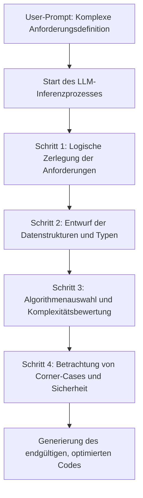
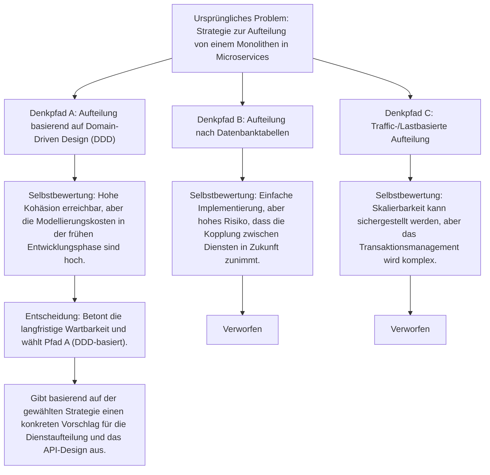
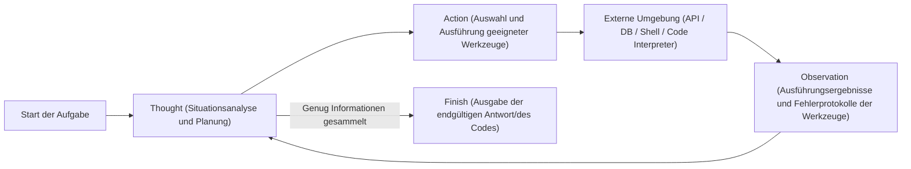
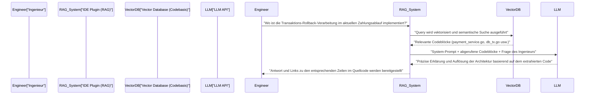

# Einführung: Warum Ingenieure Prompt Engineering lernen sollten

Die Welt der Softwareentwicklung befindet sich aufgrund der rasanten Entwicklung von Large Language Models (LLMs) inmitten eines beispiellosen Paradigmenwechsels. Es ist keine Übertreibung zu sagen, dass wir vom „Software 2.0“ (Entwicklung durch neuronale Netze), wie es von Andrejs Karpathy propagiert wurde, nun zum „Software 3.0“ (natürlichsprachliche, prompt-gesteuerte Entwicklung) übergehen.

Mit der Verbreitung von KI-Assistenten-Tools wie GitHub Copilot, Cursor oder verschiedenen LLM-APIs hat sich die Hauptaufgabe von Ingenieuren vom „Schreiben von Code von Grund auf“ hin zum „Entwerfen von Anweisungen, um die KI dazu zu bringen, den beabsichtigten Code zu generieren, und der anschließenden Überprüfung und Integration des generierten Codes“ gewandelt.

Die wichtigste Fähigkeit in dieser neuen Entwicklungsmethode ist das **Prompt Engineering**. Prompt Engineering wird oft als Schlagwort für Nicht-Ingenieure im Sinne von "geschicktem Plaudern mit der KI" abgetan, aber im Kern ist es eine **neue Art von Programmiersprache für nicht-deterministische (Non-deterministic) Rechensysteme**.

In diesem Artikel, der sich an Software-Ingenieure und Architekten richtet, wird auf etwa 10.000 Zeichen sehr detailliert auf die mathematischen und architektonischen Grundlagen von LLMs, fortgeschrittene Prompt-Engineering-Methoden wie Few-Shot, Chain-of-Thought und ReAct sowie deren Einbindung in tatsächliche Entwicklungs-Workflows und APIs eingegangen.

---

## 1. Grundlagen und mathematischer Hintergrund von Large Language Models (LLMs)

Um Prompts zu optimieren und die beabsichtigte Ausgabe stabil zu erhalten, ist es unerlässlich, das "Innere der Blackbox" mathematisch und strukturell zu verstehen, also wie LLMs intern Text oder Code verarbeiten und generieren. Die meisten modernen LLMs sind autoregressive Sprachmodelle, die die Transformer-Architektur verwenden.

### 1.1 Tokenisierung (Tokenization) und BPE

LLMs verarbeiten rohe Textzeichenfolgen nicht direkt. Text wird in kleine Einheiten unterteilt, die **Token** genannt werden. Viele Modelle verwenden einen Algorithmus namens Byte-Pair Encoding (BPE).

Das Verständnis der Tokenisierung ist für Ingenieure wichtig. Denn die Art und Weise, wie Einrückungen (Leerzeichen) und Sonderzeichen in Programmiersprachen tokenisiert werden, wirkt sich direkt auf die Qualität der Codegenerierung aus. Bei der Codegenerierung für Python beispielsweise wird die Anzahl der Leerzeichen (ob es sich um vier Leerzeichen oder einen Tabulator handelt) oft als unabhängiges Token behandelt. Wenn die Einrückungsregeln im Prompt nicht klar definiert sind, kann dies zu Syntaxfehlern führen.

### 1.2 Vorhersage des nächsten Tokens (Next Token Prediction)

Die grundlegende Aufgabe eines autoregressiven LLMs besteht darin, für eine gegebene Eingabesequenz (Kontext) das „wahrscheinlichste nächste Token“ vorherzusagen. Mathematisch ausgedrückt ist dies ein Maximierungsproblem für folgende bedingte Wahrscheinlichkeit:

$$ P(w_t | w_{1}, w_{2}, \dots, w_{t-1}) $$

Hierbei repräsentiert $w_i$ ein Token und $t$ den aktuellen Zeitschritt. Das Modell berechnet über sein internes neuronales Netz die Wahrscheinlichkeitsverteilung des nächsten Tokens aus der Gruppe der Eingabetoken. Das generierte Token wird als Eingabe für den nächsten Schritt autoregressiv hinzugefügt, und dieser Prozess wiederholt sich, bis ein End-Token (wie `<EOS>`) ausgegeben wird.

### 1.3 Aufmerksamkeitsmechanismus (Attention Mechanism) und Kontextfenster

Der Kern der Transformer-Architektur ist der Self-Attention-Mechanismus. Dieser ermöglicht es dem Modell, die Abhängigkeiten zwischen weit entfernten Token in einer Sequenz zu berechnen.

$$ \text{Attention}(Q, K, V) = \text{softmax}\left(\frac{Q K^T}{\sqrt{d_k}}\right) V $$

Hierbei sind $Q$ (Query), $K$ (Key) und $V$ (Value) Matrizen, die aus den Eingaberepräsentationen generiert werden, und $d_k$ ist ein Skalierungsfaktor. Diese Formel bedeutet: „Berechne, auf welche vergangenen Wörter (Key) das aktuell verarbeitete Wort (Query) achten (Attention) soll, und beziehe diese Informationen (Value) ein.“

Warum ist das Verständnis dieses Mechanismus im Prompt Engineering so wichtig? Weil es direkt mit dem Konzept des **Kontextfensters (Context Window)** zusammenhängt. Wenn der Eingabe-Prompt zu lang wird, gehen wichtige Anweisungen in der Mitte des Kontexts verloren, das Gewicht der Attention verteilt sich und es tritt das Phänomen „Lost in the middle (Verlust von Mittelinformationen)“ auf. Anstatt gewaltige Dokumente oder Codebasen im Ganzen als Prompt zu übergeben, ist es erforderlich, nur die notwendigen Blöcke gezielt zu extrahieren und zu übergeben.

### 1.4 Sampling-Steuerung durch den Temperaturparameter (Temperature)

In der Ausgabeschicht wird normalerweise die Softmax-Funktion verwendet, um die Logits (Rohausgaben des Modells) in eine Wahrscheinlichkeitsverteilung umzuwandeln. Hier wird die **Temperatur (Temperaturparameter $T$)** eingeführt, um die Vielfalt (Zufälligkeit) der Generierung zu steuern.

$$ p_i = \frac{\exp(z_i / T)}{\sum_j \exp(z_j / T)} $$

- $z_i$ ist das Logit (der Score) des Tokens $i$ im Vokabular.
- Wenn $T = 1.0$, handelt es sich um die Standard-Softmax-Funktion.
- Wenn sich $T \to 0$ nähert, wird die Wahrscheinlichkeitsverteilung schärfer, und es wird zunehmend nur das Token mit der höchsten Wahrscheinlichkeit ausgewählt (deterministisch, Greedy Decoding).
- Wenn $T > 1.0$, wird die Wahrscheinlichkeitsverteilung flacher, und unauffällige Token, die normalerweise nicht ausgewählt werden, werden leichter gewählt (die Kreativität steigt).

**Praktischer Ansatz für Ingenieure:**
Wenn Codegenerierung oder JSON-Datenextraktion (Structured Output) über eine API durchgeführt wird, ist es üblich, einen extrem niedrigen Wert von $T=0.0 \sim 0.2$ festzulegen, um Halluzinationen zu vermeiden und die Reproduzierbarkeit zu erhöhen. Bei explorativen Aufgaben wie Architektur-Brainstorming oder der Ideenfindung für Namenskonventionen wird der Wert auf $T=0.7 \sim 1.0$ gesetzt.

---

## 2. Strukturarchitektur von Prompts: System Prompt vs User Prompt

Beim Aufbau von KI-Anwendungen unter Verwendung von APIs von OpenAI (wie GPT-4) oder Anthropic (wie Claude) wird der Prompt nicht als einzelner Textblock, sondern strukturiert als Array von Nachrichten aufgebaut. Das Wichtigste dabei ist die Trennung von „System Prompt“ und „User Prompt“.

### 2.1 System Prompt: Definition globaler Einschränkungen und Personas

Der System Prompt definiert die **globalen Einschränkungen, die Persona (Rolle) und die grundlegenden Verhaltensregeln** für das LLM. Um es mit Softwaredesign zu vergleichen, spielt er eine Rolle wie „Umgebungsvariablen“ oder „Basisklasse“ einer Anwendung oder wie ein „Dockerfile“ eines Containers.

Ein hervorragender System Prompt stabilisiert die Ausgabqualität und das Format drastisch.

```text
# Beispiel für einen System Prompt
Du bist ein erstklassiger Senior Go-Entwickler, der bestens mit Nebenläufigkeit (Goroutine/Channel) vertraut ist.
Bitte generiere Antworten unter strikter Einhaltung der folgenden Regeln.

[Regeln]
1. Wenn du Code bereitstellst, muss dieser immer als ausführbare, vollständige Funktion bereitgestellt werden.
2. Fehlerbehandlung darf nicht weggelassen werden und muss den Go-Konventionen entsprechend explizit mit `if err != nil` behandelt werden.
3. Erklärungen außerhalb von Codeblöcken sollten Aufzählungspunkte verwenden und nicht mehr als 3 Sätze umfassen.
4. Falls eine Implementierung verlangt wird, die Sicherheitsbedenken aufwirft (SQL-Injection, Race Condition usw.), muss eine sichere Alternative vorgeschlagen werden.
5. Das Ausgabeformat darf nur aus Erklärungen und Markdown-Codeblöcken bestehen.
```

### 2.2 User Prompt: Temporäre Aufgaben und Dateninjektion

Der User Prompt liefert spezifische Aufgaben, Fragen oder Eingabedaten für die Verarbeitung. Er entspricht einem „Funktionsaufruf (Übergabe von Argumenten an eine Funktion)“, der innerhalb der vom System Prompt geschaffenen Kontextumgebung ausgeführt wird.

```text
# Beispiel für einen User Prompt
Bitte implementiere eine Funktion, die asynchron Bilder aus einer Liste vieler URLs herunterlädt und auf der lokalen Festplatte speichert.
Die Anzahl der Worker sollte über ein Argument steuerbar sein, und das Timeout-Handling mit dem Kontext (context.Context) sollte in der Implementierung enthalten sein.
```

Durch das robuste Einstellen des System Prompts kann die Stabilität der Ausgabe gegenüber stark variierenden User Prompts, die von Benutzern (oder anderen Komponenten des Systems) injiziert werden, sichergestellt werden. Es fungiert auch als erste Verteidigungslinie gegen „Prompt Injection“-Angriffe durch böswillige Benutzereingaben.

---

## 3. Kerntechnologien des Prompt Engineerings

Ab hier werden spezifische Prompting-Paradigmen erläutert, die die Präzision von Softwareentwicklungsaufgaben drastisch verbessern.

### 3.1 Zero-Shot Prompting und Few-Shot Prompting

**Zero-Shot Prompting** ist eine Methode, bei der dem Modell nur Aufgabenanweisungen gegeben werden und es um eine Antwort gebeten wird, ohne dass Beispiele angegeben werden. Bei allgemeinen Anforderungen wie „Schreibe einen Quicksort in Python“ funktionieren heutige hoch entwickelte LLMs auch mit Zero-Shot recht gut.

Wenn Sie jedoch möchten, dass das Modell projektspezifischen Codierrichtlinien folgt oder ein bestimmtes JSON-Schema ausgibt, ist die Wahrscheinlichkeit hoch, dass die Formatierung bei Zero-Shot fehlerhaft ist. Dies wird durch **Few-Shot Prompting** gelöst.

Few-Shot Prompting ist eine Methode, bei der dem Modell einige "Paare aus Eingabe und erwarteter Ausgabe (Demonstrationen)" im Prompt präsentiert werden. Es nutzt das Phänomen des "In-Context Learning", bei dem das Modell Muster innerhalb des Kontextes des Prompts lernt, ohne dass die Modellparameter aktualisiert werden müssen.

```text
# Beispiel für Few-Shot Prompting (Protokollanalyse)
Bitte analysiere das folgende Rohprotokoll und extrahiere ein strukturiertes JSON-Objekt.

Beispiel 1:
Eingabe: "[2023-10-01 10:00:05] ERROR [AuthService] Failed to authenticate user id=12345: Invalid password"
Ausgabe: {"timestamp": "2023-10-01T10:00:05Z", "level": "ERROR", "service": "AuthService", "message": "Failed to authenticate user", "user_id": 12345}

Beispiel 2:
Eingabe: "[2023-10-01 10:05:12] WARN [DBPool] Connection timeout approaching for query_id=987"
Ausgabe: {"timestamp": "2023-10-01T10:05:12Z", "level": "WARN", "service": "DBPool", "message": "Connection timeout approaching", "query_id": 987}

Aufgaben-Eingabe:
Eingabe: "[2023-10-01 10:15:30] FATAL [PaymentGateway] API rate limit exceeded. Retry after 60s"
Ausgabe:
```

Indem Beispiele auf diese Weise bereitgestellt werden, lernt das Modell implizit das Format für `timestamp` (Konvertierung nach ISO 8601) und die Namenskonventionen für Schlüssel und gibt perfektes JSON aus.

### 3.2 Chain-of-Thought (CoT) und Zero-Shot CoT

Der Durchbruch bezüglich der Denkfähigkeit von LLMs war **Chain-of-Thought (CoT: Gedankenkette)**. Bei Aufgaben, die komplexe Logik erfordern (z. B. Implementierung komplexer Algorithmen, Verfolgung obskurer Bugs, Erstellung regulärer Ausdrücke), treten oft logische Sprünge oder Fehler (Halluzinationen) auf, wenn man das LLM anweist, direkt den endgültigen Code auszugeben.

CoT ist eine Methode, bei der der mittlere Denkprozess verbalisiert wird, bevor die endgültige Antwort ausgegeben wird. Wenn das Modell die Situation Schritt für Schritt analysiert, wird der Kontext mit jedem generierten Token reicher, was die Genauigkeit der endgültigen Schlussfolgerung drastisch verbessert.

Die einfachste und wirkungsvollste Technik ist **Zero-Shot CoT**, bei der einfach das Zauberwort „**Lass uns Schritt für Schritt denken (Let's think step by step)**“ am Ende des Prompts hinzugefügt wird.

In der Entwicklung wird dieses Konzept angewendet und der Prompt folgendermaßen strukturiert:

```text
Bitte erstelle eine React-Komponente, die die folgenden Spezifikationen erfüllt.
[Spezifikationen]...

Bevor du den Code generierst, beschreibe bitte deinen Denkprozess in den folgenden Schritten (innerhalb des <thinking>-Tags).
1. Identifizierung der benötigten Zustände (State) und Entwurf der Datenstruktur
2. Betrachtung möglicher Edge-Cases und Fehlerbehandlung
3. Überlegung zur Aufteilung der Komponente in Einheiten

Nachdem der Denkprozess abgeschlossen ist, schreibe bitte den endgültigen TypeScript-Code.
```



### 3.3 Tree of Thoughts (ToT)

Eine weitere Erweiterung des CoT-Konzepts ist der **Tree of Thoughts (ToT)**. Während CoT einem linearen Pfad (Einweg-Pfad) von Überlegungen folgt, ist ToT ein Ansatz, bei dem mehrere Denkpfade (Zweige) parallel wie in einem Suchbaum entwickelt werden. Jeder Pfad wird vom Modell selbst bewertet, und durch Backtracking wird die optimale Lösung ermittelt.

ToT ist äußerst effektiv für Probleme mit großem Suchraum und der Gefahr, in ein lokales Optimum zu fallen, wie z.B. Systemarchitekturdesign, komplexes Datenbank-Schema-Design oder große Refactoring-Pläne.



Um ToT im Prompt umzusetzen, geben Sie die Anweisung: „Bitte schlage mehrere Ansätze vor, bewerte deren jeweilige Vor- und Nachteile und implementiere dann den besten Ansatz.“

---

## 4. Agentic Workflow und ReAct (Reasoning and Acting)

Die Anwendung von LLMs entwickelt sich rasant weiter – von einfachen Textein- und -ausgaben hin zu **KI-Agenten (AI Agents)**, die autonom planen und Aufgaben erledigen, indem sie mit ihrer Umgebung interagieren. Das Kernparadigma dieser Agentenarchitektur ist **ReAct (Reasoning and Acting)**.

### 4.1 Konzept des ReAct-Frameworks

Während herkömmliche LLMs zwar „denken können, bevor sie antworten“ (CoT), konnten sie nicht „handeln“, um Lücken in ihrem Wissen zu schließen. Das ReAct-Framework überwindet diese Einschränkung, indem es LLMs anweist, abwechselnd zu „denken (Thought)“ und zu „handeln (Action)“.

Das Modell analysiert das Problem (Thought), und wenn es feststellt, dass Informationen fehlen, führt es externe Werkzeuge aus (z.B. Websuche, Datenbankabfrage, Shell-Befehl, API-Aufruf) (Action). Es erhält das Ausführungsergebnis des Werkzeugs (Observation), nutzt es als neuen Kontext, um weiter nachzudenken, und durchläuft diese Schleife, bis es die endgültige Antwort (Finish) erreicht.



### 4.2 Implementierung durch Function Calling (Tool Use)

Die Standard-Schnittstelle zur Einbindung von ReAct in Systeme ist das **Function Calling (Funktionsaufruf / Werkzeugverwendung)**, das von OpenAI oder Anthropic bereitgestellt wird.

Ingenieure stellen dem LLM zusammen mit dem System Prompt „Definitionen der verfügbaren Werkzeuge (JSON-Schema)“ zur Verfügung. Das LLM analysiert den Kontext des Prompts und wenn es entscheidet, dass ein Werkzeug verwendet werden soll, gibt es nicht normalen Text aus, sondern den „aufzurufenden Funktionsnamen“ und die „zugehörigen Argumente als JSON“. Die Anwendung führt diese Funktion aus, gibt das Ergebnis an das LLM zurück und so wird eine Schleife gebildet.

**Anwendungsbeispiel für die Entwicklung (Autonomer Debugging-Agent):**
Wenn ein Agent erstellt wird, der bei einem fehlgeschlagenen Test in einer CI/CD-Pipeline die Ursache untersucht und einen Patch generiert, stellt man dem LLM folgende Tools zur Verfügung:

1. `search_codebase(regex_pattern)`: Durchsucht den Code im Repository mit regulären Ausdrücken.
2. `view_file_content(file_path, start_line, end_line)`: Liest den Inhalt einer angegebenen Datei.
3. `run_unit_test(test_file_path)`: Führt einen bestimmten Unit-Test aus und ruft den Traceback ab.
4. `propose_patch(file_path, diff_content)`: Schlägt einen Patch zur Behebung vor.

Das LLM schlussfolgert und handelt autonom wie folgt:
- **Thought**: Das Testprotokoll zeigt, dass in Zeile 45 in `src/auth.py` ein `KeyError: 'user_id'` aufgetreten ist. Ich muss den umgebenden Code überprüfen.
- **Action**: `view_file_content(file_path="src/auth.py", start_line=30, end_line=60)`
- **Observation**: (Anwendung liest den Dateiinhalt und gibt ihn an das LLM zurück)
- **Thought**: Verstehe. Es fehlt eine Validierung für den Fall, dass die Antwort-JSON von der API keine `user_id` enthält. Ich werde einen Patch erstellen, der es in die sicherere Methode `.get()` umschreibt.
- **Action**: `propose_patch(...)`

Auf diese Weise hat das Prompt Engineering eine neue Dimension erreicht – von der „Steuerung der Textgenerierung“ hin zur „Definition von Werkzeugen und Gestaltung von Agenten-Schleifen (Orchestrierung)“.

---

## 5. RAG (Retrieval-Augmented Generation) und Integration in die Codebasis

Eine der größten Schwächen von LLMs ist, dass sie keine „privaten Informationen“ oder „aktuellsten Informationen“ kennen, die nicht in ihren Trainingsdaten enthalten waren. Wenn man nach unternehmensinternen, privaten Repositories oder spezifischen API-Spezifikationen fragt, halluzinieren LLMs oft gelassen oder geben nur allgemeine Antworten.

Die Architektur zur Lösung dieses Problems ist **RAG (Retrieval-Augmented Generation)**. RAG ist eine Technologie, die den Informationsabruf (Retrieval) mit der Generierungsfähigkeit von LLMs kombiniert.

### 5.1 Einbettungen (Embeddings) und Vektorsuche

Die Grundlage von RAG ist ein mathematisches Vektorraummodell. Quellcode und interne Dokumente werden durch ein Embedding-Modell (z.B. `text-embedding-3-small`) in hochdimensionale Vektoren (z.B. ein Array von 1536 Fließkommazahlen) umgewandelt und in einer Vector Database gespeichert.

Wenn ein Benutzer eine Frage (Query) eingibt, wird die Query mit dem gleichen Modell vektorisiert und die **Kosinus-Ähnlichkeit (Cosine Similarity)** mit den Dokumentenvektoren in der Datenbank berechnet.

$$ \text{Cosine Similarity}(A, B) = \frac{A \cdot B}{\|A\| \|B\|} = \frac{\sum_{i=1}^{n} A_i B_i}{\sqrt{\sum_{i=1}^{n} A_i^2} \sqrt{\sum_{i=1}^{n} B_i^2}} $$

Die relevantesten (semantisch ähnlichsten) Code-Snippets oder Dokumente werden als „Kontext“ dynamisch in den User-Prompt eingefügt.

### 5.2 Anwendung von RAG im Entwicklungs-Workflow

Durch die Einbindung von RAG in Entwicklungstools lassen sich sehr leistungsstarke Funktionen direkt in der IDE realisieren.



Eine wichtige Prompt-Engineering-Technik beim Aufbau von RAG für Codebasen ist, nicht nur den Code aufzuteilen (Chunking), sondern auch „Zusammenfassungen aus Docstrings von Funktionen und abstrakten Syntaxbäumen (AST) von Klassen“ in die Vektorisierung einzubeziehen. Dies verbessert die Suchgenauigkeit enorm.

---

## 6. Praktische Anwendungsfälle im Engineering und Beispiele für fortgeschrittene Prompts

Im Folgenden werden praktische Anwendungsfälle und Prompt-Techniken vorgestellt, die zeigen, wie die Theorie des Prompt Engineerings angewendet werden kann, um den täglichen Entwicklungsalltag zu automatisieren und zu optimieren.

### 6.1 Automatisierung von Code-Reviews und Ergänzung der statischen Analyse

Binden Sie LLMs in CI-Pipelines ein, um automatische Code-Reviews bei der Erstellung von Pull Requests (PR) durchzuführen. Ziel ist es, Geschäftsanforderungs-Inkonsistenzen und Design-Anti-Pattern aufzuzeigen, die von Linter- oder statischen Analysetools nicht erkannt werden können.

**Prompt-Beispiel (Anforderung von strukturierten Ausgaben):**
```text
Du bist ein strenger, erfahrener Senior-Software-Ingenieur.
Bitte analysiere die Diff (Git Diff) des bereitgestellten Pull Requests und führe ein Code-Review durch.

[Fokusbereiche des Reviews]
1. Sicherheitslücken (Injection, XSS, Autorisierungsumgehungen usw.)
2. Performance-Engpässe (N+1 Query-Problem, ineffiziente Schleifenberechnungen usw.)
3. Wartbarkeit und Lesbarkeit (Verletzungen der SOLID-Prinzipien, zu tiefe Verschachtelung usw.)

[Einschränkungen]
- Weisen Sie nicht auf bloße Formatverstöße (wie Einrückungen) hin, da dies die Aufgabe von Linter-Tools ist.
- Wenn es keine Probleme gibt, versuchen Sie nicht krampfhaft, Fehler zu finden, sondern geben Sie ein leeres Array zurück.
- Die Ausgabe muss strikt dem folgenden JSON-Schema entsprechen. Schließen Sie es NICHT in Markdown-Backticks (```json) ein.

[Erwartetes JSON-Ausgabeformat]
{
  "review_comments": [
    {
      "file_path": "string",
      "line_number": "integer",
      "severity": "High | Medium | Low",
      "issue_title": "string",
      "detailed_description": "string",
      "suggested_code_fix": "string"
    }
  ]
}

[Git Diff Data]
{{PR_DIFF}}
```

Der Schlüssel dieses Prompts ist, dass das LLM gezwungen wird, leicht zu parsende JSON auszugeben, und dass die Rolle von Linting-Tools und LLMs klar getrennt wird (Definition von Systemgrenzen).

### 6.2 "Defensive Prompting" bei Zero-Shot Codegenerierung

Ein häufig auftretendes Problem bei der Codegenerierung durch KI ist, dass sie „eigenständig nicht existierende Bibliotheken importiert (Halluzination)“ oder „notwendige Variablendefinitionen weglässt (etwa durch Platzhalter wie `# Hier Code einfügen`)“. Um dies zu verhindern, verwenden wir ein „defensives Prompting“, das starke Leitplanken innerhalb des Prompts setzt.

**Wichtige Elemente des defensiven Promptings:**
1. **Verbot von Auslassungen:** „Bitte generiere eine vollständige Datei, die den Code nicht auslässt, keine Platzhalter (`// ...` etc.) verwendet und direkt durch Kopieren und Einfügen ausgeführt werden kann.“
2. **Vermeidung von Halluzinationen:** „Wenn es keine Standardbibliothek gibt, die die Anforderungen erfüllt, erfinde bitte keine nicht existierende Drittanbieter-Bibliothek. Wenn dies der Fall ist, gib explizit an, dass eine externe Bibliothek installiert werden muss, und schlage einen Code vor, der die standardmäßigste Bibliothek (z.B. requests) verwendet.“
3. **Forderung nach Eigenständigkeit:** „Alle Variablen und Funktionen müssen ordnungsgemäß im Codeblock definiert sein.“

### 6.3 Automatische Generierung von Property-basierten Tests / Edge-Case-Tests

Lassen Sie das LLM nach Corner-Cases suchen und Testcode für die von Ingenieuren implementierten Funktionen generieren. Dies ist äußerst effektiv, um menschliche Vorurteile auszuschließen.

```text
Die folgende Python-Funktion bestimmt, ob eine gegebene Zeichenfolge eine gültige IPv4-Adresse ist.
Schreiben Sie eine umfassende, auf pytest basierende Unit-Test-Suite für diese Funktion.

[Bedingungen]
- Decken Sie nicht nur normale Testfälle ab, sondern auch die folgenden Edge-Cases gründlich ab:
  - Grenzwerte (0, 255, 256 etc.)
  - Eingaben von unterschiedlichen Typen (Ganzzahlen, None, Listen etc.)
  - Zeichenfolgen mit Leerzeichen oder Sonderzeichen
  - Fälle mit einer ungewöhnlichen Anzahl von Punkten (weniger als 3, 4 oder mehr)
- Verwenden Sie parametrisierte Tests (`@pytest.mark.parametrize`), um den Testcode kompakt zu halten.

[Funktionscode]
def is_valid_ipv4(ip_str):
    # Implementierung...
```

---

## 7. Bewertung von Prompts und LLMOps (Eval)

In der Welt des Software-Engineerings wird Code, der nicht getestet ist, als Legacy-Code bezeichnet. Beim Prompt Engineering gilt genau dasselbe. Es ist extrem gefährlich, einen Prompt in der Produktionsumgebung bereitzustellen, der „ein paar Mal lokal gut funktioniert hat“.

Mit Upgrades der Basismodelle oder Änderungen in den verarbeiteten Domaindaten kann das Verhalten von Prompts leicht brechen. Um dies zu verhindern, ist es unerlässlich, Mechanismen (LLMOps) für die **Evaluation (Eval)** zu etablieren, die die Ausgaben des Prompts quantitativ bewerten.

### 7.1 LLM-as-a-Judge (LLM bewertet LLM)

Bei Aufgaben wie Codegenerierung oder Textzusammenfassung ist das Testen auf genaue Übereinstimmung (Exact Match) unmöglich. Selbst klassische Bewertungsmetriken in der Verarbeitung natürlicher Sprache (BLEU und ROUGE) sind oft nicht leistungsfähig genug, um semantische Genauigkeit zu messen.

Der aktuelle Industriestandard ist eine Methode namens **LLM-as-a-Judge**, bei der ein starkes Modell (z. B. GPT-4o oder Claude 3.5 Sonnet) als „Richter (Judge)“ agiert und die Ausgabe des Ziel-LLMs bewertet.

1. **Vorbereitung des Testsets**: Bereiten Sie Dutzende bis Hunderte von Paaren aus Eingabedaten und idealen Ausgaben (oder Bewertungskriterien) vor.
2. **Ausführung**: Lassen Sie das zu bewertende Modell und den Prompt Ausgaben für das Testset generieren.
3. **Bewertung**: Verwenden Sie einen Bewertungsprompt (Meta-Prompt), um das Judge-LLM anzuweisen: „Bewerte die generierte Ausgabe mit 1 bis 5 Punkten, basierend darauf, ob sie die Anforderungen erfüllt.“

Dies ermöglicht es, Leistungsrückgänge (Regressionen) beim Anpassen von Prompts in CI/CD-Pipelines automatisch zu erkennen. Das Prompt Engineering entwickelt sich von der handwerklichen „Prompt-Bastelei“ hin zum datengesteuerten, reproduzierbaren „Engineering“.

---

## 8. Fazit: Prompts sind die neuen Komponenten der Software

In einer Zeit, in der KI Code schreibt, hört man oft vom „Ende des Programmierens“, aber die Realität sieht anders aus. Für Ingenieure hat sich lediglich die erforderliche Abstraktionsebene um eine Stufe erhöht.

In der Vergangenheit haben wir den Übergang von der Assemblersprache zu C und dann zu höheren Programmiersprachen mit Garbage Collection vollzogen, was uns von der mühsamen Speicherverwaltung befreite und es uns ermöglichte, uns auf komplexere Geschäftslogik zu konzentrieren. LLMs und Prompt Engineering sind die nächste Welle der Abstraktion, die darauf folgt.

1. **Verständnis der Architektur**: Verstehen Sie die probabilistische Natur von LLMs (Autoregression, Attention, Temperature), um die Nicht-Determiniertheit des Systems zu steuern.
2. **Kontextdesign**: Klare Übermittlung der Absicht durch Einschränkungen im System Prompt und die Nutzung von Few-Shot/CoT.
3. **Agentenhaftes Denken und Werkzeugintegration**: Das ReAct-Paradigma voll ausschöpfen und LLMs als Orchestratoren des Systems nutzen.
4. **Kontinuierliche Evaluation**: Versionierung von Prompts als Teil des Codes und deren testgetriebene kontinuierliche Verbesserung durch Eval.

Indem Sie diese Prinzipien meistern, werden Prompts nicht mehr nur Zeichenfolgen sein, sondern robuste, skalierbare Softwarekomponenten. Ich hoffe, dass Sie die in diesem Artikel erläuterten fortgeschrittenen Prompt-Engineering-Methoden in Ihre Entwicklungs-Workflows und Produkte einbinden und so eine führende Rolle in der nächsten Generation von „Software 3.0“ spielen werden.

---
*Generated using Prompt Engineering Techniques.*
