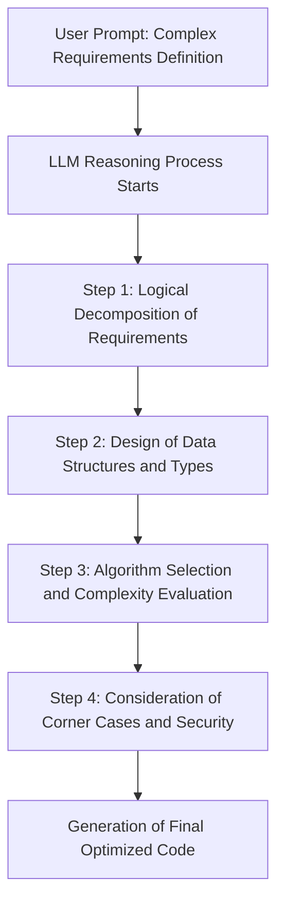
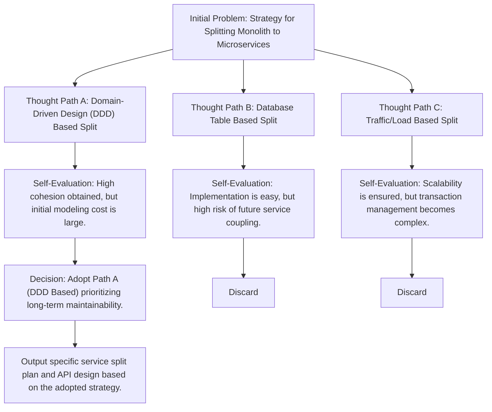
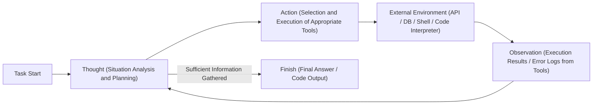
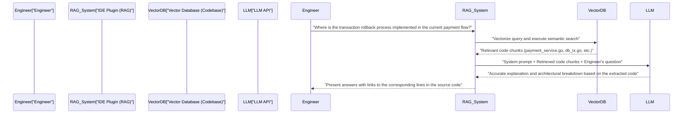

# Introduction: Why Engineers Should Learn Prompt Engineering

The world of software development is in the midst of an unprecedented paradigm shift due to the rapid evolution of Large Language Models (LLMs). It is no exaggeration to say that we are transitioning from "Software 2.0" (development via neural networks), as proposed by Andrej Karpathy, to "Software 3.0" (prompt-driven development via natural language).

With the spread of AI assistant tools using GitHub Copilot, Cursor, or various LLM APIs, the primary job of engineers is shifting from "writing code from scratch" to "designing instructions to make AI generate the intended code, and reviewing and integrating the generated code."

The most important skill in this new development methodology is **prompt engineering**. Prompt engineering is often talked about as a buzzword for non-engineers, such as "having a good chat with AI," but its essence is a **new form of programming language for non-deterministic computational systems**.

In this article, aimed at software engineers and architects, we will explain in extreme detail—with a volume of about 10,000 characters—from the mathematical and architectural foundations behind LLMs to advanced prompt engineering techniques such as Few-Shot, Chain-of-Thought, and ReAct, as well as how to integrate them into actual development workflows and APIs.

---

## 1. Basics and Mathematical Background of Large Language Models (LLMs)

To optimize prompts and consistently obtain the intended output, it is essential to understand the "contents of the black box" mathematically and structurally: how LLMs process and generate text and code internally. Most modern LLMs are auto-regressive language models using the Transformer architecture.

### 1.1 Tokenization and BPE

LLMs do not process raw text strings directly. Text is divided into smaller units called **Tokens**. Many models use an algorithm called Byte-Pair Encoding (BPE).

Understanding tokenization is important for engineers. This is because how indentations (spaces) and special symbols in programming languages are tokenized directly affects the quality of code generation. For example, in Python code generation, the number of whitespaces (four spaces or a tab) is often treated as an independent token, and failing to clarify indentation rules in the prompt can cause syntax errors.

### 1.2 Next Token Prediction

The fundamental task of an auto-regressive LLM is to predict the "most probable next single token" following a given input sequence (context). Expressed mathematically, this becomes a maximization problem of the following conditional probability.

$$ P(w_t | w_{1}, w_{2}, \dots, w_{t-1}) $$

Here, $w_i$ represents a token, and $t$ is the current time step. The model calculates the probability distribution of the next token from the input tokens through an internal neural network. The generated token is auto-regressively added as the input for the next step, and this process is repeated until an end token (such as `<EOS>`) is output.

### 1.3 Attention Mechanism and Context Window

The core of the Transformer architecture is the Self-Attention mechanism. This allows the model to calculate the dependencies between tokens that are far apart in a sequence.

$$ \text{Attention}(Q, K, V) = \text{softmax}\left(\frac{Q K^T}{\sqrt{d_k}}\right) V $$

Here, $Q$ (Query), $K$ (Key), and $V$ (Value) are matrices generated from the input representation, and $d_k$ is a scaling factor. What this formula means is the process of "calculating which past words (Key) the currently processed word (Query) should pay attention to, and incorporating that information (Value)."

Why is understanding this mechanism important in prompt engineering? It's because it directly ties to the concept of the **Context Window**. If the input prompt becomes too long, important instructions can get buried in the middle of the context, causing Attention weights to disperse, leading to a phenomenon known as "Lost in the middle". Instead of throwing massive documents or entire codebases into the prompt, you need to devise ways to accurately extract and pass only the necessary chunks.

### 1.4 Sampling Control via Temperature

In the output layer, the Softmax function is typically used to convert logits (raw model output) into a probability distribution. Here, **Temperature ($T$)** is introduced to control the diversity (randomness) of the generation.

$$ p_i = \frac{\exp(z_i / T)}{\sum_j \exp(z_j / T)} $$

- $z_i$ is the logit (score) of token $i$ in the vocabulary.
- When $T = 1.0$, it becomes a standard Softmax.
- As $T \to 0$, the probability distribution becomes sharper, and only the token with the highest probability is selected (deterministic, Greedy Decoding).
- When $T > 1.0$, the probability distribution flattens, making it easier for minor, usually unselected tokens to be chosen (increasing creativity).

**Practical Approach for Engineers:**
When having it perform code generation or JSON data extraction (Structured Output) via API, it is standard practice to set an extremely low value of $T=0.0 \sim 0.2$ to prevent hallucinations and increase reproducibility. On the other hand, for exploratory tasks such as architecture brainstorming or ideating naming conventions, set $T=0.7 \sim 1.0$.

---

## 2. Prompt Structural Architecture: System Prompt vs User Prompt

When building AI applications using OpenAI's API (such as GPT-4) or Anthropic's API (such as Claude), prompts are structured not as a single text block but as an array of messages. The most important among these is the separation of "System Prompt" and "User Prompt".

### 2.1 System Prompt: Global Constraints and Persona Definition

The system prompt defines **global constraints, persona (role), and fundamental behavior rules** for the LLM. To compare it to software design, it plays a role like the application's "environment variables" or "base class," or a container's "Dockerfile."

An excellent system prompt dramatically stabilizes output quality and format.

```text
# Example of a System Prompt
You are a world-class senior Go engineer, highly proficient in concurrent processing (Goroutine/Channel) design.
Generate your answers strictly following the rules below.

[Rules]
1. When providing code, always provide it as a complete, executable function.
2. Do not omit error handling; explicitly process errors with if err != nil following Go conventions.
3. Use bullet points for explanations outside code blocks, keeping them to 3 sentences or less.
4. If requested to implement something with security concerns (SQL injection, race conditions, etc.), propose safe alternatives.
5. Output format must be strictly explanations and Markdown code blocks only.
```

### 2.2 User Prompt: Injecting Temporary Tasks and Data

The user prompt provides specific tasks, questions, or input data to be processed. It corresponds to a "function call (passing arguments to a function)" executed within the context environment established by the system prompt.

```text
# Example of a User Prompt
Implement a function that asynchronously downloads images from a large list of URLs and saves them to the local disk.
The number of workers should be controllable via arguments, and the implementation should include timeout processing using the context (context.Context).
```

By robustly setting the system prompt, you can ensure output stability against highly variable user prompts injected by users (or other system components). It also functions as the first line of defense against "prompt injection" attacks from malicious user inputs.

---

## 3. Core Prompt Engineering Techniques

From here on, we will explain specific prompting paradigms to dramatically improve the accuracy of software development tasks.

### 3.1 Zero-Shot Prompting and Few-Shot Prompting

**Zero-Shot Prompting** is a technique where only task instructions are given, without any examples, to ask the model for an answer. For general requests like "Write a quicksort in Python," current advanced LLMs function adequately even with Zero-Shot.

However, when you want it to adhere to project-specific coding conventions or output a specific JSON schema, Zero-Shot has a high probability of breaking the format. **Few-Shot Prompting** solves this.

Few-Shot Prompting is a technique of presenting a few "input and expected output pairs (demonstrations)" within the prompt. It leverages a phenomenon called "In-Context Learning," where patterns are learned within the prompt's context without updating the model's parameters.

```text
# Example of Few-Shot Prompting (Log Analysis Task)
Parse the following raw logs and extract structured JSON objects.

Example 1:
Input: "[2023-10-01 10:00:05] ERROR [AuthService] Failed to authenticate user id=12345: Invalid password"
Output: {"timestamp": "2023-10-01T10:00:05Z", "level": "ERROR", "service": "AuthService", "message": "Failed to authenticate user", "user_id": 12345}

Example 2:
Input: "[2023-10-01 10:05:12] WARN [DBPool] Connection timeout approaching for query_id=987"
Output: {"timestamp": "2023-10-01T10:05:12Z", "level": "WARN", "service": "DBPool", "message": "Connection timeout approaching", "query_id": 987}

Task Input:
Input: "[2023-10-01 10:15:30] FATAL [PaymentGateway] API rate limit exceeded. Retry after 60s"
Output:
```

By giving examples in this way, the model implicitly learns the timestamp format (conversion to ISO 8601) and the naming convention for keys, enabling it to output perfect JSON.

### 3.2 Chain-of-Thought (CoT) and Zero-Shot CoT

A breakthrough regarding the reasoning capabilities of LLMs was **Chain-of-Thought (CoT)**. In tasks requiring complex logic (e.g., implementing complex algorithms, tracking difficult bugs, constructing regular expressions), making an LLM abruptly output the final code often leads to logical leaps and errors (hallucinations).

CoT is a technique that linguisticizes the intermediate reasoning process (thought process) before outputting the final answer. By making the model analyze the situation step-by-step itself, the context becomes richer with each token generated, dramatically improving the accuracy of the final conclusion.

The simplest and most powerful technique is **Zero-Shot CoT**, which appends the magic phrase "**Let's think step by step**" to the end of the prompt.

In development, we apply this concept and structure the prompt as follows.

```text
Create a React component that meets the following specifications.
[Specifications]...

Before generating the code, describe your thought process (inside <thinking> tags) using the following steps.
1. Identification of necessary States and design of data structures
2. Consideration of possible edge cases and error handling
3. Consideration of component decomposition units

After completing the thought process, write the final TypeScript code.
```



### 3.3 Tree of Thoughts (ToT)

A further extension of the CoT concept is **Tree of Thoughts (ToT)**. While CoT follows a single-path (linear) reasoning track, ToT is a technique that develops multiple reasoning paths (branches) in parallel like a search tree, has the model self-evaluate each path, and reaches the optimal solution while backtracking if necessary.

ToT is extremely effective for problems with large search spaces that are prone to falling into local optima, such as system architecture design, complex database schema design, or large-scale refactoring planning.



To implement ToT in a prompt, you instruct it: "Propose multiple approaches, evaluate the pros and cons of each, and then adopt and implement the most superior approach."

---

## 4. Agentic Workflow and ReAct (Reasoning and Acting)

The application of LLMs is rapidly evolving from single text input/output to the realm of **AI Agents**, which autonomously make plans and interact with external environments to accomplish tasks. The core paradigm of this agent architecture is **ReAct (Reasoning and Acting)**.

### 4.1 Concept of the ReAct Framework

While traditional LLMs could "think before answering (CoT)," they could not "act" to supplement their own knowledge gaps. The ReAct framework breaks through this limitation by making the LLM alternate between "Thought" and "Action".

The model analyzes the problem (Thought), and if it determines that information is lacking, it executes an external tool (Web search, database query, shell command, API call, etc.) (Action). It receives the execution result of the tool (Observation), advances its thoughts further using it as new context, and repeats this loop until it reaches the final answer (Finish).



### 4.2 Implementation via Function Calling (Tool Use)

The standard interface for incorporating ReAct into a system is **Function Calling (Tool Use)** provided by OpenAI and Anthropic.

The engineer passes the "definition of available tools (JSON schema)" to the LLM along with the system prompt. The LLM analyzes the prompt's context, and if it determines that a tool should be used, it outputs the "name of the function to call" and its "arguments in JSON" instead of normal text. The loop is formed by executing the function on the application side and returning the result to the LLM.

**Application Example in Development (Autonomous Debugging Agent):**
When building an agent that investigates the cause and generates a patch when a test fails in the CI/CD pipeline, provide the LLM with tools like the following.

1. `search_codebase(regex_pattern)`: Search code in the repository using regular expressions.
2. `view_file_content(file_path, start_line, end_line)`: Read the contents of a specified file.
3. `run_unit_test(test_file_path)`: Execute a specific unit test and retrieve the traceback.
4. `propose_patch(file_path, diff_content)`: Propose a fix patch.

The LLM autonomously reasons and acts as follows.
- **Thought**: Looking at the test log, a `KeyError: 'user_id'` occurs on line 45 of `src/auth.py`. I need to check the surrounding code.
- **Action**: `view_file_content(file_path="src/auth.py", start_line=30, end_line=60)`
- **Observation**: (The application reads the file content and returns it to the LLM)
- **Thought**: I see, validation is missing for cases where `user_id` is not included in the response JSON from the API. Let's create a patch to rewrite it with a safe `.get()` method.
- **Action**: `propose_patch(...)`

In this way, prompt engineering is elevated in dimension from "control of text generation" to "definition of tools and loop design of agents (orchestration)."

---

## 5. RAG (Retrieval-Augmented Generation) and Codebase Integration

One of the biggest weaknesses of LLMs is that they do not know "private information" or "latest information" that is not included in their pre-training data. If you ask about an internal private repository or proprietary API specifications, the LLM will either calmly tell lies (hallucinations) or can only give general answers.

The architecture that solves this is **RAG (Retrieval-Augmented Generation)**. RAG is a technology that combines information retrieval with the generative capabilities of LLMs.

### 5.1 Embeddings and Vector Search

At the root of RAG is a mathematical vector space model. Source code and internal documents are converted into high-dimensional vectors (e.g., arrays of 1536-dimensional floating-point numbers) by an Embedding model (e.g., `text-embedding-3-small`) and stored in a Vector Database.

When a user inputs a question (query), the query is also vectorized using the same model, and the **Cosine Similarity** is calculated between it and the document vectors in the database.

$$ \text{Cosine Similarity}(A, B) = \frac{A \cdot B}{\|A\| \|B\|} = \frac{\sum_{i=1}^{n} A_i B_i}{\sqrt{\sum_{i=1}^{n} A_i^2} \sqrt{\sum_{i=1}^{n} B_i^2}} $$

The top few code snippets or documents with high similarity (semantically close) are retrieved, and these are dynamically injected into the user prompt as "context."

### 5.2 Application of RAG to Development Workflows

By incorporating RAG into development tools, powerful features like the following are realized within the IDE.



As an important prompt engineering technique when building RAG for codebases, not only chunking the code but also including "summaries generated from each function's docstring or class's Abstract Syntax Tree (AST)" in the vectorization targets will drastically improve search accuracy.

---

## 6. Practical Use Cases and Advanced Prompt Examples in Engineering

We introduce practical use cases and prompt techniques on how to apply prompt engineering theory to automate and streamline daily development tasks.

### 6.1 Automating Code Review and Supplementing Static Analysis

Incorporate LLMs into the CI pipeline to automatically perform code reviews upon Pull Request (PR) creation. The goal is to have it point out business logic inconsistencies and design anti-patterns that Lint tools and static analysis tools cannot detect.

**Prompt Example (Requiring Structured Output):**
```text
You are a strict and experienced senior software engineer.
Analyze the provided Pull Request diff (Git Diff) and conduct a code review.

[Focus Areas of Review]
1. Security vulnerabilities (Injection, XSS, Authorization bypass, etc.)
2. Performance bottlenecks (N+1 query problem, inefficient loop calculations, etc.)
3. Maintainability and readability (Violation of SOLID principles, overly complex nesting, etc.)

[Constraints]
- Do not point out mere formatting violations (indentations, etc.) as that is the role of Lint tools.
- If there are no issues, do not force yourself to come up with points; return an empty array.
- The output must strictly follow the JSON schema below. Do not wrap it in Markdown backticks (```json).

[Expected JSON Output Format]
{
  "review_comments": [
    {
      "file_path": "string",
      "line_number": "integer",
      "severity": "High | Medium | Low",
      "issue_title": "string",
      "detailed_description": "string",
      "suggested_code_fix": "string"
    }
  ]
}

[Git Diff Data]
{{PR_DIFF}}
```

The points of this prompt are forcing the LLM's output into easily parsable JSON and clearly separating the roles of the Lint tool and the LLM (defining system boundaries).

### 6.2 "Defensive Prompting" in Zero-Shot Code Generation

Common problems that occur when having AI write code are phenomena like "arbitrarily importing non-existent libraries (hallucination)" or "omitting necessary variable definitions (omitted with `# write processing here`, etc.)." To prevent this, we use "Defensive Prompting," setting up strong guardrails within the prompt.

**Important Elements of Defensive Prompts:**
1. **Prohibition of Omissions:** "Do not omit code or use placeholders (`// ...` etc.); generate a complete file that can be copied, pasted, and executed directly."
2. **Prevention of Hallucinations:** "If standard libraries to fulfill the requirements do not exist, do not fabricate non-existent third-party libraries. In that case, clearly state that external library installation is necessary, and propose code using the most standard library (e.g., requests)."
3. **Requirement for Self-Containment:** "All variables and functions must be properly defined within the code block."

### 6.3 Automated Generation of Property-Based Tests / Edge Case Tests

For functions implemented by engineers, have the LLM find corner cases and generate test code. This is highly effective in eliminating human assumptions.

```text
The following Python function determines whether a given string is a valid IPv4 address.
Write a comprehensive pytest-based unit test suite for this function.

[Conditions]
- Exhaustively cover not only happy path test cases but also edge cases like the following:
  - Boundary values (0, 255, 256, etc.)
  - Different input types (integers, None, lists, etc.)
  - Strings containing spaces or special characters
  - Cases with incorrect number of dots (less than 3, 4 or more)
- Utilize parameterized testing (`@pytest.mark.parametrize`) to keep the test code concise.

[Function Code]
def is_valid_ipv4(ip_str):
    # Implementation...
```

---

## 7. Prompt Evaluation and LLMOps (Eval)

In the software engineering world, untested code is called legacy code. The exact same can be said for prompt engineering. It is extremely dangerous to deploy a "prompt that worked fine after trying it locally a few times" to a production environment.

Prompt behavior easily breaks due to foundation model upgrades or changes in the domain data handled. To prevent this, it is essential to build an **Evaluation (Eval)** mechanism (LLMOps) to quantitatively evaluate the prompt's output.

### 7.1 LLM-as-a-Judge (Evaluating LLMs with LLMs)

In tasks like code generation or text summarization, testing for an Exact Match is impossible. Classical natural language processing evaluation metrics (such as BLEU or ROUGE) are also insufficient for measuring semantic accuracy.

The current industry standard is the **LLM-as-a-Judge** approach, which uses powerful models (e.g., GPT-4o or Claude 3.5 Sonnet) as "Judges" to score the output results of the target LLM.

1. **Preparation of Test Sets**: Prepare tens to hundreds of pairs of input data and ideal outputs (or evaluation criteria).
2. **Execution**: Generate outputs against the test set using the prompt and model being evaluated.
3. **Evaluation**: Prepare an evaluation prompt (meta-prompt) and instruct the Judge LLM to "score on a scale of 1-5 whether the generated output meets the requirements."

This makes it possible to automatically detect regressions (performance degradation) when modifying prompts on the CI/CD pipeline. Prompt engineering is evolving from artisanal "prompt tweaking" to data-driven, reproducible "engineering."

---

## 8. Conclusion: Prompts are New Software Components

In the era of AI writing code, the "end of programming" is sometimes proclaimed, but the reality is different. The layer of abstraction required from engineers has simply gone up one level.

We once moved from assembly language to C, and then to high-level languages equipped with garbage collection, freeing ourselves from the hassle of memory management to focus on building more complex business logic. LLMs and prompt engineering are the next wave of abstraction following this.

1. **Understanding Architecture**: Understand the probabilistic nature of LLMs (auto-regression, Attention, Temperature) to control system non-determinism.
2. **Context Design**: Constraints via System Prompt and clear communication of intent leveraging Few-Shot/CoT.
3. **Agentic Thinking and Tool Integration**: Master the ReAct paradigm and utilize LLMs as system orchestrators.
4. **Continuous Evaluation**: Version control prompts as part of the code and continue to improve them in a test-driven manner through Eval.

By mastering these principles, prompts become not just text strings, but robust, scalable software components. We hope you will incorporate the advanced prompt engineering techniques explained in this article into your own development workflows and products, and thrive as an engineer leading the next generation of "Software 3.0."

---
*Generated using Prompt Engineering Techniques.*
