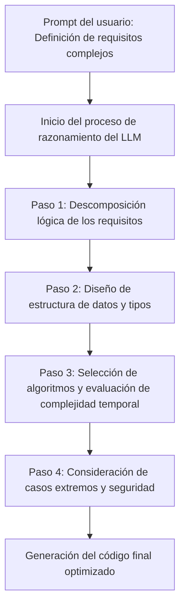
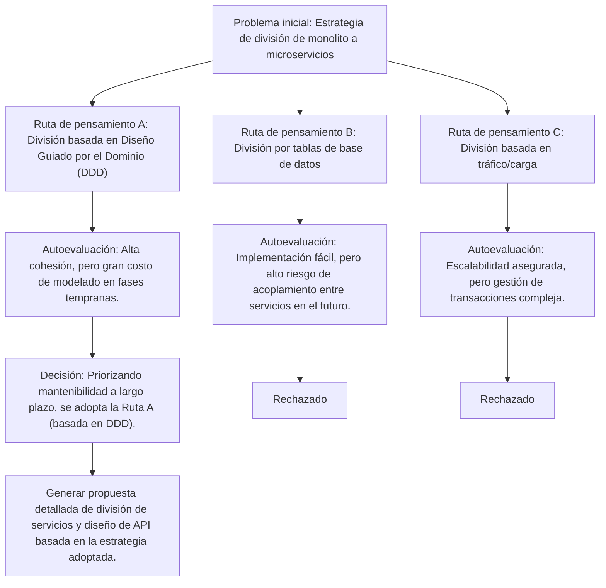
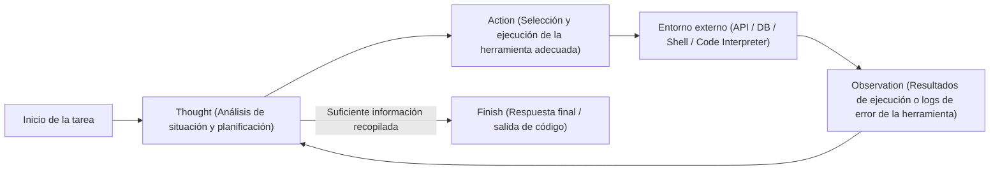
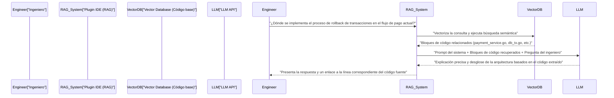

# Introducción: Por qué los ingenieros deben aprender la ingeniería de prompts

El mundo del desarrollo de software se encuentra en medio de un cambio de paradigma sin precedentes debido a la rápida evolución de los Modelos de Lenguaje Grande (LLM). No es exagerado decir que estamos haciendo la transición del "Software 2.0 (desarrollo basado en redes neuronales)" propuesto por Andrejs Karpathy, al "Software 3.0 (desarrollo impulsado por prompts en lenguaje natural)".

Con la popularización de herramientas de asistencia de IA como GitHub Copilot, Cursor o varias API de LLM, la tarea principal de los ingenieros está cambiando de "escribir código desde cero" a "diseñar instrucciones para que la IA genere el código previsto, y luego revisar e integrar el código generado".

La habilidad más importante en esta nueva metodología de desarrollo es la **ingeniería de prompts**. La ingeniería de prompts a menudo se considera una palabra de moda para no ingenieros, como "charlar hábilmente con la IA", pero su esencia es **una nueva forma de lenguaje de programación para sistemas computacionales no deterministas (Non-deterministic)**.

En este artículo, dirigido a ingenieros de software y arquitectos, explicaremos con extremo detalle (alrededor de 10,000 caracteres) desde los fundamentos matemáticos y arquitectónicos detrás de los LLM, hasta técnicas avanzadas de ingeniería de prompts como Few-Shot, Chain-of-Thought y ReAct, y cómo integrarlas en flujos de trabajo de desarrollo reales y APIs.

---

## 1. Fundamentos y antecedentes matemáticos de los Modelos de Lenguaje Grande (LLM)

Para optimizar los prompts y obtener de manera estable los resultados deseados, es esencial comprender matemática y estructuralmente el "interior de la caja negra": cómo el LLM procesa y genera texto o código internamente. La mayoría de los LLM modernos son modelos de lenguaje autorregresivos (Auto-regressive) que utilizan la arquitectura Transformer.

### 1.1 Tokenización (Tokenization) y BPE

Los LLM no procesan cadenas de texto en bruto directamente. El texto se divide en unidades pequeñas llamadas **tokens (Token)**. Muchos modelos utilizan un algoritmo llamado Byte-Pair Encoding (BPE).

Comprender la tokenización es importante para los ingenieros. Esto se debe a que la forma en que se tokeniza la sangría (espacios) y los símbolos especiales en los lenguajes de programación afecta directamente la calidad del código generado. Por ejemplo, en la generación de código Python, el número de espacios (ya sean 4 espacios o una tabulación) a menudo se trata como un token independiente, y si las reglas de sangría no se especifican claramente en el prompt, puede ser causa de errores de sintaxis.

### 1.2 Predicción del siguiente token (Next Token Prediction)

La tarea fundamental de un LLM autorregresivo es predecir "el siguiente 1 token más probable" que sigue a una secuencia de entrada dada (contexto). Expresado matemáticamente, esto se convierte en un problema de maximización de la probabilidad condicional de la siguiente manera:

$$ P(w_t | w_{1}, w_{2}, \dots, w_{t-1}) $$

Aquí, $w_i$ representa un token y $t$ es el paso de tiempo (time step) actual. El modelo calcula la distribución de probabilidad del siguiente token a partir del conjunto de tokens de entrada a través de su red neuronal interna. El token generado se agrega autorregresivamente como entrada para el siguiente paso, y este proceso se repite hasta que se emite un token de finalización (como `<EOS>`).

### 1.3 Mecanismo de Atención (Attention Mechanism) y Ventana de Contexto

El núcleo de la arquitectura Transformer es el mecanismo de Autoatención (Self-Attention). Esto permite que el modelo calcule las dependencias entre tokens que están muy separados en una secuencia.

$$ \text{Attention}(Q, K, V) = \text{softmax}\left(\frac{Q K^T}{\sqrt{d_k}}\right) V $$

Aquí, $Q$ (Query), $K$ (Key) y $V$ (Value) son matrices generadas a partir de la representación de entrada, y $d_k$ es un factor de escala. Lo que significa esta fórmula es un proceso en el que "se calcula a qué palabra pasada (Key) debe prestar atención (Attention) la palabra que se está procesando actualmente (Query), y se incorpora esa información (Value)".

¿Por qué es importante comprender este mecanismo en la ingeniería de prompts? Porque está directamente relacionado con el concepto de **ventana de contexto (Context Window)**. Si el prompt de entrada es demasiado largo, las instrucciones importantes pueden quedar enterradas en medio del contexto, lo que dispersa el peso de la Atención y provoca un fenómeno llamado "Lost in the middle" (pérdida de información intermedia). En lugar de enviar documentos masivos o bases de código enteras en un prompt, se requiere la habilidad de extraer y pasar con precisión solo los fragmentos necesarios.

### 1.4 Control de muestreo mediante el parámetro de temperatura (Temperature)

En la capa de salida, generalmente se utiliza la función Softmax para convertir los logits (salida en bruto del modelo) en una distribución de probabilidad. Aquí, se introduce la **Temperatura (parámetro de temperatura $T$)** para controlar la diversidad (aleatoriedad) de la generación.

$$ p_i = \frac{\exp(z_i / T)}{\sum_j \exp(z_j / T)} $$

- $z_i$ es el logit (puntuación) del token $i$ en el vocabulario.
- Cuando $T = 1.0$, es un Softmax estándar.
- A medida que $T \to 0$, la distribución de probabilidad se vuelve más nítida y solo se seleccionan los tokens con la probabilidad más alta (determinista, Greedy Decoding).
- Cuando $T > 1.0$, la distribución de probabilidad se aplana y los tokens menores que normalmente no se eligen tienen más probabilidades de ser seleccionados (aumenta la creatividad).

**Enfoque práctico para ingenieros:**
Cuando se utiliza una API para generar código o extraer datos JSON (Structured Output), la práctica habitual es establecer un valor extremadamente bajo de $T=0.0 \sim 0.2$ para prevenir alucinaciones (hallucinations) y mejorar la reproducibilidad. Por otro lado, en tareas exploratorias como la lluvia de ideas de arquitectura o la ideación de convenciones de nomenclatura, se establece en $T=0.7 \sim 1.0$.

---

## 2. Arquitectura de estructura del prompt: System Prompt vs User Prompt

Al construir aplicaciones de IA utilizando la API de OpenAI (GPT-4, etc.) o la API de Anthropic (Claude, etc.), un prompt no es un solo bloque de texto, sino que se estructura como un arreglo de mensajes. Lo más importante en esto es la separación entre "System Prompt (Prompt del sistema)" y "User Prompt (Prompt del usuario)".

### 2.1 Prompt del sistema: Restricciones globales y definición de la persona

El prompt del sistema define las **restricciones globales, la persona (rol) y las reglas básicas de comportamiento** para el LLM. Si lo comparamos con el diseño de software, juega un papel similar a las "variables de entorno" o la "clase base" de una aplicación, o el "Dockerfile" de un contenedor.

Un buen prompt del sistema estabiliza drásticamente la calidad y el formato de la salida.

```text
# Ejemplo de System Prompt
Eres un ingeniero de Go Senior de primer nivel mundial, y eres un experto en diseño de procesamiento concurrente (Goroutine/Channel).
Genera tu respuesta siguiendo estrictamente las siguientes reglas.

[Reglas]
1. Al proporcionar código, asegúrate de proporcionarlo siempre como una función completa y ejecutable.
2. No omitas el manejo de errores; procésalo explícitamente con `if err != nil` siguiendo las convenciones de Go.
3. Las explicaciones fuera de los bloques de código deben usar viñetas y mantenerse dentro de 3 oraciones.
4. Si se solicita una implementación con problemas de seguridad (inyección SQL, condiciones de carrera, etc.), debes proponer una alternativa segura.
5. El formato de salida debe ser únicamente la explicación y el bloque de código Markdown.
```

### 2.2 Prompt del usuario: Tareas temporales e inyección de datos

El prompt del usuario proporciona la tarea específica, pregunta o datos de entrada a procesar. Equivale a una "llamada a función (pasar argumentos a una función)" que se ejecuta dentro del entorno de contexto construido por el prompt del sistema.

```text
# Ejemplo de User Prompt
Implementa una función que descargue imágenes de forma asíncrona a partir de una gran lista de URLs y las guarde en el disco local.
Permite que la cantidad de workers se controle mediante un argumento, e incluye en la implementación el procesamiento de tiempo de espera (timeout) utilizando el contexto (context.Context).
```

Al configurar sólidamente el prompt del sistema, es posible garantizar la estabilidad de la salida frente a prompts de usuario altamente variables inyectados por el usuario (u otros componentes del sistema). Además, funciona como una primera línea de defensa contra ataques de "inyección de prompts" por entradas maliciosas de los usuarios.

---

## 3. Conjunto de técnicas básicas de ingeniería de prompts

A partir de aquí, explicaremos paradigmas específicos de prompting para mejorar drásticamente la precisión de las tareas de desarrollo de software.

### 3.1 Zero-Shot Prompting y Few-Shot Prompting

**Zero-Shot Prompting** es una técnica que solo proporciona la instrucción de la tarea y pide al modelo una respuesta sin dar ningún ejemplo. Para solicitudes generales como "Escribe un QuickSort en Python", los LLMs avanzados actuales funcionan lo suficientemente bien incluso en Zero-Shot.

Sin embargo, si deseas que el modelo siga convenciones de codificación específicas del proyecto o genere un esquema JSON particular, es muy probable que el formato se rompa con Zero-Shot. Lo que resuelve esto es el **Few-Shot Prompting**.

Few-Shot Prompting es una técnica que presenta unos cuantos "pares de entrada y salida esperada (demostraciones)" dentro del prompt. Aprovecha un fenómeno llamado "In-Context Learning (aprendizaje en contexto)", donde el modelo aprende patrones dentro del contexto del prompt sin actualizar sus parámetros.

```text
# Ejemplo de Few-Shot Prompting (Tarea de análisis de logs)
Analiza los siguientes logs en bruto y extrae objetos JSON estructurados.

Ejemplo 1:
Entrada: "[2023-10-01 10:00:05] ERROR [AuthService] Failed to authenticate user id=12345: Invalid password"
Salida: {"timestamp": "2023-10-01T10:00:05Z", "level": "ERROR", "service": "AuthService", "message": "Failed to authenticate user", "user_id": 12345}

Ejemplo 2:
Entrada: "[2023-10-01 10:05:12] WARN [DBPool] Connection timeout approaching for query_id=987"
Salida: {"timestamp": "2023-10-01T10:05:12Z", "level": "WARN", "service": "DBPool", "message": "Connection timeout approaching", "query_id": 987}

Entrada de la tarea:
Entrada: "[2023-10-01 10:15:30] FATAL [PaymentGateway] API rate limit exceeded. Retry after 60s"
Salida:
```

Al proporcionar ejemplos de esta manera, el modelo aprende implícitamente el formato del `timestamp` (conversión a ISO 8601) y las reglas de nomenclatura de las claves, y producirá un JSON perfecto.

### 3.2 Chain-of-Thought (CoT) y Zero-Shot CoT

Un avance significativo en la capacidad de razonamiento de los LLM fue el **Chain-of-Thought (CoT: Cadena de Pensamiento)**. En tareas que requieren lógica compleja (ej. implementación de algoritmos complejos, seguimiento de errores difíciles, construcción de expresiones regulares, etc.), si se le pide al LLM que emita el código final directamente, es probable que ocurran saltos lógicos o errores (alucinaciones).

CoT es una técnica que hace que el modelo verbalice el proceso de razonamiento intermedio (proceso de pensamiento) antes de generar la respuesta final. Al hacer que el modelo mismo analice la situación paso a paso, el contexto se enriquece con cada token generado y la precisión de la conclusión final mejora drásticamente.

La técnica más simple y poderosa es el **Zero-Shot CoT**, que consiste en agregar la palabra mágica "**Pensemos paso a paso (Let's think step by step)**" al final del prompt.

En el desarrollo, aplicamos este concepto y estructuramos los prompts de la siguiente manera:

```text
Crea un componente de React que cumpla con las siguientes especificaciones.
[Especificaciones]...

Antes de generar el código, describe tu proceso de pensamiento (dentro de las etiquetas <thinking>) siguiendo estos pasos.
1. Identificación del estado (State) necesario y diseño de la estructura de datos.
2. Consideración de casos extremos posibles y manejo de errores.
3. Consideración de la unidad de división del componente.

Una vez completado el proceso de pensamiento, escribe el código final en TypeScript.
```



### 3.3 Tree of Thoughts (ToT)

Una extensión del concepto de CoT es el **Tree of Thoughts (ToT)**. Mientras que CoT sigue una ruta de razonamiento única (lineal), ToT expande múltiples rutas de razonamiento (ramas) en paralelo como un árbol de búsqueda, haciendo que el modelo autoevalúe cada ruta, realizando un retroceso (backtracking) y llegando a la solución óptima.

ToT es extremadamente efectivo para problemas con un gran espacio de búsqueda y propensos a caer en óptimos locales, como el diseño de arquitectura de sistemas, diseño de esquemas de bases de datos complejos o planes de refactorización a gran escala.



Para implementar ToT en un prompt, puedes instruir: "Propón múltiples enfoques, evalúa las ventajas y desventajas de cada uno, y luego adopta e implementa el mejor enfoque".

---

## 4. Flujo de trabajo Agente (Agentic Workflow) y ReAct (Reasoning and Acting)

La aplicación de los LLM está evolucionando rápidamente de simples entradas y salidas de texto a la era de los **Agentes de IA (AI Agents)**, que planifican de manera autónoma e interactúan con entornos externos para completar tareas. El paradigma central de esta arquitectura de agentes es **ReAct (Reasoning and Acting)**.

### 4.1 Concepto del framework ReAct

Los LLM tradicionales podían "pensar antes de responder (CoT)", pero no podían "actuar" para compensar su falta de conocimiento. El framework ReAct supera esta limitación al hacer que el LLM alterne entre el "Pensamiento (Thought)" y la "Acción (Action)".

El modelo analiza el problema (Thought), y si determina que le falta información, ejecuta una herramienta externa (búsqueda web, consulta de base de datos, comando de shell, llamada a API, etc.) (Action). Recibe el resultado de la ejecución de la herramienta (Observation), lo utiliza como un nuevo contexto para seguir pensando, y repite este ciclo hasta llegar a la respuesta final (Finish).



### 4.2 Implementación mediante Function Calling (Uso de herramientas)

La interfaz estándar para integrar ReAct en sistemas es el **Function Calling (Llamada a funciones / Uso de herramientas)** proporcionado por OpenAI y Anthropic.

El ingeniero proporciona al LLM "una definición de las herramientas disponibles (esquema JSON)" junto con el prompt del sistema. El LLM analiza el contexto del prompt, y si decide que debe usar una herramienta, emite el "nombre de la función a llamar" y el "JSON de sus argumentos" en lugar de texto normal. La aplicación ejecuta esa función y devuelve el resultado al LLM, cerrando así el ciclo.

**Ejemplo de aplicación en desarrollo (Agente de depuración autónomo):**
Si quieres construir un agente que investigue la causa y genere un parche cuando falla una prueba en un pipeline de CI/CD, proporcionarías las siguientes herramientas al LLM:

1. `search_codebase(regex_pattern)`: Busca en el código del repositorio con una expresión regular.
2. `view_file_content(file_path, start_line, end_line)`: Lee el contenido de un archivo especificado.
3. `run_unit_test(test_file_path)`: Ejecuta una prueba unitaria específica y obtiene el traceback.
4. `propose_patch(file_path, diff_content)`: Propone un parche con la corrección.

El LLM razonará y actuará de manera autónoma de la siguiente manera:
- **Thought**: Mirando el log de la prueba, hay un `KeyError: 'user_id'` en la línea 45 de `src/auth.py`. Necesito revisar el código circundante.
- **Action**: `view_file_content(file_path="src/auth.py", start_line=30, end_line=60)`
- **Observation**: (La aplicación lee el contenido del archivo y lo devuelve al LLM)
- **Thought**: Ya veo, falta la validación del caso donde el JSON de respuesta de la API no contiene `user_id`. Crearé un parche para reescribirlo usando el método seguro `.get()`.
- **Action**: `propose_patch(...)`

De esta manera, la ingeniería de prompts se eleva de "controlar la generación de texto" a la "definición de herramientas y orquestación del ciclo del agente".

---

## 5. RAG (Retrieval-Augmented Generation) e integración de bases de código

Una de las mayores debilidades de los LLM es que no conocen "información privada" o "información más reciente" que no estaba incluida en sus datos de preentrenamiento. Si preguntas sobre un repositorio interno privado o especificaciones de API patentadas, el LLM mentirá con tranquilidad (alucinación) o solo podrá dar una respuesta general.

La arquitectura que resuelve esto es **RAG (Generación Aumentada por Recuperación)**. RAG es una tecnología que combina la recuperación de información (Retrieval) y la capacidad de generación del LLM (Generation).

### 5.1 Embeddings y Búsqueda Vectorial

En el fondo de RAG se encuentra un modelo matemático de espacio vectorial. El código fuente y los documentos internos se convierten en vectores de alta dimensionalidad (por ejemplo, un arreglo de 1536 números de punto flotante) mediante un modelo de Embedding (por ejemplo, `text-embedding-3-small`) y se almacenan en una base de datos vectorial (Vector Database).

Cuando un usuario introduce una pregunta (consulta o query), la consulta también se vectoriza utilizando el mismo modelo, y se calcula la **similitud de coseno (Cosine Similarity)** con los vectores de documentos en la base de datos.

$$ \text{Cosine Similarity}(A, B) = \frac{A \cdot B}{\|A\| \|B\|} = \frac{\sum_{i=1}^{n} A_i B_i}{\sqrt{\sum_{i=1}^{n} A_i^2} \sqrt{\sum_{i=1}^{n} B_i^2}} $$

Se obtienen los fragmentos de código o documentos con la mayor similitud (los más cercanos semánticamente), y estos se inyectan dinámicamente en el prompt del usuario como "contexto".

### 5.2 Aplicación de RAG al flujo de trabajo de desarrollo

Al integrar RAG en herramientas de desarrollo, se habilitan funcionalidades potentes dentro del IDE como:



Una técnica de ingeniería de prompts clave al construir RAG para un código base es que la precisión de búsqueda mejora drásticamente si, en lugar de simplemente fragmentar el código, también se incluyen en la vectorización los "resúmenes generados a partir de los Docstrings de cada función y del árbol de sintaxis abstracta (AST) de las clases".

---

## 6. Casos de uso prácticos en ingeniería y ejemplos avanzados de prompts

Presentamos casos de uso prácticos y técnicas de prompts sobre cómo aplicar la teoría de la ingeniería de prompts para automatizar y agilizar las tareas de desarrollo diarias.

### 6.1 Automatización de revisión de código y complemento de análisis estático

Integrar LLMs en la canalización de CI para realizar automáticamente revisiones de código cuando se crea un Pull Request (PR). El objetivo es que señale inconsistencias en la lógica de negocio y antipatrones de diseño que las herramientas de Lint o análisis estático no pueden detectar.

**Ejemplo de prompt (Solicitando salida estructurada):**
```text
Eres un ingeniero de software senior estricto y experimentado.
Analiza la diferencia del Pull Request (Git Diff) proporcionado y realiza una revisión de código.

[Áreas de enfoque de la revisión]
1. Vulnerabilidades de seguridad (Inyección, XSS, derivación de autorización, etc.)
2. Cuellos de botella en rendimiento (Problema de consultas N+1, cálculos de bucle ineficientes, etc.)
3. Mantenibilidad y legibilidad (Violaciones de principios SOLID, anidamiento demasiado complejo, etc.)

[Restricciones]
- No señales simples infracciones de formato (como sangrías), ya que esa es la función de una herramienta de Lint.
- Si no hay problemas, no fuerces comentarios; devuelve un arreglo vacío.
- La salida DEBE seguir estrictamente el siguiente esquema JSON. No la encierres en comillas invertidas de Markdown (```json).

[Formato de salida JSON esperado]
{
  "review_comments": [
    {
      "file_path": "string",
      "line_number": "integer",
      "severity": "High | Medium | Low",
      "issue_title": "string",
      "detailed_description": "string",
      "suggested_code_fix": "string"
    }
  ]
}

[Datos Git Diff]
{{PR_DIFF}}
```

El punto clave de este prompt es forzar la salida del LLM a un JSON fácil de parsear, y definir claramente la división entre el rol de la herramienta Lint y el rol del LLM (definición de los límites del sistema).

### 6.2 "Prompting defensivo (Defensive Prompting)" en la generación de código Zero-Shot

Un problema común que ocurre al hacer que la IA escriba código son fenómenos como "importar bibliotecas inexistentes (alucinación)" y "omitir definiciones de variables necesarias (por ejemplo, omitir con `# Escribe el procesamiento aquí`)". Para evitar esto, configuramos fuertes medidas de seguridad dentro del prompt mediante el "Prompting defensivo".

**Elementos importantes de un prompt defensivo:**
1. **Prohibición de omisiones:** "No omitas el código ni uses marcadores de posición (por ejemplo, `// ...`); genera un archivo completo que se pueda copiar, pegar y ejecutar directamente."
2. **Prevención de alucinaciones:** "Si no existe una biblioteca estándar para cumplir con los requisitos, no inventes una biblioteca de terceros inexistente por tu cuenta. En ese caso, especifica que es necesaria la instalación de una biblioteca externa y propón un código usando la biblioteca más estándar (ej: requests)."
3. **Requisito de autosuficiencia:** "Todas las variables y funciones deben estar adecuadamente definidas dentro del bloque de código."

### 6.3 Generación automática de pruebas basadas en propiedades / pruebas de casos extremos

Se pide al LLM que encuentre casos extremos para una función implementada por un ingeniero y genere código de prueba. Es muy efectivo para eliminar los sesgos humanos.

```text
La siguiente función en Python determina si una cadena dada es una dirección IPv4 válida.
Escribe un conjunto de pruebas unitarias completas basadas en pytest para esta función.

[Condiciones]
- No solo cubras los casos de prueba exitosos, sino también casos extremos (edge cases) como:
  - Valores límite (0, 255, 256, etc.)
  - Entradas de diferentes tipos (entero, None, lista, etc.)
  - Cadenas con espacios o caracteres especiales
  - Casos con número incorrecto de puntos (menos de 3, 4 o más)
- Utiliza pruebas parametrizadas (`@pytest.mark.parametrize`) para mantener el código de prueba conciso.

[Código de la función]
def is_valid_ipv4(ip_str):
    # Implementación...
```

---

## 7. Evaluación de prompts y LLMOps (Eval)

En el mundo de la ingeniería de software, el código no probado se denomina código heredado (legacy code). Lo mismo ocurre con la ingeniería de prompts. Implementar en producción un "prompt que probaste un par de veces localmente y funcionó bien" es extremadamente peligroso.

A medida que se actualizan los modelos fundacionales o cambian los datos del dominio procesado, el comportamiento del prompt se rompe fácilmente. Para evitar esto, es fundamental construir un sistema de **Evaluación (Eval)** para evaluar cuantitativamente el resultado del prompt (LLMOps).

### 7.1 LLM-as-a-Judge (Evaluación de LLM por LLM)

En tareas como la generación de código o el resumen de textos, no es posible realizar pruebas de coincidencia exacta (Exact Match). Las métricas clásicas de procesamiento de lenguaje natural (BLEU o ROUGE) también se quedan cortas para medir la precisión del significado.

El estándar actual de la industria es utilizar un modelo potente (por ejemplo, GPT-4o o Claude 3.5 Sonnet) como "Juez (Judge)" para evaluar el resultado generado por el LLM objetivo, una técnica llamada **LLM-as-a-Judge**.

1. **Preparación del conjunto de pruebas**: Prepara desde decenas hasta cientos de pares de datos de entrada y salidas ideales (o criterios de evaluación).
2. **Ejecución**: Genera las salidas contra el conjunto de pruebas usando el prompt y el modelo a evaluar.
3. **Evaluación**: Prepara un prompt de evaluación (meta-prompt) e instruye al Judge LLM a "calificar en una escala de 1 a 5 si la salida generada cumple con los requisitos".

Esto permite detectar regresiones de rendimiento (degradación) de forma automática en la canalización CI/CD al modificar el prompt. La ingeniería de prompts está evolucionando de un "ajuste artesanal de prompts" a una "ingeniería" estructurada, impulsada por datos y reproducible.

---

## 8. Conclusión: El prompt es un nuevo componente de software

En una era donde la IA escribe código, a menudo se proclama el "fin de la programación", pero la realidad es diferente. Es solo que la capa de abstracción requerida de los ingenieros ha subido un nivel.

En el pasado, al pasar del lenguaje ensamblador al lenguaje C, y luego a los lenguajes de alto nivel con recolección de basura, fuimos liberados de la molestia de la gestión de memoria y pudimos centrarnos en construir lógica de negocio más compleja. Los LLMs y la ingeniería de prompts son la siguiente ola de abstracción después de eso.

1. **Comprender la arquitectura**: Entender la naturaleza probabilística de los LLM (autorregresión, Atención, Temperatura) y controlar el no determinismo del sistema.
2. **Diseño de contexto**: Transmitir intenciones claras aprovechando restricciones mediante System Prompts y técnicas como Few-Shot/CoT.
3. **Pensamiento de agente e integración de herramientas**: Utilizar el paradigma ReAct para aprovechar el LLM como orquestador del sistema.
4. **Evaluación continua**: Controlar versiones de los prompts como parte del código y continuar mejorándolos impulsados por pruebas a través de Evals.

Al dominar estos principios, los prompts dejarán de ser simples cadenas de texto y se convertirán en componentes de software robustos y escalables. Esperamos que integren las técnicas avanzadas de ingeniería de prompts explicadas en este artículo en sus flujos de trabajo de desarrollo y productos, y prosperen como ingenieros que lideran el "Software 3.0" de la próxima generación.

---
*Generated using Prompt Engineering Techniques.*
