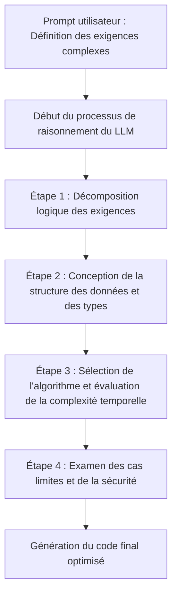
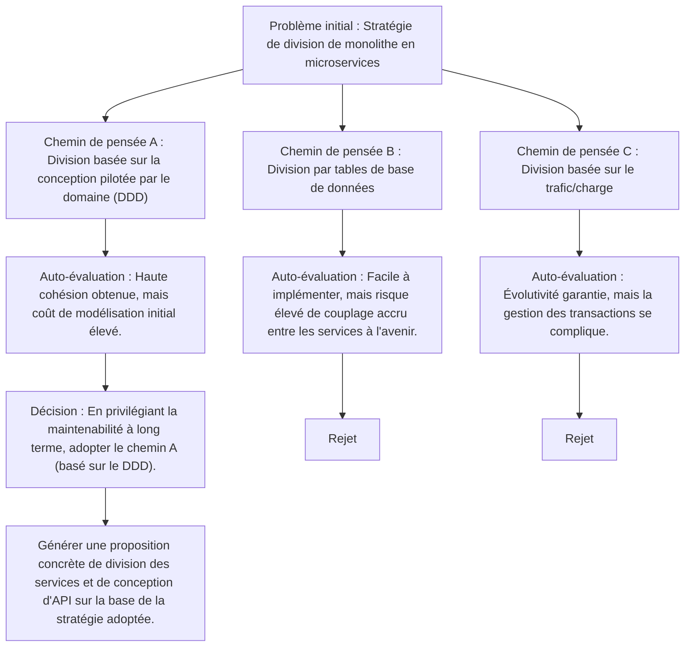
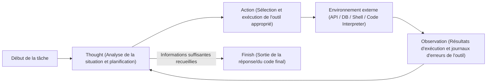
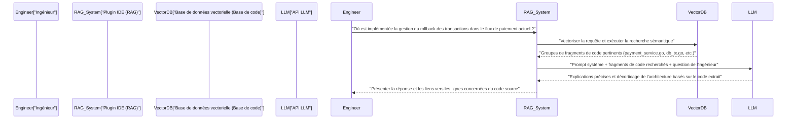

# Introduction : Pourquoi les ingénieurs devraient-ils apprendre l'ingénierie des prompts

Le monde du développement logiciel est au cœur d'un changement de paradigme sans précédent en raison de l'évolution rapide des grands modèles de langage (LLM). Il n'est pas exagéré de dire que nous passons du « Software 2.0 (développement par réseaux de neurones) » proposé par Andrejs Karpathy au « Software 3.0 (développement piloté par les prompts en langage naturel) ».

Avec la généralisation des outils d'assistance basés sur l'IA tels que GitHub Copilot, Cursor ou diverses API LLM, le travail principal des ingénieurs passe de « l'écriture de code à partir de zéro » à « la conception d'instructions pour que l'IA génère le code souhaité, puis l'examen et l'intégration du code généré ».

La compétence la plus importante dans cette nouvelle méthode de développement est l'**ingénierie des prompts**. L'ingénierie des prompts a tendance à être considérée comme un mot à la mode destiné aux non-ingénieurs pour « bien discuter avec l'IA », mais son essence est un **nouveau type de langage de programmation pour les systèmes informatiques non déterministes**.

Dans cet article, destiné aux ingénieurs logiciels et aux architectes, nous expliquerons en détail, avec un volume d'environ 10 000 caractères, depuis les bases mathématiques et architecturales qui sous-tendent les LLM jusqu'aux techniques avancées d'ingénierie des prompts telles que Few-Shot, Chain-of-Thought et ReAct, ainsi que la manière de les intégrer dans les flux de travail de développement réels et les API.

---

## 1. Bases et contexte mathématique des grands modèles de langage (LLM)

Pour optimiser les prompts et obtenir de manière stable les résultats escomptés, il est essentiel de comprendre de manière mathématique et structurelle la « boîte noire », c'est-à-dire comment les LLM traitent et génèrent en interne le texte et le code. La plupart des LLM modernes sont des modèles de langage autorégressifs (Auto-regressive) utilisant l'architecture Transformer.

### 1.1 Tokenisation (Tokenization) et BPE

Les LLM ne traitent pas directement les chaînes de texte brut. Le texte est divisé en petites unités appelées **jetons (Tokens)**. De nombreux modèles utilisent un algorithme appelé Byte-Pair Encoding (BPE).

Comprendre la tokenisation est important pour les ingénieurs. En effet, la manière dont l'indentation (espaces) et les symboles spéciaux dans les langages de programmation sont tokenisés est directement liée à la qualité de la génération de code. Par exemple, dans la génération de code Python, le nombre d'espaces (quatre espaces ou une tabulation) est souvent traité comme un jeton indépendant, et si les règles d'indentation ne sont pas claires dans le prompt, cela peut provoquer des erreurs de syntaxe.

### 1.2 Prédiction du jeton suivant (Next Token Prediction)

La tâche fondamentale d'un LLM autorégressif est de prédire le « prochain jeton unique le plus probable » à la suite d'une séquence d'entrée donnée (contexte). Mathématiquement, cela devient un problème de maximisation de probabilité conditionnelle :

$$ P(w_t | w_{1}, w_{2}, \dots, w_{t-1}) $$

Ici, $w_i$ représente un jeton, et $t$ est le pas de temps actuel. Le modèle calcule la distribution de probabilité du jeton suivant à partir des jetons d'entrée via son réseau de neurones interne. Le jeton généré est ajouté de manière autorégressive comme entrée pour l'étape suivante, et ce processus est répété jusqu'à ce qu'un jeton de fin (comme `<EOS>`) soit produit.

### 1.3 Mécanisme d'attention (Attention Mechanism) et fenêtre de contexte

Le cœur de l'architecture Transformer est le mécanisme de Self-Attention. Cela permet au modèle de calculer les dépendances entre des jetons très éloignés dans la séquence.

$$ \text{Attention}(Q, K, V) = \text{softmax}\left(\frac{Q K^T}{\sqrt{d_k}}\right) V $$

Ici, $Q$ (Query), $K$ (Key) et $V$ (Value) sont des matrices générées à partir des représentations d'entrée, et $d_k$ est un facteur de mise à l'échelle. Cette formule signifie le processus de « calcul du mot passé (Key) sur lequel le mot en cours de traitement (Query) doit se concentrer (Attention), et d'intégration de cette information (Value) ».

Pourquoi la compréhension de ce mécanisme est-elle importante dans l'ingénierie des prompts ? C'est parce qu'elle est directement liée au concept de **fenêtre de contexte (Context Window)**. Si le prompt d'entrée devient trop long, des instructions importantes peuvent se perdre au milieu du contexte, dispersant le poids de l'Attention, ce qui provoque le phénomène de « Lost in the middle » (perte d'information au milieu). Au lieu de fournir de longs documents ou des bases de code entières dans le prompt, il faut s'efforcer d'extraire et de ne transmettre que les fragments nécessaires.

### 1.4 Contrôle de l'échantillonnage par le paramètre de température (Temperature)

Dans la couche de sortie, la fonction Softmax est généralement utilisée pour convertir les logits (sorties brutes du modèle) en une distribution de probabilité. Ici, la **Température (paramètre de température $T$)** est introduite pour contrôler la diversité (caractère aléatoire) de la génération.

$$ p_i = \frac{\exp(z_i / T)}{\sum_j \exp(z_j / T)} $$

- $z_i$ est le logit (score) du jeton $i$ dans le vocabulaire.
- Lorsque $T = 1.0$, c'est le Softmax standard.
- Plus $T \to 0$ s'approche de 0, plus la distribution de probabilité devient nette, et seul le jeton le plus probable a tendance à être choisi (Déterministe, Greedy Decoding).
- Lorsque $T > 1.0$, la distribution de probabilité s'aplatit, et les jetons mineurs qui ne sont généralement pas choisis deviennent plus susceptibles d'être sélectionnés (augmentation de la créativité).

**Approche pratique pour les ingénieurs :**
Lors de la génération de code ou de l'extraction de données JSON (Structured Output) via une API, il est courant de définir une valeur extrêmement basse pour $T$, comme $T=0.0 \sim 0.2$, pour éviter les hallucinations et augmenter la reproductibilité. En revanche, pour des tâches exploratoires comme le brainstorming architectural ou la recherche d'idées pour les conventions de nommage, on la fixe entre $T=0.7 \sim 1.0$.

---

## 2. Architecture structurelle des prompts : System Prompt vs User Prompt

Lors de la création d'applications d'IA à l'aide des API d'OpenAI (GPT-4, etc.) ou d'Anthropic (Claude, etc.), le prompt n'est pas un simple bloc de texte, mais structuré sous forme de tableau de messages. La chose la plus importante ici est la séparation entre le « System Prompt (Prompt système) » et le « User Prompt (Prompt utilisateur) ».

### 2.1 Prompt système : Contraintes globales et définition du persona

Le prompt système définit **les contraintes globales, le persona (rôle) et les règles de comportement de base** pour le LLM. Pour faire une analogie avec la conception logicielle, il joue le rôle de « variable d'environnement » ou de « classe de base » de l'application, ou encore de « Dockerfile » d'un conteneur.

Un bon prompt système stabilise de manière spectaculaire la qualité et le format de la sortie.

```text
# Exemple de System Prompt
Vous êtes un ingénieur Go senior de classe mondiale et vous maîtrisez la conception de traitements concurrents (Goroutine/Channel).
Veuillez générer des réponses en suivant les règles strictes ci-dessous.

【Règles】
1. Lors de la fourniture de code, fournissez toujours une fonction complète et exécutable.
2. N'omettez pas la gestion des erreurs et traitez-la explicitement avec `if err != nil` selon les conventions Go.
3. Les explications autres que les blocs de code doivent utiliser des puces et ne pas dépasser 3 phrases.
4. Si on vous demande une implémentation qui présente des problèmes de sécurité (injection SQL, condition de course, etc.), proposez une alternative sûre.
5. Le format de sortie doit se limiter à des explications et des blocs de code Markdown.
```

### 2.2 Prompt utilisateur : Tâches temporaires et injection de données

Le prompt utilisateur fournit des tâches spécifiques, des questions ou des données d'entrée à traiter. Cela équivaut à un « appel de fonction (passage d'arguments à une fonction) » exécuté dans l'environnement contextuel construit par le prompt système.

```text
# Exemple de User Prompt
Veuillez implémenter une fonction qui télécharge de manière asynchrone des images à partir d'une liste d'URL et les enregistre sur le disque local.
Le nombre de workers doit pouvoir être contrôlé par un argument, et veuillez inclure le traitement des délais d'attente (timeout) en utilisant le contexte (context.Context) dans l'implémentation.
```

En configurant solidement le prompt système, vous pouvez garantir la stabilité de la sortie contre les prompts utilisateurs hautement variables injectés par les utilisateurs (ou d'autres composants du système). Il sert également de première ligne de défense contre les attaques par « injection de prompt » provenant d'entrées d'utilisateurs malveillants.

---

## 3. Technologies d'ingénierie des prompts de base

À partir d'ici, nous expliquerons des paradigmes de prompt spécifiques pour améliorer de façon spectaculaire la précision des tâches de développement logiciel.

### 3.1 Zero-Shot Prompting et Few-Shot Prompting

Le **Zero-Shot Prompting** est une technique qui demande au modèle de répondre en ne donnant que les instructions de la tâche, sans aucun exemple. Pour une demande générale telle que « Écris un tri rapide en Python », les LLM avancés actuels fonctionnent assez bien même en Zero-Shot.

Cependant, si vous souhaitez qu'il suive les conventions de codage spécifiques au projet ou qu'il génère un schéma JSON spécifique, il y a une forte probabilité que le format soit cassé avec le Zero-Shot. Le **Few-Shot Prompting** résout ce problème.

Le Few-Shot Prompting est une technique consistant à présenter quelques « paires d'entrées et de sorties attendues (démonstrations) » dans le prompt. Il utilise un phénomène appelé « In-Context Learning (apprentissage en contexte) », où le modèle apprend des modèles dans le contexte du prompt sans mettre à jour ses paramètres.

```text
# Exemple de Few-Shot Prompting (Tâche d'analyse de journaux)
Analysez les journaux bruts suivants et extrayez un objet JSON structuré.

Exemple 1 :
Entrée : "[2023-10-01 10:00:05] ERROR [AuthService] Failed to authenticate user id=12345: Invalid password"
Sortie : {"timestamp": "2023-10-01T10:00:05Z", "level": "ERROR", "service": "AuthService", "message": "Failed to authenticate user", "user_id": 12345}

Exemple 2 :
Entrée : "[2023-10-01 10:05:12] WARN [DBPool] Connection timeout approaching for query_id=987"
Sortie : {"timestamp": "2023-10-01T10:05:12Z", "level": "WARN", "service": "DBPool", "message": "Connection timeout approaching", "query_id": 987}

Entrée de la tâche :
Entrée : "[2023-10-01 10:15:30] FATAL [PaymentGateway] API rate limit exceeded. Retry after 60s"
Sortie :
```

En fournissant des exemples de cette manière, le modèle apprend implicitement le format du `timestamp` (conversion vers ISO 8601) et les conventions de nommage des clés, et génère un JSON parfait.

### 3.2 Chain-of-Thought (CoT) et Zero-Shot CoT

La percée de la capacité de raisonnement des LLM a été la **Chain-of-Thought (CoT : Chaîne de pensée)**. Pour des tâches nécessitant une logique complexe (par exemple, implémentation d'algorithmes complexes, suivi de bugs difficiles, construction d'expressions régulières, etc.), si vous forcez le LLM à produire le code final d'un coup, des sauts logiques et des erreurs (hallucinations) sont susceptibles de se produire.

La CoT est une méthode qui permet de verbaliser le processus de raisonnement intermédiaire (processus de pensée) avant de produire la réponse finale. En obligeant le modèle lui-même à analyser la situation étape par étape, le contexte s'enrichit à chaque génération de jeton, et l'exactitude de la conclusion finale s'améliore considérablement.

La technique la plus simple et la plus puissante est la **Zero-Shot CoT**, qui ajoute les mots magiques « **Réfléchissons étape par étape (Let's think step by step)** » à la fin du prompt.

Dans le développement, ce concept est appliqué pour structurer le prompt comme suit :

```text
Veuillez créer un composant React qui répond aux spécifications ci-dessous.
【Spécifications】...

Avant de générer le code, décrivez votre processus de réflexion (dans des balises <thinking>) en suivant les étapes ci-dessous.
1. Identification des états (State) nécessaires et conception de la structure des données
2. Examen des cas limites possibles et de la gestion des erreurs
3. Examen des unités de division du composant

Une fois le processus de réflexion terminé, écrivez le code TypeScript final.
```



### 3.3 Tree of Thoughts (ToT)

Le **Tree of Thoughts (ToT)** est une extension supplémentaire du concept de CoT. Alors que la CoT suit un chemin de raisonnement unique (linéaire), le ToT déploie de multiples chemins de raisonnement (branches) en parallèle, comme un arbre de recherche, et demande au modèle d'auto-évaluer chaque chemin, d'effectuer des retours en arrière (backtracking), et ainsi d'atteindre la solution optimale.

Le ToT est très efficace pour les problèmes avec un grand espace de recherche et où il est facile de tomber dans des optimums locaux, comme la conception de l'architecture système, la conception de schémas de base de données complexes ou les plans de refactorisation à grande échelle.



Pour réaliser un ToT avec un prompt, vous donnez pour instruction : « Veuillez proposer plusieurs approches, évaluer les avantages et les inconvénients de chacune, puis adopter et implémenter la meilleure approche ».

---

## 4. Agentic Workflow et ReAct (Reasoning and Acting)

Les applications des LLM évoluent rapidement, passant d'une simple entrée/sortie de texte au domaine des **Agents d'IA (AI Agents)** qui planifient de manière autonome et interagissent avec l'environnement externe pour accomplir des tâches. Le paradigme central de cette architecture d'agents est **ReAct (Reasoning and Acting)**.

### 4.1 Concept du framework ReAct

Les LLM traditionnels pouvaient « penser avant de répondre (CoT) », mais ne pouvaient pas « agir » pour combler leur propre manque de connaissances. Le framework ReAct surmonte cette limitation en amenant les LLM à alterner entre « Pensée (Thought) » et « Action (Action) ».

Le modèle analyse le problème (Thought) et, s'il détermine qu'il manque d'informations, exécute des outils externes (recherche web, requête de base de données, commande shell, appel d'API, etc.) (Action). Il reçoit les résultats de l'exécution de l'outil (Observation), les utilise comme un nouveau contexte pour approfondir sa réflexion, et fait tourner cette boucle jusqu'à atteindre la réponse finale (Finish).



### 4.2 Implémentation via Function Calling (Tool Use)

L'interface standard pour intégrer ReAct dans un système est le **Function Calling (Appel de fonction / Utilisation d'outil)** fourni par OpenAI ou Anthropic.

L'ingénieur fournit au LLM la « définition des outils disponibles (schéma JSON) » avec le prompt système. Le LLM analyse le contexte du prompt et, s'il détermine qu'il doit utiliser un outil, il produit « le nom de la fonction à appeler » et « le JSON de ses arguments » au lieu du texte normal. L'application exécute alors cette fonction et renvoie les résultats au LLM, formant ainsi la boucle.

**Exemple d'application au développement (Agent de débogage autonome) :**
Si vous construisez un agent qui étudie la cause et génère un patch lorsqu'un test échoue dans le pipeline CI/CD, vous fournirez les outils suivants au LLM :

1. `search_codebase(regex_pattern)` : Recherche dans le code du dépôt avec une expression régulière.
2. `view_file_content(file_path, start_line, end_line)` : Lit le contenu du fichier spécifié.
3. `run_unit_test(test_file_path)` : Exécute un test unitaire spécifique et récupère la trace (traceback).
4. `propose_patch(file_path, diff_content)` : Propose un patch de correction.

Le LLM raisonne et agit de manière autonome comme suit :
- **Thought** : En regardant les logs de test, je vois que `KeyError: 'user_id'` se produit à la ligne 45 de `src/auth.py`. Je dois vérifier le code environnant.
- **Action** : `view_file_content(file_path="src/auth.py", start_line=30, end_line=60)`
- **Observation** : (L'application lit le contenu du fichier et le renvoie au LLM)
- **Thought** : Je vois, il manque la validation pour le cas où `user_id` n'est pas inclus dans le JSON de réponse de l'API. Je vais créer un patch pour le réécrire avec la méthode sécurisée `.get()`.
- **Action** : `propose_patch(...)`

De cette façon, l'ingénierie des prompts est passée du « contrôle de la génération de texte » à la « définition d'outils et conception de boucles d'agents (orchestration) ».

---

## 5. RAG (Retrieval-Augmented Generation) et intégration de la base de code

L'une des plus grandes faiblesses des LLM est qu'ils ne connaissent pas les « informations privées » ou les « informations les plus récentes » qui ne sont pas incluses dans leurs données de pré-entraînement. Si vous leur posez des questions sur des dépôts internes privés ou des spécifications d'API propriétaires, les LLM mentiront sans vergogne (hallucinations) ou ne donneront que des réponses génériques.

L'architecture qui résout ce problème est la **RAG (Génération augmentée par la recherche)**. La RAG est une technologie qui combine la recherche d'informations (Retrieval) et la capacité de génération du LLM (Generation).

### 5.1 Plongements (Embeddings) et recherche vectorielle

Au cœur de la RAG se trouve un modèle d'espace vectoriel mathématique. Le code source et les documents internes sont convertis en vecteurs de haute dimension (par exemple, un tableau de nombres à virgule flottante de 1536 dimensions) par un modèle d'Embedding (par exemple, `text-embedding-3-small`), et stockés dans une base de données vectorielle (Vector Database).

Lorsqu'un utilisateur entre une question (requête), celle-ci est également vectorisée par le même modèle, et la **similarité cosinus (Cosine Similarity)** est calculée avec les vecteurs de documents dans la base de données.

$$ \text{Cosine Similarity}(A, B) = \frac{A \cdot B}{\|A\| \|B\|} = \frac{\sum_{i=1}^{n} A_i B_i}{\sqrt{\sum_{i=1}^{n} A_i^2} \sqrt{\sum_{i=1}^{n} B_i^2}} $$

Les fragments de code ou de documents avec une forte similarité (sémantiquement proches) sont récupérés en tête de liste, et injectés dynamiquement dans le prompt utilisateur en tant que « contexte ».

### 5.2 Application de la RAG au flux de travail de développement

L'intégration de la RAG dans les outils de développement permet de réaliser de puissantes fonctionnalités dans l'IDE, telles que :



Une technique d'ingénierie des prompts importante lors de la construction d'une RAG pour une base de code est que, plutôt que de simplement diviser le code en fragments, le fait d'inclure également dans les cibles de vectorisation les « résumés générés à partir des Docstrings de chaque fonction ou de l'arbre syntaxique abstrait (AST) de la classe » améliore considérablement la précision de la recherche.

---

## 6. Cas d'utilisation pratiques en ingénierie et exemples de prompts avancés

Nous présentons ici des cas d'utilisation pratiques et des techniques de prompts sur la façon d'appliquer la théorie de l'ingénierie des prompts pour automatiser et optimiser les tâches de développement quotidiennes.

### 6.1 Automatisation de la revue de code et complémentarité avec l'analyse statique

Intégrer le LLM dans le pipeline CI pour effectuer automatiquement des revues de code lors de la création d'une Pull Request (PR). Le but est de faire signaler les incohérences de logique métier et les anti-modèles de conception que les outils Lint ou d'analyse statique ne peuvent pas détecter.

**Exemple de prompt (demande de sortie structurée) :**
```text
Vous êtes un ingénieur logiciel senior strict et expérimenté.
Veuillez analyser les différences (Git Diff) de la Pull Request fournie et effectuer une revue de code.

【Domaines de concentration de la revue】
1. Vulnérabilités de sécurité (injections, XSS, contournement d'autorisation, etc.)
2. Goulots d'étranglement de performances (problème de requêtes N+1, calculs de boucles inefficaces, etc.)
3. Maintenabilité et lisibilité (violation des principes SOLID, imbrications trop complexes, etc.)

【Contraintes】
- Ne signalez pas les simples violations de formatage (comme l'indentation), car c'est le rôle des outils Lint.
- S'il n'y a pas de problème, ne forcez pas les remarques et renvoyez un tableau vide.
- La sortie doit impérativement suivre le schéma JSON ci-dessous. Ne l'entourez pas de backticks Markdown (```json).

【Format de sortie JSON attendu】
{
  "review_comments": [
    {
      "file_path": "string",
      "line_number": "integer",
      "severity": "High | Medium | Low",
      "issue_title": "string",
      "detailed_description": "string",
      "suggested_code_fix": "string"
    }
  ]
}

[Git Diff Data]
{{PR_DIFF}}
```

Le point de ce prompt est de forcer la sortie du LLM en un JSON facile à analyser et de séparer clairement le rôle de l'outil Lint de celui du LLM (définition des frontières du système).

### 6.2 « Defensive Prompting (Prompting défensif) » lors de la génération de code Zero-Shot

Un problème fréquent lorsque l'on fait écrire du code à l'IA est le phénomène consistant à « importer arbitrairement des bibliothèques inexistantes (hallucinations) » ou « omettre des définitions de variables nécessaires (par exemple, en abrégeant avec `# écrire le traitement ici`) ». Pour éviter cela, on effectue un « prompting défensif » en plaçant de puissants garde-fous dans le prompt.

**Éléments clés d'un prompt défensif :**
1. **Interdiction des omissions :** « Ne pas omettre de code ou utiliser d'espaces réservés (comme `// ...`), et veuillez générer un fichier complet qui peut être copié-collé et exécuté tel quel. »
2. **Prévention des hallucinations :** « S'il n'existe pas de bibliothèque standard répondant aux exigences, n'inventez pas arbitrairement de bibliothèques tierces inexistantes. Dans ce cas, veuillez proposer un code utilisant la bibliothèque la plus standard (par exemple : requests) en précisant qu'une installation de bibliothèque externe est nécessaire. »
3. **Exigence d'autonomie :** « Toutes les variables et fonctions doivent être définies correctement dans le bloc de code. »

### 6.3 Génération automatique de tests basés sur les propriétés / tests de cas limites

Pour les fonctions implémentées par l'ingénieur, demandez au LLM de trouver des cas limites (corner cases) et de générer le code de test. C'est très efficace pour éliminer les biais humains.

```text
La fonction Python suivante détermine si une chaîne donnée est une adresse IPv4 valide.
Veuillez écrire une suite de tests unitaires complète basée sur pytest pour cette fonction.

【Conditions】
- Couvrir exhaustivement non seulement les cas de tests nominaux, mais aussi les cas limites suivants :
  - Valeurs limites (0, 255, 256, etc.)
  - Entrées de types différents (entiers, None, listes, etc.)
  - Chaînes contenant des espaces ou des caractères spéciaux
  - Cas avec un nombre de points incorrect (moins de 3, ou 4 et plus)
- Utiliser des tests paramétrés (`@pytest.mark.parametrize`) pour garder un code de test concis.

[Code de la fonction]
def is_valid_ipv4(ip_str):
    # Implémentation...
```

---

## 7. Évaluation des prompts et LLMOps (Eval)

Dans le monde du génie logiciel, un code non testé est appelé code hérité. Il en va de même pour l'ingénierie des prompts. Déployer en production « un prompt qui a bien fonctionné quelques fois en local » est extrêmement dangereux.

Le comportement d'un prompt peut facilement se briser en raison des mises à niveau de la version du modèle de base ou des changements dans les données du domaine traité. Pour éviter cela, il est indispensable de construire un système d'**Evaluation (Eval)** (LLMOps) qui évalue quantitativement la sortie du prompt.

### 7.1 LLM-as-a-Judge (Évaluation du LLM par un LLM)

Dans des tâches telles que la génération de code ou le résumé de texte, un test d'égalité stricte (Exact Match) est impossible. Les métriques d'évaluation classiques du traitement du langage naturel (BLEU et ROUGE) sont également insuffisantes pour mesurer l'exactitude du sens.

La norme industrielle actuelle est d'utiliser un modèle puissant (par exemple, GPT-4o ou Claude 3.5 Sonnet) comme « juge (Judge) » pour évaluer les résultats produits par le LLM cible, une méthode appelée **LLM-as-a-Judge**.

1. **Préparation d'un ensemble de tests (Test set)** : Préparez de dizaines à des centaines de paires de données d'entrée et de sorties idéales (ou critères d'évaluation).
2. **Exécution** : Demandez au prompt et au modèle à évaluer de générer des sorties pour l'ensemble de tests.
3. **Évaluation** : Préparez un prompt d'évaluation (méta-prompt) et demandez au LLM Juge de « noter de 1 à 5 si la sortie générée répond aux exigences ».

Cela permet de détecter automatiquement les régressions (baisse de performance) lors de la modification d'un prompt, via le pipeline CI/CD. L'ingénierie des prompts évolue d'un « bricolage de prompts » artisanal vers une véritable « ingénierie » pilotée par les données et reproductible.

---

## 8. Conclusion : Le prompt est un nouveau composant logiciel

À l'ère où l'IA écrit du code, certains annoncent « la fin de la programmation », mais la réalité est différente. La couche d'abstraction exigée des ingénieurs s'est simplement élevée d'un cran.

Auparavant, en passant du langage assembleur au langage C, puis à des langages de haut niveau dotés de ramasse-miettes (garbage collection), nous avons été libérés des tracas de la gestion de la mémoire pour nous concentrer sur la construction d'une logique métier plus complexe. Les LLM et l'ingénierie des prompts constituent la prochaine vague d'abstraction à suivre.

1. **Compréhension de l'architecture** : Comprendre la nature probabiliste des LLM (autorégression, Attention, Température) et contrôler la nature non déterministe du système.
2. **Conception du contexte** : Communication claire des intentions en utilisant les contraintes du System Prompt, le Few-Shot et la CoT.
3. **Pensée agentique et intégration d'outils** : Tirer parti du paradigme ReAct pour utiliser les LLM comme orchestrateurs du système.
4. **Évaluation continue** : Gérer les versions des prompts en tant qu'éléments du code et les améliorer de manière continue via un développement piloté par les tests (Eval).

En maîtrisant ces principes, les prompts ne sont plus de simples chaînes de caractères, mais deviennent des composants logiciels robustes et évolutifs. Nous espérons que vous intégrerez les techniques avancées d'ingénierie des prompts présentées dans cet article dans vos propres flux de développement et produits, afin de vous épanouir en tant qu'ingénieur à la pointe de la prochaine génération du « Software 3.0 ».

---
*Généré en utilisant des techniques d'ingénierie des prompts.*
