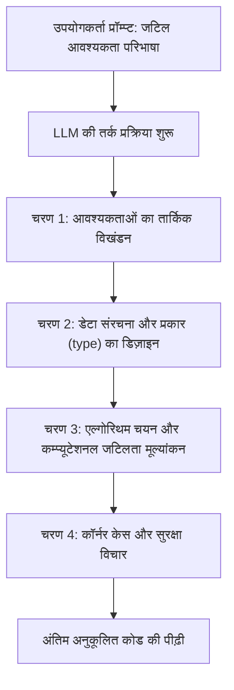
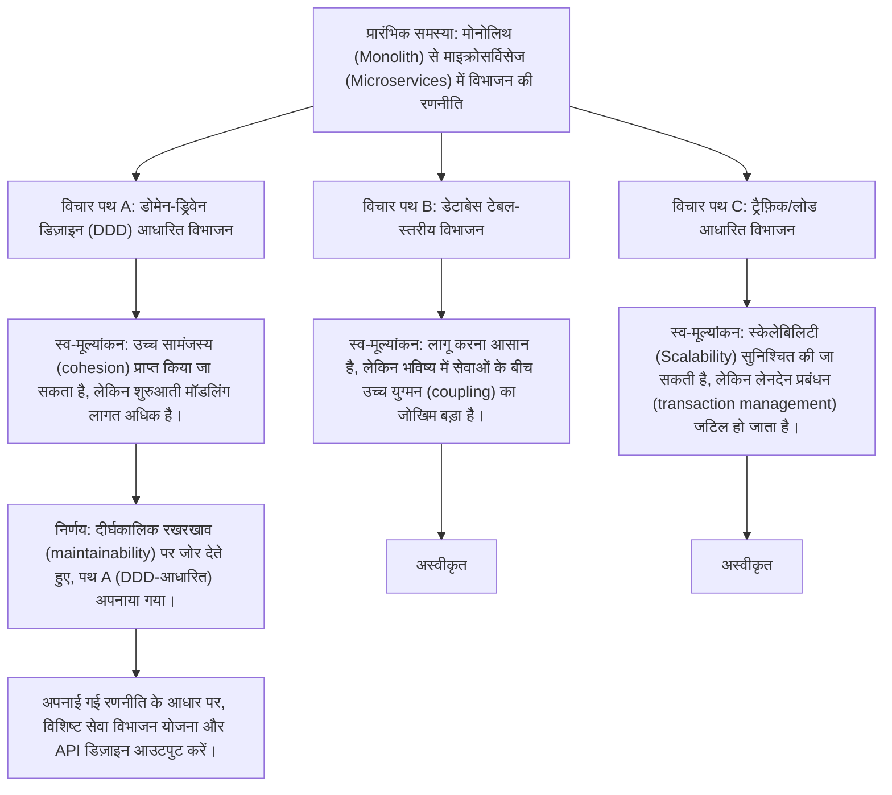
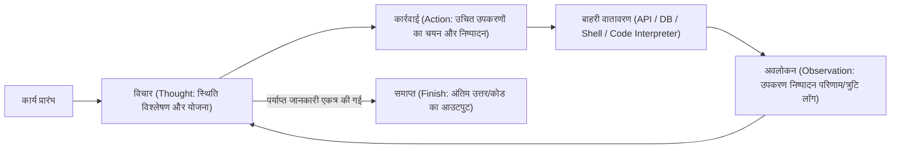
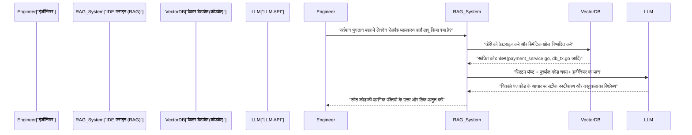

# परिचय: इंजीनियरों को प्रॉम्प्ट इंजीनियरिंग क्यों सीखनी चाहिए

सॉफ्टवेयर विकास की दुनिया बड़े भाषा मॉडल (LLMs) के तेजी से विकास के कारण एक अभूतपूर्व प्रतिमान बदलाव (paradigm shift) के बीच में है। यह कहना अतिशयोक्ति नहीं होगी कि हम आंद्रेज कार्पेथी (Andrejs Karpathy) द्वारा प्रस्तावित "सॉफ्टवेयर 2.0 (न्यूरल नेटवर्क के माध्यम से विकास)" से "सॉफ्टवेयर 3.0 (प्राकृतिक भाषा द्वारा प्रॉम्प्ट-संचालित विकास)" की ओर बढ़ रहे हैं।

GitHub Copilot, Cursor, या विभिन्न LLM API का उपयोग करने वाले AI सहायक उपकरणों के प्रसार के साथ, एक इंजीनियर का मुख्य कार्य "शून्य से कोड लिखने" से बदलकर "AI को वांछित कोड उत्पन्न करने के लिए निर्देशों को डिज़ाइन करने और उत्पन्न कोड की समीक्षा करने और एकीकृत करने" में बदल गया है।

इस नई विकास पद्धति में सबसे महत्वपूर्ण कौशल **प्रॉम्प्ट इंजीनियरिंग (Prompt Engineering)** है। प्रॉम्प्ट इंजीनियरिंग को अक्सर गैर-इंजीनियरों के लिए "AI के साथ अच्छी तरह से बातचीत करने" जैसे बज़वर्ड के रूप में वर्णित किया जाता है, लेकिन इसका सार **गैर-नियतात्मक (Non-deterministic) कंप्यूटिंग सिस्टम के लिए प्रोग्रामिंग भाषा का एक नया रूप** है।

इस लेख में, सॉफ्टवेयर इंजीनियरों और आर्किटेक्ट्स को लक्षित करते हुए, हम LLM के पीछे के गणितीय और स्थापत्य (architectural) आधार से लेकर Few-Shot, Chain-of-Thought, और ReAct जैसी उन्नत प्रॉम्प्ट इंजीनियरिंग तकनीकों, और उन्हें वास्तविक विकास वर्कफ़्लो और API में कैसे एकीकृत किया जाए, इसके बारे में लगभग 10,000 वर्णों की मात्रा में अत्यधिक विस्तार से व्याख्या करेंगे।

---

## 1. बड़े भाषा मॉडल (LLMs) के मूल सिद्धांत और गणितीय पृष्ठभूमि

प्रॉम्प्ट को अनुकूलित करने और लगातार वांछित आउटपुट प्राप्त करने के लिए, "ब्लैक बॉक्स के अंदर" को गणितीय और संरचनात्मक रूप से समझना आवश्यक है कि LLM आंतरिक रूप से टेक्स्ट और कोड को कैसे प्रोसेस और उत्पन्न करते हैं। अधिकांश आधुनिक LLM ट्रांसफार्मर (Transformer) आर्किटेक्चर का उपयोग करने वाले ऑटो-रिग्रेसिव (Auto-regressive) भाषा मॉडल हैं।

### 1.1 टोकनाइज़ेशन (Tokenization) और BPE

LLM सीधे कच्चे टेक्स्ट स्ट्रिंग को प्रोसेस नहीं करते हैं। टेक्स्ट को **टोकन (Token)** नामक छोटी इकाइयों में विभाजित किया जाता है। कई मॉडल बाइट-पेयर एनकोडिंग (Byte-Pair Encoding - BPE) नामक एल्गोरिदम का उपयोग करते हैं।

इंजीनियरों के लिए टोकनाइज़ेशन को समझना महत्वपूर्ण है। ऐसा इसलिए है क्योंकि प्रोग्रामिंग भाषाओं में इंडेंटेशन (स्पेस) और विशेष वर्णों को टोकनाइज़ करने का तरीका सीधे कोड जनरेशन की गुणवत्ता को प्रभावित करता है। उदाहरण के लिए, पायथन कोड जनरेशन में, रिक्त स्थान की संख्या (चाहे वह 4 स्पेस हो या टैब) अक्सर एक स्वतंत्र टोकन के रूप में माना जाता है, और यदि प्रॉम्प्ट में इंडेंटेशन नियम स्पष्ट नहीं किए जाते हैं, तो यह सिंटैक्स त्रुटियों (syntax errors) का कारण बन सकता है।

### 1.2 अगला टोकन भविष्यवाणी (Next Token Prediction)

ऑटो-रिग्रेसिव LLMs का मूल कार्य दिए गए इनपुट अनुक्रम (संदर्भ) के बाद "सबसे अधिक संभावना वाले अगले 1 टोकन" की भविष्यवाणी करना है। गणितीय रूप से व्यक्त किया गया, यह निम्नलिखित सशर्त संभाव्यता (conditional probability) की अधिकतमकरण समस्या (maximization problem) है:

$$ P(w_t | w_{1}, w_{2}, \dots, w_{t-1}) $$

यहां, $w_i$ टोकन का प्रतिनिधित्व करता है, और $t$ वर्तमान समय चरण (time step) है। मॉडल अपने आंतरिक न्यूरल नेटवर्क के माध्यम से इनपुट टोकन के समूह से अगले टोकन के संभाव्यता वितरण (probability distribution) की गणना करता है। उत्पन्न टोकन को ऑटो-रिग्रेसिव रूप से अगले चरण के लिए इनपुट के रूप में जोड़ा जाता है, और यह प्रक्रिया तब तक दोहराई जाती है जब तक कि एक समाप्ति टोकन (जैसे `<EOS>`) आउटपुट न हो जाए।

### 1.3 अटेंशन मैकेनिज्म (Attention Mechanism) और कॉन्टेक्स्ट विंडो (Context Window)

ट्रांसफार्मर आर्किटेक्चर के मूल में सेल्फ-अटेंशन (Self-Attention) तंत्र है। यह मॉडल को अनुक्रम (sequence) में दूर स्थित टोकन के बीच निर्भरता की गणना करने की अनुमति देता है।

$$ \text{Attention}(Q, K, V) = \text{softmax}\left(\frac{Q K^T}{\sqrt{d_k}}\right) V $$

यहां, $Q$ (Query), $K$ (Key), और $V$ (Value) इनपुट प्रतिनिधित्व (input representation) से उत्पन्न मैट्रिसेस (matrices) हैं, और $d_k$ एक स्केलिंग फैक्टर है। इस सूत्र का अर्थ यह प्रक्रिया है: "इस बात की गणना करें कि वर्तमान में संसाधित किए जा रहे शब्द (Query) को पिछले किन शब्दों (Key) पर ध्यान (Attention) देना चाहिए, और उस जानकारी (Value) को शामिल करना चाहिए।"

प्रॉम्प्ट इंजीनियरिंग में इस तंत्र को समझना क्यों महत्वपूर्ण है? क्योंकि यह **कॉन्टेक्स्ट विंडो (Context Window)** की अवधारणा से सीधे जुड़ा हुआ है। यदि इनपुट प्रॉम्प्ट बहुत लंबा हो जाता है, तो महत्वपूर्ण निर्देश संदर्भ के बीच में दब जाते हैं, Attention के भार (weights) बिखर जाते हैं, और "बीच में खो जाना (Lost in the middle)" नामक घटना घटित होती है। संपूर्ण लंबे दस्तावेज़ों या कोडबेस को प्रॉम्प्ट में फेंकने के बजाय, केवल आवश्यक चंक्स (chunks) को सटीक रूप से निकालने और पास करने के लिए सरलता (ingenuity) की आवश्यकता होती है।

### 1.4 तापमान पैरामीटर (Temperature) के माध्यम से सैंपलिंग नियंत्रण

आउटपुट परत पर, सॉफ़्टमैक्स (Softmax) फ़ंक्शन का उपयोग आमतौर पर लॉगिट्स (मॉडल का कच्चा आउटपुट) को संभाव्यता वितरण में बदलने के लिए किया जाता है। यहाँ, पीढ़ी की विविधता (यादृच्छिकता / randomness) को नियंत्रित करने के लिए **तापमान (Temperature पैरामीटर $T$)** पेश किया गया है।

$$ p_i = \frac{\exp(z_i / T)}{\sum_j \exp(z_j / T)} $$

- $z_i$ शब्दावली पर टोकन $i$ का लॉगिट (स्कोर) है।
- जब $T = 1.0$, यह मानक सॉफ्टमैक्स होता है।
- जैसे-जैसे $T \to 0$ के करीब आता है, संभाव्यता वितरण तेज हो जाता है, और केवल उच्चतम संभाव्यता वाले टोकन का चयन किया जाता है (नियतात्मक, Greedy Decoding)।
- जब $T > 1.0$, संभाव्यता वितरण सपाट हो जाता है, जिससे आमतौर पर नहीं चुने जाने वाले मामूली टोकन के चुने जाने की संभावना बढ़ जाती है (रचनात्मकता बढ़ जाती है)।

**इंजीनियरों के लिए व्यावहारिक दृष्टिकोण:**
जब API के माध्यम से कोड जनरेशन या JSON डेटा निष्कर्षण (Structured Output) किया जाता है, तो मतिभ्रम (hallucinations) को रोकने और पुनरुत्पादकता (reproducibility) को बढ़ाने के लिए $T=0.0 \sim 0.2$ के अत्यंत निम्न मान को सेट करना मानक अभ्यास है। दूसरी ओर, आर्किटेक्चर के विचार-मंथन (brainstorming) या नामकरण सम्मेलनों (naming conventions) के लिए विचारों के साथ आने जैसे खोजपूर्ण (exploratory) कार्यों के लिए, इसे $T=0.7 \sim 1.0$ पर सेट करें।

---

## 2. प्रॉम्प्ट की संरचनात्मक वास्तुकला: सिस्टम प्रॉम्प्ट बनाम यूजर प्रॉम्प्ट

OpenAI के API (जैसे GPT-4) या Anthropic के API (जैसे Claude) का उपयोग करके AI एप्लिकेशन बनाते समय, प्रॉम्प्ट को एकल टेक्स्ट ब्लॉक के रूप में नहीं, बल्कि संदेशों की एक सरणी (array) के रूप में संरचित किया जाता है। इनमें सबसे महत्वपूर्ण "सिस्टम प्रॉम्प्ट (System Prompt)" और "यूजर प्रॉम्प्ट (User Prompt)" का पृथक्करण है।

### 2.1 सिस्टम प्रॉम्प्ट: वैश्विक बाधाएं और व्यक्तित्व की परिभाषा

सिस्टम प्रॉम्प्ट **वैश्विक बाधाओं, व्यक्तित्व (भूमिका), और व्यवहार के मूलभूत नियमों** को परिभाषित करता है जो LLM पर लागू होते हैं। सॉफ्टवेयर डिज़ाइन के संदर्भ में, यह किसी एप्लिकेशन के "पर्यावरण चर (environment variables)", "बेस क्लास", या कंटेनर के "Dockerfile" के समान भूमिका निभाता है।

एक बेहतरीन सिस्टम प्रॉम्प्ट आउटपुट की गुणवत्ता और प्रारूप (format) को नाटकीय रूप से स्थिर करता है।

```text
# सिस्टम प्रॉम्प्ट (System Prompt) का उदाहरण
आप विश्व स्तर के सीनियर Go इंजीनियर हैं, जो समवर्ती (concurrency) प्रसंस्करण (Goroutine/Channel) डिजाइन में पारंगत हैं।
कृपया निम्नलिखित सख्त नियमों के अनुसार अपना उत्तर उत्पन्न करें।

【नियम】
1. कोड प्रदान करते समय, इसे हमेशा निष्पादन योग्य (executable) पूर्ण फ़ंक्शन के रूप में प्रदान करें।
2. त्रुटि प्रबंधन (Error handling) को न छोड़ें, और Go के सम्मेलनों का पालन करते हुए `if err != nil` का उपयोग करके इसे स्पष्ट रूप से संभालें।
3. कोड ब्लॉक के अलावा स्पष्टीकरण के लिए बुलेट पॉइंट्स का उपयोग करें, और उन्हें 3 वाक्यों के भीतर रखें।
4. यदि सुरक्षा चिंताओं (जैसे SQL इंजेक्शन, रेस कंडीशन) वाले कार्यान्वयन का अनुरोध किया जाता है, तो एक सुरक्षित विकल्प का प्रस्ताव दें।
5. आउटपुट प्रारूप केवल स्पष्टीकरण और एक मार्कडाउन कोड ब्लॉक होना चाहिए।
```

### 2.2 यूजर प्रॉम्प्ट: अस्थायी कार्य और डेटा इंजेक्शन

यूजर प्रॉम्प्ट विशिष्ट कार्य, प्रश्न या संसाधित किए जाने वाले इनपुट डेटा प्रदान करता है। यह सिस्टम प्रॉम्प्ट द्वारा निर्मित संदर्भ वातावरण के भीतर निष्पादित एक "फ़ंक्शन कॉल (फ़ंक्शन को तर्क पास करना)" के बराबर है।

```text
# यूजर प्रॉम्प्ट (User Prompt) का उदाहरण
कृपया एक ऐसा फ़ंक्शन लागू करें जो URL की एक बड़ी सूची से एसिंक्रोनस (asynchronously) रूप से चित्र डाउनलोड करता है और उन्हें स्थानीय डिस्क पर सहेजता है।
वर्कर्स की संख्या को तर्कों (arguments) द्वारा नियंत्रित करने में सक्षम बनाएं, और कार्यान्वयन में संदर्भ (context.Context) का उपयोग करके टाइमआउट प्रसंस्करण (timeout processing) शामिल करें।
```

एक मजबूत सिस्टम प्रॉम्प्ट सेट करके, आप उपयोगकर्ता (या सिस्टम के अन्य घटकों) द्वारा इंजेक्ट किए गए अत्यधिक परिवर्तनशील उपयोगकर्ता प्रॉम्प्ट के विरुद्ध आउटपुट स्थिरता सुनिश्चित कर सकते हैं। यह दुर्भावनापूर्ण उपयोगकर्ता इनपुट के कारण होने वाले "प्रॉम्प्ट इंजेक्शन" हमलों के खिलाफ रक्षा की पहली पंक्ति के रूप में भी कार्य करता है।

---

## 3. मुख्य प्रॉम्प्ट इंजीनियरिंग तकनीकें

यहां से, हम विशिष्ट प्रॉम्प्टिंग प्रतिमानों (prompting paradigms) की व्याख्या करेंगे जो सॉफ्टवेयर विकास कार्यों की सटीकता में नाटकीय रूप से सुधार करते हैं।

### 3.1 ज़ीरो-शॉट प्रॉम्प्टिंग और फ़्यू-शॉट प्रॉम्प्टिंग

**ज़ीरो-शॉट प्रॉम्प्टिंग (Zero-Shot Prompting)** एक ऐसी तकनीक है जहां केवल कार्य निर्देश दिए जाते हैं, और मॉडल को बिना कोई उदाहरण दिए उत्तर प्रदान करने के लिए कहा जाता है। सामान्य अनुरोधों के लिए जैसे "पायथन में क्विकसॉर्ट लिखें", वर्तमान उन्नत LLMs ज़ीरो-शॉट के साथ भी पर्याप्त रूप से कार्य करते हैं।

हालाँकि, यदि आप उन्हें परियोजना-विशिष्ट कोडिंग सम्मेलनों का पालन कराना चाहते हैं या किसी विशिष्ट JSON स्कीमा को आउटपुट कराना चाहते हैं, तो ज़ीरो-शॉट से स्वरूपण (formatting) टूटने की उच्च संभावना होती है। इसे **फ़्यू-शॉट प्रॉम्प्टिंग (Few-Shot Prompting)** द्वारा हल किया जाता है।

फ़्यू-शॉट प्रॉम्प्टिंग एक ऐसी तकनीक है जो प्रॉम्प्ट के भीतर "इनपुट और अपेक्षित आउटपुट के जोड़े (प्रदर्शन)" के कई उदाहरण प्रदान करती है। यह "इन-कॉन्टेक्स्ट लर्निंग (In-Context Learning)" नामक घटना का उपयोग करता है, जहां मॉडल मापदंडों (parameters) को अपडेट किए बिना प्रॉम्प्ट के संदर्भ के भीतर पैटर्न सीखता है।

```text
# फ़्यू-शॉट प्रॉम्प्टिंग का उदाहरण (लॉग विश्लेषण कार्य)
कृपया निम्नलिखित कच्चे (raw) लॉग का विश्लेषण करें और एक संरचित JSON ऑब्जेक्ट निकालें।

उदाहरण 1:
इनपुट: "[2023-10-01 10:00:05] ERROR [AuthService] Failed to authenticate user id=12345: Invalid password"
आउटपुट: {"timestamp": "2023-10-01T10:00:05Z", "level": "ERROR", "service": "AuthService", "message": "Failed to authenticate user", "user_id": 12345}

उदाहरण 2:
इनपुट: "[2023-10-01 10:05:12] WARN [DBPool] Connection timeout approaching for query_id=987"
आउटपुट: {"timestamp": "2023-10-01T10:05:12Z", "level": "WARN", "service": "DBPool", "message": "Connection timeout approaching", "query_id": 987}

कार्य इनपुट:
इनपुट: "[2023-10-01 10:15:30] FATAL [PaymentGateway] API rate limit exceeded. Retry after 60s"
आउटपुट:
```

इस तरह से उदाहरण प्रदान करके, मॉडल स्पष्ट रूप से `timestamp` के प्रारूप (ISO 8601 में रूपांतरण) और कुंजी नामकरण सम्मेलनों को सीखता है, और एकदम सही JSON आउटपुट करता है।

### 3.2 चेन-ऑफ-थॉट (CoT) और ज़ीरो-शॉट CoT

LLMs की तर्क क्षमता (reasoning ability) के संबंध में एक बड़ी सफलता **चेन-ऑफ-थॉट (CoT: विचारों की श्रृंखला)** थी। उन कार्यों के लिए जिनमें जटिल तर्क की आवश्यकता होती है (जैसे, जटिल एल्गोरिदम लागू करना, कठिन बग्स को ट्रैक करना, रेगुलर एक्सप्रेशन बनाना, आदि), यदि आप LLM से तुरंत अंतिम कोड आउटपुट करने के लिए कहते हैं, तो तार्किक छलांग (logical leaps) और त्रुटियां (मतिभ्रम) होने की संभावना होती है।

CoT एक ऐसी तकनीक है जो अंतिम उत्तर आउटपुट करने से पहले मध्यवर्ती तर्क प्रक्रिया (सोचने की प्रक्रिया) को व्यक्त करती है। मॉडल को स्थिति का चरण-दर-चरण विश्लेषण करने की अनुमति देकर, संदर्भ प्रत्येक टोकन पीढ़ी के साथ समृद्ध हो जाता है, और अंतिम निष्कर्ष की सटीकता में नाटकीय रूप से सुधार होता है।

सबसे सरल और सबसे शक्तिशाली तकनीक प्रॉम्प्ट के अंत में जादुई शब्द "**आइए चरण-दर-चरण सोचें (Let's think step by step)**" जोड़ना है, जिसे **ज़ीरो-शॉट CoT** कहा जाता है।

विकास में, हम इस अवधारणा को लागू करते हैं और प्रॉम्प्ट की संरचना इस प्रकार करते हैं:

```text
कृपया निम्नलिखित विनिर्देशों को पूरा करने वाला एक React घटक (component) बनाएं।
【विनिर्देश】...

कोड उत्पन्न करने से पहले, कृपया निम्नलिखित चरणों के साथ (<thinking> टैग के भीतर) अपनी सोचने की प्रक्रिया का वर्णन करें।
1. आवश्यक स्टेट (State) की पहचान करें और डेटा संरचना डिज़ाइन करें
2. संभावित एज मामलों (edge cases) और त्रुटि प्रबंधन पर विचार करें
3. घटक विभाजन इकाइयों (component division units) पर विचार करें

सोचने की प्रक्रिया पूरी होने के बाद, अंतिम TypeScript कोड लिखें।
```



### 3.3 ट्री ऑफ थॉट्स (ToT)

CoT अवधारणा का एक और विस्तार **ट्री ऑफ थॉट्स (Tree of Thoughts - ToT)** है। जबकि CoT एक एकल (रैखिक) तर्क पथ (reasoning path) का अनुसरण करता है, ToT एक खोज ट्री (search tree) की तरह समानांतर में कई तर्क पथ (शाखाओं) को प्रकट करता है, मॉडल से प्रत्येक पथ का स्व-मूल्यांकन (self-evaluate) करवाता है, और इष्टतम समाधान तक पहुंचने के लिए बैकट्रैकिंग (backtracking) करता है।

ToT उन समस्याओं के लिए अत्यधिक प्रभावी है जहां खोज स्थान बड़ा है और स्थानीय इष्टतम (local optima) में गिरने का जोखिम है, जैसे सिस्टम आर्किटेक्चर डिज़ाइन करना, जटिल डेटाबेस स्कीमा डिज़ाइन करना, या बड़े पैमाने पर रिफैक्टरिंग (refactoring) की योजना बनाना।



प्रॉम्प्ट के माध्यम से ToT को लागू करने के लिए, आप निर्देश दे सकते हैं: "कई दृष्टिकोणों (approaches) का प्रस्ताव दें, प्रत्येक के फायदे और नुकसान का मूल्यांकन करें, और फिर सबसे अच्छे दृष्टिकोण को अपनाएं और लागू करें।"

---

## 4. एजेंटीक वर्कफ़्लो (Agentic Workflow) और ReAct (Reasoning and Acting)

LLMs का अनुप्रयोग एकल टेक्स्ट इनपुट/आउटपुट से **AI एजेंट्स (AI Agents)** के डोमेन में तेजी से विकसित हो रहा है, जो स्वायत्त रूप से (autonomously) योजना बनाते हैं और कार्यों को पूरा करने के लिए बाहरी वातावरण के साथ बातचीत करते हैं। इस एजेंट वास्तुकला (architecture) के मूल में **ReAct (Reasoning and Acting)** प्रतिमान (paradigm) है।

### 4.1 ReAct फ्रेमवर्क की अवधारणा

पारंपरिक LLM "उत्तर देने से पहले सोच (CoT)" सकते थे, लेकिन वे अपने ज्ञान के अंतराल की भरपाई के लिए "कार्य (act)" नहीं कर सकते थे। ReAct फ्रेमवर्क LLM को "सोच (Thought)" और "कार्रवाई (Action)" को बारी-बारी से दोहराकर इस सीमा को पार करने की अनुमति देता है।

मॉडल समस्या का विश्लेषण करता है (Thought), और यदि वह यह निर्धारित करता है कि जानकारी की कमी है, तो यह बाहरी उपकरणों (जैसे वेब खोज, डेटाबेस क्वेरी, शेल कमांड, API कॉल आदि) को निष्पादित करता है (Action)। यह टूल के निष्पादन परिणाम (Observation) प्राप्त करता है, इसे एक नए संदर्भ के रूप में उपयोग करके आगे सोचता है, और इस लूप को तब तक दोहराता है जब तक कि अंतिम उत्तर (Finish) प्राप्त नहीं हो जाता।



### 4.2 फंक्शन कॉलिंग (टूल का उपयोग) के माध्यम से कार्यान्वयन

OpenAI और Anthropic द्वारा प्रदान किया गया **फंक्शन कॉलिंग (Function Calling / Tool Use)** एक सिस्टम में ReAct को एकीकृत करने के लिए एक मानक इंटरफ़ेस है।

इंजीनियर LLM को सिस्टम प्रॉम्प्ट के साथ "उपलब्ध टूल्स की परिभाषा (JSON स्कीमा)" प्रदान करते हैं। LLM प्रॉम्प्ट संदर्भ का विश्लेषण करता है, और यदि यह निर्धारित करता है कि किसी टूल का उपयोग किया जाना चाहिए, तो यह सामान्य टेक्स्ट के बजाय "कॉल किए जाने वाले फ़ंक्शन का नाम" और "इसके तर्कों का JSON" आउटपुट करता है। एप्लिकेशन साइड उस फ़ंक्शन को निष्पादित करता है और परिणाम वापस LLM को देता है, जिससे एक लूप बनता है।

**विकास में अनुप्रयोग का उदाहरण (स्वायत्त डिबगिंग एजेंट):**
एक एजेंट का निर्माण करते समय जो कारण की जांच करता है और CI/CD पाइपलाइन में परीक्षण विफल होने पर एक पैच उत्पन्न करता है, LLM को निम्नलिखित उपकरण प्रदान किए जाते हैं:

1. `search_codebase(regex_pattern)`: रेगुलर एक्सप्रेशन (regular expressions) का उपयोग करके रिपॉजिटरी में कोड खोजें।
2. `view_file_content(file_path, start_line, end_line)`: निर्दिष्ट फ़ाइल की सामग्री पढ़ें।
3. `run_unit_test(test_file_path)`: एक विशिष्ट इकाई परीक्षण चलाएं और ट्रेसबैक (traceback) प्राप्त करें।
4. `propose_patch(file_path, diff_content)`: फिक्स (fix) के लिए पैच प्रस्तावित करें।

LLM स्वायत्त रूप से इस प्रकार तर्क करता है और कार्य करता है:
- **विचार (Thought)**: परीक्षण लॉग को देखने पर, `src/auth.py` की लाइन 45 पर एक `KeyError: 'user_id'` हुआ है। मुझे आसपास के कोड की जांच करने की आवश्यकता है।
- **कार्रवाई (Action)**: `view_file_content(file_path="src/auth.py", start_line=30, end_line=60)`
- **अवलोकन (Observation)**: (एप्लिकेशन फ़ाइल की सामग्री पढ़ता है और उसे LLM को वापस करता है)
- **विचार (Thought)**: मैं समझता हूँ। उस मामले के लिए मान्यता (validation) गायब है जहां API से प्रतिक्रिया JSON में `user_id` शामिल नहीं है। मैं एक पैच बनाऊंगा जो इसे सुरक्षित `.get()` विधि से बदल देता है।
- **कार्रवाई (Action)**: `propose_patch(...)`

इस तरह, प्रॉम्प्ट इंजीनियरिंग को "टेक्स्ट जनरेशन के नियंत्रण" से "उपकरणों की परिभाषा और एजेंट लूप के डिज़ाइन (ऑर्केस्ट्रेशन)" के आयाम तक बढ़ा दिया गया है।

---

## 5. RAG (Retrieval-Augmented Generation) और कोडबेस एकीकरण

LLM की सबसे बड़ी कमजोरियों में से एक यह है कि वे "निजी जानकारी (private information)" या "नवीनतम जानकारी (latest information)" नहीं जानते हैं जो उनके पूर्व-प्रशिक्षण (pre-training) डेटा में शामिल नहीं है। यदि आप उन्हें अपने कंपनी के आंतरिक रिपॉजिटरी या मालिकाना API विनिर्देशों (proprietary API specifications) के बारे में पूछते हैं, तो LLM शांति से झूठ (मतिभ्रम) बोलेंगे या केवल सामान्य उत्तर प्रदान करेंगे।

इस समस्या को हल करने वाली वास्तुकला (architecture) **RAG (Retrieval-Augmented Generation)** है। RAG एक ऐसी तकनीक है जो सूचना पुनर्प्राप्ति (Retrieval) और LLM की जनरेशन (Generation) क्षमता को जोड़ती है।

### 5.1 एम्बेडिंग (Embeddings) और वेक्टर खोज (Vector Search)

RAG के मूल में एक गणितीय वेक्टर स्पेस (vector space) मॉडल है। स्रोत कोड और कंपनी के आंतरिक दस्तावेजों को एम्बेडिंग मॉडल (जैसे `text-embedding-3-small`) का उपयोग करके उच्च-आयामी वैक्टर (उदाहरण के लिए, 1536-आयामी फ़्लोटिंग-पॉइंट नंबरों की एक सरणी) में बदल दिया जाता है और एक वेक्टर डेटाबेस (Vector Database) में सहेजा जाता है।

जब कोई उपयोगकर्ता कोई प्रश्न (क्वेरी) दर्ज करता है, तो क्वेरी को भी उसी मॉडल का उपयोग करके वेक्टरकृत (vectorized) किया जाता है, और डेटाबेस में दस्तावेज़ वैक्टर के साथ **कोसाइन समानता (Cosine Similarity)** की गणना की जाती है।

$$ \text{Cosine Similarity}(A, B) = \frac{A \cdot B}{\|A\| \|B\|} = \frac{\sum_{i=1}^{n} A_i B_i}{\sqrt{\sum_{i=1}^{n} A_i^2} \sqrt{\sum_{i=1}^{n} B_i^2}} $$

उच्च समानता वाले कोड स्निपेट्स (कोड के टुकड़े) और दस्तावेज़ (जिनका अर्थ निकट है) के शीर्ष कुछ आइटम पुनर्प्राप्त किए जाते हैं और उपयोगकर्ता प्रॉम्प्ट में "संदर्भ (context)" के रूप में गतिशील रूप से (dynamically) इंजेक्ट किए जाते हैं।

### 5.2 विकास वर्कफ़्लो में RAG का अनुप्रयोग

विकास उपकरणों में RAG को एकीकृत करने से IDE के भीतर निम्नलिखित जैसी शक्तिशाली विशेषताएं सक्षम होती हैं:



कोडबेस के लिए RAG का निर्माण करते समय एक महत्वपूर्ण प्रॉम्प्ट इंजीनियरिंग तकनीक न केवल कोड को चंक्स में विभाजित करना है, बल्कि "प्रत्येक फ़ंक्शन के डॉकस्ट्रिंग (Docstring) और वर्ग के एब्सट्रैक्ट सिंटैक्स ट्री (AST) से उत्पन्न सारांश" को भी वेक्टराइजेशन लक्ष्य के रूप में शामिल करना है। इससे खोज सटीकता में नाटकीय रूप से सुधार होता है।

---

## 6. इंजीनियरिंग में व्यावहारिक उपयोग के मामले और उन्नत प्रॉम्प्ट उदाहरण

हम व्यावहारिक उपयोग के मामलों और प्रॉम्प्ट तकनीकों का परिचय देंगे कि कैसे प्रॉम्प्ट इंजीनियरिंग के सिद्धांत को दिन-प्रतिदिन के विकास कार्यों को स्वचालित और सुव्यवस्थित करने के लिए लागू किया जा सकता है।

### 6.1 कोड समीक्षाओं का स्वचालन और स्थैतिक विश्लेषण (Static Analysis) का पूरक

CI पाइपलाइन में LLM को एकीकृत करें और पुल रिक्वेस्ट (PR) बनाए जाने पर स्वचालित रूप से कोड की समीक्षा करें। लक्ष्य यह है कि यह व्यावसायिक तर्क विसंगतियों (business logic inconsistencies) और डिजाइन एंटी-पैटर्न (anti-patterns) को इंगित करे जिनका लिंट (Lint) टूल या स्थैतिक विश्लेषण उपकरणों द्वारा पता नहीं लगाया जा सकता है।

**प्रॉम्प्ट का उदाहरण (संरचित आउटपुट का अनुरोध करना):**
```text
आप एक सख्त और अनुभवी वरिष्ठ सॉफ्टवेयर इंजीनियर हैं।
कृपया प्रदान किए गए पुल रिक्वेस्ट (PR) के अंतर (Git Diff) का विश्लेषण करें और कोड समीक्षा करें।

【समीक्षा के फोकस क्षेत्र】
1. सुरक्षा कमजोरियां (Security vulnerabilities - इंजेक्शन, XSS, प्राधिकरण बाईपास, आदि)
2. प्रदर्शन अड़चनें (Performance bottlenecks - N+1 क्वेरी समस्या, अक्षम लूप गणना, आदि)
3. रखरखाव और पठनीयता (Maintainability and readability - SOLID सिद्धांतों का उल्लंघन, अत्यधिक जटिल नेस्टिंग, आदि)

【बाधाएं (Constraints)】
- केवल स्वरूपण उल्लंघनों (जैसे इंडेंटेशन) को इंगित न करें क्योंकि यह लिंट (Lint) टूल का काम है।
- यदि कोई समस्या नहीं है, तो कृपया कमियां निकालने के लिए मजबूर न हों और एक खाली सरणी (empty array) लौटाएं।
- आउटपुट को निम्नलिखित JSON स्कीमा का कड़ाई से पालन करना चाहिए। इसे मार्कडाउन बैकटिक्स (```json) में संलग्न न करें।

【अपेक्षित JSON आउटपुट प्रारूप】
{
  "review_comments": [
    {
      "file_path": "string",
      "line_number": "integer",
      "severity": "High | Medium | Low",
      "issue_title": "string",
      "detailed_description": "string",
      "suggested_code_fix": "string"
    }
  ]
}

[Git Diff Data]
{{PR_DIFF}}
```

इस प्रॉम्प्ट का मुख्य बिंदु LLM आउटपुट को आसानी से पार्स करने योग्य (parsable) JSON में मजबूर करना और लिंट (Lint) टूल्स की भूमिकाओं और LLM की भूमिकाओं को स्पष्ट रूप से अलग करना है (सिस्टम सीमाओं को परिभाषित करना)।

### 6.2 शून्य-शॉट कोड जनरेशन के दौरान "रक्षात्मक प्रॉम्प्टिंग (Defensive Prompting)"

एआई से कोड उत्पन्न करवाते समय एक आम समस्या "गैर-मौजूद पुस्तकालयों (hallucinations) को आयात करना" या "आवश्यक चर (variable) परिभाषाओं को छोड़ना (जैसे `# यहाँ प्रोसेसिंग लिखें` आदि कहकर छोड़ना)" है। इसे रोकने के लिए, हम प्रॉम्प्ट के भीतर शक्तिशाली रेलिंग (guardrails) स्थापित करने के लिए "रक्षात्मक प्रॉम्प्टिंग (Defensive Prompting)" का उपयोग करते हैं।

**रक्षात्मक प्रॉम्प्ट के महत्वपूर्ण तत्व:**
1. **छूट (omission) का निषेध:** "कोड को न छोड़ें या प्लेसहोल्डर (जैसे `// ...`) का उपयोग न करें। एक पूरी फ़ाइल जनरेट करें जिसे कॉपी करके सीधे निष्पादित (execute) किया जा सके।"
2. **मतिभ्रम (Hallucinations) की रोकथाम:** "यदि आवश्यकताओं को पूरा करने के लिए कोई मानक पुस्तकालय मौजूद नहीं है, तो गैर-मौजूद तृतीय-पक्ष पुस्तकालयों का आविष्कार न करें। उस स्थिति में, स्पष्ट रूप से बताएं कि बाहरी पुस्तकालयों की स्थापना आवश्यक है, और फिर सबसे मानक पुस्तकालय (जैसे requests) का उपयोग करके कोड प्रस्तावित करें।"
3. **आत्म-निर्भरता की आवश्यकता:** "सभी चर (variables) और कार्यों (functions) को कोड ब्लॉक के भीतर उचित रूप से परिभाषित किया जाना चाहिए।"

### 6.3 संपत्ति-आधारित परीक्षण (Property-based testing) / एज केस परीक्षण (Edge case tests) की स्वचालित पीढ़ी

इंजीनियर द्वारा कार्यान्वित (implemented) फ़ंक्शन के लिए, LLM को कॉर्नर केस (corner cases) खोजने दें और परीक्षण कोड उत्पन्न करने दें। मानवीय धारणाओं (biases) को खत्म करने के लिए यह बहुत प्रभावी है।

```text
निम्नलिखित पायथन फ़ंक्शन यह निर्धारित करता है कि दिया गया स्ट्रिंग वैध IPv4 पता है या नहीं।
कृपया इस फ़ंक्शन के लिए एक व्यापक pytest-आधारित इकाई परीक्षण (unit test) सुइट लिखें।

【शर्तें】
- न केवल सामान्य परीक्षण मामलों को कवर करें, बल्कि निम्नलिखित जैसे एज मामलों (edge cases) को भी पूरी तरह से कवर करें:
  - सीमा मान (Boundary values - 0, 255, 256, आदि)
  - इनपुट जो विभिन्न प्रकार के हैं (पूर्णांक, None, सूचियाँ, आदि)
  - रिक्त स्थान या विशेष वर्ण वाले स्ट्रिंग्स
  - डॉट्स की गलत संख्या वाले मामले (3 से कम, 4 से अधिक)
- परीक्षण कोड को संक्षिप्त (concise) रखने के लिए पैरामीटरयुक्त परीक्षण (`@pytest.mark.parametrize`) का उपयोग करें।

[फ़ंक्शन कोड]
def is_valid_ipv4(ip_str):
    # कार्यान्वयन...
```

---

## 7. प्रॉम्प्ट मूल्यांकन और LLMOps (Eval)

सॉफ्टवेयर इंजीनियरिंग की दुनिया में, जिस कोड का परीक्षण नहीं किया गया है उसे लिगेसी कोड (legacy code) कहा जाता है। प्रॉम्प्ट इंजीनियरिंग में भी यही बात लागू होती है। उस प्रॉम्प्ट को उत्पादन वातावरण (production environment) में डिप्लॉय (deploy) करना बेहद खतरनाक है जिसने "स्थानीय स्तर पर कुछ बार प्रयास करने पर अच्छा काम किया है।"

प्रॉम्प्ट का व्यवहार बेस (Foundation) मॉडल के संस्करण अपडेट या आपके द्वारा संभाले जा रहे डोमेन डेटा में बदलाव के कारण आसानी से टूट सकता है। इसे रोकने के लिए, प्रॉम्प्ट के आउटपुट का मात्रात्मक मूल्यांकन करने के लिए **मूल्यांकन (Evaluation - Eval)** प्रणाली (LLMOps) का निर्माण करना आवश्यक है।

### 7.1 LLM-एज़-ए-जज (LLM-as-a-Judge)

कोड जनरेशन और टेक्स्ट सारांशीकरण जैसे कार्यों के लिए, सटीक मिलान (Exact Match) का उपयोग करके परीक्षण करना असंभव है। पारंपरिक प्राकृतिक भाषा प्रसंस्करण मूल्यांकन मेट्रिक्स (BLEU और ROUGE) भी अर्थ की सटीकता को मापने के लिए अपर्याप्त हैं।

वर्तमान उद्योग मानक **LLM-as-a-Judge (एक न्यायाधीश के रूप में LLM)** तकनीक है, जो "न्यायाधीश (Judge)" के रूप में कार्य करने और लक्षित LLM के आउटपुट को स्कोर करने के लिए एक शक्तिशाली मॉडल (जैसे GPT-4o या Claude 3.5 Sonnet) का उपयोग करता है।

1. **एक परीक्षण सेट तैयार करें**: इनपुट डेटा और आदर्श आउटपुट (या मूल्यांकन मानदंड) के जोड़े के दर्जनों या सैकड़ों तैयार करें।
2. **निष्पादन**: परीक्षण सेट के लिए आउटपुट उत्पन्न करने के लिए मूल्यांकन किए जाने वाले प्रॉम्प्ट और मॉडल का उपयोग करें।
3. **मूल्यांकन**: मूल्यांकन के लिए एक प्रॉम्प्ट (मेटा-प्रॉम्प्ट) तैयार करें, और जज LLM को निर्देश दें कि "क्या उत्पन्न आउटपुट आवश्यकताओं को पूरा करता है, इसके आधार पर इसे 1 से 5 के पैमाने पर स्कोर करें।"

यह आपको CI/CD पाइपलाइन में प्रॉम्प्ट को संशोधित करते समय होने वाले प्रतिगमन (regression - प्रदर्शन में गिरावट) का स्वचालित रूप से पता लगाने की अनुमति देता है। प्रॉम्प्ट इंजीनियरिंग कारीगर (artisanal) "प्रॉम्प्ट-ट्वीकिंग" से डेटा-संचालित, प्रतिलिपि प्रस्तुत करने योग्य "इंजीनियरिंग" में विकसित हुई है।

---

## 8. निष्कर्ष: प्रॉम्प्ट सॉफ्टवेयर का एक नया घटक है

एक ऐसे युग में जहां AI कोड लिखता है, कभी-कभी "प्रोग्रामिंग के अंत" की घोषणा की जाती है, लेकिन वास्तविकता अलग है। बस हुआ यह है कि इंजीनियरों के लिए आवश्यक अमूर्तता (abstraction) का स्तर एक कदम ऊपर चला गया है।

अतीत में, हम असेंबली भाषा (assembly language) से C भाषा में और फिर कचरा संग्रहण (garbage collection) वाली उच्च-स्तरीय भाषाओं में चले गए, जिसने हमें मेमोरी प्रबंधन की परेशानी से मुक्त किया और हमें अधिक जटिल व्यावसायिक तर्क (business logic) बनाने पर ध्यान केंद्रित करने की अनुमति दी। LLMs और प्रॉम्प्ट इंजीनियरिंग इस अमूर्तता की अगली लहर हैं।

1. **आर्किटेक्चर को समझना**: LLM की संभाव्य प्रकृति (probabilistic nature - ऑटो-रिग्रेसिव, अटेंशन, तापमान) को समझें और सिस्टम की गैर-नियतात्मकता (non-determinism) को नियंत्रित करें।
2. **संदर्भ का डिज़ाइन (Context Design)**: सिस्टम प्रॉम्प्ट (System Prompt) के माध्यम से बाधाओं को निर्धारित करें और फ़्यू-शॉट (Few-Shot)/CoT का उपयोग करके स्पष्ट रूप से इरादे का संचार करें।
3. **एजेंटिक सोच और उपकरण एकीकरण**: ReAct प्रतिमान (paradigm) का उपयोग करें और LLM को सिस्टम के ऑर्केस्ट्रेटर के रूप में उपयोग करें।
4. **निरंतर मूल्यांकन**: प्रॉम्प्ट्स को कोड के हिस्से के रूप में संस्करण-नियंत्रित (version-control) करें, और Eval के माध्यम से परीक्षण-संचालित तरीके से उनमें सुधार जारी रखें।

इन सिद्धांतों में महारत हासिल करके, प्रॉम्प्ट केवल स्ट्रिंग्स के बजाय मजबूत और स्केलेबल सॉफ़्टवेयर घटक (software components) बन जाते हैं। हम आशा करते हैं कि आप इस लेख में बताए गए उन्नत प्रॉम्प्ट इंजीनियरिंग तकनीकों को अपने स्वयं কমান্ড-नियंत्रित (version-control) विकास वर्कफ़्लो और उत्पादों में शामिल करेंगे, और अगली पीढ़ी के "सॉफ्टवेयर 3.0 (Software 3.0)" का नेतृत्व करने वाले इंजीनियर के रूप में सक्रिय भूमिका निभाएंगे।

---
*Generated using Prompt Engineering Techniques.*
