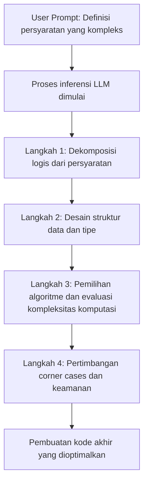
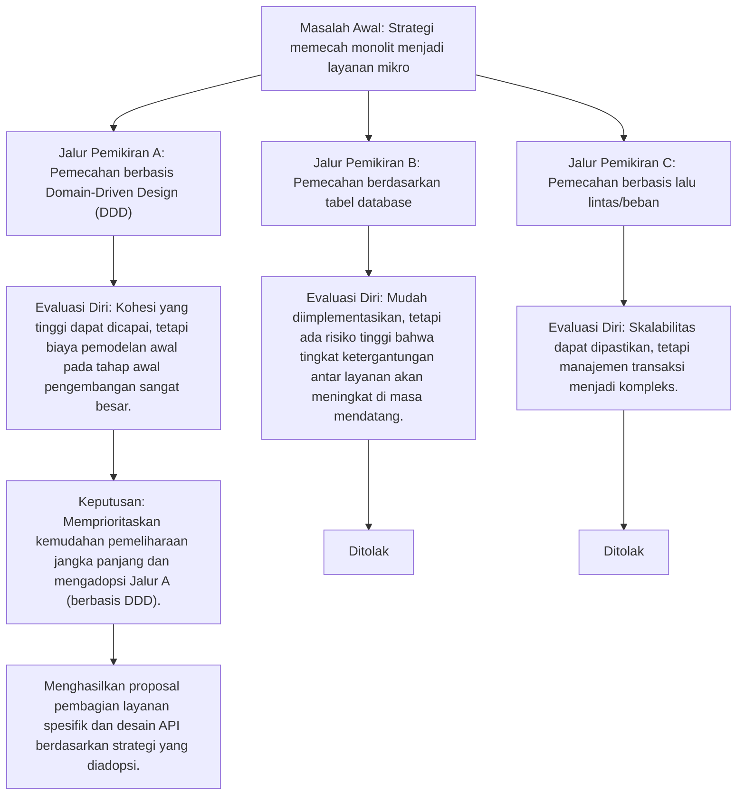
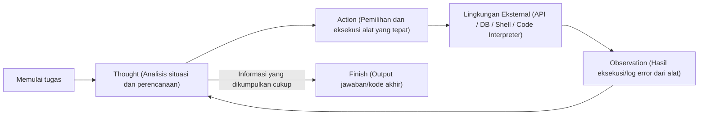
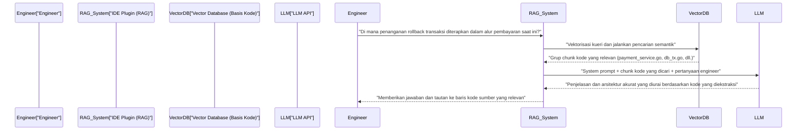

# Pengantar: Mengapa Engineer Harus Mempelajari Prompt Engineering

Dunia pengembangan perangkat lunak sedang berada di tengah-tengah pergeseran paradigma yang belum pernah terjadi sebelumnya karena evolusi pesat Large Language Models (LLM). Tidak berlebihan jika dikatakan bahwa kita sedang bertransisi dari "Software 2.0 (pengembangan menggunakan neural networks)" yang digagas oleh Andrejs Karpathy, ke "Software 3.0 (pengembangan berbasis prompt menggunakan bahasa alami)".

Dengan penyebaran alat asisten AI seperti GitHub Copilot, Cursor, atau berbagai API LLM, tugas utama para engineer bergeser dari "menulis kode dari nol" menjadi "merancang instruksi untuk membuat AI menghasilkan kode yang diinginkan, serta meninjau dan mengintegrasikan kode yang dihasilkan".

Keterampilan yang paling penting dalam metode pengembangan baru ini adalah **prompt engineering**. Prompt engineering sering kali dianggap sebagai kata kunci populer untuk non-engineer seperti "mengobrol dengan AI dengan baik", tetapi esensinya adalah **bentuk baru bahasa pemrograman untuk sistem komputasi non-deterministik (Non-deterministic)**.

Dalam artikel ini, yang ditujukan untuk software engineer dan arsitek, kami akan menjelaskan dengan sangat rinci (sekitar 10.000 karakter) mulai dari dasar-dasar matematis dan arsitektur di balik LLM, teknik prompt engineering tingkat lanjut seperti Few-Shot, Chain-of-Thought, dan ReAct, hingga cara mengintegrasikannya ke dalam alur kerja pengembangan dan API aktual.

---

## 1. Dasar-dasar dan Latar Belakang Matematis Large Language Models (LLM)

Untuk mengoptimalkan prompt dan secara stabil mendapatkan output yang diinginkan, sangat penting untuk memahami secara matematis dan struktural "isi kotak hitam" tentang bagaimana LLM memproses dan menghasilkan teks atau kode secara internal. Sebagian besar LLM modern adalah model bahasa auto-regressive (Auto-regressive) yang menggunakan arsitektur Transformer.

### 1.1 Tokenisasi (Tokenization) dan BPE

LLM tidak memproses string teks mentah secara langsung. Teks dibagi menjadi unit kecil yang disebut **token (Token)**. Banyak model menggunakan algoritma yang disebut Byte-Pair Encoding (BPE).

Pemahaman tentang tokenisasi penting bagi engineer. Hal ini karena cara indentasi (spasi) atau simbol khusus dalam bahasa pemrograman ditokenisasi secara langsung memengaruhi kualitas pembuatan kode. Misalnya, dalam pembuatan kode Python, jumlah spasi (apakah 4 spasi atau tab) sering diperlakukan sebagai token independen, dan kegagalan untuk memperjelas aturan indentasi dalam prompt dapat menyebabkan kesalahan sintaksis.

### 1.2 Prediksi Token Berikutnya (Next Token Prediction)

Tugas dasar LLM auto-regressive adalah memprediksi "1 token berikutnya dengan probabilitas tertinggi" yang mengikuti urutan input yang diberikan (konteks). Secara matematis, ini dinyatakan sebagai masalah maksimisasi probabilitas bersyarat berikut.

$$ P(w_t | w_{1}, w_{2}, \dots, w_{t-1}) $$

Di sini, $w_i$ mewakili token, dan $t$ adalah langkah waktu (time step) saat ini. Model menghitung distribusi probabilitas token berikutnya dari grup token input melalui neural network internal. Token yang dihasilkan ditambahkan secara auto-regressive sebagai input untuk langkah berikutnya, dan proses ini diulang hingga token akhir (seperti `<EOS>`) dihasilkan.

### 1.3 Mekanisme Atensi (Attention Mechanism) dan Context Window

Inti dari arsitektur Transformer adalah mekanisme Self-Attention. Hal ini memungkinkan model untuk menghitung dependensi antara token-token yang berjauhan dalam suatu urutan.

$$ \text{Attention}(Q, K, V) = \text{softmax}\left(\frac{Q K^T}{\sqrt{d_k}}\right) V $$

Di sini, $Q$ (Query), $K$ (Key), dan $V$ (Value) adalah matriks yang dihasilkan dari representasi input, dan $d_k$ adalah faktor penskalaan. Rumus ini berarti proses "menghitung kata-kata (Key) mana di masa lalu yang harus difokuskan (Attention) oleh kata yang sedang diproses saat ini (Query), dan menggabungkan informasi tersebut (Value)".

Mengapa memahami mekanisme ini penting dalam prompt engineering? Hal ini karena berkaitan langsung dengan konsep **Jendela Konteks (Context Window)**. Jika prompt input menjadi terlalu panjang, instruksi penting akan terkubur di tengah-tengah konteks, dan bobot Attention akan tersebar, yang menyebabkan fenomena "Lost in the middle (hilangnya informasi di tengah)". Dibandingkan memasukkan seluruh dokumen atau basis kode yang panjang ke dalam prompt, kita perlu membuat strategi untuk mengekstrak dan memberikan hanya chunk (potongan) yang diperlukan saja.

### 1.4 Kontrol Sampling melalui Parameter Suhu (Temperature)

Pada lapisan output, fungsi Softmax biasanya digunakan untuk mengubah logit (output mentah model) menjadi distribusi probabilitas. Di sini, **Suhu (Temperature parameter $T$)** diperkenalkan untuk mengontrol keragaman (keacakan) dari pembuatan teks.

$$ p_i = \frac{\exp(z_i / T)}{\sum_j \exp(z_j / T)} $$

- $z_i$ adalah logit (skor) dari token $i$ dalam kosakata.
- Saat $T = 1.0$, ini menjadi Softmax standar.
- Semakin mendekati $T \to 0$, distribusi probabilitas menjadi lebih tajam, dan hanya token dengan probabilitas tertinggi yang akan dipilih (deterministik, Greedy Decoding).
- Saat $T > 1.0$, distribusi probabilitas menjadi lebih datar, dan token minoritas yang biasanya tidak terpilih menjadi lebih mudah dipilih (meningkatkan kreativitas).

**Pendekatan Praktis untuk Engineer:**
Saat melakukan pembuatan kode atau ekstraksi data JSON (Structured Output) melalui API, merupakan praktik standar untuk menetapkan nilai yang sangat rendah yaitu $T=0.0 \sim 0.2$ untuk mencegah halusinasi dan meningkatkan reproduktifitas. Di sisi lain, untuk tugas-tugas eksplorasi seperti brainstorming arsitektur atau bertukar pikiran tentang konvensi penamaan, tetapkan nilai pada $T=0.7 \sim 1.0$.

---

## 2. Arsitektur Struktur Prompt: System Prompt vs User Prompt

Saat membangun aplikasi AI menggunakan API OpenAI (seperti GPT-4) atau API Anthropic (seperti Claude), prompt tidak disusun sebagai blok teks tunggal, melainkan sebagai susunan pesan. Yang paling penting di antaranya adalah pemisahan "System Prompt" dan "User Prompt".

### 2.1 System Prompt: Batasan Global dan Definisi Persona

System Prompt digunakan untuk mendefinisikan **batasan global, persona (peran), dan aturan perilaku dasar** untuk LLM. Jika dianalogikan dengan desain perangkat lunak, ia bertindak sebagai "variabel lingkungan" atau "kelas dasar" dari sebuah aplikasi, atau "Dockerfile" dari sebuah container.

System prompt yang baik secara drastis akan menstabilkan kualitas dan format output.

```text
# Contoh System Prompt
Anda adalah engineer Go senior kelas dunia dan sangat memahami desain pemrosesan paralel (Goroutine/Channel).
Harap buat jawaban dengan mematuhi aturan ketat berikut.

[Aturan]
1. Saat memberikan kode, selalu berikan sebagai fungsi lengkap yang dapat dieksekusi.
2. Jangan mengabaikan penanganan kesalahan (error handling), dan tangani secara eksplisit menggunakan `if err != nil` sesuai dengan konvensi Go.
3. Gunakan poin-poin (bullet points) untuk penjelasan selain blok kode, dan pertahankan dalam maksimal 3 kalimat.
4. Jika diminta untuk implementasi yang memiliki masalah keamanan (SQL injection, race condition, dll.), tawarkan alternatif yang aman.
5. Format output hanya boleh berupa penjelasan dan blok kode Markdown.
```

### 2.2 User Prompt: Tugas Sementara dan Injeksi Data

User prompt menyediakan tugas spesifik, pertanyaan, atau data input yang akan diproses. Ini setara dengan "pemanggilan fungsi (meneruskan argumen ke fungsi)" yang dieksekusi dalam lingkungan konteks yang dibangun oleh System Prompt.

```text
# Contoh User Prompt
Tolong implementasikan sebuah fungsi yang mengunduh gambar secara asinkron dari banyak daftar URL dan menyimpannya ke disk lokal.
Izinkan jumlah pekerja (workers) dikontrol oleh argumen, dan sertakan penanganan waktu tunggu (timeout) menggunakan konteks (context.Context) dalam implementasinya.
```

Dengan mengatur System Prompt secara kuat, Anda dapat memastikan stabilitas output terhadap User Prompt yang sangat fluktuatif yang diinjeksikan dari pengguna (atau komponen sistem lainnya). Ini juga berfungsi sebagai garis pertahanan pertama terhadap serangan "Prompt Injection" dari input pengguna yang berniat jahat.

---

## 3. Kumpulan Teknik Inti Prompt Engineering

Mulai dari sini, kami akan menjelaskan paradigma prompting spesifik untuk secara dramatis meningkatkan akurasi tugas-tugas pengembangan perangkat lunak.

### 3.1 Zero-Shot Prompting dan Few-Shot Prompting

**Zero-Shot Prompting** adalah metode untuk meminta model menjawab hanya dengan memberikan instruksi tugas tanpa memberikan contoh apa pun. Untuk permintaan umum seperti "Tulis quick sort dalam Python", LLM canggih saat ini dapat berfungsi dengan baik bahkan dengan Zero-Shot.

Namun, probabilitas bahwa formatnya akan rusak tinggi dengan Zero-Shot ketika Anda ingin model mengikuti konvensi pengkodean unik sebuah proyek atau menampilkan skema JSON tertentu. **Few-Shot Prompting** memecahkan masalah ini.

Few-Shot Prompting adalah metode untuk menyajikan beberapa "pasangan input dan output yang diharapkan (demonstrasi)" di dalam prompt. Metode ini menggunakan fenomena "In-Context Learning (pembelajaran dalam konteks)" di mana pola dipelajari dalam konteks prompt tanpa memperbarui parameter model.

```text
# Contoh Few-Shot Prompting (Tugas analisis log)
Harap analisis log mentah berikut dan ekstrak objek JSON terstruktur.

Contoh 1:
Input: "[2023-10-01 10:00:05] ERROR [AuthService] Failed to authenticate user id=12345: Invalid password"
Output: {"timestamp": "2023-10-01T10:00:05Z", "level": "ERROR", "service": "AuthService", "message": "Failed to authenticate user", "user_id": 12345}

Contoh 2:
Input: "[2023-10-01 10:05:12] WARN [DBPool] Connection timeout approaching for query_id=987"
Output: {"timestamp": "2023-10-01T10:05:12Z", "level": "WARN", "service": "DBPool", "message": "Connection timeout approaching", "query_id": 987}

Input Tugas:
Input: "[2023-10-01 10:15:30] FATAL [PaymentGateway] API rate limit exceeded. Retry after 60s"
Output:
```

Dengan memberikan contoh seperti ini, model secara implisit mempelajari format `timestamp` (konversi ke ISO 8601) dan konvensi penamaan kunci, sehingga menghasilkan JSON yang sempurna.

### 3.2 Chain-of-Thought (CoT) dan Zero-Shot CoT

Terobosan terkait kemampuan inferensi LLM adalah **Chain-of-Thought (CoT: Rantai Pemikiran)**. Dalam tugas-tugas yang membutuhkan logika kompleks (misalnya: penerapan algoritme kompleks, pelacakan bug yang sulit dipahami, pembuatan regular expression, dll.), meminta LLM untuk langsung mengeluarkan kode akhir membuat lompatan logis atau kesalahan (halusinasi) lebih mungkin terjadi.

CoT adalah metode yang meminta LLM memverbalisasi proses inferensi (proses pemikiran) menengahnya sebelum mengeluarkan jawaban akhir. Dengan meminta model untuk menganalisis situasi langkah demi langkah, konteks diperkaya dengan setiap pembuatan token, dan akurasi kesimpulan akhir meningkat secara dramatis.

Teknik paling sederhana dan paling ampuh adalah **Zero-Shot CoT**, yang menambahkan kata ajaib "**Mari kita berpikir langkah demi langkah (Let's think step by step)**" di akhir prompt.

Dalam pengembangan, konsep ini diterapkan untuk menyusun prompt sebagai berikut.

```text
Silakan buat komponen React yang memenuhi spesifikasi berikut.
[Spesifikasi]...

Sebelum menghasilkan kode, harap jelaskan proses pemikiran (dalam tag <thinking>) menggunakan langkah-langkah berikut.
1. Identifikasi State (Keadaan) yang diperlukan dan desain struktur data
2. Pertimbangan kasus tepi (edge cases) dan penanganan kesalahan yang mungkin terjadi
3. Pertimbangan unit pembagian komponen

Setelah proses pemikiran selesai, silakan tulis kode TypeScript akhir.
```



### 3.3 Tree of Thoughts (ToT)

**Tree of Thoughts (ToT)** adalah perluasan lebih lanjut dari konsep CoT. Sementara CoT mengikuti satu jalur (linier) penalaran, ToT adalah metode mengekspansikan beberapa jalur (cabang) penalaran secara paralel seperti pohon pencarian (search tree), meminta model untuk mengevaluasi sendiri setiap jalur, dan melakukan pelacakan mundur (backtracking) untuk mencapai solusi yang optimal.

ToT sangat efektif untuk masalah dengan ruang pencarian yang luas dan mudah jatuh ke dalam kondisi optimum lokal, seperti desain arsitektur sistem, desain skema basis data kompleks, atau rencana refaktorisasi berskala besar.



Untuk mengimplementasikan ToT menggunakan prompt, Anda dapat menginstruksikan: "Tolong usulkan beberapa pendekatan, evaluasi pro dan kontra masing-masing pendekatan, lalu adopsi dan implementasikan pendekatan yang terbaik."

---

## 4. Agentic Workflow dan ReAct (Reasoning and Acting)

Penerapan LLM berkembang pesat dari sekadar input dan output teks tunggal menjadi bidang **Agen AI (AI Agents)**, yang secara mandiri merencanakan dan menyelesaikan tugas sambil berinteraksi dengan lingkungan eksternal. Paradigma inti dari arsitektur agen ini adalah **ReAct (Reasoning and Acting)**.

### 4.1 Konsep Framework ReAct

LLM konvensional hanya mampu "berpikir lalu menjawab (CoT)", namun tidak bisa "bertindak" untuk menutupi kekurangan pengetahuannya. Framework ReAct menerobos batas ini dengan membuat LLM secara bergantian melakukan "Pemikiran (Thought)" dan "Tindakan (Action)".

Model menganalisis masalah (Thought) dan jika dinilai bahwa informasi kurang, model akan mengeksekusi alat eksternal (Pencarian web, kueri database, perintah shell, pemanggilan API, dll.) (Action). Model menerima hasil eksekusi alat (Observation), menggunakannya sebagai konteks baru untuk melanjutkan pemikiran, dan mengulangi loop ini hingga mencapai jawaban akhir (Finish).



### 4.2 Implementasi menggunakan Function Calling (Tool Use)

Antarmuka standar untuk mengintegrasikan ReAct ke dalam sebuah sistem adalah **Function Calling (pemanggilan fungsi / penggunaan alat)** yang disediakan oleh OpenAI dan Anthropic.

Engineer memberikan LLM "definisi set alat yang tersedia (Skema JSON)" bersama dengan System Prompt. LLM mem-parsing konteks prompt, dan jika memutuskan untuk menggunakan sebuah alat, ia akan menghasilkan "nama fungsi yang akan dipanggil" dan "JSON argumen-argumennya" daripada teks biasa. Sebuah loop terbentuk saat aplikasi mengeksekusi fungsi dan mengembalikan hasilnya kembali ke LLM.

**Contoh aplikasi dalam pengembangan (Agen debug mandiri):**
Saat membangun agen yang menyelidiki penyebab gagalnya pengujian dalam pipeline CI/CD dan membuat patch, kami menyediakan alat-alat berikut untuk LLM.

1. `search_codebase(regex_pattern)`: Mencari kode dalam repositori menggunakan ekspresi reguler.
2. `view_file_content(file_path, start_line, end_line)`: Membaca konten file yang ditentukan.
3. `run_unit_test(test_file_path)`: Menjalankan unit test tertentu dan mendapatkan traceback-nya.
4. `propose_patch(file_path, diff_content)`: Mengusulkan patch perbaikan.

LLM secara mandiri menalar dan bertindak sebagai berikut.
- **Thought**: Melihat log pengujian, `KeyError: 'user_id'` terjadi di baris 45 dari `src/auth.py`. Saya perlu memeriksa kode di sekitarnya.
- **Action**: `view_file_content(file_path="src/auth.py", start_line=30, end_line=60)`
- **Observation**: (Aplikasi membaca konten file dan mengembalikannya ke LLM)
- **Thought**: Begitu, tidak ada validasi untuk kasus ketika `user_id` tidak disertakan dalam JSON respons dari API. Mari buat patch yang menulis ulangnya dengan metode `.get()` yang aman.
- **Action**: `propose_patch(...)`

Dengan cara ini, prompt engineering telah ditingkatkan dimensinya dari "pengendalian pembuatan teks" menjadi "definisi alat dan desain loop agen (orkestrasi)".

---

## 5. Integrasi RAG (Retrieval-Augmented Generation) dan Codebase

Salah satu kelemahan terbesar LLM adalah bahwa mereka tidak mengetahui "informasi pribadi" atau "informasi terbaru" yang tidak termasuk dalam data prapelatihan. Bahkan jika Anda bertanya tentang repositori internal pribadi atau spesifikasi API kepemilikan Anda, LLM akan secara terang-terangan berbohong (berhalusinasi) atau hanya memberikan jawaban umum.

Arsitektur yang memecahkan masalah ini adalah **RAG (Retrieval-Augmented Generation)**. RAG adalah teknologi yang menggabungkan pencarian informasi (Retrieval) dengan kemampuan generatif (Generation) dari LLM.

### 5.1 Embeddings dan Pencarian Vektor

Dasar dari RAG adalah model ruang vektor matematis. Kode sumber dan dokumen internal diubah menjadi vektor dimensi tinggi (misalnya: susunan angka floating point dengan dimensi 1536) oleh model Embedding (misalnya: `text-embedding-3-small`) dan disimpan dalam Vector Database.

Ketika pengguna memasukkan pertanyaan (kueri), kueri tersebut juga diubah menjadi vektor menggunakan model yang sama, dan **Kemiripan Kosinus (Cosine Similarity)** dihitung antara vektor kueri dan vektor dokumen di dalam database.

$$ \text{Cosine Similarity}(A, B) = \frac{A \cdot B}{\|A\| \|B\|} = \frac{\sum_{i=1}^{n} A_i B_i}{\sqrt{\sum_{i=1}^{n} A_i^2} \sqrt{\sum_{i=1}^{n} B_i^2}} $$

Beberapa cuplikan kode atau dokumen teratas dengan kemiripan tinggi (dekat secara semantik) diambil, dan secara dinamis diinjeksi sebagai "konteks" ke dalam User Prompt.

### 5.2 Aplikasi RAG dalam Alur Kerja Pengembangan

Mengintegrasikan RAG ke dalam alat pengembangan memungkinkan fitur-fitur canggih berikut dalam IDE.



Sebagai teknik prompt engineering yang penting dalam membangun RAG untuk basis kode, tidak hanya membagi kode menjadi bagian-bagian kecil, tetapi juga menyertakan "ringkasan yang dihasilkan dari Docstring setiap fungsi atau Abstract Syntax Tree (AST) kelas" dalam target vektorisasi akan meningkatkan akurasi pencarian secara dramatis.

---

## 6. Kasus Penggunaan Praktis dan Contoh Prompt Tingkat Lanjut dalam Rekayasa Perangkat Lunak

Kami akan memperkenalkan kasus penggunaan praktis dan teknik prompt tentang cara menerapkan teori prompt engineering ke otomasi dan efisiensi tugas-tugas pengembangan harian.

### 6.1 Otomasi Peninjauan Kode dan Pelengkap Analisis Statis

LLM diintegrasikan ke dalam pipeline CI untuk meninjau kode secara otomatis saat Pull Request (PR) dibuat. Tujuannya adalah agar model dapat mendeteksi ketidakkonsistenan dalam logika bisnis dan pola anti-desain yang tidak dapat dideteksi oleh alat Linting dan alat analisis statis.

**Contoh prompt (Meminta output terstruktur):**
```text
Anda adalah seorang software engineer senior yang ketat dan berpengalaman.
Harap analisis perbedaan dari Pull Request (Git Diff) yang diberikan dan lakukan peninjauan kode (code review).

[Fokus Area Peninjauan]
1. Kerentanan keamanan (Injeksi, XSS, Bypass otorisasi, dll.)
2. Hambatan kinerja (Bottleneck kinerja, masalah query N+1, penghitungan perulangan yang tidak efisien, dll.)
3. Pemeliharaan dan keterbacaan (Pelanggaran prinsip SOLID, nesting yang terlalu kompleks, dll.)

[Batasan]
- Jangan menunjuk pelanggaran format biasa (seperti indentasi) karena itu adalah peran alat Lint.
- Jika tidak ada masalah, jangan memaksakan untuk mencari kesalahan, kembalikan saja array kosong.
- Output harus mematuhi skema JSON berikut. Jangan bungkus dengan backtick Markdown (```json).

[Format Output JSON yang Diharapkan]
{
  "review_comments": [
    {
      "file_path": "string",
      "line_number": "integer",
      "severity": "High | Medium | Low",
      "issue_title": "string",
      "detailed_description": "string",
      "suggested_code_fix": "string"
    }
  ]
}

[Git Diff Data]
{{PR_DIFF}}
```

Poin penting dari prompt ini adalah memaksa output LLM menjadi JSON yang mudah di-parsing dan memisahkan dengan jelas peran alat Lint dan peran LLM (mendefinisikan batas sistem).

### 6.2 "Defensive Prompting" Selama Pembuatan Kode Zero-Shot

Masalah umum yang sering terjadi saat menyuruh AI menulis kode adalah fenomena di mana ia "mengimpor pustaka (library) yang tidak ada secara sewenang-wenang (halusinasi)" atau "menghilangkan definisi variabel yang diperlukan (seperti hanya menulis `# Tulis proses di sini`)". Untuk mencegah hal ini, pagar pembatas (guardrail) yang kuat ditempatkan di dalam prompt, yang disebut "defensive prompting".

**Elemen penting dari Defensive Prompt:**
1. **Larangan untuk Menghilangkan:** "Jangan menghilangkan kode atau menggunakan placeholder (seperti `// ...`), dan hasilkan file lengkap yang dapat disalin, ditempel, dan dijalankan apa adanya."
2. **Pencegahan Halusinasi:** "Jika pustaka standar untuk memenuhi persyaratan tidak ada, jangan mengarang pustaka pihak ketiga yang sebenarnya tidak ada. Dalam hal ini, nyatakan dengan jelas bahwa instalasi pustaka eksternal diperlukan, dan sarankan kode menggunakan pustaka standar yang paling umum (misalnya: requests)."
3. **Persyaratan Kemandirian:** "Semua variabel dan fungsi harus didefinisikan dengan benar dalam blok kode."

### 6.3 Pembuatan Otomatis Pengujian Berbasis Properti / Pengujian Edge Case

Untuk fungsi yang diimplementasikan oleh engineer, biarkan LLM menemukan corner case dan menghasilkan kode unit test. Ini sangat efektif untuk menghilangkan bias asumsi manusia.

```text
Fungsi Python berikut menentukan apakah string yang diberikan adalah alamat IPv4 yang valid.
Tulis suite unit test berbasis pytest yang komprehensif untuk fungsi ini.

[Kondisi]
- Tidak hanya test case normal, tetapi pastikan untuk sepenuhnya mencakup edge case berikut:
  - Nilai batas (0, 255, 256, dll.)
  - Input dengan tipe berbeda (Integer, None, List, dll.)
  - String yang mengandung spasi atau karakter khusus
  - Kasus dengan jumlah titik yang tidak normal (kurang dari 3, atau 4 ke atas)
- Manfaatkan parameterized testing (`@pytest.mark.parametrize`) untuk menjaga agar kode pengujian tetap ringkas.

[Kode Fungsi]
def is_valid_ipv4(ip_str):
    # Implementasi...
```

---

## 7. Evaluasi Prompt dan LLMOps (Eval)

Dalam dunia rekayasa perangkat lunak, kode yang belum diuji disebut kode warisan (legacy code). Hal yang persis sama berlaku untuk prompt engineering. Menerapkan "prompt yang bekerja dengan baik ketika diuji beberapa kali secara lokal" ke lingkungan produksi sangatlah berbahaya.

Perilaku prompt dapat dengan mudah rusak oleh peningkatan versi dari model dasar atau perubahan dalam data domain yang ditangani. Untuk mencegah hal ini, sangat penting untuk membangun mekanisme **Evaluasi (Eval)** (LLMOps) untuk secara kuantitatif mengevaluasi output prompt.

### 7.1 LLM-as-a-Judge (Evaluasi LLM oleh LLM)

Dalam tugas-tugas seperti pembuatan kode atau peringkasan teks, pengujian kecocokan yang tepat (Exact Match) tidak dimungkinkan. Metrik evaluasi Natural Language Processing klasik (BLEU dan ROUGE) juga tidak mampu mengukur keakuratan semantik dengan baik.

Standar industri saat ini adalah menggunakan model canggih (misalnya: GPT-4o atau Claude 3.5 Sonnet) sebagai "hakim (Judge)" untuk menilai hasil yang dikeluarkan oleh LLM target, sebuah metode yang disebut **LLM-as-a-Judge**.

1. **Persiapan Test Set**: Siapkan puluhan hingga ratusan pasang data input dan output (atau kriteria penilaian) yang ideal.
2. **Eksekusi**: Biarkan prompt dan model yang dievaluasi menghasilkan output untuk set pengujian.
3. **Evaluasi**: Siapkan prompt untuk evaluasi (metaprompt) dan instruksikan Judge LLM untuk "menilai apakah output yang dihasilkan memenuhi persyaratan dengan skor 1 hingga 5".

Ini memungkinkan deteksi otomatis dari regresi (penurunan kinerja) saat prompt dimodifikasi dalam pipeline CI/CD. Prompt engineering berevolusi dari sekadar "mengutak-atik prompt" ala pengrajin menjadi "rekayasa (engineering)" berbasis data dan dapat direproduksi.

---

## 8. Penutup: Prompt Adalah Komponen Baru Perangkat Lunak

Di era di mana AI menulis kode, kadang-kadang disuarakan tentang "akhir dari pemrograman", tetapi kenyataannya berbeda. Lapisan abstraksi yang dibutuhkan dari para engineer hanya naik satu tingkat.

Dulu, dengan beralih dari bahasa assembly ke bahasa C, dan kemudian ke bahasa tingkat tinggi dengan pengumpulan sampah (garbage collection), kita terbebas dari kerumitan manajemen memori dan dapat fokus membangun logika bisnis yang lebih kompleks. LLM dan prompt engineering adalah gelombang abstraksi berikutnya yang mengikuti ini.

1. **Memahami Arsitektur**: Memahami sifat probabilitas LLM (Auto-regressive, Attention, Temperature) dan mengendalikan sifat non-deterministik dari sistem.
2. **Desain Konteks**: Pembatasan melalui System Prompt dan penyampaian maksud yang jelas menggunakan Few-Shot/CoT.
3. **Pemikiran Agentik dan Integrasi Alat**: Memanfaatkan paradigma ReAct sepenuhnya untuk menggunakan LLM sebagai pengorkestrasi sistem.
4. **Evaluasi Berkelanjutan**: Mengelola versi prompt sebagai bagian dari kode dan terus memperbaikinya melalui pengembangan yang digerakkan oleh pengujian (test-driven) melalui Eval.

Dengan menguasai prinsip-prinsip ini, prompt tidak lagi sekadar deretan string, melainkan komponen perangkat lunak yang tangguh dan dapat diskalakan. Kami berharap Anda dapat mengintegrasikan teknik prompt engineering tingkat lanjut yang dijelaskan dalam artikel ini ke dalam alur kerja pengembangan dan produk Anda sendiri, dan aktif berperan sebagai engineer yang memimpin "Software 3.0" generasi berikutnya.

---
*Generated using Prompt Engineering Techniques.*
