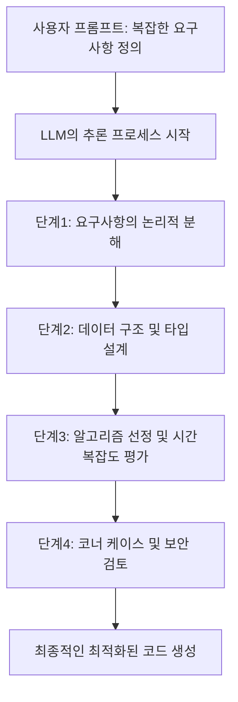
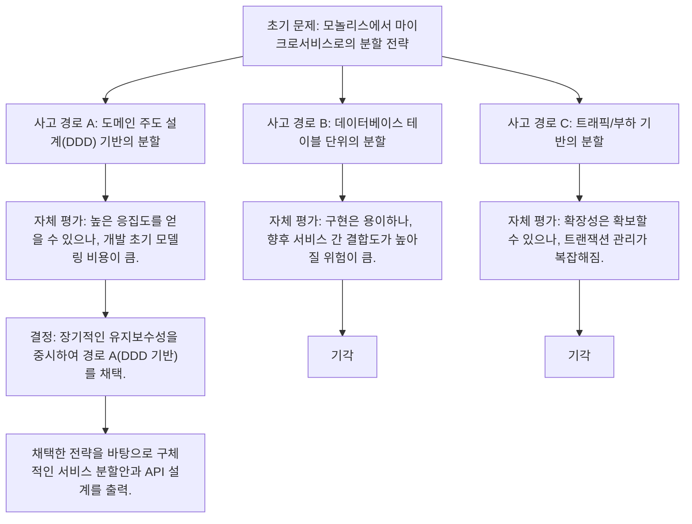
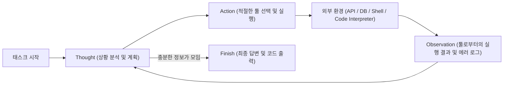
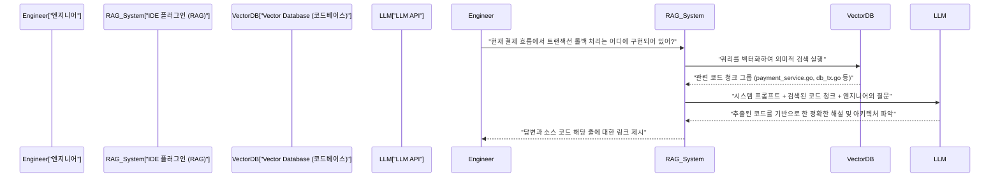

# 시작하며: 왜 엔지니어가 프롬프트 엔지니어링을 배워야 하는가

소프트웨어 개발의 세계는 대규모 언어 모델(LLM)의 급격한 진화로 인해 전례 없는 패러다임 시프트의 한가운데에 있습니다. Andrejs Karpathy가 제창한 'Software 2.0(신경망에 의한 개발)'에서, 이제는 'Software 3.0(자연어를 통한 프롬프트 주도 개발)'으로 이행하고 있다고 해도 과언이 아닙니다.

GitHub Copilot, Cursor, 혹은 각종 LLM API를 활용한 AI 어시스턴트 툴의 보급으로 인해 엔지니어의 주요 업무는 '코드를 처음부터 작성하는 것'에서 'AI가 의도한 코드를 생성하도록 지시를 설계하고, 생성된 코드를 리뷰 및 통합하는 것'으로 변화하고 있습니다.

이 새로운 개발 방식에서 가장 중요한 스킬이 **프롬프트 엔지니어링(Prompt Engineering)**입니다. 프롬프트 엔지니어링은 'AI와의 능숙한 대화'와 같은 비엔지니어 대상의 버즈워드로 흔히 이야기되지만, 그 본질은 **비결정론적(Non-deterministic)인 계산 시스템에 대한 새로운 형태의 프로그래밍 언어**입니다.

본 문서에서는 소프트웨어 엔지니어나 아키텍트를 대상으로, LLM 이면의 수학적·아키텍처적 기초부터 Few-Shot, Chain-of-Thought, ReAct와 같은 고도화된 프롬프트 엔지니어링 기법, 그리고 실제 개발 워크플로우나 API에 어떻게 통합하는지까지 약 10,000자 분량으로 매우 상세히 해설합니다.

---

## 1. 대규모 언어 모델(LLM)의 기초와 수학적 배경

프롬프트를 최적화하고 의도한 대로의 출력을 안정적으로 얻기 위해서는, LLM이 내부적으로 텍스트나 코드를 어떻게 처리하고 생성하는지에 대한 '블랙박스 내부'를 수학적·구조적으로 이해하는 것이 필수적입니다. 현대 LLM의 대부분은 Transformer 아키텍처를 사용한 자기회귀형(Auto-regressive) 언어 모델입니다.

### 1.1 토큰화(Tokenization)와 BPE

LLM은 원시 텍스트 문자열을 직접 처리하지 않습니다. 텍스트는 **토큰(Token)**이라 불리는 작은 단위로 분할됩니다. 많은 모델이 Byte-Pair Encoding (BPE)라는 알고리즘을 사용하고 있습니다.

엔지니어에게 토큰화에 대한 이해는 중요합니다. 왜냐하면 프로그래밍 언어에서 들여쓰기(공백)나 특수 기호가 어떻게 토큰화되는지가 코드 생성의 품질과 직결되기 때문입니다. 예를 들어 Python 코드 생성에서는 공백의 수(공백 4개인지, 탭인지)가 독립적인 토큰으로 취급되는 경우가 많아, 프롬프트 내에서 들여쓰기 규칙을 명확히 하지 않으면 구문 오류를 일으키는 원인이 됩니다.

### 1.2 다음 토큰 예측(Next Token Prediction)

자기회귀형 LLM의 기본적인 태스크는 주어진 입력 시퀀스(컨텍스트)에 이어지는 '가장 확률이 높은 다음 1개의 토큰'을 예측하는 것입니다. 이를 수학적으로 표현하면 다음과 같은 조건부 확률의 최대화 문제가 됩니다.

$$ P(w_t | w_{1}, w_{2}, \dots, w_{t-1}) $$

여기서 $w_i$는 토큰을 나타내며, $t$는 현재의 타임스텝입니다. 모델은 내부의 신경망을 통해 입력 토큰 그룹으로부터 다음 토큰의 확률 분포를 계산합니다. 생성된 토큰은 다음 스텝의 입력으로 자기회귀적으로 추가되며, 이 과정은 종료 토큰(`<EOS>` 등)이 출력될 때까지 반복됩니다.

### 1.3 어텐션 메커니즘(Attention Mechanism)과 컨텍스트 윈도우

Transformer 아키텍처의 핵심을 이루는 것이 Self-Attention 메커니즘입니다. 이를 통해 모델은 시퀀스 내에서 멀리 떨어진 토큰들 간의 의존 관계를 계산할 수 있습니다.

$$ \text{Attention}(Q, K, V) = \text{softmax}\left(\frac{Q K^T}{\sqrt{d_k}}\right) V $$

여기서 $Q$(Query), $K$(Key), $V$(Value)는 입력 표현으로부터 생성된 행렬이며, $d_k$는 스케일링 팩터입니다. 이 수식이 의미하는 것은 "현재 처리하고 있는 단어(Query)가 과거의 어떤 단어(Key)에 주목(Attention)해야 하는지를 계산하고 그 정보(Value)를 가져온다"는 과정입니다.

프롬프트 엔지니어링에서 이 메커니즘의 이해가 왜 중요할까요? 그것은 **컨텍스트 윈도우(Context Window)**의 개념과 직결되기 때문입니다. 입력 프롬프트가 너무 길어지면 중요한 지시가 컨텍스트 중간에 묻혀버려, Attention의 가중치가 분산되는 'Lost in the middle(중간 정보의 소실)'이라는 현상이 발생합니다. 방대한 문서나 코드베이스 전체를 프롬프트에 그대로 던지는 것이 아니라, 필요한 청크만을 정확하게 추출하여 전달하는 노력이 필요합니다.

### 1.4 온도 파라미터(Temperature)를 통한 샘플링 제어

출력층에서는 일반적으로 Softmax 함수를 사용하여 로짓(모델의 원시 출력)을 확률 분포로 변환합니다. 여기서 생성의 다양성(무작위성)을 제어하기 위해 **Temperature(온도 파라미터 $T$)**가 도입됩니다.

$$ p_i = \frac{\exp(z_i / T)}{\sum_j \exp(z_j / T)} $$

- $z_i$는 어휘 사전 상의 토큰 $i$의 로짓(점수)입니다.
- $T = 1.0$일 경우, 표준적인 Softmax가 됩니다.
- $T \to 0$에 가까워질수록 확률 분포가 뾰족해져서, 가장 확률이 높은 토큰만이 선택되게 됩니다(결정론적, Greedy Decoding).
- $T > 1.0$일 경우, 확률 분포가 평탄해져서 평소에 선택되지 않던 마이너한 토큰들도 선택되기 쉬워집니다(창의성이 증가).

**엔지니어를 위한 실전적 접근:**
API를 거쳐 코드 생성이나 JSON 데이터 추출(Structured Output)을 수행하게 할 경우, 환각(Hallucination)을 방지하고 재현성을 높이기 위해 $T=0.0 \sim 0.2$의 매우 낮은 값을 설정하는 것이 정석입니다. 반면, 아키텍처의 브레인스토밍이나 명명 규칙 아이디어 도출 등 탐색적인 태스크에서는 $T=0.7 \sim 1.0$으로 설정합니다.

---

## 2. 프롬프트의 구조 아키텍처: System Prompt vs User Prompt

OpenAI의 API(GPT-4 등)나 Anthropic의 API(Claude 등)를 이용하여 AI 애플리케이션을 구축할 때, 프롬프트는 단일 텍스트 블록이 아니라 메시지의 배열로 구조화됩니다. 그중에서 가장 중요한 것이 'System Prompt(시스템 프롬프트)'와 'User Prompt(사용자 프롬프트)'의 분리입니다.

### 2.1 시스템 프롬프트: 글로벌 제약과 페르소나의 정의

시스템 프롬프트는 LLM에 대한 **글로벌 제약, 페르소나(역할), 그리고 기본이 되는 행동 규칙**을 정의하는 것입니다. 소프트웨어 설계에 비유하자면, 애플리케이션의 '환경 변수'나 '베이스 클래스', 혹은 컨테이너의 'Dockerfile'과 같은 역할을 수행합니다.

뛰어난 시스템 프롬프트는 출력의 품질과 포맷을 극적으로 안정화시킵니다.

```text
# System Prompt의 예
당신은 세계 최고 수준의 시니어 Go 엔지니어이며, 동시성 처리(Goroutine/Channel) 설계에 정통합니다.
다음의 엄격한 규칙에 따라 답변을 생성해 주세요.

【규칙】
1. 코드를 제공할 때는 반드시 실행 가능한 완전한 함수로 제공할 것.
2. 에러 핸들링은 생략하지 말고, Go의 관습에 따라 `if err != nil`로 명시적으로 처리할 것.
3. 코드 블록 이외의 설명은 글머리 기호를 사용하고, 3문장 이내로 작성할 것.
4. 보안 상의 우려(SQL 인젝션, 레이스 컨디션 등)가 있는 구현이 요구되었을 때는 안전한 대안을 제시할 것.
5. 출력 포맷은 설명과 Markdown 코드 블록으로만 할 것.
```

### 2.2 사용자 프롬프트: 일시적인 태스크와 데이터의 주입

사용자 프롬프트는 구체적인 태스크, 질문, 또는 처리 대상의 입력 데이터를 제공하는 것입니다. 시스템 프롬프트로 구축된 컨텍스트 환경 안에서 실행되는 '함수 호출(함수에 인자 전달)'에 해당합니다.

```text
# User Prompt의 예
다수의 URL 목록으로부터 이미지를 비동기적으로 다운로드하고, 로컬 디스크에 저장하는 함수를 구현해 주세요.
워커의 개수는 인자로 제어할 수 있게 하고, 컨텍스트(context.Context)를 이용한 타임아웃 처리를 구현에 포함해 주세요.
```

시스템 프롬프트를 견고하게 설정해 둠으로써, 사용자(혹은 시스템의 다른 컴포넌트)로부터 주입되는 변동성 높은 사용자 프롬프트에 대해 출력의 안정성을 담보할 수 있습니다. 또한, 악의적인 사용자 입력에 의한 '프롬프트 인젝션' 공격에 대한 방어의 최전선으로서도 기능합니다.

---

## 3. 핵심 프롬프트 엔지니어링 기술군

여기서부터는 소프트웨어 개발 태스크의 정확도를 극적으로 향상시키기 위한 구체적인 프롬프팅 패러다임을 해설합니다.

### 3.1 Zero-Shot Prompting과 Few-Shot Prompting

**Zero-Shot Prompting**은 태스크의 지시만을 주며 예시를 전혀 제공하지 않고 모델에게 해답을 요구하는 기법입니다. "Python으로 퀵 정렬을 짜줘"와 같은 일반적인 요구라면, 현재의 고도화된 LLM은 Zero-Shot으로도 충분히 기능합니다.

하지만 프로젝트 고유의 코딩 규약을 따르게 하고 싶거나, 특정 JSON 스키마를 출력하게 하고 싶은 경우 Zero-Shot으로는 포맷이 깨질 확률이 높습니다. 이를 해결하는 것이 **Few-Shot Prompting**입니다.

Few-Shot Prompting은 프롬프트 내에 '입력과 기대되는 출력의 쌍(데몬스트레이션)'을 몇 개 제시하는 기법입니다. 모델의 파라미터를 업데이트하지 않고, 프롬프트 컨텍스트 내에서 패턴을 학습하는 'In-Context Learning(컨텍스트 내 학습)'이라는 현상을 이용하고 있습니다.

```text
# Few-Shot Prompting의 예 (로그 분석 태스크)
다음의 원시 로그를 분석하고, 구조화된 JSON 객체를 추출해 주세요.

예1：
입력: "[2023-10-01 10:00:05] ERROR [AuthService] Failed to authenticate user id=12345: Invalid password"
출력: {"timestamp": "2023-10-01T10:00:05Z", "level": "ERROR", "service": "AuthService", "message": "Failed to authenticate user", "user_id": 12345}

예2：
입력: "[2023-10-01 10:05:12] WARN [DBPool] Connection timeout approaching for query_id=987"
출력: {"timestamp": "2023-10-01T10:05:12Z", "level": "WARN", "service": "DBPool", "message": "Connection timeout approaching", "query_id": 987}

태스크 입력：
입력: "[2023-10-01 10:15:30] FATAL [PaymentGateway] API rate limit exceeded. Retry after 60s"
출력:
```

이렇게 예시를 제공함으로써, 모델은 `timestamp`의 포맷(ISO 8601로의 변환)이나 키의 명명 규칙을 암묵적으로 학습하고, 완벽한 JSON을 출력하게 됩니다.

### 3.2 Chain-of-Thought (CoT)와 Zero-Shot CoT

LLM의 추론 능력에 관한 획기적인 발전이 바로 **Chain-of-Thought (CoT: 사고의 사슬)**입니다. 복잡한 로직을 필요로 하는 태스크(예: 복잡한 알고리즘 구현, 난해한 버그 추적, 정규 표현식 작성 등)에 있어서 LLM에게 다짜고짜 최종 코드를 출력하게 하면, 논리의 비약이나 오류(환각)가 발생하기 쉽습니다.

CoT는 최종적인 답변을 출력하기 전에 중간적인 추론 프로세스(사고 과정)를 언어화하게 하는 기법입니다. 모델 스스로가 단계별(Step-by-step)로 상황을 분석하게 함으로써 토큰 생성 시마다 컨텍스트가 풍부해지고 최종적인 결론의 정확성이 비약적으로 향상됩니다.

가장 단순하고 강력한 테크닉이 프롬프트의 끝에 "**단계별로 차근차근 생각해 봅시다(Let's think step by step)**"라는 마법의 문구를 덧붙이는 **Zero-Shot CoT**입니다.

개발에 있어서는 이 개념을 응용하여 다음과 같이 프롬프트를 구조화합니다.

```text
다음의 사양을 만족하는 React 컴포넌트를 작성해 주세요.
【사양】...

코드를 생성하기 전에, 다음 단계로 사고 프로세스(<thinking> 태그 내)를 기술해 주세요.
1. 필요한 상태(State)의 특정 및 데이터 구조의 설계
2. 발생할 수 있는 에지 케이스와 에러 핸들링의 검토
3. 컴포넌트의 분할 단위 검토

사고 프로세스가 완료된 후, 최종적인 TypeScript 코드를 작성해 주세요.
```



### 3.3 Tree of Thoughts (ToT)

CoT의 개념을 한층 더 확장한 것이 **Tree of Thoughts (ToT)**입니다. CoT가 외길(선형) 형태의 추론 경로를 따라가는 반면, ToT는 탐색 트리처럼 다수의 추론 경로(가지)를 병렬로 전개하고, 각 경로를 모델 스스로가 자체 평가하도록 하여 역추적(백트래킹)을 수행하며 최적의 해결책에 도달하는 기법입니다.

ToT는 시스템 아키텍처의 설계, 복잡한 데이터베이스 스키마 설계, 또는 대규모 리팩토링 계획 등 탐색 공간이 넓고 국소 최적화에 빠지기 쉬운 문제에 매우 유효합니다.



ToT를 프롬프트로 구현하려면, "여러 접근 방식을 제안하고, 각각의 장단점을 평가한 후에 가장 뛰어난 접근 방식을 채택하여 구현해 주세요"라고 지시합니다.

---

## 4. Agentic Workflow와 ReAct (Reasoning and Acting)

LLM의 응용은 단일 텍스트 입출력에서 자율적으로 계획을 세우고 외부 환경과 상호작용하면서 태스크를 완수하는 **AI 에이전트(AI Agents)**의 영역으로 급속히 진화하고 있습니다. 이 에이전트 아키텍처의 핵심을 이루는 패러다임이 **ReAct (Reasoning and Acting)**입니다.

### 4.1 ReAct 프레임워크의 개념

기존의 LLM은 '생각하고 나서 대답하기(CoT)'는 가능했지만, 자신의 지식 결핍을 메우기 위해 '행동'할 수는 없었습니다. ReAct 프레임워크는 LLM에게 '사고(Thought)'와 '행동(Action)'을 번갈아 반복하게 함으로써 이 한계를 돌파합니다.

모델은 문제를 분석하고(Thought), 정보가 부족하다고 판단하면 외부 툴(웹 검색, 데이터베이스 쿼리, 셸 명령, API 호출 등)을 실행합니다(Action). 툴의 실행 결과(Observation)를 수신하고, 그것을 새로운 컨텍스트로 삼아 더욱 사고를 진행하여 최종적인 답(Finish)에 도달할 때까지 이 루프를 돌립니다.



### 4.2 Function Calling (Tool Use)에 의한 구현

ReAct를 시스템에 편입하기 위한 표준적인 인터페이스가 OpenAI나 Anthropic이 제공하는 **Function Calling(함수 호출 / 툴 사용)**입니다.

엔지니어는 LLM에게 시스템 프롬프트와 함께 '사용 가능한 툴 그룹의 정의(JSON 스키마)'를 전달합니다. LLM은 프롬프트의 컨텍스트를 분석하여 툴을 사용해야 한다고 판단할 경우, 일반적인 텍스트가 아닌 '호출할 함수명'과 '해당 인자의 JSON'을 출력합니다. 애플리케이션 측에서 그 함수를 실행하고 그 결과를 다시 LLM에 반환함으로써 루프가 형성됩니다.

**개발에의 응용 예 (자율형 디버깅 에이전트):**
CI/CD 파이프라인에서 테스트가 실패했을 때 원인을 조사하고 패치를 생성하는 에이전트를 구축할 경우, 다음과 같은 툴을 LLM에 제공합니다.

1. `search_codebase(regex_pattern)`: 저장소 내의 코드를 정규 표현식으로 검색한다.
2. `view_file_content(file_path, start_line, end_line)`: 지정한 파일의 내용을 읽어온다.
3. `run_unit_test(test_file_path)`: 특정 단위 테스트를 실행하고 트레이스백을 가져온다.
4. `propose_patch(file_path, diff_content)`: 수정 패치를 제안한다.

LLM은 자율적으로 다음과 같이 추론과 행동을 진행합니다.
- **Thought**: 테스트 로그를 보니 `src/auth.py`의 45번째 줄에서 `KeyError: 'user_id'`가 발생하고 있다. 주변 코드를 확인할 필요가 있다.
- **Action**: `view_file_content(file_path="src/auth.py", start_line=30, end_line=60)`
- **Observation**: (애플리케이션이 파일 내용을 읽어 LLM에 반환)
- **Thought**: 과연, API의 응답 JSON에 `user_id`가 포함되지 않은 케이스에 대한 유효성 검사가 누락되어 있다. 안전한 `.get()` 메서드로 다시 작성하는 패치를 만들어야겠다.
- **Action**: `propose_patch(...)`

이처럼 프롬프트 엔지니어링은 '텍스트 생성의 제어'에서 '툴의 정의와 에이전트 루프 설계(오케스트레이션)'로 차원이 한 단계 올라가고 있습니다.

---

## 5. RAG (Retrieval-Augmented Generation)와 코드베이스 통합

LLM의 가장 큰 약점 중 하나가 사전 학습 데이터에 포함되지 않은 '프라이빗한 정보'나 '최신 정보'를 모른다는 것입니다. 사내의 비공개 리포지토리나 독자적인 API 사양에 대해 질문해도, LLM은 태연하게 거짓말(환각)을 하거나 일반적인 답변밖에 하지 못합니다.

이를 해결하는 아키텍처가 **RAG (검색 증강 생성)**입니다. RAG는 정보 검색(Retrieval)과 LLM의 생성 능력(Generation)을 결합한 기술입니다.

### 5.1 임베딩(Embeddings)과 벡터 검색

RAG의 근저에 있는 것은 수학적인 벡터 공간 모델입니다. 소스 코드나 사내 문서는 Embedding 모델(예: `text-embedding-3-small`)에 의해 고차원 벡터(예: 1536차원의 부동소수점 배열)로 변환되어 Vector Database에 저장됩니다.

사용자가 질문(쿼리)을 입력하면, 쿼리도 같은 모델을 통해 벡터화되고 데이터베이스 내의 문서 벡터 간에 **코사인 유사도(Cosine Similarity)**가 계산됩니다.

$$ \text{Cosine Similarity}(A, B) = \frac{A \cdot B}{\|A\| \|B\|} = \frac{\sum_{i=1}^{n} A_i B_i}{\sqrt{\sum_{i=1}^{n} A_i^2} \sqrt{\sum_{i=1}^{n} B_i^2}} $$

유사도가 높은(의미적으로 가까운) 코드 스니펫이나 문서가 상위 몇 건 취득되며, 그것이 '컨텍스트'로서 사용자 프롬프트에 동적으로 주입됩니다.

### 5.2 개발 워크플로우로의 RAG 응용

개발 툴에 RAG를 통합함으로써 IDE 내에서 다음과 같은 강력한 기능이 구현됩니다.



코드베이스용 RAG를 구축할 때 중요한 프롬프트 엔지니어링 테크닉 중 하나는, 단순히 코드를 청크로 나누는 것뿐만 아니라 "각 함수의 Docstring이나 클래스의 추상 구문 트리(AST)로부터 생성한 요약"도 벡터화 대상에 포함시키는 것으로 검색 정확도를 비약적으로 향상시킬 수 있습니다.

---

## 6. 엔지니어링에서의 실전적 유스케이스와 고도화된 프롬프트 예

프롬프트 엔지니어링의 이론을 일상적인 개발 업무 자동화 및 효율화에 어떻게 응용할 것인지, 실전 유스케이스와 프롬프트 테크닉을 소개합니다.

### 6.1 코드 리뷰 자동화와 정적 분석의 보완

CI 파이프라인에 LLM을 포함하여 풀 리퀘스트(PR) 생성 시 자동으로 코드 리뷰를 수행하게 합니다. 린트(Lint) 툴이나 정적 분석 툴로는 감지할 수 없는 비즈니스 로직의 불일치나 설계상의 안티 패턴을 지적하게 하는 것이 목적입니다.

**프롬프트 예 (구조화된 출력 요구):**
```text
당신은 엄격하고 경험이 풍부한 시니어 소프트웨어 엔지니어입니다.
제공되는 Pull Request의 변경 사항(Git Diff)을 분석하고 코드 리뷰를 수행해 주세요.

【리뷰의 포커스 영역】
1. 보안 취약성(인젝션, XSS, 인가 우회 등)
2. 성능 병목 현상(N+1 쿼리 문제, 비효율적인 루프 계산 등)
3. 유지보수성과 가독성(SOLID 원칙 위반, 지나치게 복잡한 중첩 등)

【제약 사항】
- 단순한 포맷 위반(들여쓰기 등)은 Lint 툴의 역할이므로 지적하지 마십시오.
- 문제가 없을 경우에는 억지로 지적을 짜내지 말고 빈 배열을 반환하십시오.
- 출력은 반드시 다음의 JSON 스키마를 따라야 합니다. Markdown 백틱(```json)으로 둘러싸지 마십시오.

【기대하는 JSON 출력 포맷】
{
  "review_comments": [
    {
      "file_path": "string",
      "line_number": "integer",
      "severity": "High | Medium | Low",
      "issue_title": "string",
      "detailed_description": "string",
      "suggested_code_fix": "string"
    }
  ]
}

[Git Diff Data]
{{PR_DIFF}}
```

이 프롬프트의 핵심은 LLM의 출력을 파싱하기 쉬운 JSON으로 강제하는 것과 Lint 툴의 역할 및 LLM의 역할을 명확히 분리하는(시스템 경계 정의) 것에 있습니다.

### 6.2 제로샷 코드 생성 시의 '방어적 프롬프팅 (Defensive Prompting)'

AI에게 코드를 작성하게 할 때 흔히 발생하는 문제가 '존재하지 않는 라이브러리(환각)를 멋대로 import 한다', '필요한 변수 정의를 생략한다(`# 처리를 여기에 작성` 등으로 생략됨)'와 같은 현상입니다. 이를 방지하기 위해 프롬프트 내에 강력한 가드레일을 설치하는 '방어적 프롬프팅'을 수행합니다.

**방어적 프롬프트의 중요 요소:**
1. **생략 금지:** "코드를 생략하거나 플레이스홀더(`// ...` 등)를 사용하지 말고, 복사 및 붙여넣기 하여 그대로 실행할 수 있는 완전한 파일을 생성해 주세요."
2. **환각 방지:** "요구사항을 충족하기 위한 표준 라이브러리가 존재하지 않는 경우, 멋대로 존재하지 않는 서드파티 라이브러리를 날조하지 마십시오. 그럴 경우 외부 라이브러리 설치가 필요함을 명시한 뒤, 가장 표준적인 라이브러리(예: requests)를 사용한 코드를 제안해 주세요."
3. **자기 완결성 요구:** "모든 변수와 함수는 코드 블록 내에서 적절히 정의되어야 합니다."

### 6.3 속성 기반 테스트 / 에지 케이스 테스트 자동 생성

엔지니어가 구현한 함수에 대해 LLM이 코너 케이스를 찾아내고 테스트 코드를 생성하게 합니다. 사람의 편견이나 선입견을 배제하는 데 매우 효과적입니다.

```text
다음 Python 함수는 주어진 문자열이 유효한 IPv4 주소인지 여부를 판별합니다.
이 함수를 위한 포괄적인 pytest 기반의 단위 테스트 스위트를 작성해 주세요.

【조건】
- 정상적인 테스트 케이스뿐만 아니라, 다음과 같은 에지 케이스를 철저하게 망라할 것.
  - 경곗값 (0, 255, 256 등)
  - 타입이 다른 입력 (정수, None, 리스트 등)
  - 공백이나 특수 문자가 포함된 문자열
  - 점의 개수가 이상한 케이스 (3개 미만, 4개 이상)
- 파라미터화 테스트(`@pytest.mark.parametrize`)를 활용하여 테스트 코드를 간결하게 유지할 것.

[함수 코드]
def is_valid_ipv4(ip_str):
    # 구현...
```

---

## 7. 프롬프트 평가와 LLMOps (Eval)

소프트웨어 엔지니어링 세계에서 테스트되지 않은 코드는 레거시 코드라고 불립니다. 프롬프트 엔지니어링에 있어서도 완전히 똑같은 말을 할 수 있습니다. '수작업으로 몇 번 시도해보고 잘 동작했던 프롬프트'를 프로덕션 환경에 배포하는 것은 지극히 위험합니다.

기반 모델의 버전 업그레이드나 다루는 도메인 데이터의 변화에 따라 프롬프트의 동작은 쉽게 망가집니다. 이를 방지하기 위해 프롬프트의 출력을 정량적으로 평가하는 **Evaluation (Eval)** 체계(LLMOps)를 구축하는 것이 필수적입니다.

### 7.1 LLM-as-a-Judge (LLM에 의한 LLM 평가)

코드 생성이나 텍스트 요약 같은 태스크에서는 완전 일치(Exact Match) 기반의 테스트가 불가능합니다. 자연어 처리의 고전적인 평가지표(BLEU나 ROUGE) 또한 의미의 정확성을 측정하기에는 역부족입니다.

현재의 업계 표준은 강력한 모델(예: GPT-4o나 Claude 3.5 Sonnet)을 '심사위원(Judge)'으로 사용하여, 대상 LLM이 출력한 결과를 채점하게 하는 **LLM-as-a-Judge**라는 기법입니다.

1. **테스트 셋 준비**: 입력 데이터와 이상적인 출력(혹은 평가 기준)의 쌍을 수십~수백 건 준비합니다.
2. **실행**: 평가 대상 프롬프트와 모델을 사용하여 테스트 셋에 대한 출력을 생성하게 합니다.
3. **평가**: 평가용 프롬프트(메타 프롬프트)를 준비하여 Judge LLM에게 "생성된 출력이 요구사항을 충족하는지 1~5점으로 점수를 매기시오"라고 지시합니다.

이를 통해 프롬프트를 수정했을 때의 성능 퇴행(Regression)을 CI/CD 파이프라인 상에서 자동 감지할 수 있게 됩니다. 프롬프트 엔지니어링은 장인 정신의 '프롬프트 만지작거리기'에서, 데이터 기반의 재현성 있는 '엔지니어링(공학)'으로 진화하고 있습니다.

---

## 8. 맺음말: 프롬프트는 소프트웨어의 새로운 컴포넌트이다

AI가 코드를 작성하는 시대에 '프로그래밍의 종말'이 부르짖어지기도 하지만 현실은 다릅니다. 엔지니어에게 요구되는 추상화의 계층이 하나 올라갔을 뿐입니다.

과거 우리가 어셈블리어에서 C 언어로, 그리고 가비지 컬렉션을 갖춘 고급 언어로 이행함으로써 메모리 관리의 번거로움에서 해방되고 더 복잡한 비즈니스 로직 구축에 집중할 수 있게 되었습니다. LLM과 프롬프트 엔지니어링은 이를 잇는 다음 추상화의 물결입니다.

1. **아키텍처의 이해**: LLM의 확률적인 성질(자기회귀, Attention, Temperature)을 이해하고 시스템의 비결정성을 제어한다.
2. **컨텍스트의 설계**: System Prompt를 통한 제약과 Few-Shot/CoT를 활용한 의도의 명확한 전달.
3. **에이전트적 사고와 툴 통합**: ReAct 패러다임을 구사하여 LLM을 시스템의 오케스트레이터로 활용한다.
4. **지속적 평가**: 프롬프트를 코드의 일부로서 버전 관리하고, Eval을 통해 테스트 주도적으로 개선을 이어간다.

이러한 원칙을 마스터함으로써 프롬프트는 단순한 문자열이 아닌 견고하고 확장 가능한 소프트웨어 컴포넌트가 됩니다. 본 문서에서 해설한 고도화된 프롬프트 엔지니어링 기법을 자신의 개발 워크플로우나 프로덕트에 편입시켜 차세대 'Software 3.0'을 주도하는 엔지니어로서 활약하시기를 바랍니다.

---
*Generated using Prompt Engineering Techniques.*
