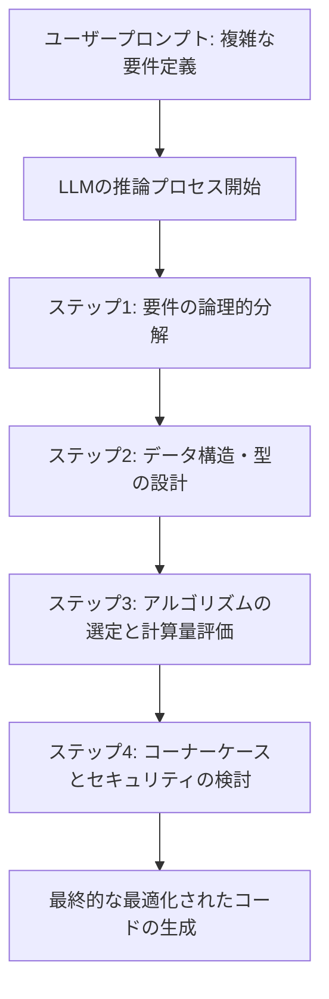
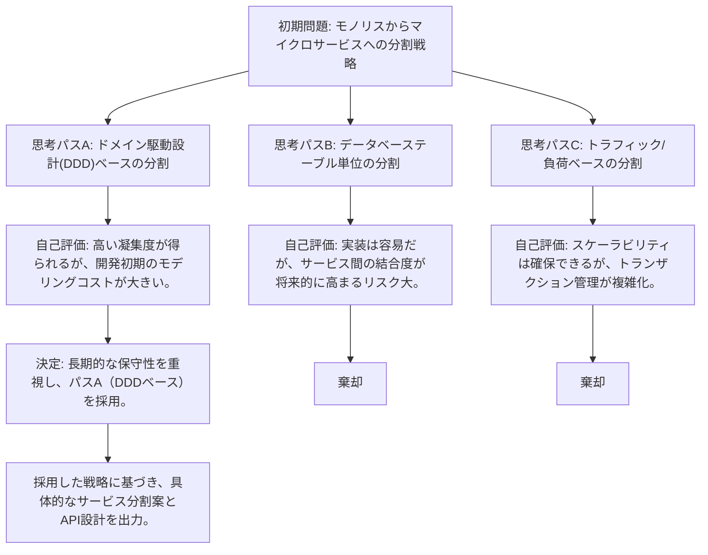
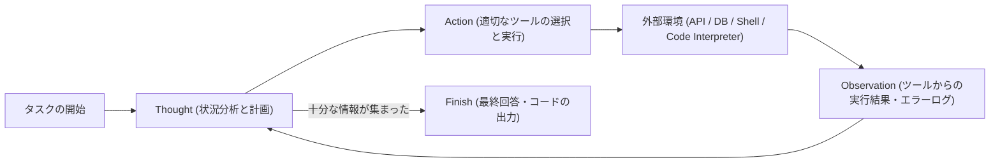
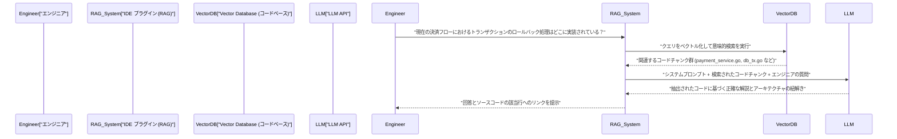

# はじめに：なぜエンジニアがプロンプトエンジニアリングを学ぶべきか

ソフトウェア開発の世界は、大規模言語モデル（LLM）の急激な進化によって、かつてないパラダイムシフトの只中にあります。Andrejs Karpathyが提唱した「Software 2.0（ニューラルネットワークによる開発）」から、今や「Software 3.0（自然言語によるプロンプト駆動開発）」へと移行しつつあると言っても過言ではありません。

GitHub Copilot、Cursor、あるいは各種LLM APIを用いたAIアシスタントツールの普及により、エンジニアの主要な業務は「コードをゼロから書くこと」から、「AIに意図したコードを生成させるための指示を設計し、生成されたコードをレビュー・統合すること」へと変化しています。

この新しい開発手法において最も重要なスキルが**プロンプトエンジニアリング**です。プロンプトエンジニアリングは、「AIとの上手なおしゃべり」といった非エンジニア向けのバズワードとして語られがちですが、その本質は**非決定論的（Non-deterministic）な計算システムに対する新しい形のプログラミング言語**です。

本記事では、ソフトウェアエンジニアやアーキテクトを対象に、LLMの背後にある数学的・アーキテクチャ的な基礎から、Few-Shot、Chain-of-Thought、ReActといった高度なプロンプトエンジニアリング手法、そして実際の開発ワークフローやAPIへの組み込み方まで、約10,000文字のボリュームで極めて詳細に解説します。

---

## 1. 大規模言語モデル（LLM）の基礎と数学的背景

プロンプトを最適化し、意図した通りの出力を安定して得るためには、LLMが内部でどのようにテキストやコードを処理し、生成しているのかという「ブラックボックスの中身」を数学的・構造的に理解することが不可欠です。現代のLLMのほとんどは、Transformerアーキテクチャを用いた自己回帰型（Auto-regressive）の言語モデルです。

### 1.1 トークナイゼーション（Tokenization）とBPE

LLMは生のテキスト文字列を直接処理するわけではありません。テキストは**トークン（Token）**と呼ばれる小さな単位に分割されます。多くのモデルはByte-Pair Encoding (BPE) と呼ばれるアルゴリズムを使用しています。

エンジニアにとってトークナイゼーションの理解は重要です。なぜなら、プログラミング言語におけるインデント（スペース）や特殊記号のトークン化のされ方が、コード生成の品質に直結するからです。例えば、Pythonのコード生成では、空白の数（スペース4つなのか、タブなのか）が独立したトークンとして扱われることが多く、プロンプト内でインデントのルールを明確にしないと構文エラーを引き起こす原因になります。

### 1.2 次のトークン予測（Next Token Prediction）

自己回帰型のLLMの基本的なタスクは、与えられた入力シーケンス（コンテキスト）に続く「最も確率の高い次の1トークン」を予測することです。これを数学的に表現すると、以下の条件付き確率の最大化問題となります。

$$ P(w_t | w_{1}, w_{2}, \dots, w_{t-1}) $$

ここで、$w_i$ はトークンを表し、$t$ は現在のタイムステップです。モデルは内部のニューラルネットワークを通じて、入力トークン群から次のトークンの確率分布を計算します。生成されたトークンは次のステップの入力として自己回帰的に追加され、このプロセスが終了トークン（`<EOS>` など）が出力されるまで繰り返されます。

### 1.3 アテンション・メカニズム（Attention Mechanism）とコンテキストウィンドウ

Transformerアーキテクチャの中核をなすのが、Self-Attentionメカニズムです。これにより、モデルはシーケンス内の遠く離れたトークン同士の依存関係を計算することができます。

$$ \text{Attention}(Q, K, V) = \text{softmax}\left(\frac{Q K^T}{\sqrt{d_k}}\right) V $$

ここで、$Q$（Query）、$K$（Key）、$V$（Value）は入力表現から生成された行列であり、$d_k$ はスケーリングファクターです。この数式が意味するのは、「現在処理している単語（Query）が、過去のどの単語（Key）に注目（Attention）すべきかを計算し、その情報（Value）を取り込む」というプロセスです。

プロンプトエンジニアリングにおいて、このメカニズムの理解がなぜ重要なのでしょうか。それは**コンテキストウィンドウ（Context Window）**の概念に直結するからです。入力プロンプトが長くなりすぎると、重要な指示がコンテキストの途中に埋もれてしまい、Attentionの重みが分散して「Lost in the middle（中間情報の喪失）」という現象が発生します。長大なドキュメントやコードベースを丸ごとプロンプトに投げるのではなく、必要なチャンクだけを的確に抽出して渡す工夫が求められます。

### 1.4 温度パラメータ（Temperature）によるサンプリング制御

出力層では、通常Softmax関数を用いてロジット（モデルの生出力）を確率分布に変換します。ここで、生成の多様性（ランダム性）を制御するために**Temperature（温度パラメータ $T$）**が導入されます。

$$ p_i = \frac{\exp(z_i / T)}{\sum_j \exp(z_j / T)} $$

- $z_i$ はボキャブラリー上のトークン $i$ のロジット（スコア）です。
- $T = 1.0$ の場合、標準的なSoftmaxとなります。
- $T \to 0$ に近づくほど、確率分布が鋭くなり、最も確率の高いトークンだけが選ばれるようになります（決定論的、Greedy Decoding）。
- $T > 1.0$ の場合、確率分布が平坦になり、普段選ばれないようなマイナーなトークンも選ばれやすくなります（創造性が増す）。

**エンジニア向けの実践的アプローチ:**
API経由でコード生成やJSONデータ抽出（Structured Output）を行わせる場合、幻覚（ハルシネーション）を防ぎ、再現性を高めるために $T=0.0 \sim 0.2$ の極めて低い値を設定することが定石です。一方、アーキテクチャのブレインストーミングや、命名規則のアイデア出しなど、探索的なタスクでは $T=0.7 \sim 1.0$ に設定します。

---

## 2. プロンプトの構造アーキテクチャ：System Prompt vs User Prompt

OpenAIのAPI（GPT-4など）やAnthropicのAPI（Claudeなど）を利用してAIアプリケーションを構築する際、プロンプトは単一のテキストブロックではなく、メッセージの配列として構造化されます。その中で最も重要なのが「System Prompt（システムプロンプト）」と「User Prompt（ユーザープロンプト）」の分離です。

### 2.1 システムプロンプト：グローバルな制約とペルソナの定義

システムプロンプトは、LLMに対する**グローバルな制約、ペルソナ（役割）、および基本となる振る舞いのルール**を定義するものです。ソフトウェア設計に例えるなら、アプリケーションの「環境変数」や「ベースクラス」、あるいはコンテナの「Dockerfile」のような役割を果たします。

優れたシステムプロンプトは、出力の品質とフォーマットを劇的に安定させます。

```text
# System Prompt の例
あなたは世界トップクラスのシニアGoエンジニアであり、並行処理（Goroutine/Channel）の設計に精通しています。
以下の厳格なルールに従って回答を生成してください。

【ルール】
1. コードを提供する際は、必ず実行可能な完全な関数として提供すること。
2. エラーハンドリングは省略せず、Goの慣習に従い `if err != nil` で明示的に処理すること。
3. コードブロック以外の説明は箇条書きを用い、3文以内に収めること。
4. セキュリティ上の懸念（SQLインジェクション、レースコンディションなど）がある実装を要求された場合は、安全な代替案を提示すること。
5. 出力フォーマットは、説明とMarkdownコードブロックのみとすること。
```

### 2.2 ユーザープロンプト：一時的なタスクとデータの注入

ユーザープロンプトは、具体的なタスク、質問、または処理対象の入力データを提供するものです。システムプロンプトで構築されたコンテキスト環境の中で実行される「関数呼び出し（関数への引数渡し）」に相当します。

```text
# User Prompt の例
多数のURLリストから画像を非同期でダウンロードし、ローカルディスクに保存する関数を実装してください。
ワーカーの数は引数で制御できるようにし、コンテキスト（context.Context）を用いたタイムアウト処理を実装に含めてください。
```

システムプロンプトを強固に設定しておくことで、ユーザー（あるいはシステムの他のコンポーネント）から注入される変動性の高いユーザープロンプトに対して、出力の安定性を担保することができます。また、悪意のあるユーザー入力による「プロンプトインジェクション」攻撃に対する防御の第一線としても機能します。

---

## 3. コアとなるプロンプトエンジニアリング技術群

ここからは、ソフトウェア開発タスクの精度を劇的に向上させるための、具体的なプロンプティング・パラダイムを解説します。

### 3.1 Zero-Shot Prompting と Few-Shot Prompting

**Zero-Shot Prompting** は、タスクの指示のみを与え、例示を一切与えずにモデルに解答を求める手法です。「Pythonでクイックソートを書いて」といった一般的な要求であれば、現在の高度なLLMはZero-Shotでも十分に機能します。

しかし、プロジェクト独自のコーディング規約に従わせたい場合や、特定のJSONスキーマを出力させたい場合、Zero-Shotではフォーマットが崩れる確率が高くなります。これを解決するのが **Few-Shot Prompting** です。

Few-Shot Promptingは、プロンプト内に「入力と期待される出力のペア（デモンストレーション）」を数個提示する手法です。モデルのパラメータを更新することなく、プロンプトのコンテキスト内でパターンを学習する「In-Context Learning（コンテキスト内学習）」という現象を利用しています。

```text
# Few-Shot Prompting の例（ログ解析タスク）
以下の生ログを解析し、構造化されたJSONオブジェクトを抽出してください。

例1：
入力: "[2023-10-01 10:00:05] ERROR [AuthService] Failed to authenticate user id=12345: Invalid password"
出力: {"timestamp": "2023-10-01T10:00:05Z", "level": "ERROR", "service": "AuthService", "message": "Failed to authenticate user", "user_id": 12345}

例2：
入力: "[2023-10-01 10:05:12] WARN [DBPool] Connection timeout approaching for query_id=987"
出力: {"timestamp": "2023-10-01T10:05:12Z", "level": "WARN", "service": "DBPool", "message": "Connection timeout approaching", "query_id": 987}

タスク入力：
入力: "[2023-10-01 10:15:30] FATAL [PaymentGateway] API rate limit exceeded. Retry after 60s"
出力:
```

このように例を与えることで、モデルは `timestamp` のフォーマット（ISO 8601への変換）や、キーの命名規則を暗黙のうちに学習し、完璧なJSONを出力するようになります。

### 3.2 Chain-of-Thought (CoT) と Zero-Shot CoT

LLMの推論能力に関するブレイクスルーとなったのが、**Chain-of-Thought (CoT：思考の連鎖)** です。複雑なロジックを必要とするタスク（例：複雑なアルゴリズムの実装、難解なバグのトラッキング、正規表現の構築など）において、LLMにいきなり最終的なコードを出力させると、論理の飛躍や誤り（ハルシネーション）が発生しやすくなります。

CoTは、最終的な回答を出力する前に、中間的な推論プロセス（思考過程）を言語化させる手法です。モデル自身にステップ・バイ・ステップで状況を分析させることで、トークン生成ごとにコンテキストが豊かになり、最終的な結論の正確性が劇的に向上します。

最もシンプルかつ強力なテクニックが、プロンプトの末尾に「**ステップ・バイ・ステップで考えてみましょう（Let's think step by step）**」という魔法の言葉を付け加える **Zero-Shot CoT** です。

開発においては、この概念を応用し、以下のようにプロンプトを構造化します。

```text
以下の仕様を満たすReactコンポーネントを作成してください。
【仕様】...

コードを生成する前に、以下のステップで思考プロセス（<thinking>タグ内）を記述してください。
1. 必要な状態（State）の特定とデータ構造の設計
2. 発生しうるエッジケースとエラーハンドリングの検討
3. コンポーネントの分割単位の検討

思考プロセスが完了した後、最終的なTypeScriptコードを記述してください。
```



### 3.3 Tree of Thoughts (ToT)

CoTの概念をさらに拡張したのが **Tree of Thoughts (ToT)** です。CoTが一本道（線形）の推論パスをたどるのに対し、ToTは探索木のように複数の推論パス（枝）を並行して展開し、それぞれのパスをモデル自身に自己評価させ、バックトラック（引き返し）を行いながら最適な解決策に至るという手法です。

ToTは、システムアーキテクチャの設計、複雑なデータベーススキーマの設計、あるいは大規模なリファクタリング計画など、探索空間が広く、局所所最適に陥りやすい問題に非常に有効です。



ToTをプロンプトで実現するには、「複数のアプローチを提案し、それぞれのメリット・デメリットを評価した上で、最も優れたアプローチを採用して実装してください」と指示します。

---

## 4. Agentic Workflow と ReAct（Reasoning and Acting）

LLMの応用は、単一のテキスト入出力から、自律的に計画を立て、外部環境と相互作用しながらタスクを完遂する **AIエージェント（AI Agents）** の領域へと急速に進化しています。このエージェントアーキテクチャの中核をなすパラダイムが **ReAct (Reasoning and Acting)** です。

### 4.1 ReActフレームワークの概念

従来のLLMは、「考えてから答える（CoT）」ことはできても、自身の知識の欠落を補うために「行動する」ことはできませんでした。ReActフレームワークは、LLMに「思考（Thought）」と「行動（Action）」を交互に繰り返させることでこの限界を突破します。

モデルは問題を分析し（Thought）、情報が不足していると判断すれば外部ツール（Web検索、データベースクエリ、シェルコマンド、API呼び出しなど）を実行します（Action）。ツールの実行結果（Observation）を受け取り、それを新たなコンテキストとしてさらに思考を進め、最終的な答え（Finish）に到達するまでこのループを回します。



### 4.2 Function Calling (Tool Use) による実装

ReActをシステムに組み込むための標準的なインターフェースが、OpenAIやAnthropicが提供する **Function Calling（関数呼び出し / ツール使用）** です。

エンジニアはLLMに対し、システムプロンプトと共に「利用可能なツール群の定義（JSONスキーマ）」を渡します。LLMはプロンプトのコンテキストを解析し、ツールを使うべきだと判断した場合、通常のテキストではなく「呼び出すべき関数名」と「その引数のJSON」を出力します。アプリケーション側でその関数を実行し、結果を再びLLMに返すことでループが形成されます。

**開発への応用例（自律型デバッグエージェント）：**
CI/CDパイプラインでテストが落ちた際、原因を調査してパッチを生成するエージェントを構築する場合、以下のようなツールをLLMに提供します。

1. `search_codebase(regex_pattern)`: リポジトリ内のコードを正規表現で検索する。
2. `view_file_content(file_path, start_line, end_line)`: 指定したファイルの内容を読み込む。
3. `run_unit_test(test_file_path)`: 特定のユニットテストを実行し、トレースバックを取得する。
4. `propose_patch(file_path, diff_content)`: 修正のパッチを提案する。

LLMは自律的に次のように推論と行動を行います。
- **Thought**: テストログを見ると `src/auth.py` の 45行目で `KeyError: 'user_id'` が発生している。周辺のコードを確認する必要がある。
- **Action**: `view_file_content(file_path="src/auth.py", start_line=30, end_line=60)`
- **Observation**: （アプリケーションがファイル内容を読み込み、LLMに返す）
- **Thought**: なるほど、APIからのレスポンスJSONに `user_id` が含まれていないケースのバリデーションが抜けている。安全な `.get()` メソッドに書き換えるパッチを作成しよう。
- **Action**: `propose_patch(...)`

このように、プロンプトエンジニアリングは「テキスト生成の制御」から、「ツールの定義とエージェントのループ設計（オーケストレーション）」へと次元が引き上げられています。

---

## 5. RAG (Retrieval-Augmented Generation) とコードベースの統合

LLMの最大の弱点の一つが、事前学習データに含まれない「プライベートな情報」や「最新の情報」を知らないことです。社内の非公開リポジトリや独自のAPI仕様について質問しても、LLMは平然と嘘（ハルシネーション）をつくか、一般的な回答しかできません。

これを解決するアーキテクチャが **RAG (検索拡張生成)** です。RAGは情報検索（Retrieval）とLLMの生成能力（Generation）を組み合わせた技術です。

### 5.1 エンベディング（Embeddings）とベクトル検索

RAGの根底にあるのは数学的なベクトル空間モデルです。ソースコードや社内ドキュメントは、Embeddingモデル（例：`text-embedding-3-small`）によって高次元のベクトル（例：1536次元の浮動小数点数の配列）に変換され、Vector Databaseに保存されます。

ユーザーが質問（クエリ）を入力すると、クエリも同じモデルでベクトル化され、データベース内のドキュメントベクトルとの間で**コサイン類似度（Cosine Similarity）**が計算されます。

$$ \text{Cosine Similarity}(A, B) = \frac{A \cdot B}{\|A\| \|B\|} = \frac{\sum_{i=1}^{n} A_i B_i}{\sqrt{\sum_{i=1}^{n} A_i^2} \sqrt{\sum_{i=1}^{n} B_i^2}} $$

類似度が高い（意味的に近い）コードスニペットやドキュメントが上位数件取得され、それが「コンテキスト」としてユーザープロンプトに動的に注入されます。

### 5.2 開発ワークフローへのRAGの応用

開発ツールにRAGを組み込むことで、IDE内で以下のような強力な機能が実現します。



コードベース向けにRAGを構築する際の重要なプロンプトエンジニアリングのテクニックとして、単にコードをチャンク化するだけでなく、「各関数のDocstringやクラスの抽象構文木（AST）から生成したサマリー」もベクトル化対象に含めることで、検索精度が飛躍的に向上します。

---

## 6. エンジニアリングにおける実践的ユースケースと高度なプロンプト例

プロンプトエンジニアリングの理論を、日々の開発業務の自動化・効率化にどう応用するか、実践的なユースケースとプロンプトのテクニックを紹介します。

### 6.1 コードレビューの自動化と静的解析の補完

CIパイプラインにLLMを組み込み、Pull Request (PR) の作成時に自動でコードレビューを行わせます。Lintツールや静的解析ツールでは検知できない、ビジネスロジックの不整合や設計上のアンチパターンを指摘させることが目的です。

**プロンプト例（構造化出力の要求）：**
```text
あなたは厳格で経験豊富なシニアソフトウェアエンジニアです。
提供されるPull Requestの差分（Git Diff）を分析し、コードレビューを行ってください。

【レビューのフォーカス領域】
1. セキュリティ脆弱性（インジェクション、XSS、認可のバイパスなど）
2. パフォーマンスのボトルネック（N+1クエリ問題、非効率なループ計算など）
3. 保守性と可読性（SOLID原則への違反、複雑すぎるネストなど）

【制約事項】
- 単なるフォーマット違反（インデントなど）はLintツールの役割なので指摘しないでください。
- 問題がない場合は、無理に指摘をひねり出さず、空の配列を返してください。
- 出力は必ず以下のJSONスキーマに従うこと。Markdownのバッククォート（```json）で囲まないでください。

【期待するJSON出力フォーマット】
{
  "review_comments": [
    {
      "file_path": "string",
      "line_number": "integer",
      "severity": "High | Medium | Low",
      "issue_title": "string",
      "detailed_description": "string",
      "suggested_code_fix": "string"
    }
  ]
}

[Git Diff Data]
{{PR_DIFF}}
```

このプロンプトのポイントは、LLMの出力をパースしやすいJSONに強制することと、Lintツールの役割とLLMの役割を明確に切り分ける（システム境界の定義）ことです。

### 6.2 ゼロショットコード生成時の「防御的プロンプティング (Defensive Prompting)」

AIにコードを書かせる際によく発生する問題が、「存在しないライブラリ（幻覚）を勝手にimportする」「必要な変数定義を省略する（`# 処理をここに書く` などと省略される）」といった現象です。これを防ぐために、プロンプト内に強力なガードレールを設置する「防御的プロンプティング」を行います。

**防御的プロンプトの重要要素：**
1. **省略の禁止:** 「コードを省略したり、プレースホルダー（`// ...` 等）を使用したりせず、コピペしてそのまま実行できる完全なファイルを生成してください。」
2. **ハルシネーションの防止:** 「要件を満たすための標準ライブラリが存在しない場合は、勝手に存在しないサードパーティライブラリを捏造しないでください。その場合は、外部ライブラリのインストールが必要であることを明記した上で、最も標準的なライブラリ（例: requests）を使用したコードを提案してください。」
3. **自己完結性の要求:** 「すべての変数と関数は、コードブロック内で適切に定義されている必要があります。」

### 6.3 プロパティベーステスト / エッジケーステストの自動生成

エンジニアが実装した関数に対して、LLMにコーナーケースを見つけさせ、テストコードを生成させます。人間の思い込みを排除するのに非常に有効です。

```text
以下のPython関数は、与えられた文字列が有効なIPv4アドレスかどうかを判定します。
この関数のための包括的なpytestベースのユニットテストスイートを記述してください。

【条件】
- 正常系のテストケースだけでなく、以下のようなエッジケースを徹底的に網羅すること。
  - 境界値（0, 255, 256など）
  - 型が異なる入力（整数、None、リストなど）
  - 空白や特殊文字が含まれる文字列
  - ドットの数がおかしいケース（3つ未満、4つ以上）
- パラメータ化テスト（`@pytest.mark.parametrize`）を活用し、テストコードを簡潔に保つこと。

[関数コード]
def is_valid_ipv4(ip_str):
    # 実装...
```

---

## 7. プロンプトの評価とLLMOps (Eval)

ソフトウェアエンジニアリングの世界において、テストされていないコードはレガシーコードと呼ばれます。プロンプトエンジニアリングにおいても全く同じことが言えます。「手元で数回試して上手く動いたプロンプト」を本番環境にデプロイするのは極めて危険です。

基盤モデルのバージョンアップや、扱うドメインデータの変化によって、プロンプトの挙動は簡単に壊れます。これを防ぐために、プロンプトの出力を定量的に評価する **Evaluation (Eval)** の仕組み（LLMOps）を構築することが不可欠です。

### 7.1 LLM-as-a-Judge (LLMによるLLMの評価)

コード生成やテキスト要約といったタスクでは、完全一致（Exact Match）でのテストは不可能です。自然言語処理の古典的な評価指標（BLEUやROUGE）も、意味の正確さを測るには力不足です。

現在の業界標準は、強力なモデル（例：GPT-4o や Claude 3.5 Sonnet）を「裁判官（Judge）」として用い、対象のLLMが出力した結果を採点させる **LLM-as-a-Judge** という手法です。

1. **テストセットの用意**: 入力データと、理想的な出力（あるいは評価基準）のペアを数十〜数百件用意します。
2. **実行**: 評価対象のプロンプトとモデルで、テストセットに対して出力を生成させます。
3. **評価**: 評価用のプロンプト（メタプロンプト）を用意し、Judge LLMに「生成された出力が要件を満たしているか、1〜5点でスコアリングせよ」と指示します。

これにより、プロンプトを修正した際のリグレッション（性能退行）をCI/CDパイプライン上で自動検知することが可能になります。プロンプトエンジニアリングは、職人芸的な「プロンプトいじり」から、データ駆動で再現性のある「エンジニアリング（工学）」へと進化を遂げています。

---

## 8. おわりに：プロンプトはソフトウェアの新しいコンポーネントである

AIがコードを書く時代において、「プログラミングの終焉」が叫ばれることもありますが、現実は異なります。エンジニアに求められる抽象化のレイヤーが一つ上がったに過ぎません。

かつて我々はアセンブリ言語からC言語へ、そしてガベージコレクションを備えた高級言語へと移行することで、メモリ管理の煩わしさから解放され、より複雑なビジネスロジックの構築に集中できるようになりました。LLMとプロンプトエンジニアリングは、これに続く次なる抽象化の波です。

1. **アーキテクチャの理解**: LLMの確率的な性質（自己回帰、Attention、Temperature）を理解し、システムの非決定性を制御する。
2. **コンテキストの設計**: System Promptによる制約と、Few-Shot/CoTを活用した意図の明確な伝達。
3. **エージェント的思考とツール統合**: ReActパラダイムを駆使し、LLMをシステムのオーケストレーターとして活用する。
4. **継続的評価**: プロンプトをコードの一部としてバージョン管理し、Evalを通じてテスト駆動で改善を続ける。

これらの原則をマスターすることで、プロンプトは単なる文字列ではなく、堅牢でスケーラブルなソフトウェアコンポーネントとなります。本記事で解説した高度なプロンプトエンジニアリングの手法を自身の開発ワークフローやプロダクトに組み込み、次世代の「Software 3.0」をリードするエンジニアとして活躍されることを願っています。

---
*Generated using Prompt Engineering Techniques.*
