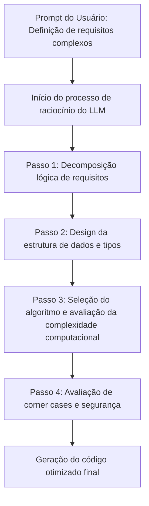
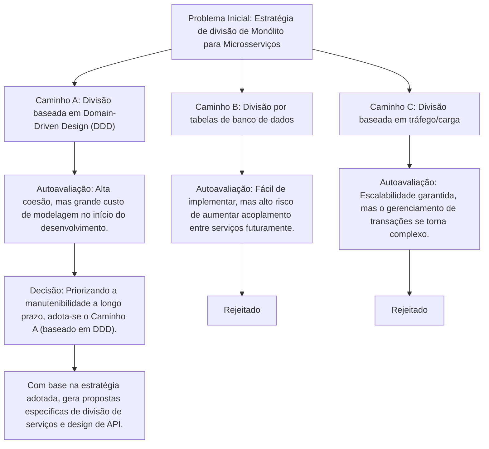
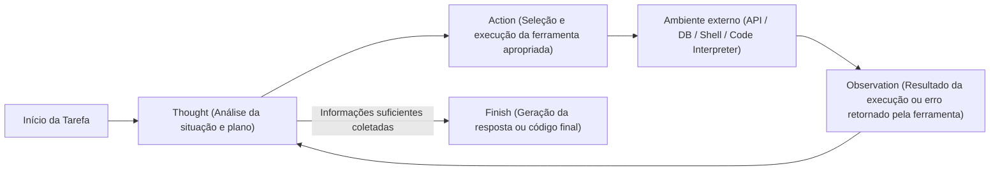
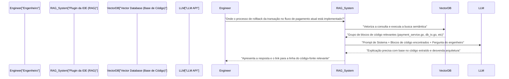

# Introdução: Por que os engenheiros devem aprender engenharia de prompt

O mundo do desenvolvimento de software está no meio de uma mudança de paradigma sem precedentes devido à rápida evolução dos Large Language Models (LLM). Não é exagero dizer que estamos passando do "Software 2.0 (desenvolvimento através de redes neurais)", proposto por Andrejs Karpathy, para o "Software 3.0 (desenvolvimento orientado a prompt através de linguagem natural)".

Com a popularização de ferramentas de assistência por IA, como GitHub Copilot, Cursor e várias APIs de LLM, a principal tarefa dos engenheiros está mudando de "escrever código do zero" para "projetar instruções para fazer a IA gerar o código desejado, e então revisar e integrar o código gerado".

A habilidade mais importante nesse novo método de desenvolvimento é a **engenharia de prompt**. A engenharia de prompt costuma ser comentada como um jargão (buzzword) para não engenheiros, como "conversar bem com a IA", mas sua essência é **uma nova forma de linguagem de programação para sistemas computacionais não determinísticos**.

Neste artigo, voltado para engenheiros de software e arquitetos, explicarei detalhadamente em cerca de 10.000 caracteres, desde os fundamentos matemáticos e arquitetônicos por trás dos LLMs até técnicas avançadas de engenharia de prompt como Few-Shot, Chain-of-Thought e ReAct, e como integrá-las em fluxos de trabalho de desenvolvimento reais e APIs.

---

## 1. Fundamentos e Contexto Matemático dos Large Language Models (LLM)

Para otimizar prompts e obter as saídas desejadas de forma consistente, é essencial entender o "conteúdo da caixa preta" matemática e estruturalmente: como o LLM processa e gera texto e código internamente. A maioria dos LLMs modernos são modelos de linguagem autorregressivos que utilizam a arquitetura Transformer.

### 1.1 Tokenização (Tokenization) e BPE

Os LLMs não processam strings de texto brutas diretamente. O texto é dividido em pequenas unidades chamadas **tokens**. Muitos modelos usam um algoritmo chamado Byte-Pair Encoding (BPE).

Para os engenheiros, a compreensão da tokenização é importante. Isso ocorre porque a maneira como a indentação (espaços) e os símbolos especiais em linguagens de programação são tokenizados afeta diretamente a qualidade da geração de código. Por exemplo, na geração de código Python, o número de espaços em branco (seja 4 espaços ou uma tabulação) costuma ser tratado como tokens independentes, e falhar em esclarecer as regras de indentação no prompt pode causar erros de sintaxe.

### 1.2 Previsão do Próximo Token (Next Token Prediction)

A tarefa básica de um LLM autorregressivo é prever "o próximo 1 token mais provável" a seguir em uma sequência de entrada dada (contexto). Expresso matematicamente, este é um problema de maximização da probabilidade condicional abaixo:

$$ P(w_t | w_{1}, w_{2}, \dots, w_{t-1}) $$

Aqui, $w_i$ representa um token e $t$ é o passo de tempo atual (time step). O modelo calcula a distribuição de probabilidade para o próximo token a partir dos tokens de entrada através de sua rede neural interna. O token gerado é adicionado autorregressivamente como entrada para a próxima etapa, e esse processo é repetido até que um token de término (como `<EOS>`) seja gerado.

### 1.3 Mecanismo de Atenção (Attention Mechanism) e Janela de Contexto

O núcleo da arquitetura Transformer é o mecanismo de Self-Attention. Isso permite que o modelo calcule as dependências entre tokens muito distantes em uma sequência.

$$ \text{Attention}(Q, K, V) = \text{softmax}\left(\frac{Q K^T}{\sqrt{d_k}}\right) V $$

Aqui, $Q$ (Query), $K$ (Key) e $V$ (Value) são matrizes geradas a partir da representação de entrada e $d_k$ é o fator de escala. O que esta fórmula significa é o processo em que "a palavra que está sendo processada no momento (Query) calcula em qual palavra passada (Key) deve prestar atenção (Attention) e incorpora essa informação (Value)".

Por que a compreensão desse mecanismo é importante na engenharia de prompt? Porque está diretamente ligada ao conceito de **Janela de Contexto (Context Window)**. Se o prompt de entrada for muito longo, instruções importantes podem ficar enterradas no meio do contexto, dispersando os pesos da Attention e causando um fenômeno chamado "Lost in the middle" (perda da informação intermediária). Em vez de jogar todo um documento extenso ou base de código em um prompt, é necessário extrair e passar apenas os chunks (blocos) necessários com precisão.

### 1.4 Controle de Amostragem por Parâmetro de Temperatura (Temperature)

Na camada de saída, as funções Softmax são geralmente usadas para converter logits (saída bruta do modelo) em uma distribuição de probabilidade. Aqui, a **Temperature (parâmetro de temperatura $T$)** é introduzida para controlar a diversidade (aleatoriedade) da geração.

$$ p_i = \frac{\exp(z_i / T)}{\sum_j \exp(z_j / T)} $$

- $z_i$ é o logit (pontuação) do token $i$ no vocabulário.
- Se $T = 1.0$, é um Softmax padrão.
- À medida que $T \to 0$, a distribuição de probabilidade se torna mais nítida e apenas o token com a maior probabilidade é escolhido (determinístico, Greedy Decoding).
- Se $T > 1.0$, a distribuição de probabilidade se achata e tokens menores, que normalmente não seriam escolhidos, têm mais chances de serem selecionados (aumentando a criatividade).

**Abordagem prática para engenheiros:**
Ao solicitar a geração de código ou extração de dados JSON (Structured Output) via API, a prática recomendada é definir um valor extremamente baixo de $T=0.0 \sim 0.2$ para evitar alucinações e aumentar a reprodutibilidade. Por outro lado, para tarefas exploratórias, como brainstorming de arquiteturas ou geração de ideias para convenções de nomenclatura, define-se $T=0.7 \sim 1.0$.

---

## 2. Arquitetura da Estrutura de Prompt: System Prompt vs User Prompt

Ao construir aplicações de IA usando APIs da OpenAI (como o GPT-4) ou APIs da Anthropic (como o Claude), o prompt não é um bloco de texto único, mas é estruturado como um array de mensagens. O aspecto mais importante nisso é a separação entre o "System Prompt" (Prompt do Sistema) e o "User Prompt" (Prompt do Usuário).

### 2.1 Prompt do Sistema: Restrições Globais e Definição de Persona

O System Prompt define **restrições globais, persona (papel) e regras comportamentais básicas** para o LLM. Em termos de design de software, atua como as "variáveis de ambiente" ou "classe base" da aplicação, ou ainda o "Dockerfile" de um contêiner.

Um excelente System Prompt estabiliza drasticamente a qualidade e o formato da saída.

```text
# Exemplo de System Prompt
Você é um engenheiro sênior de Go de classe mundial, bem versado em projetar processamento concorrente (Goroutines/Channels).
Gere respostas seguindo estritamente as regras abaixo.

[Regras]
1. Ao fornecer código, forneça-o sempre como uma função completa e executável.
2. Não omita o tratamento de erros; processe-os explicitamente com `if err != nil` seguindo a convenção do Go.
3. As explicações fora do bloco de código devem usar marcadores e ser limitadas a até 3 frases.
4. Se for solicitada uma implementação com preocupações de segurança (injeção SQL, race conditions, etc.), proponha uma alternativa segura.
5. O formato de saída deve conter apenas explicações e blocos de código em Markdown.
```

### 2.2 Prompt do Usuário: Tarefas Temporárias e Injeção de Dados

O User Prompt fornece a tarefa específica, a pergunta ou os dados de entrada a serem processados. Equivale a uma "chamada de função (passagem de argumentos para a função)" executada no contexto de ambiente construído pelo System Prompt.

```text
# Exemplo de User Prompt
Implemente uma função que baixa imagens assincronamente a partir de uma lista de várias URLs e as salva no disco local.
Permita que o número de workers seja controlado por argumento e inclua processamento de timeout usando context (context.Context) na implementação.
```

Configurando de forma robusta o System Prompt, você pode garantir a estabilidade da saída contra User Prompts altamente variáveis injetados pelos usuários (ou outros componentes do sistema). Também serve como uma primeira linha de defesa contra ataques de "prompt injection" via entrada de usuário mal-intencionado.

---

## 3. Principais Tecnologias de Engenharia de Prompt

A partir daqui, explicarei paradigmas específicos de prompting para melhorar drasticamente a precisão de tarefas de desenvolvimento de software.

### 3.1 Zero-Shot Prompting e Few-Shot Prompting

**Zero-Shot Prompting** é um método onde você dá apenas as instruções da tarefa e pede uma resposta ao modelo sem fornecer exemplos. Para solicitações gerais como "Escreva um quicksort em Python", os LLMs avançados de hoje funcionam bem com Zero-Shot.

No entanto, se você deseja que siga as convenções de codificação do projeto ou crie um esquema JSON específico, a probabilidade de falha no formato é alta com o Zero-Shot. A solução para isso é o **Few-Shot Prompting**.

Few-Shot Prompting é o método de apresentar alguns "pares de entrada e saída esperada (demonstrações)" no prompt. Isso aproveita um fenômeno chamado "In-Context Learning (Aprendizado no Contexto)", onde o modelo aprende padrões dentro do contexto do prompt sem atualizar seus parâmetros.

```text
# Exemplo de Few-Shot Prompting (Tarefa de Análise de Log)
Analise os logs brutos abaixo e extraia objetos JSON estruturados.

Exemplo 1:
Entrada: "[2023-10-01 10:00:05] ERROR [AuthService] Failed to authenticate user id=12345: Invalid password"
Saída: {"timestamp": "2023-10-01T10:00:05Z", "level": "ERROR", "service": "AuthService", "message": "Failed to authenticate user", "user_id": 12345}

Exemplo 2:
Entrada: "[2023-10-01 10:05:12] WARN [DBPool] Connection timeout approaching for query_id=987"
Saída: {"timestamp": "2023-10-01T10:05:12Z", "level": "WARN", "service": "DBPool", "message": "Connection timeout approaching", "query_id": 987}

Entrada da Tarefa:
Entrada: "[2023-10-01 10:15:30] FATAL [PaymentGateway] API rate limit exceeded. Retry after 60s"
Saída:
```

Dando exemplos como este, o modelo aprende implicitamente o formato de `timestamp` (conversão para ISO 8601) ou regras de nomeação de chaves, produzindo JSON perfeito.

### 3.2 Chain-of-Thought (CoT) e Zero-Shot CoT

Um avanço na capacidade de raciocínio de LLM foi o **Chain-of-Thought (CoT: Cadeia de Pensamento)**. Para tarefas que exigem lógicas complexas (ex: implementar algoritmos complexos, rastrear bugs difíceis, construir expressões regulares, etc.), forçar o LLM a produzir repentinamente o código final tende a causar saltos lógicos ou erros (alucinações).

O CoT é um método que faz o modelo verbalizar o processo de raciocínio intermediário (processo de pensamento) antes de exibir a resposta final. Fazer o próprio modelo analisar as situações passo a passo enriquece o contexto a cada token gerado e melhora drasticamente a precisão da conclusão final.

A técnica mais simples e poderosa é o **Zero-Shot CoT**, no qual as palavras mágicas "**Vamos pensar passo a passo (Let's think step by step)**" são adicionadas ao final do prompt.

No desenvolvimento, você pode aplicar este conceito estruturando o prompt da seguinte maneira:

```text
Crie um componente React que atenda às seguintes especificações.
[Especificações]...

Antes de gerar o código, descreva o seu processo de raciocínio (dentro da tag <thinking>) nos seguintes passos:
1. Identificação do Estado (State) necessário e desenho da estrutura de dados
2. Avaliação dos edge cases (casos limite) que podem ocorrer e tratamento de erros
3. Avaliação da granularidade da divisão do componente

Depois de concluído o processo de pensamento, escreva o código final em TypeScript.
```



### 3.3 Tree of Thoughts (ToT)

O **Tree of Thoughts (ToT)** expande ainda mais o conceito de CoT. Enquanto o CoT segue um caminho de raciocínio unidirecional (linear), o ToT expande vários caminhos de raciocínio (ramificações) em paralelo como uma árvore de busca, fazendo o modelo avaliar por si próprio cada caminho e realizar retrocessos (backtracking) até chegar à solução ideal.

O ToT é muito eficaz em problemas que possuem um amplo espaço de pesquisa e são propensos a cair em ótimos locais, como o design de arquiteturas de sistemas, design de esquemas de banco de dados complexos ou grandes planos de refatoração.



Para implementar o ToT em um prompt, você instrui: "Proponha várias abordagens, avalie os prós e os contras de cada uma e, em seguida, adote e implemente a melhor abordagem".

---

## 4. Workflow Agentic e ReAct (Reasoning and Acting)

As aplicações de LLM estão evoluindo rapidamente do processamento de texto de entrada e saída simples para a área de **Agentes de IA (AI Agents)**, que autonomamente elaboram planos e concluem tarefas enquanto interagem com ambientes externos. O paradigma central dessa arquitetura de agente é o **ReAct (Reasoning and Acting)**.

### 4.1 O Conceito do Framework ReAct

Os LLMs convencionais eram capazes de "pensar e depois responder (CoT)", mas não eram capazes de "agir" para complementar a falta de conhecimento próprio. O framework ReAct supera esse limite, alternando o LLM para realizar "Pensamentos (Thought)" e "Ações (Action)".

O modelo analisa o problema (Thought) e, se julgar que as informações são insuficientes, ele executa ferramentas externas como pesquisa na Web, consultas de banco de dados, comandos shell, chamadas de API, etc. (Action). Ele recebe os resultados da ferramenta (Observation), usa isso como novo contexto para avançar em sua reflexão e repete o loop até atingir a resposta final (Finish).



### 4.2 Implementação por Function Calling (Tool Use)

A interface padrão para integrar o ReAct em sistemas é o **Function Calling (Chamada de Função / Uso de Ferramentas)** fornecido pela OpenAI e Anthropic.

O engenheiro fornece ao LLM a "definição das ferramentas disponíveis (esquema JSON)" junto com o System Prompt. O LLM analisa o contexto do prompt e, se determinar que uma ferramenta deve ser usada, ele gera "o nome da função a ser chamada" e "seus argumentos JSON", em vez do texto normal. O loop se forma através do aplicativo que executa a função e devolve o resultado para o LLM.

**Exemplo de aplicação de desenvolvimento (Agente de depuração autônomo):**
Ao construir um agente que investiga as causas e gera patches quando um teste falha em um pipeline de CI/CD, as seguintes ferramentas são disponibilizadas ao LLM:

1. `search_codebase(regex_pattern)`: Busca o código no repositório com uma expressão regular.
2. `view_file_content(file_path, start_line, end_line)`: Lê o conteúdo de um arquivo especificado.
3. `run_unit_test(test_file_path)`: Executa um teste unitário específico e obtém o traceback.
4. `propose_patch(file_path, diff_content)`: Propõe um patch de correção.

O LLM raciocina e atua de forma autônoma da seguinte maneira:
- **Thought**: Olhando para o log de teste, `KeyError: 'user_id'` ocorre na linha 45 de `src/auth.py`. Preciso examinar o código ao redor.
- **Action**: `view_file_content(file_path="src/auth.py", start_line=30, end_line=60)`
- **Observation**: (O aplicativo lê o conteúdo do arquivo e o retorna para o LLM)
- **Thought**: Entendi, a validação não está cobrindo o caso em que `user_id` não está presente no JSON de resposta da API. Criarei um patch para alterá-lo pelo método seguro `.get()`.
- **Action**: `propose_patch(...)`

Dessa forma, a engenharia de prompt foi elevada de "controle da geração de texto" para "definição de ferramentas e design de loops de agente (orquestração)".

---

## 5. RAG (Retrieval-Augmented Generation) e Integração de Codebase

Uma das maiores fraquezas dos LLMs é que não conhecem "informações privadas" ou "informações mais recentes" que não estejam contidas nos dados de pré-treinamento. Quando perguntados sobre um repositório interno privado ou as especificações exclusivas de API, os LLMs dirão abertamente mentiras (alucinações) ou fornecerão apenas respostas gerais.

A arquitetura que resolve isso é o **RAG (Retrieval-Augmented Generation)**. RAG é uma tecnologia que combina a recuperação de informações (Retrieval) com a capacidade de geração do LLM.

### 5.1 Embeddings e Pesquisa Vetorial

Subjacente ao RAG está um modelo matemático de espaço vetorial. O código-fonte e documentos internos são transformados em vetores de alta dimensão (ex: um array de números em ponto flutuante de 1536 dimensões) por modelos de Embedding (ex: `text-embedding-3-small`) e salvos em um Vector Database.

Quando o usuário insere uma pergunta (query), essa query também é vetorizada com o mesmo modelo, e a **Similaridade do Cosseno (Cosine Similarity)** é calculada entre a query e os vetores de documentos no banco de dados.

$$ \text{Cosine Similarity}(A, B) = \frac{A \cdot B}{\|A\| \|B\|} = \frac{\sum_{i=1}^{n} A_i B_i}{\sqrt{\sum_{i=1}^{n} A_i^2} \sqrt{\sum_{i=1}^{n} B_i^2}} $$

Trechos de código ou documentos com alta similaridade (semanticamente próximos) são recuperados, e são injetados dinamicamente no User Prompt como o "contexto".

### 5.2 Aplicação do RAG ao Fluxo de Trabalho de Desenvolvimento

Integrar o RAG nas ferramentas de desenvolvimento ativa funções poderosas, como estas, dentro das IDEs:



Uma técnica de engenharia de prompt importante ao criar um RAG para uma base de código é não dividir o código de forma simplória em "chunks" (blocos), mas aprimorar exponencialmente a precisão da pesquisa, incluindo na vetorização "um resumo gerado da Abstract Syntax Tree (AST) das classes ou da Docstring de cada função".

---

## 6. Casos de Uso Práticos na Engenharia e Exemplos de Prompt Avançados

Vou introduzir casos de uso práticos e técnicas de prompt de como aplicar a teoria da engenharia de prompt para a automatização e eficiência de suas tarefas de desenvolvimento diárias.

### 6.1 Automação da Revisão de Código e Complementação da Análise Estática

Incorporar o LLM no pipeline de CI e fazer com que ele conduza automaticamente a revisão do código (Code Review) na criação de um Pull Request (PR). O objetivo é apontar inconsistências lógicas de negócio e antipadrões de design, os quais ferramentas de Lint e de análise estática não conseguem detectar.

**Exemplo de Prompt (Requisito de Saída Estruturada):**
```text
Você é um engenheiro de software sênior estrito e experiente.
Analise a diferença (Git Diff) do Pull Request fornecido e realize uma revisão de código.

[Áreas de Foco da Revisão]
1. Vulnerabilidade de Segurança (Injection, XSS, desvio de autorização, etc.)
2. Gargalos de desempenho (Problema N+1 Query, loops ineficientes, etc.)
3. Manutenibilidade e legibilidade (Violações dos princípios SOLID, aninhamentos excessivamente complexos, etc.)

[Restrições]
- Não aponte as violações de formatação (indentações, etc.), pois esse é o papel das ferramentas de Lint.
- Se não houver nenhum problema, não force para encontrar um; retorne um array vazio.
- A saída deve seguir estritamente o seguinte esquema JSON. Não inclua em crases de Markdown (```json).

[Formato de Saída JSON Esperado]
{
  "review_comments": [
    {
      "file_path": "string",
      "line_number": "integer",
      "severity": "High | Medium | Low",
      "issue_title": "string",
      "detailed_description": "string",
      "suggested_code_fix": "string"
    }
  ]
}

[Git Diff Data]
{{PR_DIFF}}
```

O ponto-chave deste prompt é forçar que a saída do LLM seja um JSON facilmente analisável e diferenciar claramente as responsabilidades entre as ferramentas de Lint e o papel do LLM (definição dos limites do sistema).

### 6.2 "Defensive Prompting" na Geração de Código Zero-Shot

Um problema que costuma acontecer ao pedir para uma IA escrever código é o fenômeno em que ela "importa espontaneamente uma biblioteca inexistente (alucinação)" ou "omite a definição de uma variável necessária (omitem-se partes como `# escreva o processamento aqui`)". Para evitar isso, usa-se a "Defensive Prompting (Prompting Defensiva)", estabelecendo proteções (guardrails) rígidas dentro do prompt.

**Elementos-chave do Prompt Defensivo:**
1. **Proibir Omissões:** "Não omita os códigos ou use espaços reservados (ex: `// ...`). Produza um arquivo completo que possa ser copiado e colado para execução."
2. **Prevenir Alucinações:** "Se não houver uma biblioteca padrão para atender aos requisitos, não fabrique bibliotecas de terceiros inexistentes de forma arbitrária. Em vez disso, proponha código usando a biblioteca mais padronizada (ex: requests), e esclareça a necessidade da instalação dessa biblioteca externa."
3. **Exigir Auto-contenção:** "Todas as variáveis e funções devem estar definidas apropriadamente dentro do bloco de código."

### 6.3 Testes baseados em propriedades e geração automática de testes de edge case

Permitir que o LLM identifique corner cases e gere o código de teste de funções implementadas por engenheiros. É altamente eficaz para eliminar a parcialidade e os "pontos cegos" humanos.

```text
A função em Python abaixo determina se a string fornecida é um endereço IPv4 válido.
Escreva uma suíte de testes unitários abrangente baseada no pytest para esta função.

[Condições]
- Inclua de forma rigorosa não apenas o cenário de casos normais (happy path), mas também cenários extremos como os abaixo:
  - Valores limiares/fronteiras (0, 255, 256, etc.)
  - Entradas de tipos diferentes (inteiros, None, listas, etc.)
  - String com espaços em branco ou caracteres especiais
  - Quantidade incorreta de pontos (menos que 3 ou mais que 4)
- Utilize testes parametrizados (`@pytest.mark.parametrize`) e mantenha o código de teste simples.

[Código da Função]
def is_valid_ipv4(ip_str):
    # Implementação...
```

---

## 7. Avaliação de Prompt e LLMOps (Eval)

No mundo da engenharia de software, o código não testado é conhecido como código legado. Exatamente a mesma afirmação vale para a engenharia de prompt. É extremamente perigoso lançar em produção "um prompt que foi testado manualmente algumas vezes e parece ter funcionado".

Devido a atualizações de versão de modelos de fundação e mudanças nos dados do domínio, o comportamento dos prompts pode quebrar facilmente. Para evitar isso, a construção de um sistema de **Evaluation (Eval)** (LLMOps) para avaliar quantitativamente a saída do prompt é essencial.

### 7.1 LLM-as-a-Judge (Avaliação de LLM por LLM)

Em tarefas como a geração de código e sumarização de texto, o teste baseado em correspondência exata (Exact Match) é impossível. As métricas clássicas de processamento de linguagem natural (BLEU ou ROUGE) também são insuficientes na medição da exatidão semântica.

O padrão atual da indústria é o método **LLM-as-a-Judge**, onde um modelo poderoso (por exemplo, GPT-4o ou Claude 3.5 Sonnet) é usado como "Juiz (Judge)" para classificar e pontuar a saída gerada pelo LLM sob avaliação.

1. **Preparação de Conjunto de Testes:** Prepare algumas dezenas a centenas de pares de dados de entrada e da saída ideal (ou critérios de avaliação).
2. **Execução:** Gere as saídas contra o conjunto de testes com o modelo e o prompt sendo testados.
3. **Avaliação:** Prepare um prompt de avaliação (meta-prompt) que instrui o Judge LLM: "Pontue a saída gerada em 1 a 5, com base no preenchimento ou não dos requisitos".

Assim, torna-se possível detectar automaticamente regressões no pipeline de CI/CD ao modificar os prompts. A engenharia de prompt evoluiu de algo artesanal focado em "brincar com o prompt", para uma "Engenharia" baseada em dados reais e com reprodutibilidade.

---

## 8. Conclusão: O Prompt é um Novo Componente do Software

Na era onde a IA escreve código, alguns afirmam "o fim da programação", mas a realidade é bem diferente. Trata-se simplesmente do aumento de uma camada de abstração requerida dos engenheiros.

Assim como migramos da linguagem Assembly para o C e posteriormente para linguagens de alto nível equipadas com coleta de lixo (garbage collection), nos livrando dos problemas do gerenciamento de memória e focando no desenvolvimento das lógicas complexas de negócios, o LLM e a engenharia de prompt representam a próxima onda de abstração.

1. **Entendimento da Arquitetura:** Compreender a natureza estocástica do LLM (Autorregressão, Attention, Temperature) e controlar a não-determinidade do sistema.
2. **Design de Contexto:** Estabelecimento de restrições por meio do System Prompt e transmissão clara das intenções usando Few-Shot/CoT.
3. **Pensamento baseado em agente e integração de ferramentas:** Dominar o paradigma ReAct e utilizar o LLM como orquestrador do sistema.
4. **Avaliação Contínua:** Gerenciar versão dos prompts como parte do código e continuar melhorando via Test-Driven por meio do Eval.

Compreendendo esses princípios, os prompts deixam de ser uma simples string para se tornarem um componente de software robusto e escalável. Ao incorporar os métodos avançados de engenharia de prompt discutidos neste artigo nos fluxos de trabalho do seu desenvolvimento de código e de produtos diários, você tem o que precisa para brilhar como líder de engenharia do "Software 3.0" da nova geração.

---
*Generated using Prompt Engineering Techniques.*
