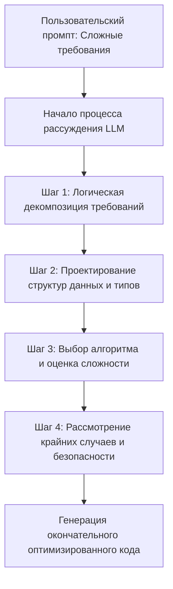
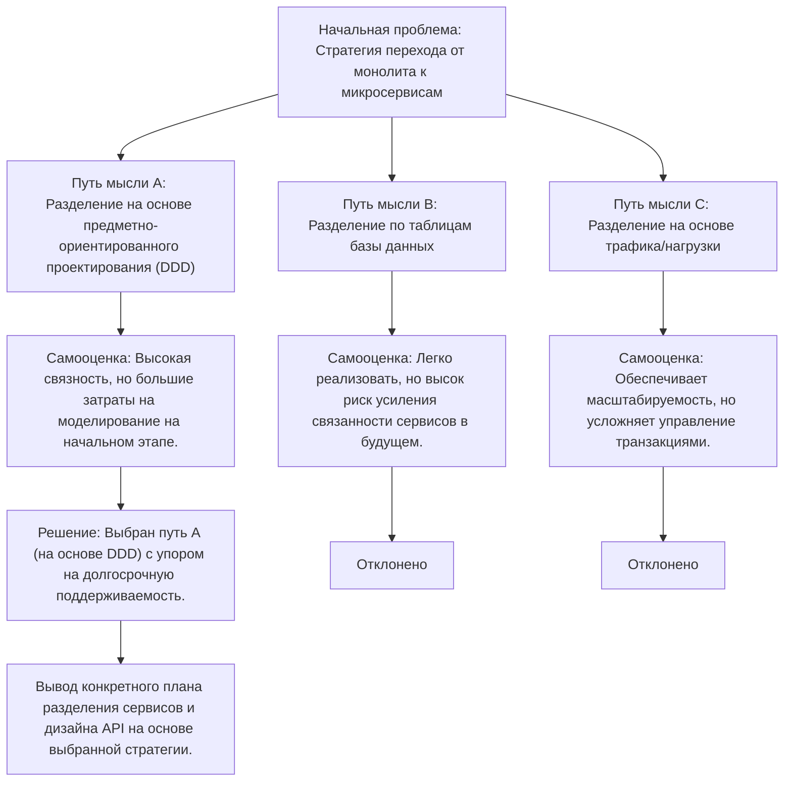
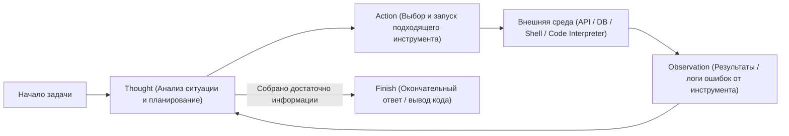
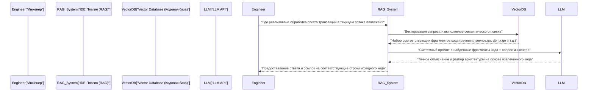

# Введение: почему инженерам стоит изучать промпт-инжиниринг

Мир разработки программного обеспечения находится в самом центре беспрецедентного сдвига парадигмы, вызванного стремительной эволюцией больших языковых моделей (LLM). Без преувеличения можно сказать, что мы переходим от «Software 2.0» (разработка с использованием нейронных сетей), предложенного Андреем Карпаты, к «Software 3.0» (разработка на основе промптов на естественном языке).

С распространением инструментов AI-ассистентов на базе GitHub Copilot, Cursor или различных API LLM, основная работа инженеров смещается от «написания кода с нуля» к «проектированию инструкций для того, чтобы ИИ сгенерировал нужный код, а также последующему ревью и интеграции сгенерированного кода».

Наиболее важным навыком в этом новом подходе к разработке является **промпт-инжиниринг**. Промпт-инжиниринг часто обсуждается как модное словечко для нетехнических специалистов, вроде «умения хорошо поболтать с ИИ», но по своей сути это **новая форма языка программирования для недетерминированных (non-deterministic) вычислительных систем**.

В этой статье, предназначенной для инженеров-программистов и архитекторов, в объеме около 10 000 символов мы предельно подробно рассмотрим математические и архитектурные основы LLM, продвинутые методы промпт-инжиниринга, такие как Few-Shot, Chain-of-Thought и ReAct, а также их внедрение в реальные рабочие процессы разработки и API.

---

## 1. Основы и математическая база больших языковых моделей (LLM)

Для того чтобы оптимизировать промпты и стабильно получать желаемые результаты, необходимо иметь математическое и структурное понимание «содержимого черного ящика»: того, как LLM внутренне обрабатывают и генерируют текст и код. Большинство современных LLM представляют собой авторегрессионные (auto-regressive) языковые модели на основе архитектуры Transformer.

### 1.1 Токенизация (Tokenization) и BPE

LLM не обрабатывают сырые текстовые строки напрямую. Текст разбивается на небольшие единицы, называемые **токенами (Token)**. Многие модели используют алгоритм, называемый Byte-Pair Encoding (BPE).

Для инженеров понимание токенизации крайне важно. Это связано с тем, что способ токенизации отступов (пробелов) и специальных символов в языках программирования напрямую влияет на качество генерируемого кода. Например, при генерации кода на Python количество пробелов (4 пробела или табуляция) часто обрабатывается как отдельные токены, и отсутствие четких правил отступов в промпте может стать причиной синтаксических ошибок.

### 1.2 Предсказание следующего токена (Next Token Prediction)

Основная задача авторегрессионных LLM — предсказать «наиболее вероятный следующий 1 токен», следующий за заданной входной последовательностью (контекстом). В математическом выражении это сводится к задаче максимизации следующей условной вероятности:

$$ P(w_t | w_{1}, w_{2}, \dots, w_{t-1}) $$

Где $w_i$ обозначает токен, а $t$ — текущий временной шаг. Модель вычисляет распределение вероятностей следующего токена на основе входных токенов с помощью своей внутренней нейронной сети. Сгенерированный токен авторегрессионно добавляется в качестве входа для следующего шага, и этот процесс повторяется до тех пор, пока не будет выведен токен завершения (например, `<EOS>`).

### 1.3 Механизм внимания (Attention Mechanism) и контекстное окно

Ядром архитектуры Transformer является механизм самовнимания (Self-Attention). Благодаря ему модель может вычислять зависимости между токенами, находящимися далеко друг от друга в последовательности.

$$ \text{Attention}(Q, K, V) = \text{softmax}\left(\frac{Q K^T}{\sqrt{d_k}}\right) V $$

Здесь $Q$ (Query — запрос), $K$ (Key — ключ) и $V$ (Value — значение) — это матрицы, сгенерированные из входного представления, а $d_k$ — коэффициент масштабирования. Эта формула описывает процесс: «вычислить, на какие из предыдущих слов (Key) должно обратить внимание (Attention) текущее обрабатываемое слово (Query), и включить эту информацию (Value)».

Почему понимание этого механизма важно в промпт-инжиниринге? Потому что оно напрямую связано с концепцией **контекстного окна (Context Window)**. Если входной промпт становится слишком длинным, важные инструкции могут затеряться где-то в середине контекста, а веса внимания рассредоточатся, что приведет к явлению «Lost in the middle» (потеря информации в середине). Вместо того чтобы целиком скармливать длинные документы или кодовые базы в промпт, требуется избирательный подход: точное извлечение и передача только необходимых фрагментов (чанков).

### 1.4 Управление сэмплированием с помощью параметра температуры (Temperature)

На выходном слое для преобразования логитов (сырых выходов модели) в распределение вероятностей обычно используется функция Softmax. Здесь для управления разнообразием (случайностью) генерации вводится **Температура (параметр температуры $T$)**.

$$ p_i = \frac{\exp(z_i / T)}{\sum_j \exp(z_j / T)} $$

- $z_i$ — это логит (оценка) токена $i$ в словаре.
- При $T = 1.0$ получается стандартный Softmax.
- По мере приближения $T \to 0$ распределение вероятностей становится более острым, и выбираются только токены с наибольшей вероятностью (детерминированный подход, Greedy Decoding).
- При $T > 1.0$ распределение вероятностей становится более плоским, и менее вероятные (минорные) токены выбираются чаще (повышается креативность).

**Практический подход для инженеров:**
При использовании API для генерации кода или извлечения данных в формате JSON (Structured Output), для предотвращения галлюцинаций и повышения воспроизводимости стандартной практикой является установка крайне низких значений $T=0.0 \sim 0.2$. С другой стороны, для исследовательских задач, таких как мозговой штурм архитектуры или придумывание идей для правил именования, $T$ устанавливается в диапазоне $0.7 \sim 1.0$.

---

## 2. Структурная архитектура промптов: System Prompt vs User Prompt

При создании ИИ-приложений с использованием API OpenAI (например, GPT-4) или API Anthropic (например, Claude) промпт структурируется не как единый текстовый блок, а как массив сообщений. Наиболее важным аспектом здесь является разделение на «Системный промпт (System Prompt)» и «Пользовательский промпт (User Prompt)».

### 2.1 Системный промпт: глобальные ограничения и определение персоны

Системный промпт определяет **глобальные ограничения, персону (роль) и основные правила поведения** для LLM. Если проводить аналогию с проектированием программного обеспечения, он выполняет роль «переменных окружения» или «базового класса» приложения, или же «Dockerfile» для контейнера.

Отличный системный промпт радикально стабилизирует качество и формат вывода.

```text
# Пример System Prompt
Вы являетесь старшим Go-инженером мирового класса, хорошо разбирающимся в проектировании параллелизма (Goroutine/Channel).
Пожалуйста, генерируйте ответы в соответствии со следующими строгими правилами.

[Правила]
1. При предоставлении кода обязательно предоставляйте его в виде полной выполняемой функции.
2. Не пропускайте обработку ошибок, явно обрабатывайте их с помощью `if err != nil` в соответствии с соглашениями Go.
3. Описания, не относящиеся к блокам кода, должны быть в виде маркированного списка и не превышать 3 предложений.
4. Если запрашивается реализация, вызывающая проблемы с безопасностью (SQL-инъекции, состояние гонки и т.д.), предложите безопасную альтернативу.
5. Выходной формат должен содержать только объяснение и блок кода Markdown.
```

### 2.2 Пользовательский промпт: временные задачи и внедрение данных

Пользовательский промпт предоставляет конкретные задачи, вопросы или входные данные для обработки. Он эквивалентен «вызову функции (передаче аргументов в функцию)», выполняемому в контекстной среде, созданной системным промптом.

```text
# Пример User Prompt
Реализуйте функцию, которая асинхронно загружает изображения из списка URL-адресов и сохраняет их на локальный диск.
Сделайте так, чтобы количество воркеров (workers) можно было контролировать с помощью аргумента, и включите в реализацию обработку таймаута с помощью контекста (context.Context).
```

Надежная настройка системного промпта гарантирует стабильность вывода даже при получении пользовательских промптов с высокой степенью изменчивости (или промптов от других компонентов системы). Кроме того, она служит первой линией защиты от атак типа «внедрение промпта» (prompt injection) со стороны вредоносного пользовательского ввода.

---

## 3. Основные методы промпт-инжиниринга

С этого момента мы рассмотрим конкретные парадигмы промптинга, которые позволят кардинально повысить точность при выполнении задач разработки программного обеспечения.

### 3.1 Zero-Shot Prompting и Few-Shot Prompting

**Zero-Shot Prompting (промптинг без примеров)** — это метод, при котором модели дается только инструкция к задаче без каких-либо примеров, и ожидается ответ. Для общих запросов, таких как «напиши быструю сортировку на Python», современные продвинутые LLM отлично справляются и в режиме Zero-Shot.

Однако, если вы хотите, чтобы модель следовала специфическим правилам кодирования вашего проекта или выводила определенную схему JSON, при Zero-Shot высока вероятность нарушения формата. Эта проблема решается с помощью **Few-Shot Prompting (промптинга с несколькими примерами)**.

Few-Shot Prompting — это метод предоставления в промпте нескольких «пар ввода и ожидаемого вывода (демонстраций)». Он использует явление «In-Context Learning (внутриконтекстное обучение)», при котором модель изучает закономерности в контексте промпта без обновления своих параметров.

```text
# Пример Few-Shot Prompting (задача анализа логов)
Пожалуйста, проанализируйте следующие необработанные логи и извлеките структурированный объект JSON.

Пример 1:
Ввод: "[2023-10-01 10:00:05] ERROR [AuthService] Failed to authenticate user id=12345: Invalid password"
Вывод: {"timestamp": "2023-10-01T10:00:05Z", "level": "ERROR", "service": "AuthService", "message": "Failed to authenticate user", "user_id": 12345}

Пример 2:
Ввод: "[2023-10-01 10:05:12] WARN [DBPool] Connection timeout approaching for query_id=987"
Вывод: {"timestamp": "2023-10-01T10:05:12Z", "level": "WARN", "service": "DBPool", "message": "Connection timeout approaching", "query_id": 987}

Ввод для задачи:
Ввод: "[2023-10-01 10:15:30] FATAL [PaymentGateway] API rate limit exceeded. Retry after 60s"
Вывод:
```

Предоставляя такие примеры, модель неявно изучает формат `timestamp` (преобразование в ISO 8601) и правила именования ключей, что позволяет ей выводить идеальный JSON.

### 3.2 Chain-of-Thought (CoT) и Zero-Shot CoT

Настоящим прорывом в способностях рассуждения LLM стала **Chain-of-Thought (CoT: Цепочка мыслей)**. В задачах, требующих сложной логики (например, реализация сложного алгоритма, отслеживание запутанного бага, составление регулярных выражений и т.д.), если заставить LLM сразу выдать финальный код, часто возникают логические пробелы или ошибки (галлюцинации).

CoT — это метод, при котором модель вербализует промежуточный процесс рассуждения (процесс мышления) перед выдачей окончательного ответа. Заставляя саму модель анализировать ситуацию шаг за шагом, мы обогащаем контекст с каждым сгенерированным токеном, что кардинально повышает точность окончательного заключения.

Самая простая и мощная техника — это **Zero-Shot CoT**, заключающаяся в добавлении волшебной фразы «**Давайте подумаем шаг за шагом (Let's think step by step)**» в конце промпта.

В разработке эта концепция применяется путем структурирования промпта следующим образом:

```text
Создайте React-компонент, удовлетворяющий следующим спецификациям.
[Спецификации]...

Перед генерацией кода опишите процесс своего мышления (внутри тега <thinking>) в соответствии со следующими шагами.
1. Определение необходимого состояния (State) и проектирование структуры данных
2. Рассмотрение возможных крайних случаев (edge cases) и обработка ошибок
3. Рассмотрение единиц разделения компонента

После завершения процесса мышления напишите окончательный код на TypeScript.
```



### 3.3 Tree of Thoughts (ToT)

Концепция CoT была дополнительно расширена в **Tree of Thoughts (ToT)**. В то время как CoT следует по линейному пути рассуждений, ToT использует подход, подобный дереву поиска: он параллельно развивает несколько путей рассуждений (ветвей), заставляет саму модель оценивать каждый путь и достигает оптимального решения путем использования возвратов (backtracking).

ToT очень эффективен для задач с обширным пространством поиска и высокой вероятностью попадания в локальный оптимум, таких как проектирование системной архитектуры, проектирование сложных схем баз данных или планирование крупномасштабного рефакторинга.



Чтобы реализовать ToT в промпте, используется инструкция: «Предложите несколько подходов, оцените преимущества и недостатки каждого, а затем выберите и реализуйте наилучший подход».

---

## 4. Агентские рабочие процессы (Agentic Workflow) и ReAct (Reasoning and Acting)

Применение LLM стремительно эволюционирует от простого текстового ввода-вывода к области **ИИ-агентов (AI Agents)**, которые могут автономно планировать и выполнять задачи, взаимодействуя с внешней средой. Ключевой парадигмой в архитектуре таких агентов является **ReAct (Рассуждение и Действие)**.

### 4.1 Концепция фреймворка ReAct

Традиционные LLM могли «подумать перед ответом (CoT)», но не могли «действовать», чтобы восполнить пробелы в своих знаниях. Фреймворк ReAct преодолевает это ограничение, заставляя LLM чередовать «мысли (Thought)» и «действия (Action)».

Модель анализирует проблему (Thought), и если она решает, что ей не хватает информации, она выполняет действие с внешними инструментами (Action: веб-поиск, запрос к базе данных, команда оболочки, вызов API и т.д.). Она получает результаты выполнения инструмента (Observation — наблюдение), использует их как новый контекст для дальнейших рассуждений и повторяет этот цикл до достижения окончательного ответа (Finish).



### 4.2 Реализация с помощью Function Calling (использование инструментов)

Стандартным интерфейсом для интеграции ReAct в системы является **Function Calling (вызов функций / использование инструментов)**, предоставляемый OpenAI и Anthropic.

Инженеры передают LLM системный промпт вместе с «определением доступных инструментов (схема JSON)». LLM анализирует контекст промпта и, если решает, что необходимо использовать инструмент, вместо обычного текста выводит «имя вызываемой функции» и «JSON с ее аргументами». Приложение выполняет эту функцию и возвращает результат обратно в LLM, таким образом формируя цикл.

**Пример применения в разработке (автономный агент отладки):**
При создании агента, который исследует причину и генерирует патч при падении тестов в CI/CD-конвейере, LLM можно предоставить следующие инструменты:

1. `search_codebase(regex_pattern)`: Поиск в коде репозитория с использованием регулярного выражения.
2. `view_file_content(file_path, start_line, end_line)`: Чтение содержимого указанного файла.
3. `run_unit_test(test_file_path)`: Запуск определенного модульного теста и получение трассировки (traceback).
4. `propose_patch(file_path, diff_content)`: Предложение патча с исправлениями.

LLM автономно рассуждает и действует следующим образом:
- **Thought**: Глядя на логи тестов, я вижу, что на строке 45 в `src/auth.py` возникает `KeyError: 'user_id'`. Необходимо проверить код вокруг этой строки.
- **Action**: `view_file_content(file_path="src/auth.py", start_line=30, end_line=60)`
- **Observation**: (Приложение считывает содержимое файла и возвращает его в LLM)
- **Thought**: Понятно, отсутствует валидация для случая, когда ответ API в формате JSON не содержит `user_id`. Создам патч, который переписывает это на использование безопасного метода `.get()`.
- **Action**: `propose_patch(...)`

Таким образом, промпт-инжиниринг переходит на новый уровень: от «управления генерацией текста» к «определению инструментов и проектированию циклов агентов (оркестрации)».

---

## 5. Интеграция RAG (Retrieval-Augmented Generation) и кодовых баз

Одной из самых больших слабостей LLM является отсутствие знаний о «приватной информации» или «последней информации», которая не была включена в обучающие данные. Если вы зададите вопрос о внутреннем приватном репозитории или проприетарной спецификации API, LLM может спокойно солгать (сгаллюцинировать) или дать лишь обобщенный ответ.

Архитектура, решающая эту проблему, — это **RAG (генерация, дополненная поиском)**. RAG — это технология, объединяющая информационный поиск (Retrieval) и генеративные возможности LLM (Generation).

### 5.1 Эмбеддинги (Embeddings) и векторный поиск

В основе RAG лежит математическая модель векторного пространства. Исходный код и внутренняя документация преобразуются моделью Embedding (например, `text-embedding-3-small`) в многомерные векторы (например, массивы чисел с плавающей запятой размерностью 1536) и сохраняются в векторной базе данных (Vector Database).

Когда пользователь вводит вопрос (запрос), этот запрос также векторизуется с помощью той же модели, и вычисляется **косинусное сходство (Cosine Similarity)** между ним и векторами документов в базе данных.

$$ \text{Cosine Similarity}(A, B) = \frac{A \cdot B}{\|A\| \|B\|} = \frac{\sum_{i=1}^{n} A_i B_i}{\sqrt{\sum_{i=1}^{n} A_i^2} \sqrt{\sum_{i=1}^{n} B_i^2}} $$

Извлекается несколько лучших фрагментов кода или документов с наибольшим сходством (семантически близких), и они динамически внедряются в пользовательский промпт в качестве «контекста».

### 5.2 Применение RAG в рабочем процессе разработки

Интеграция RAG в инструменты разработки обеспечивает следующие мощные функции в IDE:



Важной техникой промпт-инжиниринга при создании RAG для кодовых баз является не просто разделение кода на фрагменты, но и включение в векторизацию «дополнительных резюме, сгенерированных из строк документации (Docstrings) каждой функции или абстрактного синтаксического дерева (AST) классов». Это позволяет значительно повысить точность поиска.

---

## 6. Практические сценарии использования в инженерии и примеры продвинутых промптов

Здесь мы представляем практические сценарии и методы промптинга, демонстрирующие, как применять теорию промпт-инжиниринга для автоматизации и оптимизации повседневных задач разработки.

### 6.1 Автоматизация код-ревью и дополнение статического анализа

Внедрите LLM в CI-конвейер для автоматического проведения код-ревью при создании Pull Request (PR). Цель состоит в том, чтобы он указывал на несоответствия бизнес-логики и архитектурные антипаттерны, которые не могут быть обнаружены инструментами линтинга (Lint) или статического анализа.

**Пример промпта (Запрос структурированного вывода):**
```text
Вы строгий и опытный старший инженер-программист.
Пожалуйста, проанализируйте предоставленные изменения (Git Diff) из Pull Request и проведите код-ревью.

[Фокус ревью]
1. Уязвимости безопасности (инъекции, XSS, обход авторизации и т.д.)
2. Узкие места в производительности (проблема N+1 запросов, неэффективные вычисления в циклах и т.д.)
3. Поддерживаемость и читаемость (нарушения принципов SOLID, чрезмерная вложенность и т.д.)

[Ограничения]
- Не указывайте на простые нарушения форматирования (например, отступы), так как это задача инструментов Lint.
- Если проблем нет, не выдумывайте замечания, просто верните пустой массив.
- Вывод должен строго соответствовать следующей схеме JSON. Не оборачивайте вывод в обратные кавычки Markdown (```json).

[Ожидаемый формат вывода JSON]
{
  "review_comments": [
    {
      "file_path": "string",
      "line_number": "integer",
      "severity": "High | Medium | Low",
      "issue_title": "string",
      "detailed_description": "string",
      "suggested_code_fix": "string"
    }
  ]
}

[Git Diff Data]
{{PR_DIFF}}
```

Ключевые моменты этого промпта: принуждение LLM к выводу в формате JSON, который легко парсить, а также четкое разделение ролей инструмента Lint и роли LLM (определение границ системы).

### 6.2 «Оборонительный промптинг» (Defensive Prompting) при генерации кода в режиме Zero-Shot

При поручении ИИ написания кода часто возникают такие проблемы, как «самовольный импорт несуществующих библиотек (галлюцинация)» или «пропуск необходимых определений переменных (например, опущение вида `# тут писать обработку`)». Чтобы предотвратить это, применяется «оборонительный промптинг», устанавливающий мощные ограждения в самом промпте.

**Важные элементы оборонительного промпта:**
1. **Запрет пропусков:** «Не опускайте код и не используйте заполнители (например, `// ...`). Сгенерируйте полный файл, который можно скопировать, вставить и запустить как есть.»
2. **Предотвращение галлюцинаций:** «Если стандартной библиотеки, удовлетворяющей требованиям, не существует, не выдумывайте несуществующие сторонние библиотеки. В таком случае укажите, что требуется установка внешней библиотеки, и предложите код с использованием наиболее стандартной библиотеки (например: requests).»
3. **Требование самодостаточности:** «Все переменные и функции должны быть должным образом определены внутри блока кода.»

### 6.3 Автоматическая генерация тестов на основе свойств (Property-based tests) / тестов крайних случаев

Позвольте LLM находить крайние случаи (corner cases) для реализованных инженером функций и генерировать тестовый код. Это очень эффективно для исключения человеческих предубеждений.

```text
Следующая функция Python определяет, является ли заданная строка допустимым адресом IPv4.
Напишите полный набор модульных тестов на основе pytest для этой функции.

[Условия]
- Тщательно покройте не только стандартные (положительные) тестовые случаи, но и крайние случаи, такие как:
  - Граничные значения (например, 0, 255, 256)
  - Входные данные разных типов (целые числа, None, списки и т.д.)
  - Строки, содержащие пробелы или специальные символы
  - Случаи с неправильным количеством точек (менее 3 или 4 и более)
- Используйте параметризованные тесты (`@pytest.mark.parametrize`), чтобы тестовый код был лаконичным.

[Код функции]
def is_valid_ipv4(ip_str):
    # реализация...
```

---

## 7. Оценка промптов и LLMOps (Eval)

В мире программной инженерии непротестированный код называют унаследованным кодом (legacy code). То же самое в полной мере относится и к промпт-инжинирингу. Крайне опасно развертывать в рабочей среде промпт только потому, что «он хорошо сработал при проверке вручную пару раз».

Поведение промпта может легко сломаться из-за обновления базовой модели или изменения обрабатываемых доменных данных. Чтобы предотвратить это, необходимо создать механизм **Оценки (Evaluation / Eval)** для количественной оценки вывода промпта в рамках LLMOps.

### 7.1 LLM-as-a-Judge (Оценка LLM с помощью LLM)

Для таких задач, как генерация кода или суммаризация текста, тестирование на точное совпадение (Exact Match) невозможно. Классические метрики оценки обработки естественного языка (такие как BLEU или ROUGE) также недостаточно сильны для измерения семантической точности.

Современным отраслевым стандартом является метод **LLM-as-a-Judge**, при котором в качестве «судьи (Judge)» используется мощная модель (например, GPT-4o или Claude 3.5 Sonnet) для оценки результатов вывода целевой LLM.

1. **Подготовка набора тестов**: Подготовьте от десятков до сотен пар входных данных и идеальных выводов (или критериев оценки).
2. **Выполнение**: Сгенерируйте выводы для тестового набора с использованием оцениваемого промпта и модели.
3. **Оценка**: Подготовьте промпт для оценки (мета-промпт) и дайте команду LLM-судье: «Оцени от 1 до 5 баллов, насколько сгенерированный вывод соответствует требованиям».

Это позволяет автоматически обнаруживать регрессию (ухудшение производительности) при изменении промпта прямо в CI/CD-конвейере. Промпт-инжиниринг эволюционирует от кустарного «копания в промптах» к управляемой данными, воспроизводимой «инженерии».

---

## 8. Заключение: промпт — это новый компонент программного обеспечения

В эпоху, когда ИИ пишет код, иногда говорят о «конце программирования», но реальность иная. Уровень абстракции, требуемый от инженеров, просто поднялся на одну ступень выше.

Когда-то, перейдя от языка ассемблера к языку C, а затем к языкам высокого уровня со сборкой мусора, мы освободились от бремени управления памятью и смогли сосредоточиться на построении более сложной бизнес-логики. LLM и промпт-инжиниринг — это следующая за ними волна абстракции.

1. **Понимание архитектуры**: Понимание вероятностной природы LLM (авторегрессия, внимание, температура) для управления недетерминированностью системы.
2. **Проектирование контекста**: Установка ограничений с помощью System Prompt и четкая передача намерений с использованием Few-Shot / CoT.
3. **Агентское мышление и интеграция инструментов**: Использование парадигмы ReAct и использование LLM в качестве оркестратора системы.
4. **Непрерывная оценка**: Управление версиями промптов как частью кода и их постоянное улучшение на основе тестов (Eval).

Овладев этими принципами, вы превратите промпты из простых строк в надежные, масштабируемые компоненты программного обеспечения. Мы надеемся, что вы внедрите передовые методы промпт-инжиниринга, описанные в этой статье, в свои рабочие процессы и продукты, и станете ведущим инженером в эпоху «Software 3.0».

---
*Создано с использованием методов промпт-инжиниринга.*
