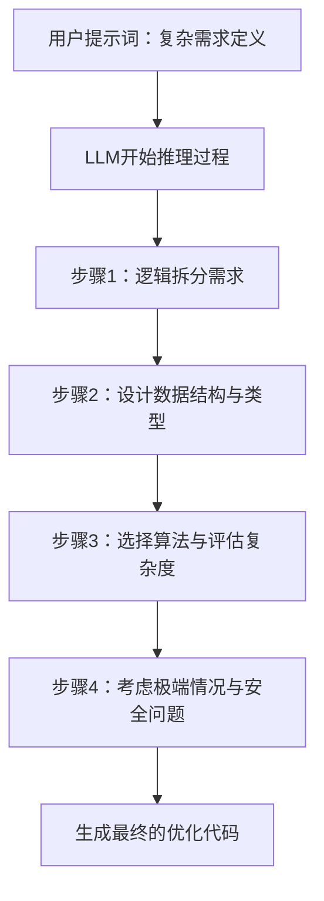
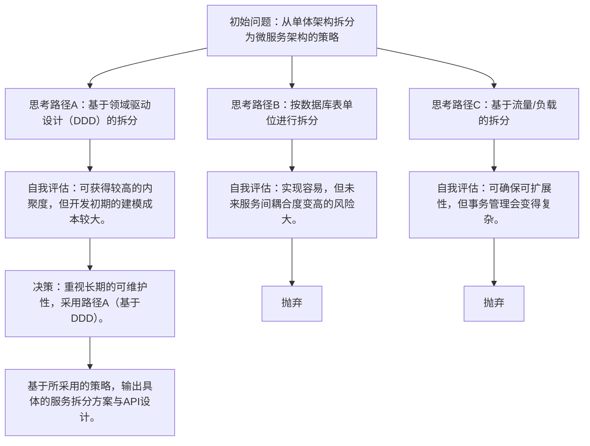
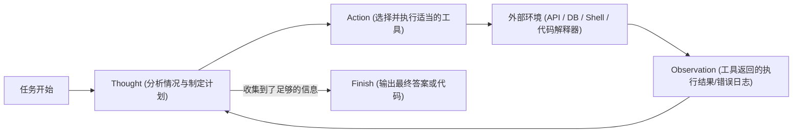
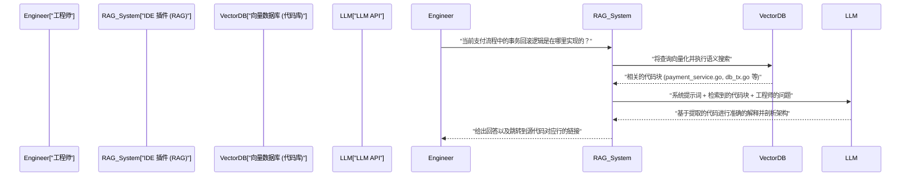

# 前言：为什么工程师应该学习提示词工程

在大型语言模型（LLM）的快速进化下，软件开发世界正处于前所未有的范式转移之中。可以说，我们正从Andrejs Karpathy提出的“Software 2.0（通过神经网络进行开发）”向如今的“Software 3.0（自然语言驱动的提示词开发）”过渡。

随着GitHub Copilot、Cursor或各种基于LLM API的AI助手工具的普及，工程师的主要工作已经从“从零开始编写代码”转变为“设计指令让AI生成符合意图的代码，并审查、整合这些生成的代码”。

在这种新的开发方法中，最重要的技能就是**提示词工程（Prompt Engineering）**。虽然提示词工程常被视为非工程师群体中所谓“与AI巧妙聊天”的流行语，但其本质是**一种针对非确定性（Non-deterministic）计算系统的全新形式的编程语言**。

本文面向软件工程师和架构师，从LLM背后的数学和架构基础出发，到Few-Shot、Chain-of-Thought、ReAct等高级提示词工程方法，再到如何将其融入实际开发工作流及API中，以约一万字的篇幅进行了极其详尽的解说。

---

## 1. 大型语言模型（LLM）的基础与数学背景

为了优化提示词并稳定地获得符合预期的输出，我们必须从数学和结构上理解“黑盒内部”，即LLM在内部是如何处理和生成文本及代码的。现代LLM几乎都是基于Transformer架构的自回归（Auto-regressive）语言模型。

### 1.1 分词（Tokenization）与BPE

LLM并不会直接处理原始文本字符串。文本会被分割成被称为**Token**的较小单位。大多数模型使用了名为字节对编码（Byte-Pair Encoding, BPE）的算法。

对于工程师来说，理解分词非常重要。因为在编程语言中，缩进（空格）和特殊符号如何被分词，将直接影响代码生成的质量。例如，在Python的代码生成中，空格的数量（是4个空格还是制表符）通常被视作独立的Token，如果在提示词中没有明确指定缩进规则，就可能导致语法错误。

### 1.2 下一个Token预测（Next Token Prediction）

自回归LLM的基本任务是预测接在给定输入序列（上下文）之后的“概率最高的下一个Token”。如果用数学公式表达，这就是如下的条件概率最大化问题：

$$ P(w_t | w_{1}, w_{2}, \dots, w_{t-1}) $$

这里，$w_i$ 表示Token，$t$ 为当前时间步。模型通过内部的神经网络，从输入Token集合中计算出下一个Token的概率分布。生成的Token作为下一步的输入进行自回归式的追加，这个过程会不断重复，直到输出结束Token（如 `<EOS>`）。

### 1.3 注意力机制（Attention Mechanism）与上下文窗口

构成Transformer架构核心的是自注意力（Self-Attention）机制。借此，模型可以计算序列中相距较远的Token之间的依赖关系。

$$ \text{Attention}(Q, K, V) = \text{softmax}\left(\frac{Q K^T}{\sqrt{d_k}}\right) V $$

这里，$Q$（Query）、$K$（Key）、$V$（Value）是由输入表示生成的矩阵，而 $d_k$ 是缩放因子。这个公式的含义是“计算当前正在处理的单词（Query）应该关注（Attention）过去的哪些单词（Key），并提取该信息（Value）”的过程。

在提示词工程中，为什么理解这个机制如此重要？因为这与**上下文窗口（Context Window）**的概念直接相关。当输入提示词过长时，重要的指令可能会被埋没在上下文之中，导致注意力的权重分散，从而出现“中间信息丢失（Lost in the middle）”的现象。因此，我们不应将长篇文档或整个代码库直接全部扔进提示词中，而是需要设法精确提取必要的片段并传递给模型。

### 1.4 基于温度参数（Temperature）的采样控制

在输出层，通常使用Softmax函数将逻辑值（Logits，即模型的原始输出）转换为概率分布。为了控制生成的多样性（随机性），此时引入了**温度参数 $T$（Temperature）**。

$$ p_i = \frac{\exp(z_i / T)}{\sum_j \exp(z_j / T)} $$

- $z_i$ 是词汇表中Token $i$ 的逻辑值（得分）。
- 当 $T = 1.0$ 时，即为标准的Softmax分布。
- 当 $T \to 0$ 趋近于0时，概率分布变得更加尖锐，仅选择概率最高的Token（确定性生成，贪心解码Greedy Decoding）。
- 当 $T > 1.0$ 时，概率分布变得平坦，平时很少被选择的冷门Token也更容易被选中（创造性增强）。

**面向工程师的实践策略：**
在通过API进行代码生成或JSON数据提取（结构化输出）时，为防止产生幻觉（Hallucination）并提高结果可复现性，常规做法是将其设定为 $T=0.0 \sim 0.2$ 的极低值。而在进行架构头脑风暴或命名规则构思等探索性任务时，应将 $T$ 设定在 $0.7 \sim 1.0$ 之间。

---

## 2. 提示词的结构架构：系统提示词（System Prompt）与用户提示词（User Prompt）

利用OpenAI API（如GPT-4）或Anthropic API（如Claude）构建AI应用时，提示词并不是单一的文本块，而是结构化的消息数组。其中最重要的概念就是“系统提示词（System Prompt）”与“用户提示词（User Prompt）”的分离。

### 2.1 系统提示词：全局约束与人设定义

系统提示词负责为LLM定义**全局的约束、人设（角色）以及基本的行为规则**。如果将其比作软件设计，它就相当于应用程序的“环境变量”、“基类”，或者是容器中的“Dockerfile”。

优秀的系统提示词能够显著稳定输出的质量和格式。

```text
# 系统提示词示例
你是世界顶级的资深Go工程师，精通并发处理（Goroutine/Channel）设计。
请严格遵循以下规则生成回答：

【规则】
1. 提供代码时，必须提供可执行的完整函数。
2. 不要省略错误处理，必须遵守Go的惯例使用 `if err != nil` 进行显式处理。
3. 代码块之外的说明应使用列表形式，并限制在3句话以内。
4. 若被要求提供有安全隐患（如SQL注入、竞态条件等）的实现，必须提出安全的替代方案。
5. 输出格式仅限于文字说明和Markdown代码块。
```

### 2.2 用户提示词：临时任务与数据注入

用户提示词提供的是具体的任务、问题或需要处理的输入数据。它相当于在由系统提示词构建的上下文环境中执行的“函数调用（向函数传递参数）”。

```text
# 用户提示词示例
请实现一个可以异步从大量URL列表中下载图片并保存至本地磁盘的函数。
需通过参数控制工作线程（Worker）的数量，并在实现中包含基于上下文（context.Context）的超时处理。
```

通过牢固地设置系统提示词，可以在面对用户（或系统其他组件）注入的高度变化的用户提示词时，保证输出的稳定性。此外，它也能作为防范恶意用户输入的“提示词注入（Prompt Injection）”攻击的第一道防线。

---

## 3. 核心提示词工程技术群

接下来，将为您讲解能够大幅提升软件开发任务精确度的具体提示词范式。

### 3.1 零样本提示（Zero-Shot Prompting）与少样本提示（Few-Shot Prompting）

**零样本提示（Zero-Shot Prompting）** 是一种仅提供任务指令，而不提供任何示例就要求模型进行解答的方法。如果只是提出“用Python写一个快速排序”等常见请求，当前先进的LLM即使在零样本提示下也能发挥出色的作用。

然而，当需要模型遵循项目特有的编码规范，或者输出特定的JSON结构时，零样本提示下格式崩溃的概率会很高。为了解决这个问题，我们需要使用 **少样本提示（Few-Shot Prompting）**。

少样本提示是在提示词中提供数个“输入与期望输出的组合（示例展示）”的方法。它利用了一种名为“上下文学习（In-Context Learning）”的现象，即在不更新模型参数的情况下，在提示词上下文中学习特定模式。

```text
# 少样本提示示例（日志解析任务）
请解析以下原始日志，并提取出结构化的JSON对象。

示例1：
输入: "[2023-10-01 10:00:05] ERROR [AuthService] Failed to authenticate user id=12345: Invalid password"
输出: {"timestamp": "2023-10-01T10:00:05Z", "level": "ERROR", "service": "AuthService", "message": "Failed to authenticate user", "user_id": 12345}

示例2：
输入: "[2023-10-01 10:05:12] WARN [DBPool] Connection timeout approaching for query_id=987"
输出: {"timestamp": "2023-10-01T10:05:12Z", "level": "WARN", "service": "DBPool", "message": "Connection timeout approaching", "query_id": 987}

任务输入：
输入: "[2023-10-01 10:15:30] FATAL [PaymentGateway] API rate limit exceeded. Retry after 60s"
输出:
```

通过这样提供示例，模型就能隐式地学习 `timestamp` 的格式（如转换为ISO 8601）以及键名的命名规则，从而输出完美的JSON。

### 3.2 思维链（Chain-of-Thought, CoT）与 Zero-Shot CoT

关于LLM推理能力的一个重大突破就是 **思维链（Chain-of-Thought，CoT）**。在需要复杂逻辑的任务（例如复杂算法实现、疑难Bug追踪、正则表达式构建等）中，如果直接让LLM输出最终代码，很容易产生逻辑跳跃或错误（幻觉）。

CoT是一种在输出最终答案前，要求模型将中间推理过程（思考过程）用语言表达出来的方法。通过让模型自身逐步分析情况，每生成一个Token上下文就会变得更丰富，从而极大提高最终结论的准确性。

最简单且有效的技巧就是 **Zero-Shot CoT**，即在提示词结尾加上一句神奇的口诀：“**让我们一步一步地思考（Let's think step by step）**”。

在开发中，我们可以应用这个概念，像下面这样对提示词进行结构化：

```text
请编写一个满足以下规格的React组件。
【规格】...

在生成代码之前，请按照以下步骤在 `<thinking>` 标签内描述你的思考过程。
1. 确定所需状态（State）并设计数据结构
2. 考虑可能出现的边缘情况（Edge cases）与错误处理
3. 考虑组件的拆分粒度

完成思考过程后，请编写最终的TypeScript代码。
```



### 3.3 思维树（Tree of Thoughts, ToT）

进一步扩展CoT概念的便是 **思维树（Tree of Thoughts, ToT）**。与CoT沿着单向（线性）推理路径前进不同，ToT像探索树一样并行展开多个推理路径（分支），让模型自身对各条路径进行自我评估，并在必要时进行回溯（Backtracking），从而找到最佳的解决方案。

ToT在解决系统架构设计、复杂的数据库模式设计或是大规模重构计划等搜索空间巨大且容易陷入局部最优的问题时非常有效。



为了在提示词中实现ToT，可以如此指示：“请提出多种解决方案，评估各自的优缺点，然后采用最优的方案进行实现。”

---

## 4. 智能体工作流（Agentic Workflow）与 ReAct（Reasoning and Acting）

LLM的应用已经从单一的文本输入输出，迅速演变为能够自主规划并与外部环境交互以完成任务的 **AI智能体（AI Agents）** 领域。而构成这一智能体架构核心的范式便是 **ReAct (Reasoning and Acting，推理与行动)**。

### 4.1 ReAct框架的概念

传统的LLM虽然能做到“先思考后回答（CoT）”，却无法通过“行动”来弥补自身知识的缺失。ReAct框架通过让LLM交替进行“思考（Thought）”与“行动（Action）”，突破了这一限制。

模型分析问题（Thought），在判断信息不足时就会执行外部工具（如网页搜索、数据库查询、Shell命令、API调用等）（Action）。它接收工具执行的结果（Observation），将其作为新的上下文进一步推进思考，并持续这个循环直到得出最终答案（Finish）。



### 4.2 基于函数调用（Function Calling / Tool Use）的实现

将ReAct集成到系统中的标准接口，就是OpenAI或Anthropic等提供的 **函数调用（Function Calling / Tool Use）** 功能。

工程师向LLM传递系统提示词的同时，也传递“可用工具群的定义（JSON结构）”。LLM解析提示词的上下文，若判断需要使用工具，就不会输出普通文本，而是输出“应该调用的函数名称”及“其对应的JSON参数”。应用程序侧执行该函数，将结果再次返回给LLM，从而形成一个循环。

**开发应用示例（自主调试智能体）：**
例如构建一个在CI/CD流水线中测试失败时，能够自动调查原因并生成补丁的智能体，我们可以为LLM提供如下工具：

1. `search_codebase(regex_pattern)`：使用正则表达式搜索仓库中的代码。
2. `view_file_content(file_path, start_line, end_line)`：读取指定文件的内容。
3. `run_unit_test(test_file_path)`：执行特定的单元测试并获取Traceback日志。
4. `propose_patch(file_path, diff_content)`：提出修改补丁。

LLM会自主地像这样进行推理与行动：
- **Thought**：观察测试日志发现在 `src/auth.py` 的第45行发生了 `KeyError: 'user_id'`。需要检查周边的代码。
- **Action**：`view_file_content(file_path="src/auth.py", start_line=30, end_line=60)`
- **Observation**：（应用程序读取文件内容，返回给LLM）
- **Thought**：原来如此，当API返回的JSON不包含 `user_id` 时的校验逻辑缺失了。让我们编写补丁改用更安全的 `.get()` 方法吧。
- **Action**：`propose_patch(...)`

由此可见，提示词工程的维度已经从单纯的“控制文本生成”，提升到了“工具定义与智能体循环设计（业务编排）”的层面。

---

## 5. RAG（检索增强生成）与代码库集成

LLM最大的弱点之一，就是它不了解未包含在预训练数据中的“私有信息”和“最新信息”。如果你询问公司内部的未公开仓库或专有的API规范，LLM很可能会若无其事地撒谎（产生幻觉）或仅能给出笼统的回答。

解决这一问题的架构就是 **RAG（检索增强生成，Retrieval-Augmented Generation）**。RAG是一项结合了信息检索（Retrieval）和LLM生成能力（Generation）的技术。

### 5.1 向量嵌入（Embeddings）与向量搜索

RAG的底层基础是数学上的向量空间模型。源代码和内部文档通过Embedding模型（例如：`text-embedding-3-small`）转换为高维向量（例如：1536维浮点数数组），并存储在向量数据库（Vector Database）中。

当用户输入问题（查询Query）时，该查询也会被同一模型向量化，并与数据库中的文档向量计算 **余弦相似度（Cosine Similarity）**。

$$ \text{Cosine Similarity}(A, B) = \frac{A \cdot B}{\|A\| \|B\|} = \frac{\sum_{i=1}^{n} A_i B_i}{\sqrt{\sum_{i=1}^{n} A_i^2} \sqrt{\sum_{i=1}^{n} B_i^2}} $$

系统获取相似度最高（语义上最接近）的前几个代码片段或文档，并将它们作为“上下文”动态注入到用户提示词中。

### 5.2 RAG在开发工作流中的应用

通过在开发工具中集成RAG，可以在IDE中实现如下强大的功能：



构建面向代码库的RAG时，有一个重要的提示词工程技巧：不要只是简单地对代码进行切片（Chunking），还要将“根据各个函数的Docstring或类的抽象语法树（AST）生成的摘要”包含进向量化对象中，这样能飞跃性地提升检索精度。

---

## 6. 工程实践中的实际用例与高级提示词示例

接下来我们将介绍一些实用的场景和提示词技巧，以展示如何将提示词工程理论应用于日常开发业务的自动化与效率提升。

### 6.1 代码审查自动化与静态分析的补充

在CI流水线中集成LLM，并在创建Pull Request (PR) 时让其自动进行代码审查。其目的在于指出那些Lint工具或静态分析工具无法检测出的业务逻辑不一致或设计上的反模式。

**提示词示例（请求结构化输出）：**
```text
你是一名严格且经验丰富的资深软件工程师。
请分析所提供的Pull Request差异（Git Diff），并进行代码审查。

【审查重点领域】
1. 安全漏洞（注入攻击、XSS、绕过授权等）
2. 性能瓶颈（N+1查询问题、低效的循环计算等）
3. 可维护性与可读性（违反SOLID原则、嵌套过深等）

【约束条件】
- 仅仅是格式违规（如缩进错误等）属于Lint工具的范畴，请勿指出。
- 如果没有问题，请不要强行拼凑审查意见，直接返回空数组。
- 输出必须符合以下JSON规范，请不要使用Markdown的反引号（```json）包裹。

【期望的JSON输出格式】
{
  "review_comments": [
    {
      "file_path": "string",
      "line_number": "integer",
      "severity": "High | Medium | Low",
      "issue_title": "string",
      "detailed_description": "string",
      "suggested_code_fix": "string"
    }
  ]
}

[Git Diff Data]
{{PR_DIFF}}
```

这个提示词的关键点在于：强制LLM输出易于解析的JSON格式，并且明确区分Lint工具的作用和LLM的作用（定义系统边界）。

### 6.2 零样本代码生成时的“防御性提示（Defensive Prompting）”

让AI编写代码时经常发生的问题包括：“擅自引入不存在的库（产生幻觉）”和“省略必要的变量定义（如用 `# 在此处编写处理逻辑` 进行省略）”。为了防止这些现象，我们需要在提示词内设置强力的护栏，即进行“防御性提示（Defensive Prompting）”。

**防御性提示的关键要素：**
1. **禁止省略：** “不要省略代码或使用占位符（如 `// ...`），请生成可以直接复制粘贴并执行的完整文件。”
2. **防止幻觉：** “如果满足需求的标准库不存在，请不要擅自捏造不存在的第三方库。在这种情况下，请明确注明需要安装外部库，并提出使用最标准的库（例如：requests）的代码。”
3. **要求自我完备性：** “所有变量和函数必须在代码块中被妥善定义。”

### 6.3 自动生成基于属性的测试 / 边缘用例测试

针对工程师实现的函数，让LLM去寻找边缘极端案例并生成测试代码。这在排除人为思维定式方面非常有效。

```text
以下Python函数用于判断给定字符串是否为有效的IPv4地址。
请为该函数编写一个全面且基于pytest的单元测试套件。

【条件】
- 不仅要有正常情况下的测试用例，还需彻底覆盖以下边缘用例：
  - 边界值（如0、255、256等）
  - 不同类型的输入（如整数、None、列表等）
  - 包含空格或特殊字符的字符串
  - 点数异常的情况（少于3个或多于4个）
- 利用参数化测试（`@pytest.mark.parametrize`）保持测试代码的简洁。

[函数代码]
def is_valid_ipv4(ip_str):
    # 实现细节...
```

---

## 7. 提示词的评估与LLMOps (Eval)

在软件工程的世界里，未经测试的代码被称为遗留代码（Legacy Code）。在提示词工程中也是完全一样的道理。“在本地试了几次碰巧能跑通的提示词”部署到生产环境是极其危险的。

随着基础模型的版本升级或所处理的领域数据发生变化，提示词的行为很容易崩溃。为了防止这种情况发生，构建一个定量评估提示词输出结果的 **评估（Evaluation / Eval）** 机制（即LLMOps）是不可或缺的。

### 7.1 LLM-as-a-Judge（使用LLM评估LLM）

对于代码生成或文本摘要等任务而言，完全匹配（Exact Match）测试是不可能的。而自然语言处理领域中传统的评估指标（如BLEU或ROUGE），在衡量语义准确性方面也显得力不从心。

目前的行业标准方法是使用强大的模型（如GPT-4o或Claude 3.5 Sonnet）作为“裁判员（Judge）”，对目标LLM的输出结果进行评分，这种方法被称为 **LLM-as-a-Judge**。

1. **准备测试集**：准备几十到几百对“输入数据与理想输出（或评估标准）”的数据组合。
2. **执行**：使用待评估的提示词与模型，针对测试集生成输出结果。
3. **评估**：准备用于评估的提示词（元提示词，Meta-prompt），指示裁判模型（Judge LLM）：“生成的输出是否满足需求，请以1~5分进行评分”。

借此，我们可以在CI/CD流水线上自动检测出修改提示词时造成的回归（性能退化）。提示词工程正从手工艺般的“调试提示词”进化为数据驱动且具备可复现性的真正“工程学（Engineering）”。

---

## 8. 结语：提示词是软件架构的新组件

在AI编写代码的时代，虽然有时会听到“编程已死”的呼声，但现实并非如此。这仅仅是工程师所需的抽象化层级又提升了一层而已。

曾经我们从汇编语言转向C语言，再过渡到带有垃圾回收机制的高级语言，从而从繁琐的内存管理中解放出来，得以专注于构建更复杂的业务逻辑。LLM与提示词工程，正是紧随其后的下一波抽象化浪潮。

1. **理解架构**：理解LLM的概率性质（自回归、注意力机制、温度参数），以控制系统的非确定性。
2. **设计上下文**：利用系统提示词进行约束，并运用Few-Shot/CoT明确传达意图。
3. **智能体思维与工具集成**：灵活运用ReAct范式，将LLM作为系统的业务编排器加以利用。
4. **持续评估**：将提示词作为代码的一部分进行版本控制，通过Eval以测试驱动的方式不断改进。

掌握这些原则后，提示词将不再只是单纯的字符串，而是成为健壮且可扩展的软件组件。希望各位能将本文讲解的高级提示词工程方法融入自己的开发工作流及产品中，成为引领次世代“Software 3.0”的杰出工程师。

---
*Generated using Prompt Engineering Techniques.*
*使用提示词工程技术生成。*
