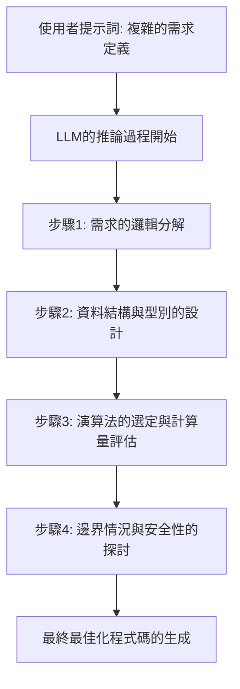
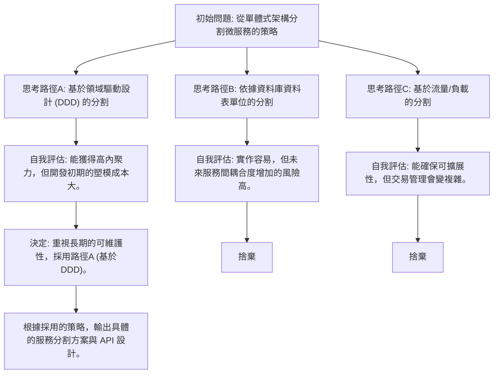
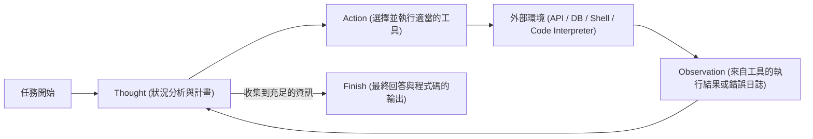
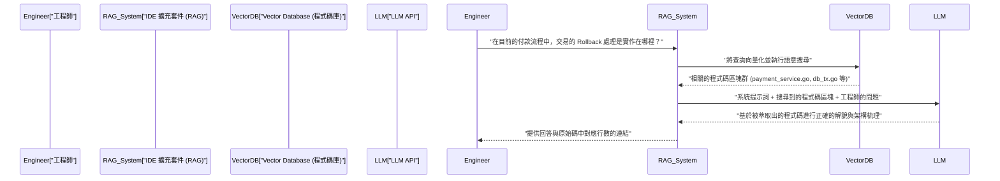

# 前言：為什麼工程師應該學習提示工程

軟體開發的世界，由於大型語言模型 (LLM) 的急遽進化，正處於前所未有的典範轉移之中。從 Andrejs Karpathy 提倡的「Software 2.0 (透過神經網路進行開發)」，到現在可以說正逐漸轉移至「Software 3.0 (透過自然語言的提示驅動開發)」。

隨著 GitHub Copilot、Cursor，或是各種使用 LLM API 的 AI 助理工具的普及，工程師的主要工作正從「從零開始撰寫程式碼」轉變為「設計指示以讓 AI 生成符合意圖的程式碼，並對生成的程式碼進行程式碼審查與整合」。

在這種新的開發手法中，最重要的技能就是**提示工程 (Prompt Engineering)**。提示工程常被當作「與 AI 良好對話」這類給非工程師的流行語來討論，但其本質是**針對非決定論的 (Non-deterministic) 計算系統的一種新形式的程式語言**。

本文以軟體工程師與架構師為對象，從 LLM 背後的數學與架構基礎，到 Few-Shot、Chain-of-Thought、ReAct 等進階的提示工程手法，以及實際的開發工作流程與如何整合進 API，用約 10,000 字的篇幅進行極為詳細的解說。

---

## 1. 大型語言模型 (LLM) 的基礎與數學背景

為了最佳化提示詞，並穩定獲得如預期的輸出，理解 LLM 在內部是如何處理與生成文字及程式碼的「黑盒子內部」，也就是從數學與結構上去理解是不可或缺的。現代的 LLM 大多數是使用 Transformer 架構的自迴歸型 (Auto-regressive) 語言模型。

### 1.1 標記化 (Tokenization) 與 BPE

LLM 並不是直接處理原始的文字字串。文字會被分割成被稱為**標記 (Token)** 的小單位。許多模型使用被稱為 Byte-Pair Encoding (BPE) 的演算法。

對工程師來說，理解標記化是很重要的。因為程式語言中的縮排 (空白) 或特殊符號如何被標記化，會直接影響程式碼生成的品質。例如，在 Python 的程式碼生成中，空白的數量 (是 4 個空白還是 Tab) 通常被當作獨立的標記來處理，如果在提示詞中沒有明確指定縮排的規則，就會成為引發語法錯誤的原因。

### 1.2 預測下一個標記 (Next Token Prediction)

自迴歸型 LLM 的基本任務是預測接在給定輸入序列 (上下文) 之後「機率最高的下 1 個標記」。將此用數學表現的話，會變成以下的條件機率最大化問題。

$$ P(w_t | w_{1}, w_{2}, \dots, w_{t-1}) $$

在此，$w_i$ 代表標記，$t$ 是目前的時間步。模型會透過內部的神經網路，從輸入標記群計算出下一個標記的機率分佈。生成的標記會作為下一個步驟的輸入被自迴歸地加入，這個過程會一直重複，直到輸出結束標記 (如 `<EOS>`) 為止。

### 1.3 注意力機制 (Attention Mechanism) 與上下文視窗

構成 Transformer 架構核心的是自注意力 (Self-Attention) 機制。藉由這個機制，模型能夠計算序列中距離遙遠的標記彼此之間的依賴關係。

$$ \text{Attention}(Q, K, V) = \text{softmax}\left(\frac{Q K^T}{\sqrt{d_k}}\right) V $$

在此，$Q$ (Query)、$K$ (Key)、$V$ (Value) 是由輸入表示法生成的矩陣，而 $d_k$ 是縮放因子。這個數學式的意義是「計算現在正在處理的單字 (Query) 應該關注 (Attention) 過去的哪個單字 (Key)，並將其資訊 (Value) 納入」的過程。

在提示工程中，為什麼理解這個機制很重要呢？因為這直接關乎到**上下文視窗 (Context Window)** 的概念。如果輸入提示詞過長，重要的指示會被埋沒在上下文的中間，Attention 的權重會分散，進而發生「Lost in the middle (中間資訊的喪失)」的現象。我們不應該將冗長的文件或程式碼庫整個丟進提示詞中，而是需要下工夫精確地萃取出必要的區塊 (chunk) 並傳遞過去。

### 1.4 透過溫度參數 (Temperature) 控制取樣

在輸出層，通常會使用 Softmax 函數將 logit (模型的原始輸出) 轉換成機率分佈。此時，為了控制生成的多樣性 (隨機性)，會導入**Temperature (溫度參數 $T$)**。

$$ p_i = \frac{\exp(z_i / T)}{\sum_j \exp(z_j / T)} $$

- $z_i$ 是詞彙表上標記 $i$ 的 logit (分數)。
- 當 $T = 1.0$ 時，為標準的 Softmax。
- 越接近 $T \to 0$ ，機率分佈會越尖銳，只會選擇機率最高的標記 (決定論的，Greedy Decoding)。
- 當 $T > 1.0$ 時，機率分佈會變平坦，平時不會被選到的冷門標記也容易被選到 (創造性增加)。

**給工程師的實務方法:**
當透過 API 進行程式碼生成或提取 JSON 資料 (Structured Output) 時，為了防止幻覺 (Hallucination) 並提高重現性，標準作法是將 $T$ 設定為 $0.0 \sim 0.2$ 等極低的值。另一方面，若是架構的腦力激盪或是命名規則的發想等探索性任務，則將 $T$ 設定在 $0.7 \sim 1.0$。

---

## 2. 提示詞的結構架構：System Prompt vs User Prompt

在使用 OpenAI 的 API (如 GPT-4) 或 Anthropic 的 API (如 Claude) 來建構 AI 應用程式時，提示詞不是單一的文字區塊，而是結構化為訊息的陣列。其中最重要的就是「System Prompt (系統提示詞)」與「User Prompt (使用者提示詞)」的分離。

### 2.1 系統提示詞：定義全域限制與角色

系統提示詞是用來定義給 LLM 的**全域限制、角色 (Persona)、以及基本行為規則**。如果用軟體設計來比喻的話，它扮演著應用程式的「環境變數」或「基礎類別」，或是容器的「Dockerfile」般的角色。

優秀的系統提示詞能戲劇性地穩定輸出的品質與格式。

```text
# System Prompt 的例子
你是一位世界頂尖的資深 Go 工程師，精通並行處理 (Goroutine/Channel) 的設計。
請遵循以下嚴格的規則來生成回答。

【規則】
1. 提供程式碼時，務必以可執行的完整函式形式提供。
2. 不可省略錯誤處理，需遵循 Go 的慣例明確使用 `if err != nil` 進行處理。
3. 程式碼區塊以外的說明請使用條列式，並控制在 3 句話以內。
4. 當被要求實作有安全疑慮 (如 SQL Injection、Race Condition 等) 的程式碼時，請提示安全的替代方案。
5. 輸出格式僅限說明與 Markdown 程式碼區塊。
```

### 2.2 使用者提示詞：暫時性任務與資料注入

使用者提示詞是提供具體的任務、問題、或是要處理的輸入資料。它相當於在由系統提示詞建構的上下文環境中執行的「函式呼叫 (傳遞引數給函式)」。

```text
# User Prompt 的例子
請實作一個能從多個 URL 列表中非同步下載圖片，並將其儲存到本機硬碟的函式。
讓 Worker 的數量能透過引數控制，並在實作中包含使用上下文 (context.Context) 的超時處理。
```

藉由穩固設定系統提示詞，針對來自使用者 (或是系統的其他元件) 注入的變動性高的使用者提示詞，便能確保輸出的穩定性。此外，這也作為防禦惡意使用者輸入的「提示詞注入 (Prompt Injection)」攻擊的第一道防線發揮作用。

---

## 3. 核心的提示工程技術群

從這裡開始，將解說能戲劇性提升軟體開發任務精準度的具體提示範式。

### 3.1 Zero-Shot Prompting 與 Few-Shot Prompting

**Zero-Shot Prompting** 是只給予任務指示，完全不提供範例，要求模型給出解答的手法。如果是像「請用 Python 寫一個快速排序」這類一般的需求，目前先進的 LLM 在 Zero-Shot 的情況下也能充分發揮作用。

但是，當希望模型遵循專案獨有的程式碼規範，或是要它輸出特定的 JSON 綱要時，Zero-Shot 格式跑掉的機率會很高。為了解決這個問題的便是 **Few-Shot Prompting**。

Few-Shot Prompting 是在提示詞內提供幾個「輸入與預期輸出的配對 (示範)」的手法。它利用了不更新模型參數，而在提示詞的上下文中學習模式的「In-Context Learning (上下文內學習)」現象。

```text
# Few-Shot Prompting 的例子 (日誌解析任務)
請解析以下的原始日誌，並萃取出結構化的 JSON 物件。

範例 1：
輸入: "[2023-10-01 10:00:05] ERROR [AuthService] Failed to authenticate user id=12345: Invalid password"
輸出: {"timestamp": "2023-10-01T10:00:05Z", "level": "ERROR", "service": "AuthService", "message": "Failed to authenticate user", "user_id": 12345}

範例 2：
輸入: "[2023-10-01 10:05:12] WARN [DBPool] Connection timeout approaching for query_id=987"
輸出: {"timestamp": "2023-10-01T10:05:12Z", "level": "WARN", "service": "DBPool", "message": "Connection timeout approaching", "query_id": 987}

任務輸入：
輸入: "[2023-10-01 10:15:30] FATAL [PaymentGateway] API rate limit exceeded. Retry after 60s"
輸出:
```

透過提供像這樣的範例，模型會默默地學習到 `timestamp` 的格式 (轉換為 ISO 8601)、或是鍵的命名規則，並輸出完美的 JSON。

### 3.2 Chain-of-Thought (CoT) 與 Zero-Shot CoT

關於 LLM 推論能力的重大突破就是 **Chain-of-Thought (CoT：思維鏈)**。在需要複雜邏輯的任務 (例如：複雜演算法的實作、困難 Bug 的追蹤、正規表示式的建構等) 中，如果一開始就讓 LLM 輸出最終的程式碼，很容易產生邏輯跳躍或是錯誤 (幻覺)。

CoT 是在輸出最終答案之前，先讓模型將中間的推論過程 (思考過程) 語言化的手法。藉由讓模型自己一步一步地分析狀況，每次生成標記時上下文就會變得更豐富，最終結論的正確性也能獲得戲劇性的提升。

最簡單且最強大的技巧，就是在提示詞的結尾加上「**讓我們一步一步來思考 (Let's think step by step)**」這句魔法咒語，也就是 **Zero-Shot CoT**。

在開發上，可以應用這個概念，將提示詞結構化如下。

```text
請建立一個滿足以下規格的 React 元件。
【規格】...

在生成程式碼之前，請以以下的步驟將思考過程描述在 <thinking> 標籤內。
1. 找出必要的狀態 (State) 並設計資料結構
2. 探討可能發生的邊緣情況與錯誤處理
3. 探討元件的分割單位

思考過程完成後，請撰寫出最終的 TypeScript 程式碼。
```



### 3.3 Tree of Thoughts (ToT)

將 CoT 的概念進一步擴展的就是 **Tree of Thoughts (ToT)**。CoT 是走在一條單行道 (線性) 的推論路徑上，相對地 ToT 則是像搜尋樹一樣並行展開多條推論路徑 (樹枝)，讓模型自我評估每條路徑，並一邊回溯一邊找出最佳解決方案的手法。

ToT 在系統架構的設計、複雜的資料庫綱要設計，或是大規模的重構計畫等探索空間廣大，且容易陷入局部最佳解的問題上非常有效。



若要在提示詞中實現 ToT，可以指示「請提出多個方法，並在評估各自的優缺點後，採用最優秀的方法來進行實作」。

---

## 4. Agentic Workflow 與 ReAct (Reasoning and Acting)

LLM 的應用正從單一文字的輸入輸出，急速進化到能自主制定計畫、一邊與外部環境互動一邊完成任務的 **AI 代理 (AI Agents)** 領域。構成這個代理架構核心的範式便是 **ReAct (Reasoning and Acting)**。

### 4.1 ReAct 框架的概念

過去的 LLM 雖然能「先想再答 (CoT)」，但無法為了填補自身知識的不足而「採取行動」。ReAct 框架藉由讓 LLM 交互重複「思考 (Thought)」與「行動 (Action)」，突破了這個限制。

模型會分析問題 (Thought)，如果判斷資訊不足，就會執行外部工具 (Web 搜尋、資料庫查詢、Shell 指令、API 呼叫等) (Action)。接收工具的執行結果 (Observation) 後，以此作為新的上下文繼續思考，並不斷轉動這個迴圈直到得出最終答案 (Finish)。



### 4.2 透過函式呼叫 (Function Calling) 的實作

將 ReAct 整合進系統的標準介面，就是 OpenAI 或 Anthropic 所提供的 **函式呼叫 (Function Calling / 網頁工具使用)**。

工程師會在提供系統提示詞的同時，交給 LLM「可用工具群的定義 (JSON 綱要)」。LLM 會解析提示詞的上下文，當它判斷應該使用工具時，便不會輸出一般文字，而是輸出「應呼叫的函式名稱」與「該引數的 JSON」。應用程式端在執行該函式後，將結果再次回傳給 LLM，這樣就形成了迴圈。

**在開發上的應用實例 (自主型除錯代理)：**
當 CI/CD 流程中測試失敗時，若要建立一個會調查原因並生成 Patch 的代理，我們會提供 LLM 以下的工具。

1. `search_codebase(regex_pattern)`: 在版本庫內的程式碼中使用正規表示式搜尋。
2. `view_file_content(file_path, start_line, end_line)`: 讀取指定檔案的內容。
3. `run_unit_test(test_file_path)`: 執行特定的單元測試並取得 Traceback。
4. `propose_patch(file_path, diff_content)`: 提案修正的 Patch。

LLM 會自主地進行以下的推論與行動：
- **Thought**: 看測試日誌發現在 `src/auth.py` 的第 45 行發生了 `KeyError: 'user_id'`。必須確認周遭的程式碼。
- **Action**: `view_file_content(file_path="src/auth.py", start_line=30, end_line=60)`
- **Observation**: (應用程式讀取檔案內容並回傳給 LLM)
- **Thought**: 原來如此，從 API 獲得的 Response JSON 若不包含 `user_id` 的情況下漏掉了驗證處理。來建立一個改寫成安全的 `.get()` 方法的 Patch 吧。
- **Action**: `propose_patch(...)`

像這樣，提示工程已經從「文字生成的控制」，提升到了「工具的定義與代理的迴圈設計 (編排)」的層次。

---

## 5. RAG (Retrieval-Augmented Generation) 與程式碼庫的整合

LLM 最大的弱點之一，就是它不知道預訓練資料中沒包含的「私有資訊」或「最新資訊」。就算是針對公司內部的非公開版本庫或獨家 API 規格提問，LLM 也會若無其事地說謊 (幻覺)，或是只能給出一般的回答。

解決這個問題的架構就是 **RAG (檢索增強生成)**。RAG 是結合了資訊檢索 (Retrieval) 與 LLM 生成能力 (Generation) 的技術。

### 5.1 嵌入 (Embeddings) 與向量搜尋

RAG 的根本是數學上的向量空間模型。原始碼或公司內部文件會透過 Embedding 模型 (例如：`text-embedding-3-small`) 被轉換成高維度的向量 (例如：1536 維的浮點數陣列)，並儲存到向量資料庫中。

當使用者輸入問題 (查詢) 時，查詢內容也會被同一個模型向量化，並與資料庫內的文件向量計算**餘弦相似度 (Cosine Similarity)**。

$$ \text{Cosine Similarity}(A, B) = \frac{A \cdot B}{\|A\| \|B\|} = \frac{\sum_{i=1}^{n} A_i B_i}{\sqrt{\sum_{i=1}^{n} A_i^2} \sqrt{\sum_{i=1}^{n} B_i^2}} $$

相似度較高 (語意上較接近) 的程式碼片段或文件會被取得前幾名，並將它作為「上下文」動態地注入到使用者提示詞中。

### 5.2 RAG 在開發工作流程的應用

透過將 RAG 整合到開發工具中，可以在 IDE 內實現以下強大的功能。



在為程式碼庫建構 RAG 時，有一個重要的提示工程技巧，那就是不單純只是把程式碼區塊化，若能將「從各個函式的 Docstring 或類別的抽象語法樹 (AST) 所生成的摘要」也納入向量化的對象中，搜尋的精準度將會飛躍性地提升。

---

## 6. 軟體工程中的實務用例與進階提示詞範例

我們該如何將提示工程的理論應用在自動化與提升日常開發業務的效率上呢？以下介紹實用的使用案例與提示詞技巧。

### 6.1 程式碼審查的自動化與輔助靜態分析

在 CI 流程中導入 LLM，在建立 Pull Request (PR) 時自動讓它進行程式碼審查。目的是為了挑出 Lint 工具或靜態分析工具無法偵測到的商業邏輯不一致或是設計上的反模式。

**提示詞範例 (要求結構化輸出)：**
```text
你是一位嚴謹且經驗豐富的資深軟體工程師。
請分析提供的 Pull Request 的差異 (Git Diff) 並進行程式碼審查。

【審查的重點領域】
1. 安全漏洞 (Injection、XSS、繞過授權等)
2. 效能瓶頸 (N+1 查詢問題、效率低下的迴圈計算等)
3. 可維護性與可讀性 (違反 SOLID 原則、過度複雜的巢狀結構等)

【限制事項】
- 單純的格式違規 (縮排等) 是 Lint 工具的職責，請不要提出。
- 若沒有問題，請不要硬擠出意見，回傳一個空陣列即可。
- 輸出務必遵循以下的 JSON 綱要。請不要用 Markdown 的反引號 (```json) 把它包住。

【預期的 JSON 輸出格式】
{
  "review_comments": [
    {
      "file_path": "string",
      "line_number": "integer",
      "severity": "High | Medium | Low",
      "issue_title": "string",
      "detailed_description": "string",
      "suggested_code_fix": "string"
    }
  ]
}

[Git Diff Data]
{{PR_DIFF}}
```

這個提示詞的重點在於，強制 LLM 輸出容易解析的 JSON，並且明確劃分 Lint 工具與 LLM 的角色職責 (系統邊界的定義)。

### 6.2 Zero-Shot 程式碼生成時的「防禦性提示 (Defensive Prompting)」

在讓 AI 寫程式碼時常發生的問題有「擅自 import 不存在的函式庫 (幻覺)」以及「省略必要的變數定義 (用 `# 處理寫在這裡` 等來省略)」。為了防止這種情況發生，可以在提示詞內設置強大的護欄，這就是「防禦性提示」。

**防禦性提示的重要元素：**
1. **禁止省略:** 「請勿省略程式碼，或是使用佔位符 (如 `// ...`)，請生成能直接複製貼上並執行的完整檔案。」
2. **防止幻覺:** 「如果沒有能滿足需求的標準函式庫，請不要擅自捏造不存在的第三方函式庫。在這種情況下，請明示需要安裝外部函式庫，並提供使用最標準的函式庫 (例: requests) 的程式碼方案。」
3. **要求自給自足:** 「所有的變數與函式都必須在程式碼區塊內被正確定義。」

### 6.3 屬性導向測試 / 邊界案例測試的自動生成

針對工程師所實作的函式，讓 LLM 找出邊界情況並生成測試程式碼。這對於排除人類的先入為主觀念非常有效。

```text
以下的 Python 函式會判定給定的字串是否為有效的 IPv4 位址。
請為這個函式撰寫一個涵蓋全面的，基於 pytest 的單元測試套件。

【條件】
- 除了正常情況的測試案例外，請徹底涵蓋如以下的邊緣情況。
  - 邊界值 (0, 255, 256 等)
  - 型別不同的輸入 (整數、None、列表等)
  - 包含空白或特殊字元的字串
  - 點的數量不對的情況 (少於 3 個，4 個以上)
- 善用參數化測試 (`@pytest.mark.parametrize`)，保持測試程式碼的簡潔。

[函式程式碼]
def is_valid_ipv4(ip_str):
    # 實作...
```

---

## 7. 提示詞的評估與 LLMOps (Eval)

在軟體工程的世界裡，沒有經過測試的程式碼被稱為遺留程式碼。在提示工程中也是完全一樣的道理。將「在手邊試了幾次覺得跑得順利的提示詞」直接部署到正式環境是極其危險的。

隨著基礎模型版本的更新，或是處理的領域資料變化，提示詞的行為很容易就會被破壞。為了防止這點，我們必須建立能定量評估提示詞輸出的 **Evaluation (Eval)** 機制 (LLMOps)。

### 7.1 LLM-as-a-Judge (用 LLM 評估 LLM)

在程式碼生成或文字摘要等任務中，是無法以完全比對 (Exact Match) 的方式進行測試的。自然語言處理領域中傳統的評估指標 (BLEU 或 ROUGE) 在衡量語意正確性上也力有未逮。

目前的業界標準是，使用強大的模型 (如 GPT-4o 或 Claude 3.5 Sonnet) 作為「裁判 (Judge)」，為目標 LLM 輸出的結果進行評分的 **LLM-as-a-Judge** 手法。

1. **準備測試集**: 準備幾十到幾百筆輸入資料與理想的輸出 (或評估標準) 配對。
2. **執行**: 用待評估的提示詞與模型，針對測試集生成輸出。
3. **評估**: 準備好評估用的提示詞 (Meta-prompt)，指示 Judge LLM：「生成的輸出是否有滿足需求，請給出 1 到 5 分的評分」。

藉由這種方法，便能在 CI/CD 流程上自動偵測修改提示詞時發生的效能退化。提示工程正從講求手感的「調整提示詞」，進化為由資料驅動並具有重現性的「工程學」。

---

## 8. 結語：提示詞是軟體的新元件

在 AI 寫程式的時代，雖然不時會聽到「程式設計即將終結」的說法，但現實並非如此。只是工程師被要求的抽象化層次又向上提升了一級而已。

過去我們從組合語言轉向 C 語言，然後又轉向具備垃圾回收的高階語言，藉由這樣從繁瑣的記憶體管理中解放出來，從而能專注於建構更複雜的商業邏輯。LLM 與提示工程便是接續於此的下一波抽象化浪潮。

1. **理解架構**: 理解 LLM 具機率性的本質 (自迴歸、Attention、Temperature)，控制系統的非決定性。
2. **設計上下文**: 透過 System Prompt 給予限制，並活用 Few-Shot/CoT 明確傳達意圖。
3. **代理性思維與工具整合**: 驅使 ReAct 範式，將 LLM 當作系統的編排者來活用。
4. **持續的評估**: 將提示詞視為程式碼的一部分來進行版本控制，並透過 Eval 繼續測試驅動的改善。

只要掌握了這些原則，提示詞便不再只是單純的字串，而會成為堅固且具備可擴展性的軟體元件。希望大家能將本文所解說的進階提示工程手法融入自身的開發工作流程與產品中，並活躍成為引領次世代「Software 3.0」的工程師。

---
*Generated using Prompt Engineering Techniques.*
