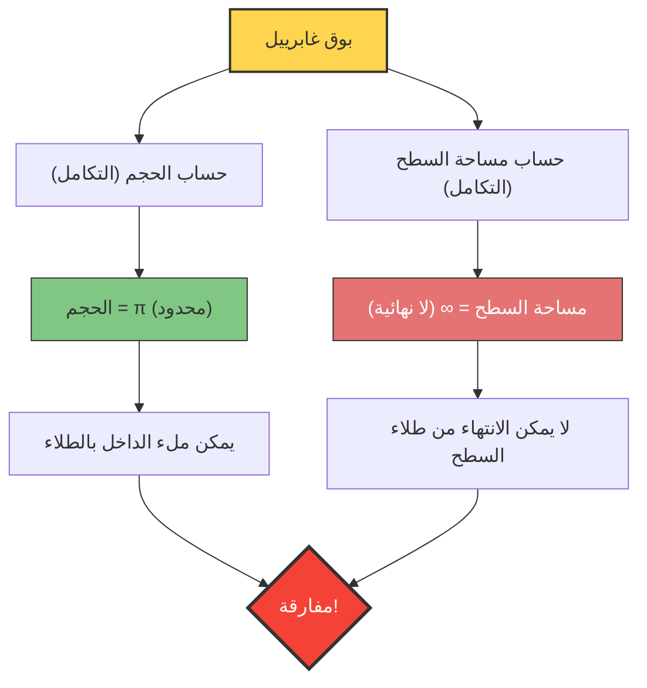

ماذا سيحدث إذا كان هناك وعاء "حجمه محدود، ولكن مساحة سطحه لا نهائية"؟
قد يبدو هذا مستحيلاً من الناحية البديهية، لكن في عالم الرياضيات يوجد بالفعل مثل هذا الشكل ثلاثي الأبعاد. يُعرف هذا الشكل باسم **"بوق غابرييل (Gabriel's Horn)"**، ويُسمى أيضاً **"بوق توريتشيلي"**.

تم اكتشاف هذا الشكل في عام 1641 من قبل عالم الرياضيات الإيطالي إيفانجيليستا توريتشيلي، وأحدث صدمة كبيرة لعلماء الرياضيات والفلاسفة في ذلك الوقت، مما أثار جدلاً حاداً حول طبيعة "اللانهاية".

## مفارقة الطلاء

إذا شبهنا خصائص هذا الشكل بـ "الطلاء" في حياتنا اليومية، فستحدث المفارقة الغريبة التالية:

1. **عند ملء البوق بالطلاء**:
   نظراً لأن حجم البوق محدود (وهو $\pi$ على وجه الدقة)، يمكنك ملء البوق من الداخل بالكامل بمجرد صب $\pi$ لتر (حوالي 3.14 لتر) من الطلاء.
2. **عند طلاء سطح البوق**:
   مساحة سطح البوق لا نهائية. لذلك، إذا حاولت طلاء السطح الداخلي (أو الخارجي) للبوق باستخدام فرشاة، فلن تنتهي من الطلاء أبداً مهما كانت كمية الطلاء التي قمت بإعدادها كبيرة.

**"يمكن ملء الداخل بـ 3.14 لتر من الطلاء، لكن طلاء السطح سيتطلب كمية لا نهائية من الطلاء"**
لماذا يحدث هذا الموقف الذي يتعارض مع الحدس البديهي؟

## الإثبات الرياضي: سحر حساب التفاضل والتكامل

يتم تشكيل بوق غابرييل عن طريق تدوير الرسم البياني للدالة $y = \frac{1}{x}$ (حيث $x \ge 1$) حول المحور $x$.
دعونا نستخدم حساب التفاضل والتكامل لحساب الحجم $V$ ومساحة السطح $A$ لهذا الشكل.

### 1. حساب الحجم (سبب كونه محدوداً)

يمكن إيجاد حجم الجسم الدوراني $V$ عن طريق تكامل مساحة المقطع العرضي (دائرة نصف قطرها $\frac{1}{x}$).

$$ V = \pi \int_{1}^{\infty} \left( \frac{1}{x} \right)^2 dx = \pi \int_{1}^{\infty} \frac{1}{x^2} dx $$

بحساب هذا التكامل المحدود:
$$ V = \pi \left[ -\frac{1}{x} \right]_{1}^{\infty} = \pi (0 - (-1)) = \pi $$
تتقارب النتيجة إلى القيمة المحدودة $\pi$.

### 2. حساب مساحة السطح (سبب كونها لا نهائية)

من ناحية أخرى، يتم حساب مساحة السطح $A$ على النحو التالي.

$$ A = 2\pi \int_{1}^{\infty} y \sqrt{1 + \left(\frac{dy}{dx}\right)^2} dx $$

بما أن $$ \frac{dy}{dx} = -\frac{1}{x^2} $$، فإن التعبير داخل الجذر التربيعي يصبح $1 + \frac{1}{x^4}$.
هنا، لجميع قيم $x \ge 1$، لدينا $\sqrt{1 + \frac{1}{x^4}} > 1$، وبالتالي تتحقق المتباينة التالية:

$$ A > 2\pi \int_{1}^{\infty} \frac{1}{x} \cdot 1 dx = 2\pi \left[ \ln x \right]_{1}^{\infty} $$

اللوغاريتم الطبيعي $\ln x$ يتباعد إلى اللانهاية عندما $x \to \infty$. وبالتالي، من الطبيعي أن تتباعد مساحة السطح $A$ الأكبر منه أيضًا إلى **اللانهاية**.

## "كشف اللغز" وراء هذه المفارقة

حتى لو أمكن إثبات ذلك رياضيًا بشكل صحيح، فقد لا يكون مقنعًا لمداركنا في العالم الحقيقي.
"إذا كان بإمكانك ملؤه بالطلاء، فهذا يعني أن الطلاء يلامس السطح الداخلي، لذا ألا يجب أن يكون السطح مطليًا أيضًا؟"

هذا التناقض الحدسي ينشأ من **الخلط بين المفاهيم الرياضية والواقع الفيزيائي**.

في عالم الرياضيات، يمكن جعل "سُمك" الطلاء رقيقًا إلى ما لا نهاية وصولًا إلى الصفر. يصبح بوق غابرييل رفيعًا بشكل لا نهائي كلما اتجهنا نحو نهايته، ولكن الطلاء الرياضي يمكن أن يصبح رقيقًا ليتدفق عميقًا داخل ذلك الطرف الرفيع، مكوّناً طبقة تغطي مساحة سطح لا نهائية بحجم محدود (مع العلم أن سُمك طبقة الطلاء يقترب من الصفر نحو الطرف).

ومع ذلك، في العالم الفيزيائي الحقيقي، يتكون الطلاء من ذرات وجزيئات (حبيبات ذات حجم محدود).
حتى لو صببت طلاءً حقيقيًا، بمجرد أن يصبح أنبوب البوق أرفع من "قُطر جزيء الطلاء"، فلن يتمكن الطلاء من التقدم أكثر. بمعنى آخر، من المستحيل فيزيائيًا ملؤه حتى النهاية، أو طلاء سطحه اللانهائي.

بوق غابرييل هو مثال جميل يعلمنا أن الحدس البشري مقيد بـ "قواعد العالم المحدود"، ولا يتطابق بالضرورة مع عالم حساب التفاضل والتكامل الذي يتعامل مع "اللانهاية".
