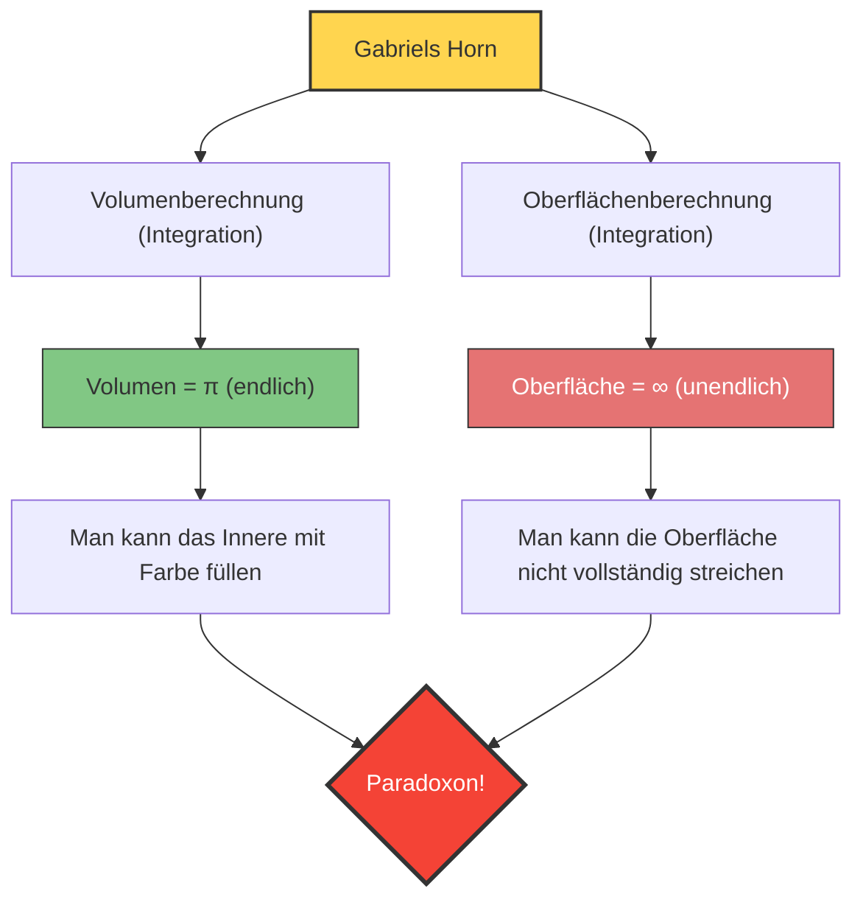

---
title: "Mit Farbe füllen, aber nicht anstreichen? Gabriels Horn"
description: "Ein bizarres Paradoxon eines Festkörpers, das durch die Infinitesimalrechnung hervorgebracht wurde und gleichzeitig ein „endliches Volumen“ und eine „unendliche Oberfläche“ besitzt."
date: 2026-09-10T21:00:00+09:00
draft: false
slug: "gabriels-horn"
image: "img/gabriels_horn.jpg"
math: true
mermaid: true
categories: ["Mathematisches Paradoxon", "Infinitesimalrechnung"]
tags: ["Paradoxon", "Geometrie", "Unendlichkeit", "Torricellis Trompete"]
---

Was wäre, wenn es einen Behälter gäbe, dessen „Volumen endlich, aber die Oberfläche unendlich ist“?
Intuitiv scheint das unmöglich zu sein, aber in der Welt der Mathematik existiert ein solcher Körper tatsächlich. Es ist die Figur, die als **„Gabriels Horn (Gabriel's Horn)“**, auch bekannt als **„Torricellis Trompete“**, bezeichnet wird.

Diese Figur, die 1641 von dem italienischen Mathematiker Evangelista Torricelli entdeckt wurde, schockierte die Mathematiker und Philosophen jener Zeit und löste eine heftige Debatte über die wahre Natur der „Unendlichkeit“ aus.

## Das Paradoxon des Anstreichens

Wenn man die Eigenschaften dieser Figur mit gewöhnlicher „Farbe“ vergleicht, entsteht folgendes seltsames Paradoxon.

1. **Wenn man das Horn mit Farbe füllt**:
   Da das Volumen des Horns endlich ist (genau gesagt $\pi$), kann man das Innere des Horns vollständig füllen, indem man nur $\pi$ Liter (etwa 3,14 Liter) Farbe hineingießt.
2. **Wenn man die Oberfläche des Horns mit Farbe anstreicht**:
   Die Oberfläche des Horns ist unendlich. Wenn man also versuchen würde, die innere (oder äußere) Oberfläche des Horns mit einem Pinsel zu streichen, würde man niemals fertig werden, egal wie viel Farbe man bereithält.

**„Man kann das Innere mit 3,14 Litern Farbe füllen, aber man braucht unendlich viel Farbe, um die Oberfläche zu streichen.“**
Warum tritt diese kontraintuitive Situation auf?

## Mathematischer Beweis: Die Magie der Infinitesimalrechnung

Gabriels Horn wird gebildet, indem man den Graphen der Funktion $y = \frac{1}{x}$ (für $x \ge 1$) um die $x$-Achse rotieren lässt.
Lassen Sie uns das Volumen $V$ und die Oberfläche $A$ dieses Körpers mithilfe der Infinitesimalrechnung berechnen.

### 1. Volumenberechnung (Warum es endlich ist)

Das Volumen $V$ des Rotationskörpers erhält man durch Integration der Querschnittsfläche (eines Kreises mit dem Radius $\frac{1}{x}$).

$$ V = \pi \int_{1}^{\infty} \left( \frac{1}{x} \right)^2 dx = \pi \int_{1}^{\infty} \frac{1}{x^2} dx $$

Wenn man dieses bestimmte Integral berechnet:

$$ V = \pi \left[ -\frac{1}{x} \right]_{1}^{\infty} = \pi (0 - (-1)) = \pi $$

Das Ergebnis konvergiert gegen den endlichen Wert $\pi$.

### 2. Oberflächenberechnung (Warum sie unendlich ist)

Andererseits sieht die Berechnung der Oberfläche $A$ wie folgt aus:

$$ A = 2\pi \int_{1}^{\infty} y \sqrt{1 + \left(\frac{dy}{dx}\right)^2} dx $$

Da $$ \frac{dy}{dx} = -\frac{1}{x^2} $$ ist, lautet der Ausdruck unter der Quadratwurzel $1 + \frac{1}{x^4}$.
Da $\sqrt{1 + \frac{1}{x^4}} > 1$ für alle $x \ge 1$ gilt, ergibt sich folgende Ungleichung:

$$ A > 2\pi \int_{1}^{\infty} \frac{1}{x} \cdot 1 dx = 2\pi \left[ \ln x \right]_{1}^{\infty} $$

Der natürliche Logarithmus $\ln x$ divergiert gegen Unendlich für $x \to \infty$. Da die Oberfläche $A$ noch größer ist, divergiert sie folglich natürlich auch gegen **Unendlich**.

## Die „Auflösung“ dieses Paradoxons

Auch wenn es mathematisch korrekt bewiesen werden kann, mag es unserem Gespür für die reale Welt nicht einleuchten.
„Wenn man es mit Farbe füllen kann, dann berührt diese Farbe doch die innere Oberfläche, also müsste die Oberfläche doch gestrichen sein?“

Diese Diskrepanz in der Intuition rührt von der **Verwechslung mathematischer Konzepte mit physikalischer Realität** her.

In der Welt der Mathematik kann die „Dicke“ der Farbe bis auf Null unendlich dünn gemacht werden. Gabriels Horn wird immer dünner, je weiter es sich erstreckt, aber die mathematische Farbe wird beliebig dünn und fließt bis tief in die winzige Spitze, wodurch die unendliche Oberfläche mit einem endlichen Volumen beschichtet werden kann (wobei die Dicke der Farbschicht jedoch zur Spitze hin gegen Null konvergiert).

In der physikalischen Realität besteht Farbe jedoch aus Atomen und Molekülen (Teilchen mit endlicher Größe).
Selbst wenn man echte Farbe hineingießt, kann sie nicht mehr weiter vordringen, sobald das Rohr des Horns enger wird als der „Durchmesser eines Farbmodemoleküls“. Das bedeutet, physikalisch ist es unmöglich, das Horn bis zur Spitze zu füllen oder seine unendliche Oberfläche zu streichen.

Gabriels Horn ist ein wunderschönes Beispiel, das uns lehrt, dass die menschliche Intuition an die „Regeln der endlichen Welt“ gebunden ist und nicht immer mit der Welt der Infinitesimalrechnung übereinstimmt, die mit der „Unendlichkeit“ umgeht.
