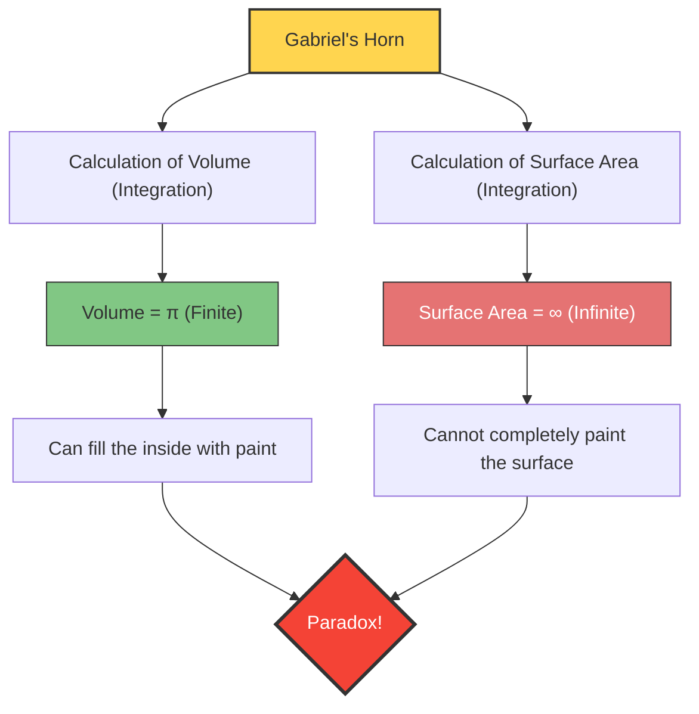

---
title: "Can it be filled with paint, but not painted on the surface?: Gabriel's Horn"
description: "A strange paradox of a solid figure brought about by calculus, having both a 'finite volume' and an 'infinite surface area' at the same time."
date: 2026-09-10T21:00:00+09:00
draft: false
slug: "gabriels-horn"
image: "img/gabriels_horn.jpg"
math: true
mermaid: true
categories: ["Mathematical Paradox", "Calculus"]
tags: ["Paradox", "Geometry", "Infinity", "Torricelli's Trumpet"]
---

What would happen if there was a container with a "finite volume, yet an infinite surface area"?
Intuitively, it seems impossible, but in the world of mathematics, such a solid figure certainly exists. It is the figure known as **"Gabriel's Horn"**, also known as **"Torricelli's Trumpet"**.

Discovered in 1641 by the Italian mathematician Evangelista Torricelli, this figure shocked mathematicians and philosophers of the time, sparking fierce debate about the nature of "infinity".

## The Painter's Paradox

If we liken the properties of this figure to everyday "paint", the following bizarre paradox occurs.

1. **When filling the horn with paint**:
   Since the volume of the horn is finite (exactly $\pi$), you can completely fill the inside of the horn by pouring just $\pi$ liters (about 3.14 liters) of paint.
2. **When painting the surface of the horn**:
   The surface area of the horn is infinite. Therefore, if you try to paint the inside (or outside) surface of the horn with a brush, no matter how much paint you prepare, you will never finish painting it for eternity.

**"You can fill the inside with 3.14 liters of paint, but you need an infinite amount of paint to paint the surface."**
Why does this counter-intuitive situation occur?

## Mathematical Proof: The Magic of Calculus

Gabriel's Horn is created by rotating the graph of the function $y = \frac{1}{x}$ (where $x \ge 1$) around the $x$-axis.
Let's calculate the volume $V$ and surface area $A$ of this solid figure using calculus.

### 1. Calculation of Volume (Why it becomes finite)

The volume $V$ of a solid of revolution is found by integrating the cross-sectional area (a circle with radius $\frac{1}{x}$).

$$ V = \pi \int_{1}^{\infty} \left( \frac{1}{x} \right)^2 dx = \pi \int_{1}^{\infty} \frac{1}{x^2} dx $$

Calculating this definite integral:
$$ V = \pi \left[ -\frac{1}{x} \right]_{1}^{\infty} = \pi (0 - (-1)) = \pi $$
The result converges to a finite value $\pi$.

### 2. Calculation of Surface Area (Why it becomes infinite)

On the other hand, the calculation for the surface area $A$ is as follows.

$$ A = 2\pi \int_{1}^{\infty} y \sqrt{1 + \left(\frac{dy}{dx}\right)^2} dx $$

Since $$ \frac{dy}{dx} = -\frac{1}{x^2} $$, the content inside the square root becomes $1 + \frac{1}{x^4}$.
Here, since $\sqrt{1 + \frac{1}{x^4}} > 1$ for all $x \ge 1$, the following inequality holds.

$$ A > 2\pi \int_{1}^{\infty} \frac{1}{x} \cdot 1 dx = 2\pi \left[ \ln x \right]_{1}^{\infty} $$

The natural logarithm $\ln x$ diverges to infinity as $x \to \infty$. Therefore, the surface area $A$, which is larger than that, naturally also diverges to **infinity**.

## The "Trick" Behind This Paradox

Even if it can be proven mathematically correct, it might not make sense to our real-world intuition.
"If it can be filled with paint, that paint is touching the inner surface, so shouldn't the surface be painted as well?"

This discrepancy in intuition arises from the **confusion of mathematical concepts with physical reality**.

In the world of mathematics, the "thickness" of paint can be made infinitely thin down to zero. Although Gabriel's Horn becomes infinitely narrow as it goes further, the mathematical paint can become infinitely thin and flow into the deepest depths of that narrow tip, coating the infinite surface area with a finite volume (however, the thickness of the paint film approaches zero towards the tip).

However, in the physical real world, paint is made up of atoms and molecules (particles with a finite size).
Even if you pour real paint, once the horn's tube becomes narrower than the "diameter of a paint molecule", the paint can go no further. In other words, physically, it is impossible to fill it to the tip, nor to paint its infinite surface.

Gabriel's Horn is a beautiful example that teaches us that human intuition is bound by the "rules of a finite world" and does not always align with the world of calculus, which deals with "infinity".
