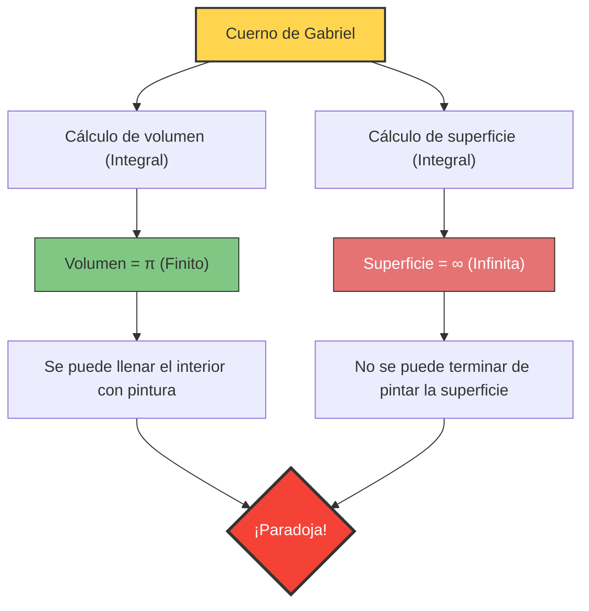

---
title: "¿Se puede llenar de pintura, pero no se puede pintar su superficie? El cuerno de Gabriel"
description: "La extraña paradoja de un sólido aportado por el cálculo que tiene un 'volumen finito' y un 'área de superficie infinita' al mismo tiempo."
date: 2026-09-10T21:00:00+09:00
draft: false
slug: "gabriels-horn"
image: "img/gabriels_horn.jpg"
math: true
mermaid: true
categories: ["Paradojas matemáticas", "Cálculo"]
tags: ["Paradoja", "Geometría", "Infinito", "Trompeta de Torricelli"]
---

¿Qué pasaría si existiera un recipiente con "un volumen finito pero un área de superficie infinita"?
Intuitivamente parece imposible, pero en el mundo de las matemáticas ciertamente existe tal sólido. Esta figura geométrica se llama **"El cuerno de Gabriel (Gabriel's Horn)"**, también conocido como **"La trompeta de Torricelli"**.

Descubierta en 1641 por el matemático italiano Evangelista Torricelli, esta figura causó un gran impacto en los matemáticos y filósofos de la época, desencadenando un intenso debate sobre la naturaleza del "infinito".

## La paradoja de la pintura

Si comparamos las propiedades de esta figura con "pintura" de uso cotidiano, surge la siguiente extraña paradoja.

1. **Si llenamos el cuerno con pintura**:
   Dado que el volumen del cuerno es finito (exactamente $\pi$), solo se necesita verter $\pi$ litros (aproximadamente 3.14 litros) de pintura para llenar completamente el interior del cuerno.
2. **Si pintamos la superficie del cuerno con pintura**:
   El área de la superficie del cuerno es infinita. Por lo tanto, si intentamos pintar la superficie interior (o exterior) del cuerno con una brocha, no importa cuánta cantidad masiva de pintura preparemos, nunca terminaremos de pintarlo.

**"Aunque podemos llenar el interior con 3.14 litros de pintura, necesitaríamos una cantidad infinita de pintura para cubrir su superficie"**
¿Por qué ocurre esta situación contraria a la intuición?

## Demostración matemática: La magia del cálculo

El cuerno de Gabriel se genera al rotar la gráfica de la función $y = \frac{1}{x}$ (para $x \ge 1$) alrededor del eje $x$.
Usemos el cálculo para hallar el volumen $V$ y el área de la superficie $A$ de este sólido.

### 1. Cálculo del volumen (por qué es finito)

El volumen $V$ de un sólido de revolución se obtiene integrando el área de la sección transversal (un círculo de radio $\frac{1}{x}$).

$$ V = \pi \int_{1}^{\infty} \left( \frac{1}{x} \right)^2 dx = \pi \int_{1}^{\infty} \frac{1}{x^2} dx $$

Calculando esta integral definida:
$$ V = \pi \left[ -\frac{1}{x} \right]_{1}^{\infty} = \pi (0 - (-1)) = \pi $$
El resultado converge a un valor finito $\pi$.

### 2. Cálculo del área de superficie (por qué es infinita)

Por otro lado, el cálculo del área de la superficie $A$ es el siguiente:

$$ A = 2\pi \int_{1}^{\infty} y \sqrt{1 + \left(\frac{dy}{dx}\right)^2} dx $$

Dado que $$ \frac{dy}{dx} = -\frac{1}{x^2} $$, el contenido dentro de la raíz cuadrada es $1 + \frac{1}{x^4}$.
Aquí, como $\sqrt{1 + \frac{1}{x^4}} > 1$ para todo $x \ge 1$, se cumple la siguiente desigualdad:

$$ A > 2\pi \int_{1}^{\infty} \frac{1}{x} \cdot 1 dx = 2\pi \left[ \ln x \right]_{1}^{\infty} $$

El logaritmo natural $\ln x$ diverge hacia el infinito cuando $x \to \infty$. Por lo tanto, el área de la superficie $A$, que es mayor que esto, naturalmente también divergirá hacia el **infinito**.

## La "explicación" de esta paradoja

Aunque se puede demostrar matemáticamente que es correcto, puede resultar difícil de aceptar desde el punto de vista del mundo real.
"Si se puede llenar con pintura, esa pintura está tocando la superficie interior, entonces la superficie también debería estar pintada, ¿no es así?"

Esta discrepancia intuitiva surge de la **confusión entre conceptos matemáticos y la realidad física**.

En el mundo de las matemáticas, el "grosor" de la pintura puede hacerse infinitamente delgado hasta llegar a cero. El cuerno de Gabriel se vuelve infinitamente estrecho a medida que avanza, pero la pintura matemática puede volverse tan delgada como sea necesario para fluir hasta lo más profundo de su estrecho extremo, recubriendo una superficie infinita con un volumen finito (sin embargo, el grosor de la capa de pintura se acercará a cero hacia el extremo).

Sin embargo, en el mundo físico real, la pintura está hecha de átomos y moléculas (partículas con un tamaño finito).
Incluso si vertemos pintura real, una vez que el tubo del cuerno se vuelve más estrecho que el "diámetro de una molécula de pintura", la pintura no puede avanzar más. En otras palabras, físicamente es imposible llenarlo hasta el extremo o pintar su superficie infinita.

El cuerno de Gabriel es un hermoso ejemplo que nos enseña que la intuición humana está atada a las "reglas del mundo finito" y no siempre coincide con el mundo del cálculo que maneja el "infinito".
