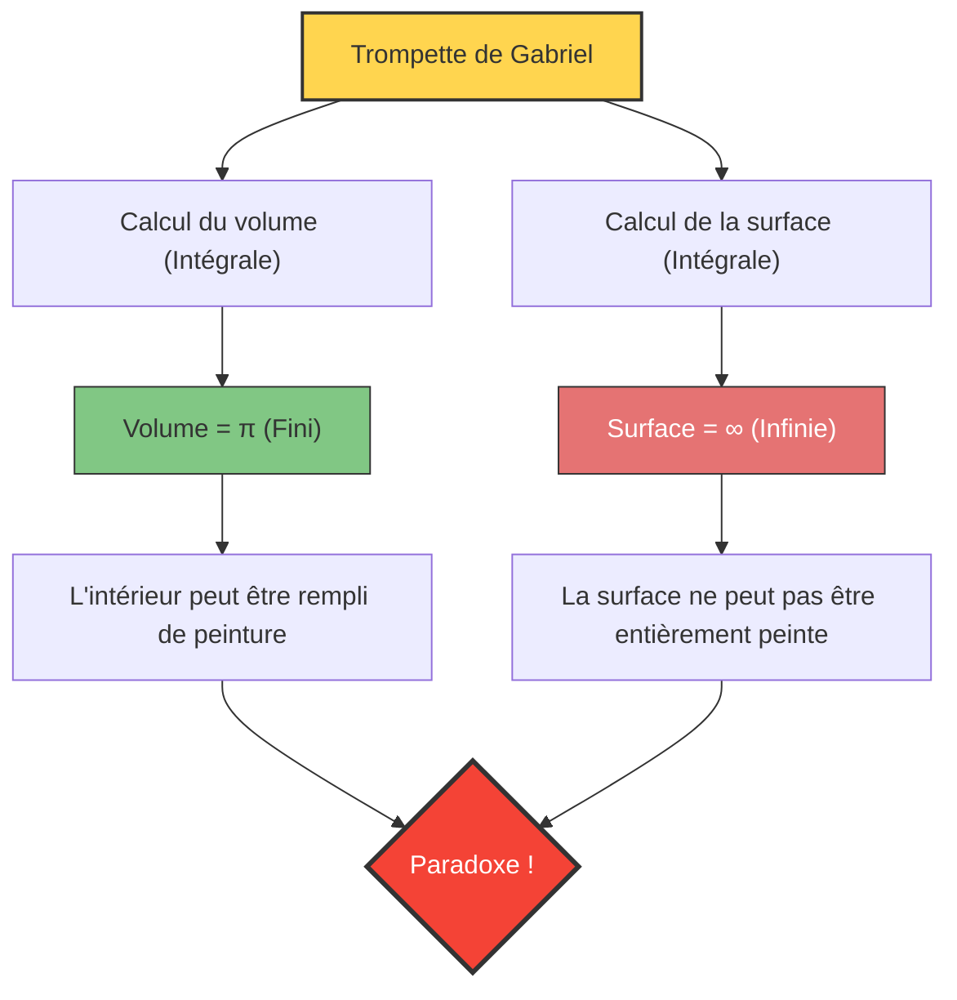

Que se passerait-il s'il existait un récipient dont le "volume est fini, mais la surface est infinie" ?
Intuitivement, cela semble impossible, mais un tel objet tridimensionnel existe bel et bien dans le monde des mathématiques. Il s'agit de la figure appelée **"Trompette de Gabriel" (Gabriel's Horn)**, également connue sous le nom de **"Trompette de Torricelli"**.

Découverte en 1641 par le mathématicien italien Evangelista Torricelli, cette figure a causé un grand choc aux mathématiciens et philosophes de l'époque, déclenchant un débat passionné sur la nature de l'"infini".

## Le paradoxe du peintre

Si l'on compare les propriétés de cette figure à de la "peinture" quotidienne, le curieux paradoxe suivant se produit :

1. **Si l'on remplit la trompette de peinture** :
   Le volume de la trompette étant fini (exactement $\pi$), il suffit d'y verser seulement $\pi$ litres (environ 3,14 litres) de peinture pour en remplir complètement l'intérieur.
2. **Si l'on peint la surface de la trompette** :
   La surface de la trompette est infinie. Par conséquent, si vous essayez de peindre la surface intérieure (ou extérieure) avec un pinceau, peu importe la quantité de peinture que vous préparez, vous ne finirez jamais de la peindre.

**"On peut remplir l'intérieur avec 3,14 litres de peinture, mais il faut une quantité infinie de peinture pour en peindre la surface."**
Pourquoi une telle situation contre-intuitive se produit-elle ?

## Preuve mathématique : La magie du calcul

La trompette de Gabriel est créée en faisant tourner le graphique de la fonction $y = \frac{1}{x}$ (pour $x \ge 1$) autour de l'axe des $x$.
Utilisons le calcul infinitésimal pour calculer le volume $V$ et la surface $A$ de ce solide.

### 1. Calcul du volume (Pourquoi il est fini)

Le volume $V$ du solide de révolution s'obtient en intégrant l'aire de la section transversale (un cercle de rayon $\frac{1}{x}$).

$$ V = \pi \int_{1}^{\infty} \left( \frac{1}{x} \right)^2 dx = \pi \int_{1}^{\infty} \frac{1}{x^2} dx $$

En calculant cette intégrale définie :
$$ V = \pi \left[ -\frac{1}{x} \right]_{1}^{\infty} = \pi (0 - (-1)) = \pi $$
Le résultat converge vers une valeur finie $\pi$.

### 2. Calcul de la surface (Pourquoi elle est infinie)

D'autre part, le calcul de la surface $A$ se fait comme suit :

$$ A = 2\pi \int_{1}^{\infty} y \sqrt{1 + \left(\frac{dy}{dx}\right)^2} dx $$

Puisque $$ \frac{dy}{dx} = -\frac{1}{x^2} $$, le contenu de la racine carrée devient $1 + \frac{1}{x^4}$.
Ici, comme $\sqrt{1 + \frac{1}{x^4}} > 1$ pour tout $x \ge 1$, l'inégalité suivante est vérifiée :

$$ A > 2\pi \int_{1}^{\infty} \frac{1}{x} \cdot 1 dx = 2\pi \left[ \ln x \right]_{1}^{\infty} $$

Le logarithme naturel $\ln x$ diverge vers l'infini lorsque $x \to \infty$. Par conséquent, la surface $A$, qui est plus grande que cette valeur, divergera naturellement aussi vers l'**infini**.

## Le "secret" de ce paradoxe

Même s'il peut être prouvé comme mathématiquement correct, il peut sembler peu convaincant d'un point de vue du monde réel.
"Si l'on peut la remplir de peinture, la peinture touche la surface intérieure, donc la surface devrait également être peinte, n'est-ce pas ?"

Ce décalage de l'intuition provient de **la confusion entre les concepts mathématiques et la réalité physique**.

Dans le monde mathématique, "l'épaisseur" de la peinture peut être rendue infiniment mince, jusqu'à zéro. Bien que la trompette de Gabriel devienne infiniment étroite au fur et à mesure qu'elle avance, la peinture mathématique peut devenir aussi fine que possible et s'écouler au plus profond de son extrémité étroite, revêtant une surface infinie avec un volume fini (cependant, l'épaisseur de la couche de peinture se rapproche de zéro en direction de l'extrémité).

Cependant, dans le monde physique réel, la peinture est composée d'atomes et de molécules (des particules de taille finie).
Même si l'on verse de la vraie peinture, dès que le tube de la trompette devient plus fin que le "diamètre d'une molécule de peinture", la peinture ne peut plus avancer. En d'autres termes, il est physiquement impossible de la remplir jusqu'à son extrémité, ni d'en peindre la surface infinie.

La trompette de Gabriel est un bel exemple qui nous enseigne que l'intuition humaine est liée aux "règles du monde fini" et ne coïncide pas toujours avec le monde du calcul qui traite de l'"infini".
