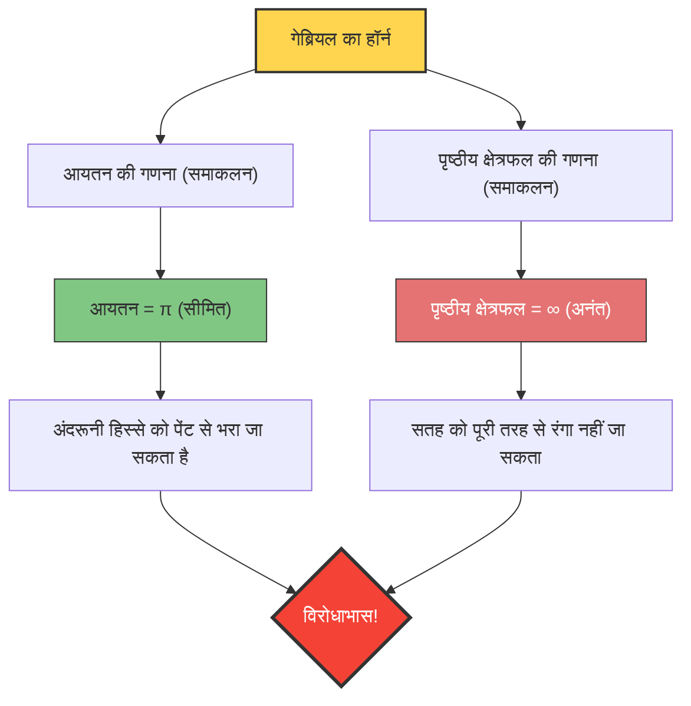

क्या होगा यदि कोई ऐसा बर्तन हो जिसका "आयतन सीमित हो, लेकिन पृष्ठीय क्षेत्रफल अनंत हो"?
सहज रूप से यह असंभव लग सकता है, लेकिन गणित की दुनिया में वास्तव में एक ऐसा आकार मौजूद है। यह वह आकार है जिसे **"गेब्रियल का हॉर्न (Gabriel's Horn)"** या **"टॉरिसिली का ट्रम्पेट (Torricelli's Trumpet)"** कहा जाता है।

1641 में इतालवी गणितज्ञ इवेंजेलिस्टा टॉरिसिली द्वारा खोजे गए इस आकार ने उस समय के गणितज्ञों और दार्शनिकों को झकझोर कर रख दिया था और "अनंत" की प्रकृति पर एक तीव्र बहस छेड़ दी थी।

## पेंटिंग का विरोधाभास

यदि हम इस आकार के गुणों की तुलना रोज़मर्रा के "पेंट" से करते हैं, तो निम्नलिखित विचित्र विरोधाभास उत्पन्न होता है:

1. **हॉर्न को पेंट से भरने पर**：
   हॉर्न का आयतन सीमित है (सटीक रूप से $\pi$), इसलिए इसमें केवल $\pi$ लीटर (लगभग 3.14 लीटर) पेंट डालकर इसके अंदरूनी हिस्से को पूरी तरह से भरा जा सकता है।
2. **हॉर्न की सतह को पेंट से रंगने पर**：
   हॉर्न का पृष्ठीय क्षेत्रफल अनंत है। इसलिए, यदि आप ब्रश से हॉर्न की अंदरूनी (या बाहरी) सतह को रंगने का प्रयास करते हैं, तो चाहे आप कितना भी पेंट तैयार कर लें, आप इसे कभी भी पूरा नहीं रंग पाएंगे।

**"आप 3.14 लीटर पेंट से अंदरूनी हिस्से को भर सकते हैं, लेकिन सतह को रंगने के लिए आपको अनंत मात्रा में पेंट की आवश्यकता होगी।"**
हमारी सहज बुद्धि (intuition) के विपरीत यह स्थिति क्यों उत्पन्न होती है?

## गणितीय प्रमाण: कैलकुलस का जादू

गेब्रियल का हॉर्न, फ़ंक्शन $y = \frac{1}{x}$ के ग्राफ़ (जहाँ $x \ge 1$) को $x$-अक्ष के चारों ओर घुमाकर (rotate) बनाया जाता है।
आइए कैलकुलस का उपयोग करके इस 3D आकार के आयतन $V$ और पृष्ठीय क्षेत्रफल $A$ की गणना करें।

### 1. आयतन की गणना (यह सीमित क्यों है?)

घूर्णन वाले ठोस (solid of revolution) का आयतन $V$, अनुप्रस्थ-काट के क्षेत्रफल (त्रिज्या $\frac{1}{x}$ वाला वृत्त) का समाकलन (integration) करके प्राप्त किया जा सकता है।

$$ V = \pi \int_{1}^{\infty} \left( \frac{1}{x} \right)^2 dx = \pi \int_{1}^{\infty} \frac{1}{x^2} dx $$

इस निश्चित समाकल (definite integral) की गणना करने पर:
$$ V = \pi \left[ -\frac{1}{x} \right]_{1}^{\infty} = \pi (0 - (-1)) = \pi $$
परिणाम सीमित मान $\pi$ तक अभिसरित (converge) हो जाता है।

### 2. पृष्ठीय क्षेत्रफल की गणना (यह अनंत क्यों है?)

दूसरी ओर, पृष्ठीय क्षेत्रफल $A$ की गणना इस प्रकार है:

$$ A = 2\pi \int_{1}^{\infty} y \sqrt{1 + \left(\frac{dy}{dx}\right)^2} dx $$

$$ \frac{dy}{dx} = -\frac{1}{x^2} $$ है, इसलिए वर्गमूल (square root) के अंदर का हिस्सा $1 + \frac{1}{x^4}$ हो जाता है।
चूँकि सभी $x \ge 1$ के लिए $\sqrt{1 + \frac{1}{x^4}} > 1$ होता है, इसलिए निम्नलिखित असमिका (inequality) सत्य है:

$$ A > 2\pi \int_{1}^{\infty} \frac{1}{x} \cdot 1 dx = 2\pi \left[ \ln x \right]_{1}^{\infty} $$

प्राकृतिक लघुगणक $\ln x$, $x \to \infty$ होने पर अनंत तक अपसरित (diverge) हो जाता है। इसलिए, पृष्ठीय क्षेत्रफल $A$ जो कि इससे बड़ा है, वह भी स्वाभाविक रूप से **अनंत** तक अपसरित होगा।

## इस विरोधाभास का "रहस्योद्घाटन"

भले ही इसे गणितीय रूप से सही साबित किया जा सकता है, लेकिन वास्तविक दुनिया की समझ के अनुसार इसे स्वीकार करना मुश्किल हो सकता है।
"यदि इसे पेंट से भरा जा सकता है, और चूँकि वह पेंट अंदरूनी सतह को छू रहा है, तो सतह भी तो रंगी जानी चाहिए, है न?"

अंतर्ज्ञान (intuition) का यह अंतर, **गणितीय अवधारणाओं और भौतिक वास्तविकता के सम्मिश्रण (confusion)** से उत्पन्न होता है।

गणित की दुनिया में, पेंट की "मोटाई" को शून्य तक असीमित रूप से पतला किया जा सकता है। गेब्रियल का हॉर्न आगे बढ़ने पर असीमित रूप से पतला होता जाता है, लेकिन गणितीय पेंट कितना भी पतला होकर उस पतले सिरे की गहराई तक बह सकता है, और यह अनंत पृष्ठीय क्षेत्रफल को सीमित आयतन से कोट (coat) कर सकता है (हालाँकि, पेंट की परत की मोटाई सिरे की ओर बढ़ने पर शून्य के करीब होती जाती है)।

हालाँकि, भौतिक वास्तविक दुनिया में, पेंट परमाणुओं और अणुओं (सीमित आकार वाले कणों) से बना होता है।
यदि आप वास्तविक पेंट डालते हैं, तो उस बिंदु पर जहाँ हॉर्न की नली "पेंट के अणु के व्यास" से अधिक पतली हो जाती है, पेंट उससे आगे नहीं जा पाएगा। दूसरे शब्दों में, भौतिक रूप से हॉर्न को सिरे तक भरना या उसकी अनंत सतह को रंगना असंभव है।

गेब्रियल का हॉर्न एक सुंदर उदाहरण है जो हमें यह सिखाता है कि मानव अंतर्ज्ञान "सीमित दुनिया के नियमों" से बंधा हुआ है और यह हमेशा "अनंत" को संभालने वाली कैलकुलस की दुनिया से मेल नहीं खाता है।
