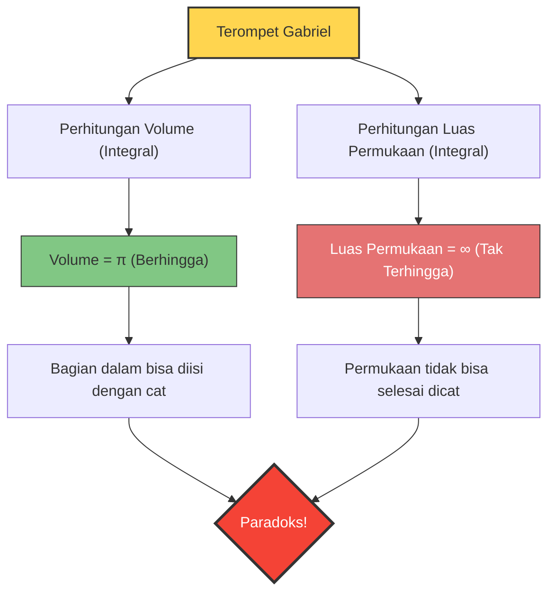

Bagaimana jika ada sebuah wadah yang memiliki "volume berhingga, tetapi luas permukaannya tak terhingga"?
Secara intuitif hal ini tampaknya mustahil, tetapi dalam dunia matematika, bangun ruang seperti itu benar-benar ada. Itulah bangun yang disebut **"Terompet Gabriel (Gabriel's Horn)"**, atau dikenal juga dengan nama **"Terompet Torricelli"**.

Ditemukan pada tahun 1641 oleh matematikawan Italia Evangelista Torricelli, bangun ini memberikan kejutan besar bagi para matematikawan dan filsuf pada masa itu, serta memicu perdebatan sengit tentang hakikat "ketakterhinggaan (infinity)".

## Paradoks Pengecatan

Jika sifat yang dimiliki bangun ini diibaratkan dengan "cat" dalam kehidupan sehari-hari, akan muncul paradoks aneh sebagai berikut.

1. **Jika mengisi terompet dengan cat**:
   Volume terompet adalah berhingga (tepatnya $\pi$), sehingga kita hanya perlu menuangkan $\pi$ liter (sekitar 3,14 liter) cat untuk mengisi penuh bagian dalam terompet.
2. **Jika mengecat permukaan terompet**:
   Luas permukaan terompet adalah tak terhingga. Oleh karena itu, jika kita mencoba mengecat permukaan dalam (atau luar) terompet dengan kuas, sebanyak apa pun cat yang kita siapkan, kita tidak akan pernah selesai mengecatnya untuk selamanya.

**"Hanya butuh 3,14 liter cat untuk mengisi penuh bagian dalamnya, tetapi butuh cat tak terhingga untuk mengecat permukaannya."**
Mengapa situasi yang berlawanan dengan intuisi ini bisa terjadi?

## Pembuktian Matematis: Keajaiban Kalkulus

Terompet Gabriel dibuat dengan memutar grafik dari fungsi $y = \frac{1}{x}$ (dengan batas $x \ge 1$) mengelilingi sumbu-$x$.
Mari kita hitung volume $V$ dan luas permukaan $A$ dari bangun ruang ini menggunakan kalkulus.

### 1. Perhitungan Volume (Alasan Mengapa Berhingga)

Volume benda putar $V$ dapat dicari dengan mengintegralkan luas penampangnya (lingkaran dengan jari-jari $\frac{1}{x}$).

$$ V = \pi \int_{1}^{\infty} \left( \frac{1}{x} \right)^2 dx = \pi \int_{1}^{\infty} \frac{1}{x^2} dx $$

Jika kita menghitung integral tentu ini:
$$ V = \pi \left[ -\frac{1}{x} \right]_{1}^{\infty} = \pi (0 - (-1)) = \pi $$
Hasilnya konvergen ke nilai yang berhingga, yaitu $\pi$.

### 2. Perhitungan Luas Permukaan (Alasan Mengapa Tak Terhingga)

Di sisi lain, perhitungan luas permukaan $A$ adalah sebagai berikut.

$$ A = 2\pi \int_{1}^{\infty} y \sqrt{1 + \left(\frac{dy}{dx}\right)^2} dx $$

Karena $ \frac{dy}{dx} = -\frac{1}{x^2} $, maka isi di dalam akar kuadrat menjadi $1 + \frac{1}{x^4}$.
Di sini, karena $\sqrt{1 + \frac{1}{x^4}} > 1$ untuk semua $x \ge 1$, pertidaksamaan berikut akan berlaku.

$$ A > 2\pi \int_{1}^{\infty} \frac{1}{x} \cdot 1 dx = 2\pi \left[ \ln x \right]_{1}^{\infty} $$

Logaritma natural $\ln x$ divergen menuju tak terhingga saat $x \to \infty$. Oleh karena itu, luas permukaan $A$ yang lebih besar darinya secara alami juga akan divergen menuju **tak terhingga**.

## "Pengungkapan Rahasia" dari Paradoks Ini

Meskipun kebenaran secara matematis dapat dibuktikan, perasaan kita di dunia nyata mungkin tidak bisa menerimanya.
"Jika bisa diisi dengan cat, karena cat itu menyentuh permukaan di bagian dalam, bukankah seharusnya permukaannya juga ikut tercat?"

Perbedaan intuisi ini muncul karena **mencampurkan konsep matematis dengan realitas fisik**.

Dalam dunia matematika, "ketebalan" cat bisa dibuat sangat tipis tak terhingga hingga mencapai nol. Terompet Gabriel menjadi semakin tipis tak terhingga menuju ujungnya, tetapi cat matematis bisa menjadi sangat tipis dan mengalir jauh ke dalam ujung yang tipis tersebut, melapisi luas permukaan tak terhingga dengan volume yang berhingga (namun, ketebalan lapisan catnya akan mendekati nol menuju ujungnya).

Akan tetapi, di dunia fisik nyata, cat terbuat dari atom dan molekul (partikel dengan ukuran yang berhingga).
Bahkan jika kita menuangkan cat sungguhan, saat tabung terompet menjadi lebih sempit dari "diameter molekul cat", cat tidak akan bisa maju lebih jauh lagi ke dalam. Dengan kata lain, secara fisik, mengisi hingga ke ujung atau mengecat permukaannya yang tak terhingga adalah hal yang mustahil.

Terompet Gabriel adalah contoh indah yang mengajarkan bahwa intuisi manusia terikat oleh "aturan dunia yang berhingga", yang mana hal itu belum tentu selaras dengan dunia kalkulus yang menangani "ketakterhinggaan".
