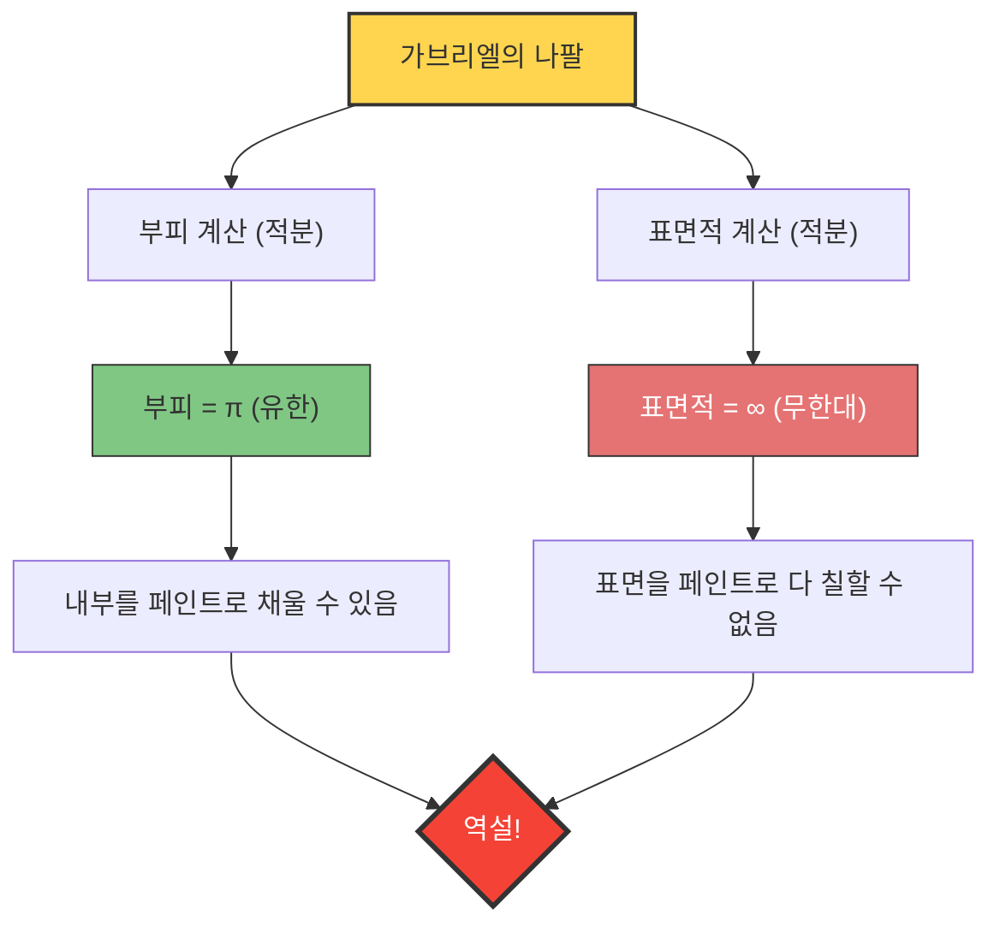

만약 '부피는 유한한데 표면적은 무한대'인 용기가 있다면 어떻게 될까요?
직관적으로는 있을 수 없는 일처럼 보이지만, 수학의 세계에는 확실히 그런 입체가 존재합니다. 그것이 바로 **'가브리엘의 나팔(Gabriel's Horn)'**, 일명 **'토리첼리의 나팔'**이라고 불리는 도형입니다.

1641년 이탈리아의 수학자 에반젤리스타 토리첼리에 의해 발견된 이 도형은 당시 수학자와 철학자들에게 큰 충격을 주었고, '무한'의 본질에 대한 격렬한 논쟁을 불러일으켰습니다.

## 페인트 칠하기 역설

이 도형이 가진 성질을 일상적인 '페인트'에 비유하면 다음과 같은 기묘한 역설이 발생합니다.

1. **나팔을 페인트로 채울 경우**:
   나팔의 부피는 유한(정확히는 $\pi$)하므로 단 $\pi$ 리터(약 3.14리터)의 페인트만 부으면 나팔 내부를 완전히 채울 수 있습니다.
2. **나팔의 표면을 페인트로 칠할 경우**:
   나팔의 표면적은 무한대입니다. 따라서 나팔 안쪽(또는 바깥쪽) 표면을 붓으로 칠하려고 하면, 아무리 많은 페인트를 준비해도 영원히 다 칠할 수 없습니다.

**"3.14리터의 페인트로 내부를 채울 수 있는데, 표면을 칠하기 위한 페인트는 무한히 필요하다"**
이 직관에 반하는 사태는 왜 일어나는 것일까요?

## 수학적 증명: 미적분의 마법

가브리엘의 나팔은 함수 $y = \frac{1}{x}$ 의 그래프(단, $x \ge 1$)를 $x$ 축을 중심으로 회전시켜서 만듭니다.
미적분을 사용하여 이 입체의 부피 $V$ 와 표면적 $A$ 를 계산해 봅시다.

### 1. 부피 계산 (유한해지는 이유)

회전체의 부피 $V$ 는 단면적(반지름 $\frac{1}{x}$ 인 원)을 적분하여 구할 수 있습니다.

$$ V = \pi \int_{1}^{\infty} \left( \frac{1}{x} \right)^2 dx = \pi \int_{1}^{\infty} \frac{1}{x^2} dx $$

이 정적분을 계산하면:
$$ V = \pi \left[ -\frac{1}{x} \right]_{1}^{\infty} = \pi (0 - (-1)) = \pi $$
결과는 유한한 값 $\pi$ 에 수렴합니다.

### 2. 표면적 계산 (무한해지는 이유)

반면, 표면적 $A$ 의 계산은 다음과 같습니다.

$$ A = 2\pi \int_{1}^{\infty} y \sqrt{1 + \left(\frac{dy}{dx}\right)^2} dx $$

$$ \frac{dy}{dx} = -\frac{1}{x^2} $$ 이므로, 제곱근 안은 $1 + \frac{1}{x^4}$ 가 됩니다.
여기서 모든 $x \ge 1$ 에 대해 $\sqrt{1 + \frac{1}{x^4}} > 1$ 이기 때문에, 다음과 같은 부등식이 성립합니다.

$$ A > 2\pi \int_{1}^{\infty} \frac{1}{x} \cdot 1 dx = 2\pi \left[ \ln x \right]_{1}^{\infty} $$

자연로그 $\ln x$ 는 $x \to \infty$ 일 때 무한대로 발산합니다. 따라서 그보다 큰 표면적 $A$ 도 당연히 **무한대**로 발산하게 됩니다.

## 이 역설의 '해답'

수학적으로 옳다는 것을 증명할 수 있어도, 현실 세계의 감각으로는 납득이 가지 않을 수 있습니다.
"페인트로 채울 수 있다면, 그 페인트가 안쪽 표면에 닿아 있으니 표면도 칠해진 것 아닐까?"

이 직관의 어긋남은 **수학적 개념과 물리적 현실의 혼동**에서 발생합니다.

수학의 세계에서는 페인트의 '두께'를 0까지 무한히 얇게 만들 수 있습니다. 가브리엘의 나팔은 끝으로 갈수록 무한히 얇아지지만, 수학적인 페인트는 아무리 얇아져도 그 얇은 끝의 가장 깊은 곳까지 흘러 들어가 무한한 표면적을 유한한 부피로 코팅할 수 있습니다(단, 페인트 막의 두께는 끝을 향할수록 0에 가까워집니다).

그러나 물리적인 현실 세계에서 페인트는 원자나 분자(유한한 크기를 가진 입자)로 이루어져 있습니다.
실제 페인트를 붓더라도, 나팔의 관이 '페인트 분자의 지름'보다 얇아지는 시점에서 페인트는 더 이상 안으로 나아갈 수 없습니다. 즉, 물리적으로는 끝까지 채우는 것도, 무한한 표면을 칠하는 것도 불가능한 것입니다.

가브리엘의 나팔은 인간의 직관이 '유한한 세계의 규칙'에 얽매여 있으며, '무한'을 다루는 미적분의 세계와 반드시 일치하지 않는다는 것을 알려주는 아름다운 예시입니다.
