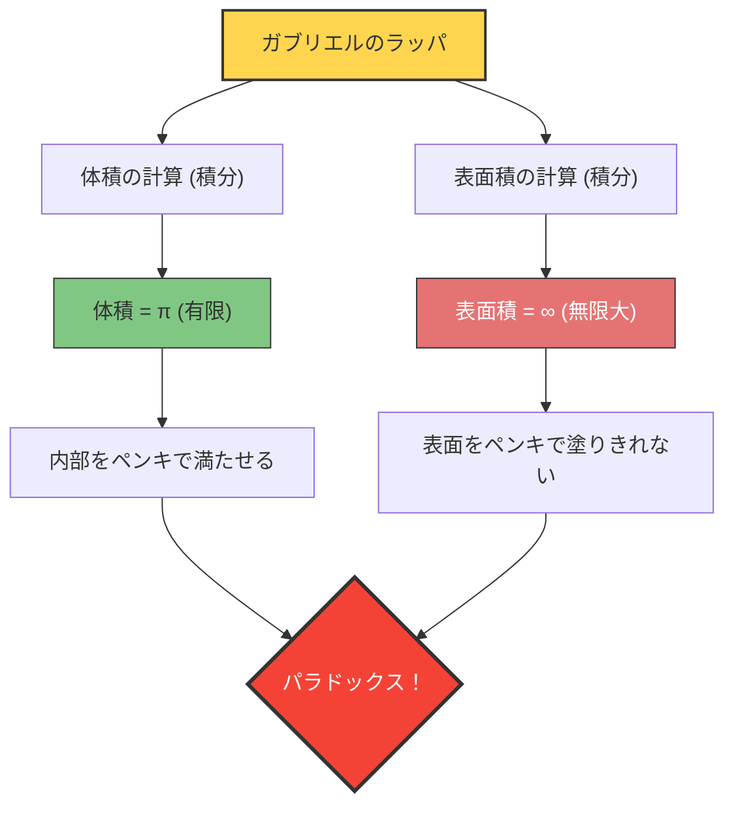

もし「体積は有限なのに、表面積が無限大である」ような容器があったらどうなるでしょうか？
直感的にはあり得ないように思えますが、数学の世界には確かにそのような立体が存在します。それが**「ガブリエルのラッパ（Gabriel's Horn）」**、別名**「トリチェリのラッパ」**と呼ばれる図形です。

1641年にイタリアの数学者エヴァンジェリスタ・トリチェリによって発見されたこの図形は、当時の数学者や哲学者たちに大きな衝撃を与え、「無限」の本質についての激しい論争を引き起こしました。

## ペンキ塗りのパラドックス

この図形が持つ性質を、日常的な「ペンキ」に例えると、次のような奇妙なパラドックスが発生します。

1. **ラッパをペンキで満たす場合**：
   ラッパの体積は有限（正確には $\pi$）なので、たった $\pi$ リットル（約3.14リットル）のペンキを注ぐだけで、ラッパの内部を完全に満たすことができます。
2. **ラッパの表面をペンキで塗る場合**：
   ラッパの表面積は無限大です。したがって、ラッパの内側（または外側）の表面をハケで塗ろうとすると、どれだけ大量のペンキを用意しても永遠に塗り終えることができません。

**「3.14リットルのペンキで内部を満たせるのに、表面を塗るためのペンキは無限に必要になる」**
この直感に反する事態は、なぜ起こるのでしょうか？

## 数学的な証明：微積分の魔法

ガブリエルのラッパは、関数 $y = \frac{1}{x}$ のグラフ（ただし $x \ge 1$）を、$x$ 軸の周りに回転させることで作られます。
微積分を使って、この立体の体積 $V$ と表面積 $A$ を計算してみましょう。

### 1. 体積の計算（有限になる理由）

回転体の体積 $V$ は、断面積（半径 $\frac{1}{x}$ の円）を積分することで求められます。

$$ V = \pi \int_{1}^{\infty} \left( \frac{1}{x} \right)^2 dx = \pi \int_{1}^{\infty} \frac{1}{x^2} dx $$

この定積分を計算すると：
$$ V = \pi \left[ -\frac{1}{x} \right]_{1}^{\infty} = \pi (0 - (-1)) = \pi $$
結果は有限の値 $\pi$ に収束します。

### 2. 表面積の計算（無限になる理由）

一方、表面積 $A$ の計算は次のようになります。

$$ A = 2\pi \int_{1}^{\infty} y \sqrt{1 + \left(\frac{dy}{dx}\right)^2} dx $$

$$ \frac{dy}{dx} = -\frac{1}{x^2} $$ なので、平方根の中身は $1 + \frac{1}{x^4}$ となります。
ここで、すべての $x \ge 1$ において $\sqrt{1 + \frac{1}{x^4}} > 1$ であるため、次のような不等式が成り立ちます。

$$ A > 2\pi \int_{1}^{\infty} \frac{1}{x} \cdot 1 dx = 2\pi \left[ \ln x \right]_{1}^{\infty} $$

自然対数 $\ln x$ は $x \to \infty$ で無限大に発散します。したがって、それよりも大きい表面積 $A$ も当然、**無限大**に発散することになります。

## このパラドックスの「種明かし」

数学的に正しいことは証明できても、現実世界の感覚としては納得がいかないかもしれません。
「ペンキで満たせるなら、そのペンキが内側の表面に触れているのだから、表面も塗れているはずではないか？」

この直感のズレは、**数学的な概念と物理的な現実の混同**から生まれています。

数学の世界では、ペンキの「厚さ」をゼロまで無限に薄くすることができます。ガブリエルのラッパは先に行くほど無限に細くなりますが、数学的なペンキはいくらでも薄くなってその細い先端の奥の奥まで流れ込み、無限の表面積を有限の体積でコーティングすることができます（ただし、ペンキの膜の厚さは先端に向かってゼロに近づいていきます）。

しかし、物理的な現実世界では、ペンキは原子や分子（有限の大きさを持つ粒）でできています。
現実のペンキを注いでも、ラッパの管が「ペンキ分子の直径」よりも細くなった時点で、ペンキはそれ以上奥へ進めなくなります。つまり、物理的には先端まで満たすことも、無限の表面を塗ることも不可能なのです。

ガブリエルのラッパは、人間の直感が「有限の世界のルール」に縛られており、「無限」を扱う微積分の世界とは必ずしも一致しないことを教えてくれる美しい例です。
