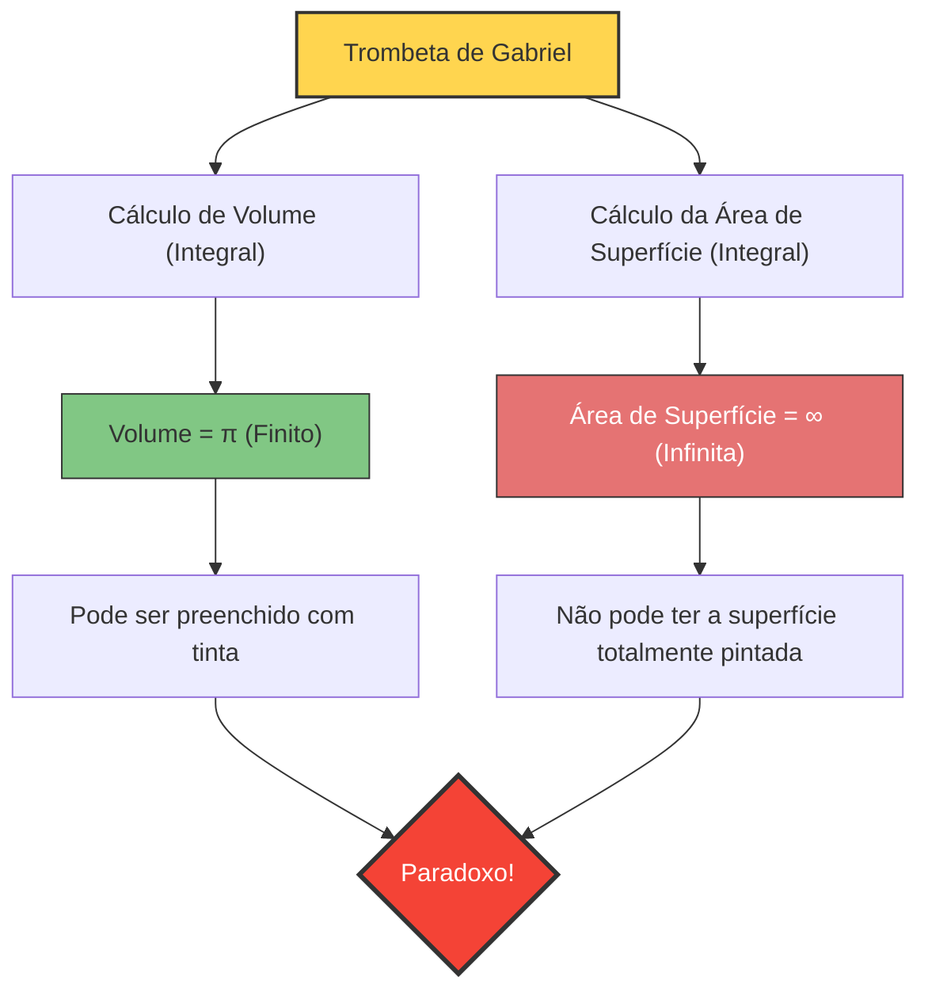

---
title: "É possível encher com tinta, mas não pintar a superfície? A Trombeta de Gabriel"
description: "Um estranho paradoxo tridimensional trazido pelo cálculo, que possui um 'volume finito' e uma 'área de superfície infinita' simultaneamente."
date: 2026-09-10T21:00:00+09:00
draft: false
slug: "gabriels-horn"
image: "img/gabriels_horn.jpg"
math: true
mermaid: true
categories: ["Paradoxos Matemáticos", "Cálculo"]
tags: ["Paradoxo", "Geometria", "Infinito", "Trombeta de Torricelli"]
---

O que aconteceria se houvesse um recipiente com um "volume finito, mas uma área de superfície infinita"?
Pode parecer intuitivamente impossível, mas tal sólido de fato existe no mundo da matemática. É a figura chamada **"Trombeta de Gabriel" (Gabriel's Horn)**, também conhecida como **"Trombeta de Torricelli"**.

Descoberta em 1641 pelo matemático italiano Evangelista Torricelli, essa figura chocou profundamente os matemáticos e filósofos da época, provocando intensos debates sobre a verdadeira natureza do "infinito".

## O Paradoxo da Pintura

Se compararmos as propriedades dessa figura a algo do dia a dia, como "tinta", ocorre o seguinte paradoxo bizarro:

1. **Ao encher a trombeta com tinta**:
   Como o volume da trombeta é finito (exatamente $\pi$), basta despejar $\pi$ litros (cerca de 3,14 litros) de tinta para preencher completamente o seu interior.
2. **Ao pintar a superfície da trombeta**:
   A área de superfície da trombeta é infinita. Portanto, se você tentar pintar a superfície interna (ou externa) da trombeta com um pincel, não importa quanta tinta você tenha, nunca terminará de pintá-la.

**"Embora seja possível preencher o interior com 3,14 litros de tinta, é necessária uma quantidade infinita de tinta para pintar a superfície"**
Por que essa situação contra-intuitiva acontece?

## Prova Matemática: A Magia do Cálculo

A Trombeta de Gabriel é formada pela rotação do gráfico da função $y = \frac{1}{x}$ (onde $x \ge 1$) em torno do eixo $x$.
Vamos usar o cálculo para encontrar o volume $V$ e a área de superfície $A$ desse sólido.

### 1. Cálculo do Volume (Por que é finito)

O volume $V$ de um sólido de revolução é obtido integrando a área da seção transversal (um círculo com raio $\frac{1}{x}$).

$$ V = \pi \int_{1}^{\infty} \left( \frac{1}{x} \right)^2 dx = \pi \int_{1}^{\infty} \frac{1}{x^2} dx $$

Ao calcular essa integral definida:
$$ V = \pi \left[ -\frac{1}{x} \right]_{1}^{\infty} = \pi (0 - (-1)) = \pi $$
O resultado converge para um valor finito $\pi$.

### 2. Cálculo da Área de Superfície (Por que é infinita)

Por outro lado, o cálculo da área de superfície $A$ é o seguinte:

$$ A = 2\pi \int_{1}^{\infty} y \sqrt{1 + \left(\frac{dy}{dx}\right)^2} dx $$

Como $$ \frac{dy}{dx} = -\frac{1}{x^2} $$, o conteúdo dentro da raiz quadrada é $1 + \frac{1}{x^4}$.
Aqui, como $\sqrt{1 + \frac{1}{x^4}} > 1$ para todo $x \ge 1$, a seguinte desigualdade é válida:

$$ A > 2\pi \int_{1}^{\infty} \frac{1}{x} \cdot 1 dx = 2\pi \left[ \ln x \right]_{1}^{\infty} $$

O logaritmo natural $\ln x$ diverge para o infinito quando $x \to \infty$. Consequentemente, a área de superfície $A$, sendo maior que isso, naturalmente também diverge para o **infinito**.

## A "Revelação" deste Paradoxo

Mesmo que algo possa ser provado matematicamente como correto, pode não fazer sentido na perspectiva do mundo real.
"Se pode ser preenchida com tinta, então essa tinta está tocando a superfície interna; a superfície não deveria estar pintada também?"

Essa divergência intuitiva surge da **confusão entre os conceitos matemáticos e a realidade física**.

No mundo da matemática, a "espessura" da tinta pode ser reduzida infinitamente, chegando a zero. A Trombeta de Gabriel torna-se infinitamente fina à medida que avança, mas uma "tinta matemática" pode tornar-se infinitamente fina, fluindo profundamente nas partes mais estreitas para revestir uma área de superfície infinita com um volume finito (no entanto, a espessura da camada de tinta tenderá a zero em direção à extremidade).

Entretanto, no mundo físico real, a tinta é composta de átomos e moléculas (partículas de tamanho finito).
Mesmo se você despejar tinta real, uma vez que o tubo da trombeta se torne mais estreito que o "diâmetro de uma molécula de tinta", a tinta não poderá mais avançar. Ou seja, fisicamente é impossível preenchê-la até a ponta ou pintar sua superfície infinita.

A Trombeta de Gabriel é um belo exemplo que nos ensina que a intuição humana está restrita às "regras de um mundo finito", que nem sempre concordam com o mundo do cálculo que lida com o "infinito".
