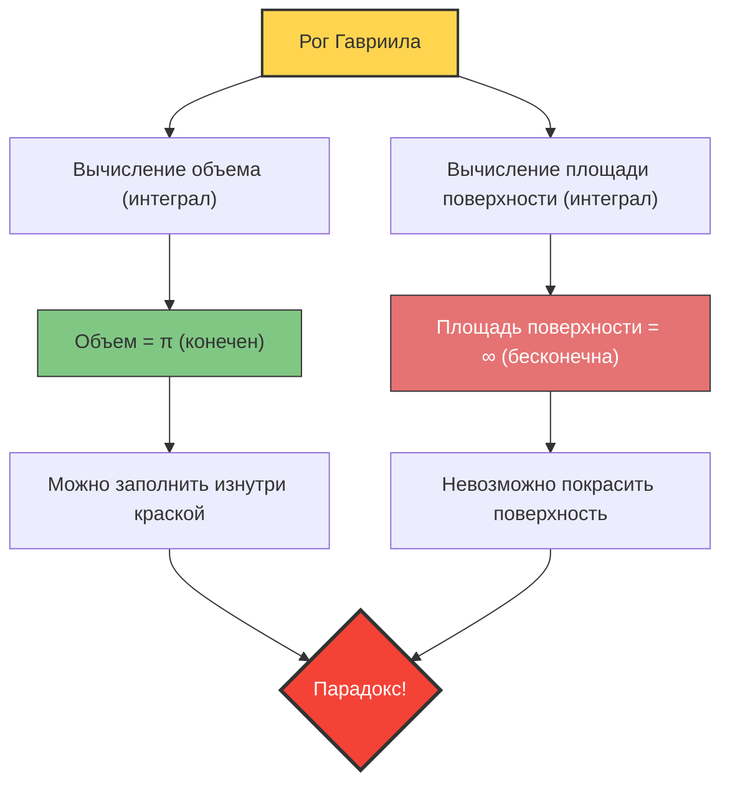

Что будет, если появится сосуд, у которого «объем конечен, а площадь поверхности бесконечна»?
Интуитивно кажется, что такое невозможно, но в мире математики подобная фигура действительно существует. Это **«Рог Гавриила» (Gabriel's Horn)**, также известный как **«Рог Торричелли»**.

Открытая в 1641 году итальянским математиком Эванджелистой Торричелли, эта фигура произвела огромное впечатление на математиков и философов того времени и вызвала ожесточенные споры о природе «бесконечности».

## Парадокс маляра

Если попытаться применить свойства этой фигуры к обычной «краске», возникнет следующий странный парадокс.

1. **Если заполнить рог краской**:
   Поскольку объем рога конечен (точнее, $\pi$), достаточно влить всего $\pi$ литров (около 3,14 литра) краски, чтобы полностью заполнить его изнутри.
2. **Если красить поверхность рога**:
   Площадь поверхности рога бесконечна. Следовательно, если вы попытаетесь покрасить внутреннюю (или внешнюю) поверхность рога кистью, сколько бы краски вы ни приготовили, вы никогда не закончите эту работу.

**«3,14 литрами краски можно заполнить объем, но для покраски поверхности потребуется бесконечно много краски»**
Почему возникает эта ситуация, противоречащая нашей интуиции?

## Математическое доказательство: Магия математического анализа

Рог Гавриила образуется вращением графика функции $y = \frac{1}{x}$ (при $x \ge 1$) вокруг оси $x$.
Давайте вычислим объем $V$ и площадь поверхности $A$ этой фигуры с помощью математического анализа.

### 1. Вычисление объема (почему он конечен)

Объем тела вращения $V$ можно найти, интегрируя площадь поперечного сечения (круг радиусом $\frac{1}{x}$).

$$ V = \pi \int_{1}^{\infty} \left( \frac{1}{x} \right)^2 dx = \pi \int_{1}^{\infty} \frac{1}{x^2} dx $$

Если вычислить этот определенный интеграл:
$$ V = \pi \left[ -\frac{1}{x} \right]_{1}^{\infty} = \pi (0 - (-1)) = \pi $$
Результат сходится к конечному значению $\pi$.

### 2. Вычисление площади поверхности (почему она бесконечна)

С другой стороны, вычисление площади поверхности $A$ выглядит следующим образом.

$$ A = 2\pi \int_{1}^{\infty} y \sqrt{1 + \left(\frac{dy}{dx}\right)^2} dx $$

Поскольку $\frac{dy}{dx} = -\frac{1}{x^2}$, выражение под корнем будет $1 + \frac{1}{x^4}$.
Здесь для всех $x \ge 1$ выполняется условие $\sqrt{1 + \frac{1}{x^4}} > 1$, поэтому верно следующее неравенство:

$$ A > 2\pi \int_{1}^{\infty} \frac{1}{x} \cdot 1 dx = 2\pi \left[ \ln x \right]_{1}^{\infty} $$

Натуральный логарифм $\ln x$ стремится к бесконечности при $x \to \infty$. Следовательно, большая по значению площадь поверхности $A$, естественно, тоже расходится к **бесконечности**.

## «Разоблачение» парадокса

Даже если можно математически доказать правильность, с точки зрения здравого смысла реального мира с этим трудно согласиться.
«Если мы можем заполнить его краской, значит, эта краска касается внутренней поверхности, а значит, и поверхность должна быть покрашена, не так ли?»

Это расхождение с интуицией возникает из-за **смешения математических концепций и физической реальности**.

В математическом мире «толщину» краски можно сделать бесконечно малой, вплоть до нуля. Рог Гавриила становится бесконечно узким по мере продвижения вперед, но «математическая» краска может становиться сколь угодно тонкой и проникать в самые глубокие участки этого узкого конца, покрывая бесконечную площадь поверхности конечным объемом (однако толщина слоя краски при этом стремится к нулю ближе к концу рога).

Однако в физическом реальном мире краска состоит из атомов и молекул (частиц, имеющих конечный размер).
Если залить настоящую краску, то как только трубка рога станет у́же «диаметра молекулы краски», краска больше не сможет продвигаться дальше. Иными словами, физически невозможно ни заполнить его до конца, ни покрыть краской бесконечную поверхность.

Рог Гавриила — это прекрасный пример, показывающий, что человеческая интуиция ограничена «правилами конечного мира» и не всегда совпадает с миром математического анализа, где работает понятие «бесконечности».
