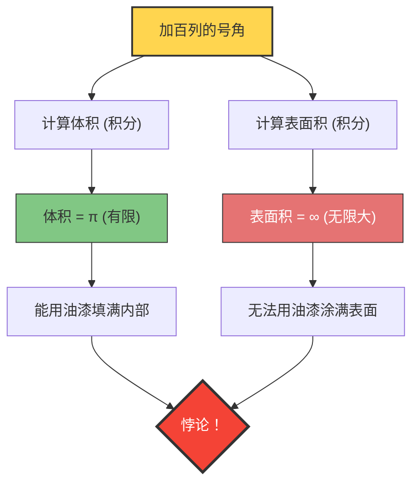

如果有一个“体积有限，表面积却无限大”的容器，会怎么样呢？
直觉上似乎是不可能的，但在数学的世界里确实存在这样的立体。那就是被称为**“加百列的号角（Gabriel's Horn）”**，别名**“托里切利小号”**的图形。

这个图形由意大利数学家埃万杰利斯塔·托里切利在1641年发现，给当时的数学家和哲学家们带来了巨大的冲击，引发了关于“无限”本质的激烈争论。

## 涂油漆的悖论

如果把这个图形所具有的性质，用日常的“油漆”来比喻的话，就会产生以下奇妙的悖论。

1. **用油漆填满号角的情况**：
   号角的体积是有限的（准确地说是 $\pi$），所以只需注入仅仅 $\pi$ 升（约3.14升）的油漆，就可以完全填满号角的内部。
2. **用油漆涂满号角表面的情况**：
   号角的表面积是无限大的。因此，如果想用刷子涂满号角内部（或外部）的表面，无论准备多少大量的油漆，也永远无法涂完。

**“明明3.14升油漆就能填满内部，但涂满表面却需要无限的油漆”**
这种违背直觉的情况，究竟为什么会发生呢？

## 数学证明：微积分的魔法

加百列的号角是由函数 $y = \frac{1}{x}$ （其中 $x \ge 1$）的图像绕 $x$ 轴旋转而成的。
让我们使用微积分来计算这个立体的体积 $V$ 和表面积 $A$。

### 1. 体积的计算（有限的理由）

旋转体的体积 $V$ 可以通过对横截面积（半径为 $\frac{1}{x}$ 的圆）进行积分来求得。

$$ V = \pi \int_{1}^{\infty} \left( \frac{1}{x} \right)^2 dx = \pi \int_{1}^{\infty} \frac{1}{x^2} dx $$

计算这个定积分：
$$ V = \pi \left[ -\frac{1}{x} \right]_{1}^{\infty} = \pi (0 - (-1)) = \pi $$
结果收敛于有限的值 $\pi$。

### 2. 表面积的计算（无限大的理由）

另一方面，表面积 $A$ 的计算如下。

$$ A = 2\pi \int_{1}^{\infty} y \sqrt{1 + \left(\frac{dy}{dx}\right)^2} dx $$

因为 $$ \frac{dy}{dx} = -\frac{1}{x^2} $$，所以平方根里面的内容是 $1 + \frac{1}{x^4}$。
这里，因为在所有的 $x \ge 1$ 处都有 $\sqrt{1 + \frac{1}{x^4}} > 1$，所以成立以下不等式。

$$ A > 2\pi \int_{1}^{\infty} \frac{1}{x} \cdot 1 dx = 2\pi \left[ \ln x \right]_{1}^{\infty} $$

自然对数 $\ln x$ 在 $x \to \infty$ 时发散到无限大。因此，比它还要大的表面积 $A$ 当然也会发散到**无限大**。

## 这个悖论的“揭秘”

即使在数学上被证明是正确的，在现实世界的直觉上可能也难以接受。
“如果能用油漆填满，那油漆既然接触到了内侧表面，不就等同于表面也被涂满了吗？”

这种直觉上的偏差，源于**将数学概念与物理现实相混淆**。

在数学的世界里，油漆的“厚度”可以无限变薄直至为零。加百列的号角越往前端越无限细长，但在数学概念中，油漆可以无限变薄，流入那极细前端的最深处，从而用有限的体积覆盖无限的表面积（不过，油漆膜的厚度越往前端就越接近于零）。

然而，在物理学的现实世界中，油漆是由原子和分子（具有有限大小的粒子）组成的。
即使注入现实中的油漆，当号角的管径细于“油漆分子的直径”时，油漆就无法继续向深处推进了。也就是说，在物理上，既不可能将其前端填满，也不可能涂满无限的表面。

加百列的号角是一个美妙的例子，它告诉我们人类的直觉被“有限世界的规则”所束缚，与处理“无限”的微积分世界并不总是一致。
